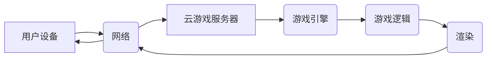

                 

## 云游戏技术：挑战与解决方案

> 关键词：云游戏、游戏流媒体、网络延迟、带宽需求、服务器架构、编码技术、用户体验

### 1. 背景介绍

云游戏，也称为游戏流媒体，是一种将游戏运行在远程服务器，并将游戏画面和音频流式传输到用户设备的全新游戏模式。它彻底改变了传统的游戏体验，打破了硬件限制，让用户无需强大的游戏主机或个人电脑，即可畅享高品质的游戏。

近年来，云游戏技术发展迅速，受到业界和用户的广泛关注。主要推动因素包括：

* **移动设备的普及:** 智能手机和平板电脑的普及，为云游戏提供了庞大的用户群体。
* **网络带宽的提升:** 5G网络的商用部署，以及光纤网络的不断扩展，为云游戏提供了高速稳定的网络传输基础。
* **云计算技术的成熟:** 云计算平台的强大算力和存储能力，能够支撑大型游戏的运行和流媒体传输。

### 2. 核心概念与联系

云游戏的核心概念是将游戏逻辑、渲染和物理计算等任务卸载到远程服务器，并将游戏画面和音频流式传输到用户设备。

**云游戏架构**



**核心概念:**

* **用户设备:** 包括智能手机、平板电脑、电视机等，负责接收并渲染游戏画面和音频。
* **云游戏服务器:** 负责运行游戏引擎、处理游戏逻辑、渲染游戏画面和音频，并将其流式传输到用户设备。
* **网络:** 连接用户设备和云游戏服务器，负责传输游戏数据。
* **游戏引擎:** 提供游戏运行所需的底层框架和功能，例如物理引擎、图形引擎、音频引擎等。
* **游戏逻辑:** 包括游戏规则、游戏场景、游戏角色等，决定游戏的玩法和内容。
* **渲染:** 将游戏逻辑转化为可视化的画面和音频。

### 3. 核心算法原理 & 具体操作步骤

#### 3.1 算法原理概述

云游戏的核心算法主要包括：

* **编码算法:** 将游戏画面和音频压缩成更小的数据包，以便高效传输。
* **解码算法:** 在用户设备上解码压缩后的数据包，还原游戏画面和音频。
* **网络传输协议:** 负责数据包的可靠传输和丢包处理。
* **延迟补偿算法:** 补偿网络延迟，确保游戏体验流畅。

#### 3.2 算法步骤详解

**编码算法:**

1. **帧捕获:** 从游戏画面中捕获每一帧图像。
2. **图像压缩:** 使用图像压缩算法，例如H.264或H.265，将图像数据压缩成更小的数据包。
3. **音频编码:** 使用音频编码算法，例如AAC或Opus，将音频数据压缩成更小的数据包。
4. **数据打包:** 将压缩后的图像和音频数据打包成网络传输的数据包。

**解码算法:**

1. **数据包接收:** 用户设备接收来自云游戏服务器的数据包。
2. **数据包解包:** 解包数据包，提取图像和音频数据。
3. **图像解压缩:** 使用图像解压缩算法，还原图像数据。
4. **音频解压缩:** 使用音频解压缩算法，还原音频数据。
5. **画面渲染:** 将还原后的图像数据渲染到用户设备的屏幕上。
6. **音频播放:** 将还原后的音频数据播放到用户设备的扬声器上。

**网络传输协议:**

1. **数据包可靠传输:** 使用TCP协议或UDP协议，确保数据包的可靠传输。
2. **丢包处理:** 使用重传机制或流媒体缓冲机制，处理网络丢包情况。

**延迟补偿算法:**

1. **网络延迟测量:** 测量网络延迟。
2. **预测游戏状态:** 根据网络延迟，预测游戏状态。
3. **补偿延迟:** 在用户设备上补偿延迟，确保游戏体验流畅。

#### 3.3 算法优缺点

**优点:**

* **降低硬件门槛:** 用户无需购买昂贵的硬件设备，即可体验高品质游戏。
* **提升游戏体验:** 云游戏服务器拥有强大的算力和存储能力，可以提供更流畅的游戏体验。
* **游戏内容丰富:** 云游戏平台可以提供丰富的游戏内容，满足不同用户的需求。

**缺点:**

* **网络延迟:** 网络延迟是云游戏体验的主要瓶颈，可能会导致游戏卡顿或延迟。
* **带宽需求:** 云游戏需要较高的带宽，否则可能会导致游戏画面卡顿或延迟。
* **服务器压力:** 云游戏服务器需要承受大量的用户请求，可能会导致服务器压力过大。

#### 3.4 算法应用领域

云游戏算法广泛应用于游戏行业，例如：

* **游戏流媒体平台:** 例如腾讯 START、谷歌 Stadia、微软 xCloud 等。
* **游戏开发工具:** 例如Unity、Unreal Engine 等。
* **游戏直播平台:** 例如Twitch、斗鱼等。

### 4. 数学模型和公式 & 详细讲解 & 举例说明

#### 4.1 数学模型构建

云游戏中的延迟补偿算法通常基于以下数学模型：

* **网络延迟:** $D = t_{server} - t_{client}$，其中 $t_{server}$ 是服务器响应时间，$t_{client}$ 是客户端接收数据时间。
* **预测游戏状态:** $s_{predicted} = s_{current} + v \cdot D$，其中 $s_{current}$ 是当前游戏状态，$v$ 是游戏状态变化速度，$D$ 是网络延迟。

#### 4.2 公式推导过程

延迟补偿算法的目的是在客户端预测游戏状态，并根据预测结果调整游戏画面，以补偿网络延迟。

假设游戏状态变化速度为 $v$，网络延迟为 $D$，则客户端可以预测游戏状态为：

$s_{predicted} = s_{current} + v \cdot D$

#### 4.3 案例分析与讲解

例如，在射击游戏中，玩家射击目标时，网络延迟会导致玩家射击的子弹到达目标的时间延迟。

如果玩家在 $t_{client}$ 时刻点击射击按钮，服务器在 $t_{server}$ 时刻收到请求，并计算出子弹到达目标的时间为 $t_{arrival}$。

则网络延迟为：

$D = t_{arrival} - t_{client}$

客户端可以根据网络延迟预测子弹到达目标的时间，并提前渲染子弹到达目标的动画效果，以补偿网络延迟。

### 5. 项目实践：代码实例和详细解释说明

#### 5.1 开发环境搭建

* **操作系统:** Ubuntu 20.04 LTS
* **编程语言:** Python 3.8
* **框架:** Flask
* **库:** OpenCV, Numpy, SocketIO

#### 5.2 源代码详细实现

```python
from flask import Flask, render_template
from flask_socketio import SocketIO, emit

app = Flask(__name__)
app.config['SECRET_KEY'] = 'secret!'
socketio = SocketIO(app)

@app.route('/')
def index():
    return render_template('index.html')

@socketio.on('connect')
def handle_connect():
    print('Client connected')

@socketio.on('game_state')
def handle_game_state(data):
    # 接收游戏状态数据
    print(f'Received game state: {data}')
    # 处理游戏状态数据
    # ...
    # 发送游戏状态数据到客户端
    emit('game_state', data, broadcast=True)

if __name__ == '__main__':
    socketio.run(app, debug=True)
```

#### 5.3 代码解读与分析

* **Flask:** 用于构建Web应用框架。
* **SocketIO:** 用于实现实时双向通信。
* **`handle_connect()`:** 当客户端连接时触发，打印连接信息。
* **`handle_game_state()`:** 当客户端发送游戏状态数据时触发，接收数据并进行处理，然后将处理后的数据广播到所有客户端。

#### 5.4 运行结果展示

运行上述代码后，可以访问 `http://127.0.0.1:5000/`，并使用SocketIO客户端连接到服务器。

### 6. 实际应用场景

云游戏技术已在多个领域得到应用，例如：

* **游戏直播:** 云游戏平台可以提供游戏直播功能，让用户可以观看其他玩家的游戏画面和操作。
* **游戏教育:** 云游戏平台可以提供游戏教育资源，让用户可以学习游戏开发知识或游戏设计技巧。
* **游戏竞技:** 云游戏平台可以提供游戏竞技功能，让用户可以与其他玩家进行比赛。

#### 6.4 未来应用展望

云游戏技术未来将朝着以下方向发展：

* **更低的延迟:** 通过优化网络传输协议和算法，降低网络延迟，提升游戏体验。
* **更高的画质:** 支持更高分辨率和帧率的游戏画面，提供更逼真的游戏体验。
* **更丰富的游戏内容:** 提供更多类型的游戏内容，满足不同用户的需求。
* **更智能的游戏体验:** 利用人工智能技术，提供更智能的游戏体验，例如自动匹配对手、个性化游戏推荐等。

### 7. 工具和资源推荐

#### 7.1 学习资源推荐

* **书籍:**
    * 《云游戏技术》
    * 《游戏开发基础》
    * 《网络编程》
* **网站:**
    * **Unity Learn:** https://learn.unity.com/
    * **Unreal Engine Documentation:** https://docs.unrealengine.com/
    * **GDC Vault:** https://www.gdconf.com/vault

#### 7.2 开发工具推荐

* **游戏引擎:** Unity, Unreal Engine
* **云游戏平台:** Tencent START, Google Stadia, Microsoft xCloud
* **网络传输协议:** TCP, UDP, WebRTC

#### 7.3 相关论文推荐

* **《Cloud Gaming: A Survey》**
* **《Latency Compensation Techniques for Cloud Gaming》**
* **《A Survey of Game Streaming Technologies》**

### 8. 总结：未来发展趋势与挑战

#### 8.1 研究成果总结

云游戏技术发展迅速，取得了显著成果，例如：

* **降低硬件门槛:** 用户无需购买昂贵的硬件设备，即可体验高品质游戏。
* **提升游戏体验:** 云游戏服务器拥有强大的算力和存储能力，可以提供更流畅的游戏体验。
* **游戏内容丰富:** 云游戏平台可以提供丰富的游戏内容，满足不同用户的需求。

#### 8.2 未来发展趋势

云游戏技术未来将朝着以下方向发展：

* **更低的延迟:** 通过优化网络传输协议和算法，降低网络延迟，提升游戏体验。
* **更高的画质:** 支持更高分辨率和帧率的游戏画面，提供更逼真的游戏体验。
* **更丰富的游戏内容:** 提供更多类型的游戏内容，满足不同用户的需求。
* **更智能的游戏体验:** 利用人工智能技术，提供更智能的游戏体验，例如自动匹配对手、个性化游戏推荐等。

#### 8.3 面临的挑战

云游戏技术也面临着一些挑战：

* **网络延迟:** 网络延迟是云游戏体验的主要瓶颈，需要进一步优化网络传输协议和算法。
* **带宽需求:** 云游戏需要较高的带宽，需要进一步提升网络带宽和传输效率。
* **服务器压力:** 云游戏服务器需要承受大量的用户请求，需要进一步优化服务器架构和资源分配。
* **游戏内容开发:** 云游戏平台需要吸引更多游戏开发者，开发更多类型的游戏内容。

#### 8.4 研究展望

未来，云游戏技术将继续发展，并与其他新兴技术融合，例如人工智能、虚拟现实、增强现实等，为用户提供更丰富、更智能、更沉浸式的游戏体验。

### 9. 附录：常见问题与解答

* **Q: 云游戏需要什么样的网络环境？**

A: 云游戏需要稳定的网络连接，建议使用宽带网络，并确保网络带宽足够。

* **Q: 云游戏需要什么样的设备？**

A: 云游戏可以运行在各种设备上，例如智能手机、平板电脑、电视机等，只要设备支持网络连接即可。

* **Q: 云游戏比本地游戏有什么优势？**

A: 云游戏可以降低硬件门槛，提升游戏体验，提供更丰富的游戏内容。

* **Q: 云游戏有什么缺点？**

A: 云游戏需要稳定的网络连接，网络延迟可能会影响游戏体验。

* **Q: 云游戏未来发展趋势如何？**

A: 云游戏未来将朝着更低的延迟、更高的画质、更丰富的游戏内容、更智能的游戏体验的方向发展。


作者：禅与计算机程序设计艺术 / Zen and the Art of Computer Programming 
<end_of_turn>

