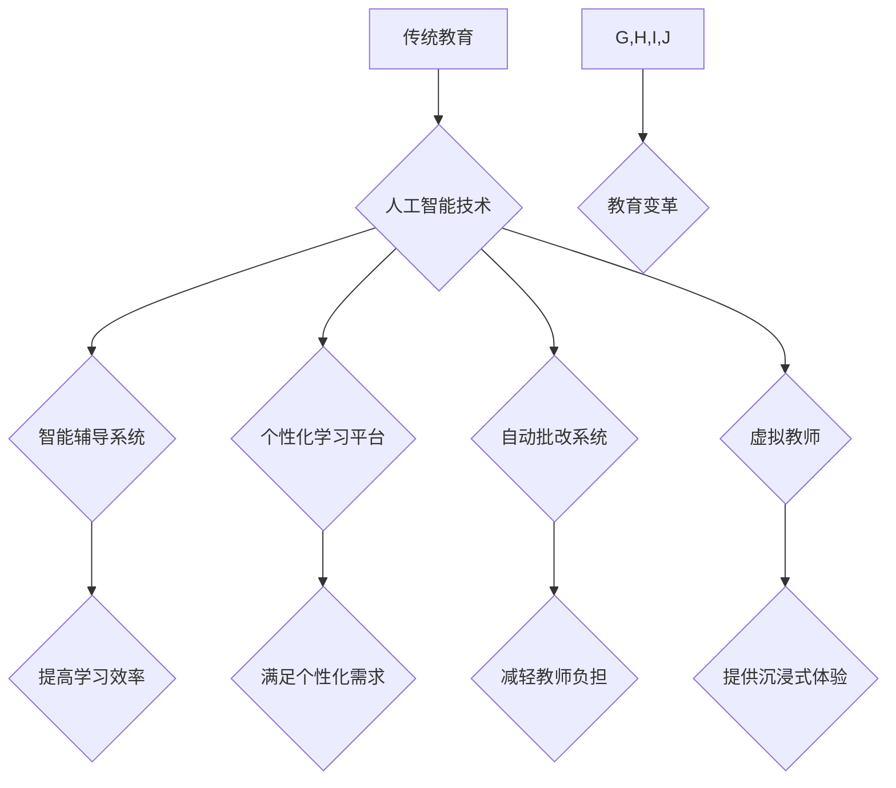

                 

## 人工智能：教育变革的催化剂

> 关键词：人工智能、教育变革、机器学习、个性化学习、智能辅导系统、教育公平、未来教育

## 1. 背景介绍

教育，作为人类文明进步的基石，一直致力于培养人才、传承知识和促进社会发展。然而，传统教育模式面临着诸多挑战，例如教学资源的不足、教师的短缺、学生的个性差异和学习效率低下等。随着人工智能技术的飞速发展，它为教育领域带来了前所未有的机遇，有望成为教育变革的催化剂，推动教育模式的创新和升级。

人工智能（AI）是指模拟人类智能行为的计算机系统，它能够通过学习和推理来解决问题、做出决策和进行创造性活动。在教育领域，人工智能技术可以应用于多个方面，例如智能辅导系统、个性化学习平台、自动批改系统、虚拟教师等，为学生提供更加个性化、高效、便捷的学习体验。

## 2. 核心概念与联系

### 2.1  人工智能在教育中的应用

人工智能在教育领域的应用主要围绕以下几个核心概念展开：

* **个性化学习:**  根据学生的学习进度、兴趣和能力，提供定制化的学习内容和学习路径。
* **智能辅导:**  利用人工智能算法，为学生提供实时反馈、解答疑问、提供学习建议等个性化辅导服务。
* **自动批改:**  利用自然语言处理和机器学习技术，自动批改学生的作业和考试，提高教师的工作效率。
* **虚拟教师:**  利用人工智能技术，模拟教师的教学行为，为学生提供虚拟的教学环境和互动体验。

### 2.2  人工智能与教育的关联

人工智能技术与教育的结合，可以构建一个更加智能化、高效化、个性化的教育生态系统。



## 3. 核心算法原理 & 具体操作步骤

### 3.1  算法原理概述

人工智能在教育领域的应用主要依赖于以下核心算法：

* **机器学习:**  通过分析大量数据，让机器学习并自动改进其性能。
* **深度学习:**  一种更高级的机器学习方法，利用多层神经网络来模拟人类大脑的学习过程。
* **自然语言处理:**  使计算机能够理解和处理人类语言，例如文本分析、语音识别等。

### 3.2  算法步骤详解

以个性化学习平台为例，其核心算法步骤如下：

1. **数据收集:**  收集学生的学习记录、考试成绩、兴趣爱好等数据。
2. **数据预处理:**  对收集到的数据进行清洗、转换和特征提取。
3. **模型训练:**  利用机器学习算法，训练一个个性化学习模型。
4. **学习路径推荐:**  根据学生的学习数据和模型预测，推荐个性化的学习路径和内容。
5. **学习效果评估:**  持续监控学生的学习效果，并根据反馈调整学习路径和内容。

### 3.3  算法优缺点

**优点:**

* **个性化:**  根据学生的个体差异提供定制化的学习体验。
* **效率:**  提高学习效率，帮助学生更快地掌握知识。
* **公平:**  为所有学生提供平等的学习机会，弥补教育资源的分配不均。

**缺点:**

* **数据依赖:**  需要大量的数据来训练模型，数据质量直接影响模型效果。
* **算法黑盒:**  一些深度学习算法难以解释，其决策过程难以被理解。
* **伦理问题:**  人工智能在教育领域的应用可能引发一些伦理问题，例如数据隐私、算法偏见等。

### 3.4  算法应用领域

人工智能算法在教育领域的应用领域非常广泛，例如：

* **智能辅导系统:**  为学生提供个性化的学习辅导和答疑服务。
* **个性化学习平台:**  根据学生的学习进度和兴趣，推荐个性化的学习内容和学习路径。
* **自动批改系统:**  自动批改学生的作业和考试，提高教师的工作效率。
* **虚拟教师:**  模拟教师的教学行为，为学生提供虚拟的教学环境和互动体验。
* **教育资源推荐:**  根据学生的学习需求，推荐相关的学习资源，例如视频、文章、练习题等。

## 4. 数学模型和公式 & 详细讲解 & 举例说明

### 4.1  数学模型构建

在个性化学习平台中，可以使用协同过滤算法来构建数学模型，推荐个性化的学习内容。协同过滤算法基于用户的行为数据，例如学习记录、评分等，预测用户对特定内容的兴趣。

### 4.2  公式推导过程

协同过滤算法的核心公式是基于用户的相似度计算，例如余弦相似度：

$$
\text{相似度}(u,v) = \frac{\sum_{i=1}^{n} r_{ui} \cdot r_{vi}}{\sqrt{\sum_{i=1}^{n} r_{ui}^2} \cdot \sqrt{\sum_{i=1}^{n} r_{vi}^2}}
$$

其中：

* $u$ 和 $v$ 表示两个用户。
* $r_{ui}$ 和 $r_{vi}$ 表示用户 $u$ 和 $v$ 对物品 $i$ 的评分。
* $n$ 表示物品的数量。

### 4.3  案例分析与讲解

假设有两个用户 $A$ 和 $B$，他们都对数学和英语科目感兴趣，但 $A$ 更喜欢数学，而 $B$ 更喜欢英语。根据协同过滤算法，我们可以计算出 $A$ 和 $B$ 之间的相似度，并根据相似度推荐 $B$ 可能会感兴趣的数学学习资源。

## 5. 项目实践：代码实例和详细解释说明

### 5.1  开发环境搭建

为了实现个性化学习平台，需要搭建一个开发环境，包括以下软件：

* Python 编程语言
* TensorFlow 或 PyTorch 深度学习框架
* Jupyter Notebook 开发环境

### 5.2  源代码详细实现

以下是一个简单的个性化学习平台代码示例，使用 Python 和 TensorFlow 框架实现：

```python
import tensorflow as tf

# 定义模型
model = tf.keras.Sequential([
    tf.keras.layers.Dense(64, activation='relu'),
    tf.keras.layers.Dense(10, activation='softmax')
])

# 训练模型
model.compile(optimizer='adam',
              loss='sparse_categorical_crossentropy',
              metrics=['accuracy'])

# 加载数据并训练模型
model.fit(x_train, y_train, epochs=10)

# 预测学习内容
predictions = model.predict(x_test)
```

### 5.3  代码解读与分析

这段代码定义了一个简单的深度学习模型，用于预测学生的学习内容。模型包含两层全连接层，第一层有 64 个神经元，使用 ReLU 激活函数，第二层有 10 个神经元，使用 softmax 激活函数。模型使用 Adam 优化器，损失函数为 sparse_categorical_crossentropy，评估指标为准确率。

### 5.4  运行结果展示

训练完成后，可以使用测试数据来评估模型的性能，例如计算准确率。

## 6. 实际应用场景

### 6.1  智能辅导系统

智能辅导系统可以根据学生的学习进度和理解情况，提供个性化的辅导和答疑服务。例如，当学生遇到难题时，智能辅导系统可以提供相关的学习资源、讲解视频或示例问题，帮助学生解决问题。

### 6.2  个性化学习平台

个性化学习平台可以根据学生的学习兴趣和能力，推荐个性化的学习内容和学习路径。例如，对于喜欢编程的学生，平台可以推荐相关的编程课程和练习题；对于喜欢阅读的学生，平台可以推荐相关的书籍和文章。

### 6.3  自动批改系统

自动批改系统可以自动批改学生的作业和考试，提高教师的工作效率。例如，对于选择题和填空题，自动批改系统可以快速准确地批改；对于简答题和作文，自动批改系统可以利用自然语言处理技术进行批改，并提供相应的反馈。

### 6.4  未来应用展望

人工智能在教育领域的应用前景广阔，未来可能出现以下应用场景：

* **虚拟现实/增强现实教学:**  利用虚拟现实和增强现实技术，创造沉浸式的学习环境，提高学生的学习兴趣和参与度。
* **个性化学习机器人:**  开发能够与学生进行互动、提供个性化辅导的学习机器人。
* **人工智能辅助教师:**  利用人工智能技术辅助教师进行教学工作，例如自动生成教学计划、批改作业、提供学生学习情况分析等。

## 7. 工具和资源推荐

### 7.1  学习资源推荐

* **Coursera:**  提供各种人工智能和教育领域的在线课程。
* **edX:**  提供由世界顶级大学提供的在线课程，包括人工智能和教育领域的课程。
* **Udacity:**  提供人工智能和数据科学领域的在线课程和项目。

### 7.2  开发工具推荐

* **TensorFlow:**  开源深度学习框架，用于构建和训练人工智能模型。
* **PyTorch:**  开源深度学习框架，具有灵活性和易用性。
* **Jupyter Notebook:**  交互式编程环境，用于数据分析、机器学习和深度学习开发。

### 7.3  相关论文推荐

* **Deep Learning for Education: A Survey**
* **Personalized Learning with Artificial Intelligence**
* **The Impact of Artificial Intelligence on Education**

## 8. 总结：未来发展趋势与挑战

### 8.1  研究成果总结

人工智能在教育领域的应用取得了显著的成果，例如智能辅导系统、个性化学习平台、自动批改系统等，为教育教学带来了新的变革。

### 8.2  未来发展趋势

未来，人工智能在教育领域的应用将更加深入和广泛，例如：

* **更智能的个性化学习:**  利用更先进的机器学习算法，提供更加精准的个性化学习体验。
* **更沉浸式的学习环境:**  利用虚拟现实和增强现实技术，创造更加沉浸式的学习环境。
* **更有效的教师辅助:**  利用人工智能技术辅助教师进行教学工作，例如自动生成教学计划、批改作业、提供学生学习情况分析等。

### 8.3  面临的挑战

人工智能在教育领域的应用也面临着一些挑战，例如：

* **数据隐私和安全:**  人工智能算法需要大量的数据来训练，如何保护学生的隐私和数据安全是一个重要的挑战。
* **算法偏见:**  一些人工智能算法可能存在偏见，例如性别、种族、经济背景等，需要进行公平性和包容性的评估和改进。
* **伦理问题:**  人工智能在教育领域的应用可能引发一些伦理问题，例如算法透明度、教师的角色变化等，需要进行深入的探讨和伦理规范的制定。

### 8.4  研究展望

未来，需要进一步研究人工智能在教育领域的应用，例如：

* **开发更安全、更可靠的人工智能算法:**  确保人工智能算法的公平性、透明度和安全性。
* **探索人工智能与教育的更深层次的融合:**  例如，利用人工智能技术进行教育研究、评估教育效果等。
* **制定人工智能在教育领域的伦理规范:**  引导人工智能技术在教育领域的健康发展。


## 9. 附录：常见问题与解答

### 9.1  人工智能是否会取代教师？

人工智能技术可以辅助教师进行教学工作，但不会取代教师。教师的角色将更加注重学生的个性化辅导、情感支持和批判性思维培养等方面。

### 9.2  人工智能在教育领域的应用是否公平？

人工智能算法可能存在偏见，需要进行公平性和包容性的评估和改进。需要确保人工智能技术能够为所有学生提供平等的学习机会。

### 9.3  如何保护学生的隐私和数据安全？

在人工智能在教育领域的应用中，需要采取措施保护学生的隐私和数据安全，例如数据加密、匿名化处理等。

作者：禅与计算机程序设计艺术 / Zen and the Art of Computer Programming 


<end_of_turn>

