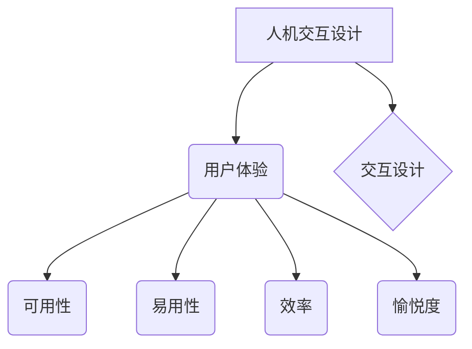

                 

## 人机交互设计：打造高效的人类计算系统

> 关键词：人机交互、用户体验、交互设计、界面设计、可用性、人工智能、自然语言处理、认知科学

### 1. 背景介绍

随着人工智能技术的飞速发展，人机交互已经不再局限于传统的鼠标键盘操作，而是朝着更加自然、智能、便捷的方向迈进。从语音助手到虚拟现实，从智能家居到自动驾驶，人机交互正在深刻地改变着我们的生活方式和工作模式。

高效的人机交互设计是构建未来智能计算系统的关键。它需要深入理解用户的认知能力、行为模式和情感需求，并利用先进的技术手段，创造出直观、易用、愉悦的用户体验。

### 2. 核心概念与联系

**2.1 人机交互设计 (HCI)**

人机交互设计 (HCI) 是一门跨学科的领域，它关注于设计、评估和改进人与计算机之间交互的方式。HCI 的目标是创造出用户友好、高效、安全的交互体验。

**2.2 用户体验 (UX)**

用户体验 (UX) 是用户与产品或系统交互时所感受到的整体感受。它包括用户对产品功能、易用性、美观度、效率等方面的感知。良好的用户体验是高效人机交互设计的核心目标。

**2.3 交互设计 (IxD)**

交互设计 (IxD) 是 HCI 的一个重要分支，它侧重于设计用户与产品或系统交互的流程、界面和行为模式。交互设计师需要考虑用户的认知能力、行为习惯和情感需求，设计出直观、易用、愉悦的交互体验。

**2.4  核心概念关系图**



### 3. 核心算法原理 & 具体操作步骤

**3.1 算法原理概述**

高效的人机交互设计需要利用各种算法和技术手段，例如自然语言处理、机器学习、计算机视觉等，来理解用户的意图、预测用户的行为，并提供相应的交互反馈。

**3.2 算法步骤详解**

1. **用户输入识别:**  识别用户的输入方式，例如文本、语音、手势等。
2. **意图理解:**  分析用户的输入内容，识别用户的意图和需求。
3. **行为预测:**  根据用户的历史行为和上下文信息，预测用户的下一步行动。
4. **交互反馈:**  根据用户的意图和行为预测，提供相应的交互反馈，例如文本回复、语音提示、图像展示等。

**3.3 算法优缺点**

* **优点:** 能够实现更加自然、智能、便捷的人机交互。
* **缺点:** 需要大量的训练数据和计算资源，算法的准确性还存在一定局限性。

**3.4 算法应用领域**

* **智能语音助手:** 例如 Siri、Alexa、Google Assistant 等。
* **聊天机器人:** 用于提供客户服务、咨询信息等。
* **虚拟现实/增强现实:**  提供更加沉浸式的交互体验。
* **自动驾驶:**  帮助车辆理解周围环境，做出决策。

### 4. 数学模型和公式 & 详细讲解 & 举例说明

**4.1 数学模型构建**

人机交互设计中常用的数学模型包括：

* **贝叶斯网络:** 用于表示用户行为之间的概率关系。
* **隐马尔可夫模型:** 用于预测用户的下一个行为。
* **支持向量机:** 用于分类用户行为。

**4.2 公式推导过程**

例如，贝叶斯网络的概率计算公式如下：

$$P(A|B) = \frac{P(B|A)P(A)}{P(B)}$$

其中：

* $P(A|B)$ 是在已知事件 B 发生的情况下，事件 A 发生的概率。
* $P(B|A)$ 是在已知事件 A 发生的情况下，事件 B 发生的概率。
* $P(A)$ 是事件 A 发生的概率。
* $P(B)$ 是事件 B 发生的概率。

**4.3 案例分析与讲解**

例如，在设计一个智能语音助手时，可以使用贝叶斯网络来预测用户的下一个意图。

假设用户输入了 "今天天气怎么样"，我们可以根据用户的历史行为和上下文信息，计算出用户意图为 "查询天气" 的概率。

$$P(\text{查询天气}|\text{用户输入 "今天天气怎么样"}) = \frac{P(\text{用户输入 "今天天气怎么样" | 查询天气})P(\text{查询天气})}{P(\text{用户输入 "今天天气怎么样"})}$$

其中：

* $P(\text{用户输入 "今天天气怎么样" | 查询天气})$ 是在用户意图为 "查询天气" 的情况下，用户输入 "今天天气怎么样" 的概率。
* $P(\text{查询天气})$ 是用户意图为 "查询天气" 的概率。
* $P(\text{用户输入 "今天天气怎么样"}))$ 是用户输入 "今天天气怎么样" 的概率。

通过计算以上概率，我们可以得到用户意图为 "查询天气" 的概率，并根据该概率提供相应的交互反馈。

### 5. 项目实践：代码实例和详细解释说明

**5.1 开发环境搭建**

* 操作系统: Windows/macOS/Linux
* 编程语言: Python
* 开发工具: PyCharm/VS Code
* 库依赖: NLTK/SpaCy/TensorFlow/PyTorch

**5.2 源代码详细实现**

```python
import nltk
from nltk.chat.util import Chat, reflections

pairs = [
    [
        r"我的名字是什么？",
        ["我的名字是 Bard."]
    ],
    [
        r"你好",
        ["你好！", "嗨！", "元気？"]
    ],
    [
        r"再见",
        ["再见！", "拜拜！", "下次见！"]
    ],
]

chat = Chat(pairs, reflections)
chat.converse()
```

**5.3 代码解读与分析**

* 该代码实现了一个简单的聊天机器人。
* 使用 NLTK 库进行自然语言处理。
* 定义了一组对话规则，用于匹配用户的输入和相应的回复。
* 使用 `Chat` 类创建聊天机器人实例，并调用 `converse()` 方法进行对话。

**5.4 运行结果展示**

```
你好！
我的名字是什么？
我的名字是 Bard.
再见！
下次见！
```

### 6. 实际应用场景

**6.1 智能客服:**  自动处理客户咨询、订单查询等常见问题，提高客服效率。

**6.2 教育辅助:**  提供个性化的学习辅导、知识问答等服务，帮助学生提高学习效率。

**6.3 娱乐互动:**  设计游戏、虚拟角色等，提供更加生动、有趣的互动体验。

**6.4 未来应用展望**

* 人机交互将更加自然、智能、个性化。
* 人工智能将更加深入地融入人机交互系统，提供更加智能的交互体验。
* 虚拟现实、增强现实等技术将与人机交互相结合，创造更加沉浸式的交互体验。

### 7. 工具和资源推荐

**7.1 学习资源推荐**

* **书籍:**
    * 《人机交互设计》
    * 《交互设计》
    * 《设计心理学》
* **在线课程:**
    * Coursera: 人机交互设计
    * edX: 交互设计
    * Udemy: 人工智能与人机交互

**7.2 开发工具推荐**

* **设计工具:**
    * Figma
    * Sketch
    * Adobe XD
* **开发工具:**
    * PyCharm
    * VS Code
    * Xcode

**7.3 相关论文推荐**

* **ACM CHI Conference on Human Factors in Computing Systems**
* **IEEE International Conference on Human-Computer Interaction (HCI)**
* **Association for Computing Machinery (ACM)**

### 8. 总结：未来发展趋势与挑战

**8.1 研究成果总结**

近年来，人机交互设计取得了显著的进展，例如：

* 自然语言处理技术取得了突破性进展，使得人机交互更加自然、流畅。
* 机器学习技术被广泛应用于人机交互设计，例如用户行为预测、个性化推荐等。
* 虚拟现实、增强现实等技术为人机交互提供了更加沉浸式的体验。

**8.2 未来发展趋势**

* 人机交互将更加智能、个性化、情感化。
* 人工智能将更加深入地融入人机交互系统，提供更加智能的交互体验。
* 跨模态人机交互将成为主流，例如语音、图像、视频等多种模态的融合。

**8.3 面临的挑战**

* 如何设计更加安全、可靠、可解释的人机交互系统。
* 如何解决数据隐私、算法偏见等伦理问题。
* 如何让技术更加普惠，惠及更多的人。

**8.4 研究展望**

未来，人机交互设计将继续朝着更加智能、便捷、人性化的方向发展。我们需要不断探索新的技术手段和设计理念，创造出更加美好的未来。

### 9. 附录：常见问题与解答

**9.1 如何设计一个好的用户界面？**

* 遵循用户中心设计原则，深入了解用户的需求和行为模式。
* 设计直观、易用的界面，避免使用复杂的术语和操作流程。
* 进行多次用户测试，收集用户反馈，不断优化界面设计。

**9.2 如何提高人机交互系统的效率？**

* 利用人工智能技术，例如自然语言处理、机器学习等，提高系统的智能化水平。
* 设计高效的交互流程，减少用户操作步骤。
* 提供个性化的交互体验，根据用户的习惯和需求定制交互方式。


作者：禅与计算机程序设计艺术 / Zen and the Art of Computer Programming 
<end_of_turn>

