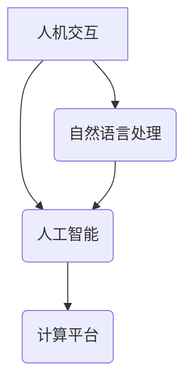

                 

## 人机交互：打造高效便捷的人类计算平台

> 关键词：人机交互、自然语言处理、人工智能、用户体验、计算平台、交互设计、语音识别、机器学习

### 1. 背景介绍

人类与计算机的交互方式经历了从命令行界面到图形用户界面，再到如今的自然语言交互的演变。随着人工智能技术的飞速发展，人机交互正迎来一场革命性的变革。传统的鼠标和键盘操作方式逐渐被语音、图像、体感等更加自然、直观的方式所取代。

高效便捷的人机交互平台是未来计算平台的核心，它将极大地提升人类的计算能力和工作效率。 

### 2. 核心概念与联系

#### 2.1 人机交互 (Human-Computer Interaction, HCI)

人机交互是指人类与计算机之间进行信息交换和操作的整个过程。它涉及到用户界面设计、用户体验、心理学、认知科学等多学科领域。

#### 2.2 自然语言处理 (Natural Language Processing, NLP)

自然语言处理是人工智能领域的重要分支，它致力于使计算机能够理解、处理和生成人类语言。NLP技术在人机交互中扮演着至关重要的角色，它使得用户能够用自然语言与计算机进行交流。

#### 2.3 人工智能 (Artificial Intelligence, AI)

人工智能是指模拟人类智能行为的计算机系统。AI技术在人机交互中被广泛应用，例如：

* **语音识别:** 将语音转换成文本。
* **机器翻译:** 将一种语言翻译成另一种语言。
* **对话系统:** 与用户进行自然语言对话。

#### 2.4 计算平台 (Computing Platform)

计算平台是指提供计算资源和软件环境的硬件和软件系统。高效便捷的人机交互平台需要强大的计算平台作为基础。

**核心概念关系图:**



### 3. 核心算法原理 & 具体操作步骤

#### 3.1 算法原理概述

高效便捷的人机交互平台需要基于先进的算法原理，例如：

* **语音识别算法:** 包括声学建模、语言模型和解码算法。
* **自然语言理解算法:** 包括词义消歧、句法分析和语义分析。
* **对话系统算法:** 包括状态机、基于规则的系统和基于机器学习的系统。

#### 3.2 算法步骤详解

以语音识别为例，其具体操作步骤如下：

1. **语音采集:** 使用麦克风采集用户的语音信号。
2. **预处理:** 对语音信号进行降噪、增益调整等预处理操作。
3. **特征提取:** 从语音信号中提取特征，例如梅尔频率倒谱系数 (MFCC)。
4. **声学建模:** 使用声学模型将语音特征映射到相应的音素或单词。
5. **语言模型:** 使用语言模型预测最可能的词序列。
6. **解码:** 使用解码算法将声学模型和语言模型的输出组合成完整的文本。

#### 3.3 算法优缺点

* **语音识别算法:**
    * **优点:** 能够实现无键盘输入，提高交互效率。
    * **缺点:** 识别准确率受环境噪声、说话者口音等因素影响。
* **自然语言理解算法:**
    * **优点:** 能够理解用户的复杂意图和需求。
    * **缺点:** 理解能力有限，难以处理歧义和上下文信息不足的情况。
* **对话系统算法:**
    * **优点:** 可以提供个性化、交互式的服务体验。
    * **缺点:** 难以处理开放式问题和复杂场景。

#### 3.4 算法应用领域

* **智能语音助手:** 例如 Siri、Alexa、Google Assistant。
* **虚拟客服:** 自动回答用户常见问题，提高服务效率。
* **智能家居:** 通过语音控制家电设备。
* **医疗诊断:** 辅助医生进行诊断和治疗。

### 4. 数学模型和公式 & 详细讲解 & 举例说明

#### 4.1 数学模型构建

在人机交互中，可以使用数学模型来描述用户行为、系统响应和交互过程。例如，可以使用马尔科夫模型来建模用户的对话行为，可以使用贝叶斯网络来建模系统的知识表示和推理过程。

#### 4.2 公式推导过程

以语音识别为例，声学模型的概率计算可以使用以下公式：

$$P(W|O) = \frac{P(O|W)P(W)}{P(O)}$$

其中：

* $P(W|O)$ 是给定观测序列 $O$ 下单词序列 $W$ 的概率。
* $P(O|W)$ 是给定单词序列 $W$ 下观测序列 $O$ 的概率。
* $P(W)$ 是单词序列 $W$ 的先验概率。
* $P(O)$ 是观测序列 $O$ 的边缘概率。

#### 4.3 案例分析与讲解

假设我们有一个语音识别系统，需要识别“你好”这个词。

* $O$ 是语音信号的特征序列。
* $W$ 是“你好”这个词的单词序列。

系统会根据声学模型 $P(O|W)$ 和语言模型 $P(W)$ 计算出 $P(W|O)$ 的值，从而判断识别结果。

### 5. 项目实践：代码实例和详细解释说明

#### 5.1 开发环境搭建

* 操作系统: Ubuntu 20.04
* Python 版本: 3.8
* 必要的库: TensorFlow, PyTorch, NLTK, SpeechRecognition

#### 5.2 源代码详细实现

```python
import speech_recognition as sr

# 初始化语音识别器
r = sr.Recognizer()

# 使用麦克风录音
with sr.Microphone() as source:
    print("请说话:")
    audio = r.listen(source)

# 使用Google Speech Recognition识别语音
try:
    text = r.recognize_google(audio, language="zh-CN")
    print("您说的是:", text)
except sr.UnknownValueError:
    print("无法识别语音")
except sr.RequestError as e:
    print("无法连接到语音识别服务; {0}".format(e))
```

#### 5.3 代码解读与分析

* 该代码使用 `speech_recognition` 库实现语音识别功能。
* `sr.Recognizer()` 初始化语音识别器。
* `sr.Microphone()` 使用麦克风录音。
* `r.recognize_google()` 使用Google Speech Recognition服务识别语音，并返回识别结果。
* `try-except` 语句处理语音识别失败的情况。

#### 5.4 运行结果展示

当用户说话时，程序会识别用户的语音并将其转换为文本，然后在控制台中打印识别结果。

### 6. 实际应用场景

#### 6.1 智能家居

通过语音控制家电设备，例如调节温度、打开灯光、播放音乐等。

#### 6.2 医疗诊断

辅助医生进行诊断和治疗，例如识别患者的症状、提供医疗建议等。

#### 6.3 教育培训

提供个性化的学习体验，例如语音朗读教材、答疑解惑等。

#### 6.4 未来应用展望

* **更自然的交互方式:** 例如手势识别、眼动追踪等。
* **更智能的交互体验:** 例如情感识别、个性化推荐等。
* **更广泛的应用场景:** 例如自动驾驶、机器人等。

### 7. 工具和资源推荐

#### 7.1 学习资源推荐

* **书籍:**
    * 人机交互设计
    * 自然语言处理
    * 人工智能
* **在线课程:**
    * Coursera
    * edX
    * Udacity

#### 7.2 开发工具推荐

* **语音识别库:**
    * SpeechRecognition
    * Vosk
* **自然语言处理库:**
    * NLTK
    * SpaCy
    * Transformers
* **机器学习框架:**
    * TensorFlow
    * PyTorch

#### 7.3 相关论文推荐

* **ACL (Association for Computational Linguistics) 会议论文:** https://www.aclweb.org/
* **EMNLP (Empirical Methods in Natural Language Processing) 会议论文:** https://www.emnlp.org/
* **NAACL (North American Chapter of the Association for Computational Linguistics) 会议论文:** https://www.naacl.org/

### 8. 总结：未来发展趋势与挑战

#### 8.1 研究成果总结

高效便捷的人机交互平台是未来计算平台的核心，它将极大地提升人类的计算能力和工作效率。 人工智能、自然语言处理、语音识别等技术的快速发展为构建高效便捷的人机交互平台提供了强大的技术支撑。

#### 8.2 未来发展趋势

* **更自然、更智能的人机交互方式:** 例如手势识别、眼动追踪、情感识别等。
* **更个性化、更定制化的交互体验:** 例如个性化推荐、上下文感知等。
* **更广泛的应用场景:** 例如自动驾驶、机器人、医疗诊断等。

#### 8.3 面临的挑战

* **算法精度和鲁棒性:** 人机交互算法需要能够处理复杂场景、歧义和噪声等问题。
* **数据安全和隐私保护:** 人机交互平台需要收集和处理大量用户数据，因此数据安全和隐私保护是一个重要的挑战。
* **伦理和社会影响:** 人机交互技术的快速发展可能会带来一些伦理和社会问题，例如就业替代、信息操控等。

#### 8.4 研究展望

未来，我们需要继续加强对人机交互算法、模型和平台的研究，以构建更安全、更可靠、更智能的人机交互平台，为人类社会带来更多福祉。

### 9. 附录：常见问题与解答

#### 9.1 如何提高语音识别的准确率？

* 使用高质量的麦克风录音。
* 减少环境噪声。
* 使用专业的语音识别引擎。
* 提供足够的训练数据。

#### 9.2 如何保护用户数据安全？

* 使用加密技术保护用户数据。
* 明确用户数据的使用政策。
* 获得用户的明确同意。
* 遵守相关数据保护法规。


作者：禅与计算机程序设计艺术 / Zen and the Art of Computer Programming 
<end_of_turn>

