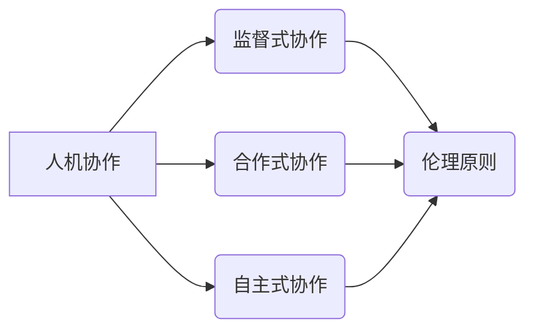

                 

## 人机协作：伦理规范与准则

> 关键词：人机协作、伦理规范、人工智能、算法偏见、透明度、可解释性、责任归属

### 1. 背景介绍

人工智能 (AI) 的飞速发展正在深刻地改变着我们的生活和工作方式。从自动驾驶汽车到医疗诊断，从个性化教育到金融风险管理，AI 正在各个领域展现出强大的潜力。然而，随着 AI 技术的日益成熟，人机协作也面临着越来越多的伦理挑战。

人机协作是指人类和人工智能系统共同完成任务的过程。这种协作模式可以最大限度地发挥人类和 AI 的各自优势，提高工作效率和决策质量。然而，人机协作也带来了新的伦理问题，例如：

* **算法偏见:** AI 算法的训练数据可能包含社会偏见，导致算法在决策过程中产生歧视性结果。
* **透明度和可解释性:** 许多 AI 算法过于复杂，难以理解其决策过程，这使得人们难以信任 AI 系统的判断。
* **责任归属:** 当 AI 系统导致负面后果时，谁应该承担责任？是开发者、使用者还是 AI 系统本身？

这些伦理问题需要我们认真思考和探讨，制定相应的规范和准则，确保人机协作能够安全、公平、透明地发展。

### 2. 核心概念与联系

**2.1 人机协作模式**

人机协作模式可以分为以下几种：

* **监督式协作:** 人类在整个过程中扮演着主导角色，AI 系统辅助人类完成任务。
* **合作式协作:** 人类和 AI 系统共同参与任务的各个阶段，相互补充，共同完成目标。
* **自主式协作:** AI 系统能够独立完成任务，人类只在必要时进行干预。

**2.2 伦理原则**

人机协作的伦理规范应该遵循以下原则：

* **尊重:** 人类和 AI 系统都应该被尊重，其权利和利益都应该得到保障。
* **公平:** 人机协作系统应该公平公正地对待所有用户，避免产生歧视性结果。
* **透明:** 人机协作系统的决策过程应该尽可能透明，让人们能够理解其背后的逻辑。
* **责任:** 人机协作系统的开发者、使用者和监管机构都应该对系统产生的结果承担相应的责任。

**2.3 核心概念关系图**



### 3. 核心算法原理 & 具体操作步骤

**3.1 算法原理概述**

在人机协作中，许多算法被用于实现人类和 AI 系统之间的交互和协作。例如，自然语言处理 (NLP) 算法可以帮助 AI 系统理解和生成人类语言，机器学习 (ML) 算法可以帮助 AI 系统从数据中学习和改进。

**3.2 算法步骤详解**

以 NLP 算法为例，其基本步骤包括：

1. **文本预处理:** 将自然语言文本转换为机器可理解的格式，例如去除停用词、分词等。
2. **特征提取:** 从预处理后的文本中提取特征，例如词频、词向量等。
3. **模型训练:** 使用训练数据训练 NLP 模型，例如语言模型、机器翻译模型等。
4. **模型预测:** 将新文本输入到训练好的模型中，进行预测或生成。

**3.3 算法优缺点**

NLP 算法具有以下优点：

* 可以理解和生成人类语言，实现人机自然交互。
* 可以用于多种应用场景，例如聊天机器人、文本摘要、机器翻译等。

但同时也存在以下缺点：

* 训练数据量大，需要大量的数据进行训练。
* 算法复杂，需要专业的知识和技术进行开发和维护。
* 容易受到数据偏差的影响，可能产生歧视性结果。

**3.4 算法应用领域**

NLP 算法广泛应用于以下领域：

* **自然语言理解:** 语义分析、情感分析、问答系统等。
* **自然语言生成:** 机器翻译、文本摘要、对话系统等。
* **信息检索:** 搜索引擎、知识图谱等。

### 4. 数学模型和公式 & 详细讲解 & 举例说明

**4.1 数学模型构建**

在人机协作中，数学模型可以用于描述人类和 AI 系统之间的交互关系，例如：

* **合作决策模型:** 描述人类和 AI 系统在决策过程中如何协作，例如博弈论中的合作博弈模型。
* **信任模型:** 描述人类对 AI 系统的信任程度，例如基于贝叶斯网络的信任模型。

**4.2 公式推导过程**

以合作决策模型为例，假设人类和 AI 系统分别拥有两个策略，A 和 B，以及相应的收益函数。合作决策模型的目标是找到一个最优策略组合，使得人类和 AI 系统的总收益最大化。

可以使用博弈论中的纳什均衡概念来求解最优策略组合。纳什均衡是指一个策略组合，使得任何一方都不愿意单独改变其策略，而其他方的策略保持不变。

**4.3 案例分析与讲解**

例如，在自动驾驶汽车中，人类驾驶员和 AI 系统可以合作决策。人类驾驶员可以提供全局信息和驾驶经验，而 AI 系统可以提供实时路况信息和驾驶辅助功能。

通过合作决策模型，可以找到一个最优策略组合，使得人类驾驶员和 AI 系统能够协作驾驶，提高安全性、效率和舒适性。

### 5. 项目实践：代码实例和详细解释说明

**5.1 开发环境搭建**

为了实现人机协作项目，需要搭建相应的开发环境。例如，可以使用 Python 语言和 TensorFlow 库进行 AI 模型开发，可以使用 ROS (Robot Operating System) 进行机器人控制。

**5.2 源代码详细实现**

以下是一个简单的 NLP 算法代码实例，用于实现文本分类任务：

```python
import tensorflow as tf

# 定义模型结构
model = tf.keras.models.Sequential([
    tf.keras.layers.Embedding(input_dim=10000, output_dim=128),
    tf.keras.layers.LSTM(128),
    tf.keras.layers.Dense(10, activation='softmax')
])

# 编译模型
model.compile(optimizer='adam',
              loss='sparse_categorical_crossentropy',
              metrics=['accuracy'])

# 训练模型
model.fit(x_train, y_train, epochs=10)

# 预测结果
predictions = model.predict(x_test)
```

**5.3 代码解读与分析**

这段代码定义了一个简单的文本分类模型，使用 Embedding 层将单词转换为向量表示，使用 LSTM 层提取文本特征，使用 Dense 层进行分类。

**5.4 运行结果展示**

训练完成后，可以使用测试数据评估模型的性能，例如计算准确率、召回率等指标。

### 6. 实际应用场景

人机协作技术已经应用于各个领域，例如：

* **医疗保健:** AI 辅助医生诊断疾病、制定治疗方案。
* **教育:** AI 个性化学习辅导、自动批改作业。
* **金融:** AI 风险评估、欺诈检测。
* **制造业:** AI 自动化生产、质量控制。

**6.4 未来应用展望**

未来，人机协作技术将更加深入地融入我们的生活和工作，例如：

* **智能家居:** AI 辅助家居管理、提供个性化服务。
* **自动驾驶:** AI 辅助驾驶员驾驶，实现无人驾驶。
* **远程医疗:** AI 辅助远程医疗诊断、治疗。

### 7. 工具和资源推荐

**7.1 学习资源推荐**

* **书籍:**

    * 人工智能：一种现代方法 (Artificial Intelligence: A Modern Approach)
    * 深度学习 (Deep Learning)

* **在线课程:**

    * Coursera: 人工智能
    * edX: 深度学习

**7.2 开发工具推荐**

* **Python:** 人工智能开发的常用语言。
* **TensorFlow:** 深度学习框架。
* **PyTorch:** 深度学习框架。
* **ROS:** 机器人操作系统。

**7.3 相关论文推荐**

* 人工智能：一种现代方法 (Russell & Norvig, 2021)
* 深度学习 (Goodfellow et al., 2016)

### 8. 总结：未来发展趋势与挑战

**8.1 研究成果总结**

人机协作技术取得了显著的进展，在各个领域展现出巨大的潜力。

**8.2 未来发展趋势**

未来，人机协作技术将更加智能化、个性化、协同化。

**8.3 面临的挑战**

人机协作技术也面临着许多挑战，例如：

* 算法偏见
* 透明度和可解释性
* 责任归属

**8.4 研究展望**

未来研究需要重点关注以下方面：

* 开发更加公平、透明、可解释的 AI 算法。
* 建立完善的人机协作伦理规范和法律框架。
* 加强对人机协作技术的社会影响评估和监管。

### 9. 附录：常见问题与解答

**9.1 如何避免算法偏见？**

* 使用更加多样化的训练数据。
* 开发算法公平性评估指标。
* 采用算法调优技术，减轻算法偏见的影响。

**9.2 如何提高 AI 系统的透明度和可解释性？**

* 使用可解释的 AI 算法，例如规则模型、决策树等。
* 开发 AI 系统决策过程可视化工具。
* 建立 AI 系统解释报告机制。

**9.3 如何解决人机协作中的责任归属问题？**

* 明确 AI 系统的职责范围和限制。
* 建立 AI 系统的责任追溯机制。
* 制定相应的法律法规，规范 AI 系统的开发和使用。


作者：禅与计算机程序设计艺术 / Zen and the Art of Computer Programming 
<end_of_turn>

