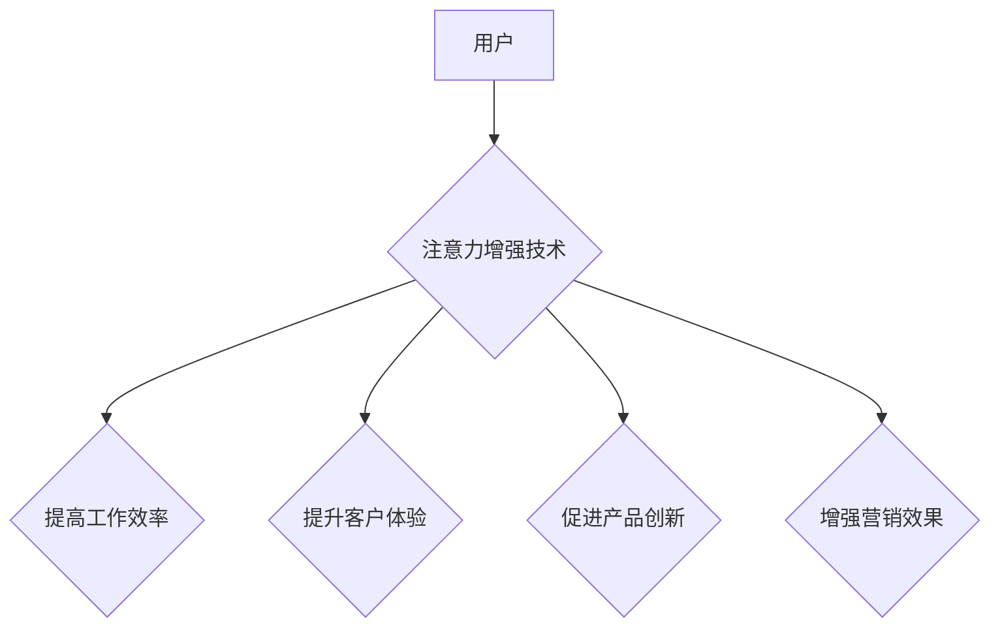

                 

## 人类注意力增强：提升专注力和注意力在商业中的未来发展趋势预测分析

> 关键词：注意力增强、专注力、深度学习、脑机接口、商业应用、未来趋势、挑战

## 1. 背景介绍

在当今信息爆炸的时代，人类的注意力面临着前所未有的挑战。来自社交媒体、电子邮件、新闻推送等各种信息源的干扰，使得人们难以集中精力完成任务，专注力持续下降。这不仅影响着个人生活和学习效率，也对商业发展造成严重阻碍。

注意力是认知的核心能力之一，它决定着我们获取、处理和记忆信息的能力。专注力则是注意力的一种特殊表现形式，指的是能够长时间地集中在特定目标上，排除干扰的能力。

对于商业而言，注意力和专注力是至关重要的资源。它直接影响着员工的工作效率、客户的体验、产品的创新能力以及企业的竞争力。

## 2. 核心概念与联系

### 2.1 注意力增强

注意力增强是指通过技术手段提升人类注意力和专注力的能力。它涵盖了多种技术和方法，包括：

* **认知训练:** 通过专门的训练程序和游戏，锻炼大脑的注意力和专注力。
* **生物反馈技术:** 利用脑电图等设备，实时监测大脑活动，并通过反馈机制帮助用户控制注意力。
* **神经刺激技术:** 通过电刺激或磁刺激等方式，直接影响大脑神经元活动，增强注意力。
* **环境调节:** 通过调整工作环境，减少干扰，提高注意力。

### 2.2 商业应用

注意力增强技术在商业领域有着广泛的应用前景，例如：

* **提高员工工作效率:** 通过注意力增强技术，帮助员工集中注意力，提高工作效率和生产力。
* **提升客户体验:** 通过注意力增强技术，帮助企业更好地理解客户需求，提供更个性化和精准的服务。
* **促进产品创新:** 通过注意力增强技术，帮助企业员工更有效地进行创意思考和问题解决，促进产品创新。
* **增强营销效果:** 通过注意力增强技术，帮助企业更精准地触达目标客户，提高营销效果。

**Mermaid 流程图**



## 3. 核心算法原理 & 具体操作步骤

### 3.1 算法原理概述

注意力增强算法通常基于深度学习技术，利用神经网络模型学习人类注意力的机制，并通过训练模型来提升注意力和专注力。

常见的注意力增强算法包括：

* **Transformer网络:** Transformer网络是一种强大的深度学习模型，能够有效地捕捉序列数据中的长距离依赖关系，在自然语言处理领域取得了突破性进展。
* **注意力机制:** 注意力机制是一种用于处理序列数据的机制，能够学习到哪些信息对当前任务更重要，并对这些信息给予更多的关注。

### 3.2 算法步骤详解

1. **数据收集和预处理:** 收集大量注意力相关的数据，例如用户行为数据、脑电图数据等，并进行预处理，例如数据清洗、特征提取等。
2. **模型构建:** 选择合适的深度学习模型，例如Transformer网络，并根据任务需求进行调整和优化。
3. **模型训练:** 利用收集到的数据对模型进行训练，训练目标是让模型能够准确地预测用户注意力和专注力。
4. **模型评估:** 使用测试数据对模型进行评估，评估指标包括准确率、召回率、F1-score等。
5. **模型部署:** 将训练好的模型部署到实际应用场景中，例如智能手机应用程序、脑机接口设备等。

### 3.3 算法优缺点

**优点:**

* **高精度:** 深度学习算法能够学习到复杂的注意力机制，具有较高的预测精度。
* **可扩展性:** 深度学习模型可以轻松扩展到处理更大的数据集和更复杂的任务。
* **个性化:** 深度学习模型可以根据用户的个人特征和行为数据进行个性化定制。

**缺点:**

* **数据依赖:** 深度学习算法需要大量的训练数据，否则模型性能会下降。
* **计算资源:** 训练深度学习模型需要大量的计算资源，成本较高。
* **可解释性:** 深度学习模型的决策过程比较复杂，难以解释其背后的机制。

### 3.4 算法应用领域

注意力增强算法在以下领域有着广泛的应用前景:

* **教育:** 帮助学生提高学习效率和专注力。
* **医疗:** 辅助医生诊断疾病、治疗患者。
* **游戏:** 提升游戏玩家的沉浸感和体验。
* **安全:** 检测和预防注意力缺陷障碍等心理健康问题。

## 4. 数学模型和公式 & 详细讲解 & 举例说明

### 4.1 数学模型构建

注意力增强算法通常基于以下数学模型构建:

* **注意力机制:** 注意力机制的核心是计算每个输入元素对输出的影响权重，权重越高，表示该元素对输出的影响越大。

**公式:**

$$
\text{Attention}(Q, K, V) = \text{softmax}(\frac{Q K^T}{\sqrt{d_k}}) V
$$

其中:

* $Q$：查询矩阵
* $K$：键矩阵
* $V$：值矩阵
* $d_k$：键向量的维度
* $\text{softmax}$：softmax函数，用于将权重归一化

**解释:**

该公式计算每个查询元素与所有键元素之间的相似度，然后通过softmax函数将其转换为概率分布，表示每个键元素对当前查询元素的影响权重。最后，将这些权重与值矩阵相乘，得到最终的输出。

### 4.2 公式推导过程

注意力机制的公式推导过程可以分为以下几个步骤:

1. 计算查询矩阵 $Q$ 与键矩阵 $K$ 的点积，得到一个得分矩阵。
2. 对得分矩阵进行归一化，使用softmax函数将其转换为概率分布。
3. 将概率分布与值矩阵 $V$ 相乘，得到最终的输出。

### 4.3 案例分析与讲解

**举例:**

假设我们有一个句子 "我爱学习编程"，想要计算每个单词对句子整体语义的影响权重。

我们可以将每个单词作为查询元素，将每个单词作为键元素，将每个单词的词向量作为值元素。

然后，利用注意力机制的公式计算每个单词对句子整体语义的影响权重。

最终，我们可以得到每个单词的注意力权重分布，例如 "我" 的权重可能较高，因为它是句子的主语，而 "编程" 的权重可能也较高，因为它与句子的主题相关。

## 5. 项目实践：代码实例和详细解释说明

### 5.1 开发环境搭建

* **操作系统:** Ubuntu 20.04 LTS
* **编程语言:** Python 3.8
* **深度学习框架:** TensorFlow 2.0
* **其他工具:** Jupyter Notebook, Git

### 5.2 源代码详细实现

```python
import tensorflow as tf

# 定义注意力机制模型
class Attention(tf.keras.layers.Layer):
    def __init__(self, units):
        super(Attention, self).__init__()
        self.W1 = tf.keras.layers.Dense(units)
        self.W2 = tf.keras.layers.Dense(units)
        self.V = tf.keras.layers.Dense(1)

    def call(self, query, key, value):
        # 计算注意力权重
        scores = tf.matmul(self.W1(query), self.W2(key), transpose_b=True)
        scores = self.V(scores)
        attention_weights = tf.nn.softmax(scores, axis=-1)

        # 计算加权平均值
        context_vector = tf.matmul(attention_weights, value)
        return context_vector

# 定义注意力增强模型
class AttentionAugmentationModel(tf.keras.Model):
    def __init__(self, units):
        super(AttentionAugmentationModel, self).__init__()
        self.attention = Attention(units)
        self.fc = tf.keras.layers.Dense(1)

    def call(self, inputs):
        # 计算注意力权重
        context_vector = self.attention(inputs, inputs, inputs)
        # 将注意力权重与输入数据相结合
        output = self.fc(tf.concat([inputs, context_vector], axis=-1))
        return output

# 实例化模型
model = AttentionAugmentationModel(units=128)

# 训练模型
# ...

# 使用模型进行预测
# ...
```

### 5.3 代码解读与分析

* **Attention 类:** 定义了注意力机制模型，包含三个稠密层，分别用于计算查询、键和值的线性变换，以及计算注意力权重。
* **AttentionAugmentationModel 类:** 定义了注意力增强模型，包含一个注意力机制层和一个全连接层，用于将注意力权重与输入数据相结合。
* **模型实例化和训练:** 实例化模型并使用训练数据进行训练。

### 5.4 运行结果展示

训练完成后，可以使用测试数据对模型进行评估，并展示模型的预测结果。

## 6. 实际应用场景

### 6.1  商业应用案例

* **提高员工工作效率:** 一家科技公司利用注意力增强技术开发了一款应用程序，帮助员工集中注意力，提高工作效率。通过训练模型，应用程序能够识别员工的注意力状态，并提供个性化的建议，例如提醒员工休息、调整工作环境等。
* **提升客户体验:** 一家电商平台利用注意力增强技术开发了一款智能客服系统，能够更好地理解客户需求，提供更精准的服务。通过训练模型，客服系统能够识别客户的语气和情绪，并根据不同的情况提供相应的解决方案。
* **促进产品创新:** 一家汽车制造公司利用注意力增强技术开发了一款脑机接口设备，帮助工程师进行创意思考和问题解决。通过训练模型，设备能够识别工程师的脑电波信号，并将其转化为设计灵感和解决方案。

### 6.2 未来应用展望

注意力增强技术在未来将有更广泛的应用场景，例如:

* **个性化教育:** 根据学生的注意力特点，提供个性化的学习方案和教学内容。
* **远程医疗:** 通过脑机接口设备，远程诊断和治疗患者。
* **增强现实:** 利用注意力增强技术，提高增强现实体验的沉浸感和互动性。
* **自动驾驶:** 利用注意力增强技术，帮助自动驾驶系统更好地感知周围环境。

## 7. 工具和资源推荐

### 7.1 学习资源推荐

* **书籍:**
    * 《深度学习》 by Ian Goodfellow, Yoshua Bengio, and Aaron Courville
    * 《Attention Is All You Need》 by Vaswani et al.
* **在线课程:**
    * Coursera: Deep Learning Specialization
    * Udacity: Deep Learning Nanodegree
* **博客和网站:**
    * TensorFlow Blog
    * PyTorch Blog
    * Towards Data Science

### 7.2 开发工具推荐

* **深度学习框架:** TensorFlow, PyTorch
* **编程语言:** Python
* **数据处理工具:** Pandas, NumPy
* **可视化工具:** Matplotlib, Seaborn

### 7.3 相关论文推荐

* **Attention Is All You Need:** https://arxiv.org/abs/1706.03762
* **BERT: Pre-training of Deep Bidirectional Transformers for Language Understanding:** https://arxiv.org/abs/1810.04805
* **Transformer-XL: Attentive Language Models Beyond a Fixed-Length Context:** https://arxiv.org/abs/1901.08316

## 8. 总结：未来发展趋势与挑战

### 8.1 研究成果总结

近年来，注意力增强技术取得了显著进展，在自然语言处理、计算机视觉等领域取得了突破性成果。

### 8.2 未来发展趋势

* **更强大的模型:** 研究人员将继续开发更强大的注意力增强模型，例如基于Transformer网络的模型，能够处理更复杂的任务。
* **更个性化的应用:** 注意力增强技术将更加个性化，根据用户的个人特征和行为数据提供定制化的服务。
* **跨模态应用:** 注意力增强技术将应用于跨模态任务，例如将文本、图像、音频等多种数据类型融合在一起。

### 8.3 面临的挑战

* **数据隐私:** 注意力增强技术需要收集大量的用户数据，如何保护用户隐私是一个重要的挑战。
* **算法可解释性:** 深度学习模型的决策过程比较复杂，难以解释其背后的机制，如何提高算法的可解释性是一个重要的研究方向。
* **伦理问题:** 注意力增强技术可能会被用于操纵用户行为，如何确保其伦理使用是一个重要的议题。

### 8.4 研究展望

未来，注意力增强技术将继续发展，并应用于更多领域，为人类社会带来更多福祉。

## 9. 附录：常见问题与解答

**Q1: 注意力增强技术真的可以提高注意力和专注力吗?**

**A1:** 目前，注意力增强技术已经取得了一些成果，能够帮助用户提高注意力和专注力。但是，每个人的情况不同，效果也不尽相同。

**Q2: 注意力增强技术有哪些风险?**

**A2:** 注意力增强技术可能会被用于操纵用户行为，例如让人们沉迷于游戏或社交媒体。因此，我们需要谨慎使用注意力增强技术，并制定相应的伦理规范。

**Q3: 如何选择合适的注意力增强技术?**

**A3:** 选择合适的注意力增强技术需要根据用户的需求和情况进行选择。例如，对于需要提高工作效率的用户，可以选择基于认知训练的注意力增强技术；对于需要提升学习效率的用户，可以选择基于脑机接口的注意力增强技术。


作者：禅与计算机程序设计艺术 / Zen and the Art of Computer Programming 
<end_of_turn>

