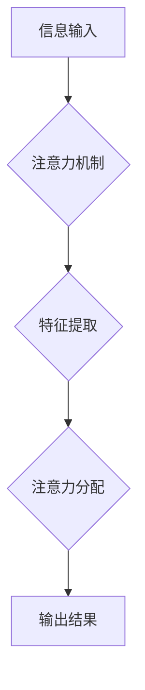

                 

## 人类注意力增强：提升专注力和注意力在教育中的应用

> 关键词：注意力增强、专注力、深度学习、神经网络、教育科技、认知科学、脑机接口

## 1. 背景介绍

在当今信息爆炸的时代，人类的注意力面临着前所未有的挑战。来自社交媒体、电子游戏、新闻推送等各种信息源的干扰，使得人们难以集中精力完成任务，学习效率也随之降低。注意力问题已成为全球范围内普遍存在的社会问题，对个人学习、工作和生活都产生了负面影响。

教育领域也深受注意力问题的困扰。传统的教学模式往往难以满足学生个性化的学习需求，学生的注意力难以集中，学习效果不佳。因此，如何提升学生的专注力和注意力，提高学习效率，成为教育科技发展的重要方向。

## 2. 核心概念与联系

**2.1 注意力机制**

注意力机制是一种模仿人类认知过程的机器学习技术，它能够帮助模型聚焦于输入数据中最重要的部分，从而提高学习效率和准确性。

**2.2 注意力增强技术**

注意力增强技术是指利用注意力机制，通过软件、硬件或其他方式，帮助人类提升专注力和注意力。

**2.3 教育科技应用**

教育科技利用注意力增强技术，可以开发出能够帮助学生集中注意力、提高学习效率的学习工具和平台。

**2.4 流程图**



## 3. 核心算法原理 & 具体操作步骤

**3.1 算法原理概述**

注意力机制的核心原理是通过学习一个权重向量，将输入数据中的不同部分赋予不同的重要性。权重向量可以根据输入数据的特征和任务目标进行调整，从而使模型能够聚焦于最相关的部分。

**3.2 算法步骤详解**

1. **输入数据预处理:** 将输入数据转换为模型能够理解的格式。
2. **特征提取:** 使用神经网络或其他方法提取输入数据的特征。
3. **注意力计算:** 计算每个特征的注意力权重。
4. **加权求和:** 根据注意力权重对特征进行加权求和，得到最终的输出。

**3.3 算法优缺点**

**优点:**

* 可以有效地提高模型的学习效率和准确性。
* 可以帮助模型理解输入数据的语义和上下文。
* 可以用于各种类型的任务，例如文本分类、机器翻译、图像识别等。

**缺点:**

* 计算复杂度较高。
* 需要大量的训练数据。
* 训练过程可能比较耗时。

**3.4 算法应用领域**

注意力机制在机器学习领域有着广泛的应用，例如：

* **自然语言处理:** 文本分类、机器翻译、问答系统等。
* **计算机视觉:** 图像识别、目标检测、图像分割等。
* **语音识别:** 语音转文本、语音合成等。

## 4. 数学模型和公式 & 详细讲解 & 举例说明

**4.1 数学模型构建**

注意力机制的数学模型通常基于一个注意力权重向量，该向量表示每个输入特征的重要性。

**4.2 公式推导过程**

假设输入数据为一个序列 $x = (x_1, x_2, ..., x_n)$，目标是学习一个注意力权重向量 $a = (a_1, a_2, ..., a_n)$，其中 $a_i$ 表示 $x_i$ 的注意力权重。

注意力权重向量可以通过以下公式计算:

$$a_i = \frac{exp(e_i)}{\sum_{j=1}^{n} exp(e_j)}$$

其中 $e_i$ 是每个特征的注意力得分，可以由一个神经网络计算得到。

**4.3 案例分析与讲解**

例如，在机器翻译任务中，注意力机制可以帮助模型聚焦于源语言句子中与目标语言句子相关的部分，从而提高翻译的准确性。

## 5. 项目实践：代码实例和详细解释说明

**5.1 开发环境搭建**

可以使用 Python 和 TensorFlow 或 PyTorch 等深度学习框架来实现注意力机制。

**5.2 源代码详细实现**

```python
import tensorflow as tf

# 定义注意力机制层
class AttentionLayer(tf.keras.layers.Layer):
    def __init__(self, units):
        super(AttentionLayer, self).__init__()
        self.W1 = tf.keras.layers.Dense(units)
        self.W2 = tf.keras.layers.Dense(units)
        self.v = tf.keras.layers.Dense(1)

    def call(self, inputs):
        # 计算注意力得分
        scores = self.v(tf.tanh(self.W1(inputs) + self.W2(tf.transpose(inputs, perm=[0, 2, 1]))))
        # 归一化注意力得分
        attention_weights = tf.nn.softmax(scores, axis=-1)
        # 加权求和
        context_vector = tf.matmul(attention_weights, inputs)
        return context_vector
```

**5.3 代码解读与分析**

该代码实现了一个简单的注意力机制层。

* `W1` 和 `W2` 是两个全连接层，用于提取输入特征。
* `v` 是一个全连接层，用于计算注意力得分。
* `tf.tanh` 是双曲正切函数，用于非线性变换。
* `tf.nn.softmax` 是softmax函数，用于归一化注意力得分。
* `tf.matmul` 是矩阵乘法，用于加权求和。

**5.4 运行结果展示**

运行该代码可以得到注意力权重向量和上下文向量，这些结果可以用于后续的机器学习任务。

## 6. 实际应用场景

**6.1 教育场景**

* **个性化学习:** 根据学生的学习进度和兴趣，提供个性化的学习内容和练习。
* **注意力训练:** 通过游戏化和互动的方式，帮助学生提高专注力和注意力。
* **学习反馈:** 分析学生的学习行为和注意力分布，提供针对性的学习反馈和建议。

**6.2 其他场景**

* **医疗保健:** 帮助医生分析患者的脑电波信号，诊断和治疗注意力障碍等疾病。
* **游戏开发:** 开发更具沉浸性和吸引力的游戏体验。
* **人机交互:** 开发更自然和智能的人机交互系统。

**6.4 未来应用展望**

随着人工智能技术的不断发展，注意力增强技术将有更广泛的应用场景。例如，未来可能出现能够实时监测和调整用户的注意力状态的设备，帮助用户更高效地学习、工作和生活。

## 7. 工具和资源推荐

**7.1 学习资源推荐**

* **书籍:**
    * 《深度学习》
    * 《Attention Is All You Need》
* **在线课程:**
    * Coursera: 深度学习
    * edX: 自然语言处理

**7.2 开发工具推荐**

* **Python:** 
* **TensorFlow:** 
* **PyTorch:** 

**7.3 相关论文推荐**

* 《Attention Is All You Need》
* 《BERT: Pre-training of Deep Bidirectional Transformers for Language Understanding》

## 8. 总结：未来发展趋势与挑战

**8.1 研究成果总结**

注意力机制在机器学习领域取得了显著的成果，并在自然语言处理、计算机视觉等领域得到了广泛应用。

**8.2 未来发展趋势**

* **更强大的注意力模型:** 研究更强大的注意力模型，例如 Transformer、XLNet 等。
* **跨模态注意力:** 研究跨模态注意力机制，例如将文本和图像等不同模态的信息融合在一起。
* **可解释性:** 研究注意力机制的可解释性，帮助人们更好地理解模型的决策过程。

**8.3 面临的挑战**

* **计算复杂度:** 训练大型注意力模型需要大量的计算资源。
* **数据需求:** 训练注意力模型需要大量的训练数据。
* **可解释性:** 注意力机制的决策过程往往难以解释。

**8.4 研究展望**

未来，注意力机制将继续在人工智能领域发挥重要作用，并推动人工智能技术的进一步发展。


## 9. 附录：常见问题与解答

**9.1 Q: 注意力机制和深度学习有什么关系？**

**A:** 注意力机制是一种深度学习技术，它可以帮助深度学习模型更好地理解输入数据。

**9.2 Q: 注意力机制有哪些应用场景？**

**A:** 注意力机制在机器学习领域有着广泛的应用，例如自然语言处理、计算机视觉、语音识别等。

**9.3 Q: 如何实现注意力机制？**

**A:** 可以使用深度学习框架，例如 TensorFlow 或 PyTorch，实现注意力机制。

**9.4 Q: 注意力机制的未来发展趋势是什么？**

**A:** 未来，注意力机制将继续在人工智能领域发挥重要作用，并推动人工智能技术的进一步发展。


作者：禅与计算机程序设计艺术 / Zen and the Art of Computer Programming 
<end_of_turn>

