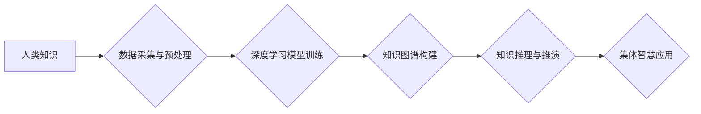

                 

## 人类知识的集体智慧：众智成城

> 关键词：人工智能、集体智慧、协同学习、知识图谱、深度学习、分布式计算

### 1. 背景介绍

人类文明的进步离不开知识的积累和传播。从古至今，人们不断探索、发现、记录和分享知识，推动社会发展。随着信息技术的飞速发展，特别是人工智能技术的兴起，人类知识的存储、处理和应用方式发生了革命性的变化。

传统的知识获取方式主要依赖于个人经验和专家的积累，效率低下且容易陷入信息孤岛。而人工智能技术的出现，为人类知识的集体智慧提供了新的平台和工具。通过大数据、深度学习等技术，我们可以将海量数据进行分析和挖掘，从数据中提取知识，并通过算法模型进行知识推理和推演，最终形成一个庞大的知识网络，即“知识图谱”。

知识图谱是一种基于知识表示的结构化数据模型，它将知识表示为实体、关系和属性的网络结构。通过构建知识图谱，我们可以将分散的知识点进行连接和整合，形成一个完整的知识体系，从而更好地理解和利用知识。

### 2. 核心概念与联系

**2.1 集体智慧**

集体智慧是指一群人通过合作和协作，能够产生比单个成员更智能的成果。它体现了群体协同的力量，能够克服个体认知的局限性，获得更全面的、更深入的洞察力和解决问题的能力。

**2.2 协同学习**

协同学习是指多个智能体通过相互交流和合作，共同学习和进步的过程。在人工智能领域，协同学习被广泛应用于机器学习、自然语言处理等领域，通过多个模型的协作，可以提高模型的准确性和泛化能力。

**2.3 知识图谱**

知识图谱是一种结构化知识表示模型，它将知识表示为实体、关系和属性的网络结构。知识图谱能够有效地存储、组织和查询知识，为人工智能应用提供基础数据支撑。

**2.4 深度学习**

深度学习是一种机器学习的子领域，它利用多层神经网络来模拟人类大脑的学习过程。深度学习算法能够从海量数据中自动提取特征，并进行复杂的知识推理和推演。

**2.5 分布式计算**

分布式计算是指将计算任务分解成多个子任务，并分别在不同的计算节点上进行处理，最终将结果汇总在一起。分布式计算能够有效地利用多台计算机的计算资源，提高计算效率。

**2.6 流程图**



### 3. 核心算法原理 & 具体操作步骤

**3.1 算法原理概述**

众智成城的核心算法原理基于深度学习、知识图谱和分布式计算的结合。

* **深度学习**用于从海量数据中自动提取知识，构建知识表示模型。
* **知识图谱**用于组织和存储知识，并进行知识推理和推演。
* **分布式计算**用于加速算法训练和知识图谱构建过程。

**3.2 算法步骤详解**

1. **数据采集与预处理**: 从各种数据源收集相关数据，并进行清洗、格式化和预处理，以便于深度学习模型的训练。
2. **深度学习模型训练**: 利用深度学习算法，例如图神经网络、Transformer等，从预处理后的数据中学习知识表示模型。
3. **知识图谱构建**: 将深度学习模型提取的知识表示转化为知识图谱的形式，构建实体、关系和属性的网络结构。
4. **知识推理与推演**: 利用知识图谱进行知识推理和推演，例如基于规则的推理、基于概率的推理等，从已有的知识中推导出新的知识。
5. **集体智慧应用**: 将推理出的知识应用于实际场景，例如智能问答、知识发现、决策支持等。

**3.3 算法优缺点**

**优点:**

* 能够从海量数据中自动提取知识，提高知识发现效率。
* 能够构建完整的知识体系，更好地理解和利用知识。
* 能够进行知识推理和推演，获得新的知识和洞察力。

**缺点:**

* 需要大量的训练数据和计算资源。
* 知识图谱的构建和维护需要专业知识和技术支持。
* 算法的准确性和可靠性依赖于训练数据的质量和算法模型的复杂度。

**3.4 算法应用领域**

* **智能问答**: 利用知识图谱和自然语言处理技术，构建智能问答系统，能够回答用户的问题并提供相关知识。
* **知识发现**: 从海量数据中自动发现新的知识和模式，为科研和决策提供支持。
* **决策支持**: 利用知识图谱和推理算法，为决策者提供更全面的信息和建议。
* **个性化推荐**: 根据用户的兴趣和偏好，利用知识图谱进行个性化推荐。

### 4. 数学模型和公式 & 详细讲解 & 举例说明

**4.1 数学模型构建**

知识图谱可以表示为一个三元组的集合： (实体, 关系, 实体)。

* 实体：知识图谱中的基本单元，代表一个具体的事物或概念。
* 关系：实体之间的连接方式，描述实体之间的属性或联系。
* 属性：实体的特征描述，例如名称、地址、出生日期等。

**4.2 公式推导过程**

知识推理可以使用逻辑规则或概率模型进行。

* **逻辑规则**: 基于事先定义的规则，从已有的知识中推导出新的知识。例如，如果知道“张三是学生”和“学生必须上学”，则可以推导出“张三必须上学”。
* **概率模型**: 基于概率统计，计算知识推断的可能性。例如，如果知道“张三喜欢吃苹果”和“苹果是水果”，则可以推断出“张三喜欢吃水果”的概率。

**4.3 案例分析与讲解**

假设我们构建了一个关于人物的知识图谱，其中包含以下实体和关系：

* 实体：张三、李四、苹果、水果
* 关系：喜欢、是

我们可以使用以下逻辑规则进行知识推理：

* 如果一个人喜欢某种水果，那么这个人也喜欢水果。

根据这个规则，如果我们知道“张三喜欢苹果”，则可以推导出“张三喜欢水果”。

### 5. 项目实践：代码实例和详细解释说明

**5.1 开发环境搭建**

* 操作系统：Linux
* Python 版本：3.7+
* 依赖库：TensorFlow、PyTorch、NetworkX、Neo4j

**5.2 源代码详细实现**

```python
# 使用 TensorFlow 构建图神经网络模型
import tensorflow as tf

# 定义图神经网络模型
class GraphNeuralNetwork(tf.keras.Model):
    def __init__(self, num_entities, num_relations):
        super(GraphNeuralNetwork, self).__init__()
        # ...

    def call(self, inputs):
        # ...

# 训练图神经网络模型
model = GraphNeuralNetwork(num_entities, num_relations)
model.compile(optimizer='adam', loss='mse')
model.fit(train_data, train_labels, epochs=10)

# 使用 Neo4j 构建知识图谱
# ...

# 使用知识图谱进行知识推理
# ...
```

**5.3 代码解读与分析**

* 代码示例展示了如何使用 TensorFlow 构建图神经网络模型，并进行训练。
* 知识图谱的构建和推理可以使用 Neo4j 等数据库进行实现。

**5.4 运行结果展示**

* 训练后的模型可以用于预测新的知识关系。
* 知识推理的结果可以用于回答用户的问题或提供决策支持。

### 6. 实际应用场景

**6.1 智能问答系统**

* 利用知识图谱和自然语言处理技术，构建智能问答系统，能够回答用户的问题并提供相关知识。

**6.2 知识发现平台**

* 从海量数据中自动发现新的知识和模式，为科研和决策提供支持。

**6.3 个性化推荐系统**

* 根据用户的兴趣和偏好，利用知识图谱进行个性化推荐。

**6.4 医疗诊断辅助系统**

* 利用医学知识图谱和机器学习算法，辅助医生进行疾病诊断。

**6.5 未来应用展望**

* 随着人工智能技术的不断发展，众智成城的应用场景将更加广泛，例如自动驾驶、机器人、虚拟现实等领域。

### 7. 工具和资源推荐

**7.1 学习资源推荐**

* **书籍:**
    * 《深度学习》
    * 《图神经网络》
    * 《知识图谱》
* **在线课程:**
    * Coursera: 深度学习
    * edX: 图神经网络
    * Udacity: 知识图谱

**7.2 开发工具推荐**

* **深度学习框架:** TensorFlow, PyTorch
* **知识图谱数据库:** Neo4j, RDF4J
* **自然语言处理库:** NLTK, spaCy

**7.3 相关论文推荐**

* 《Graph Convolutional Networks》
* 《Knowledge Graph Embedding》
* 《Attention Is All You Need》

### 8. 总结：未来发展趋势与挑战

**8.1 研究成果总结**

* 人工智能技术的发展为人类知识的集体智慧提供了新的平台和工具。
* 深度学习、知识图谱和分布式计算等技术为构建众智成城提供了关键支撑。
* 众智成城技术在智能问答、知识发现、个性化推荐等领域取得了显著成果。

**8.2 未来发展趋势**

* **模型更加智能化:** 深度学习模型将更加智能化，能够更好地理解和利用知识。
* **知识图谱更加丰富:** 知识图谱将更加丰富，涵盖更广泛的领域和知识。
* **应用场景更加广泛:** 众智成城技术将应用于更多领域，例如自动驾驶、机器人、虚拟现实等。

**8.3 面临的挑战**

* **数据质量:** 知识图谱的构建依赖于高质量的数据，数据质量问题将影响算法的准确性和可靠性。
* **知识表示:** 如何更好地表示复杂知识仍然是一个挑战。
* **伦理问题:** 众智成城技术可能带来一些伦理问题，例如数据隐私、算法偏见等，需要引起重视和解决。

**8.4 研究展望**

* 研究更加高效、准确的知识提取和表示方法。
* 研究更加智能的知识推理和推演算法。
* 研究众智成城技术的伦理问题，并制定相应的规范和制度。


### 9. 附录：常见问题与解答

* **Q1: 众智成城技术与传统人工智能技术有什么区别？**

* **A1:** 众智成城技术强调知识的集体智慧，通过协同学习和知识图谱构建，能够获得比单个模型更智能的成果。而传统人工智能技术主要依赖于单个模型的学习和推理。

* **Q2: 众智成城技术需要哪些技术支持？**

* **A2:** 众智成城技术需要深度学习、知识图谱、分布式计算等技术的支持。

* **Q3: 众智成城技术的应用场景有哪些？**

* **A3:** 众智成城技术的应用场景包括智能问答、知识发现、个性化推荐、医疗诊断辅助等。


作者：禅与计算机程序设计艺术 / Zen and the Art of Computer Programming 
<end_of_turn>

