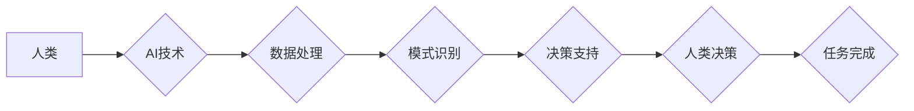

                 

## 人类计算：AI时代的未来就业市场与技能培训发展趋势分析机遇挑战

> 关键词：人工智能、未来就业、技能培训、人类计算、自动化、机器学习、数据分析、编程、跨学科合作

## 1. 背景介绍

人工智能（AI）技术的飞速发展正在深刻地改变着世界，并对未来就业市场和技能培训产生着深远的影响。随着机器学习、深度学习等技术的不断进步，自动化程度不断提高，许多传统工作岗位面临被替代的风险。与此同时，AI技术也催生了许多新的工作岗位和职业方向，对人才的需求也发生了转变。

在AI时代，人类计算的概念逐渐成为人们关注的焦点。人类计算是指人类利用自身的认知能力、创造力、情感智能等优势，与人工智能技术相结合，共同完成复杂的任务。这种模式强调人机协作，充分发挥人类和机器各自的优势，实现更高效、更智能的计算。

## 2. 核心概念与联系

### 2.1 人类计算的定义

人类计算是指人类利用自身的认知能力、创造力、情感智能等优势，与人工智能技术相结合，共同完成复杂的任务。它强调人机协作，充分发挥人类和机器各自的优势，实现更高效、更智能的计算。

### 2.2 人类计算与AI的关系

AI技术为人类计算提供了强大的工具和支撑。AI算法可以自动处理大量数据，识别模式，提供决策支持，而人类则负责设定目标、解释结果、进行创意思考和解决复杂问题。

**Mermaid 流程图：**



### 2.3 人类计算的优势

* **更强的创造力和创新能力:** 人类拥有独特的创造力和想象力，可以提出新的想法和解决方案，而AI则擅长执行和优化已有的方案。
* **更好的解决复杂问题的能力:** 人类可以理解和处理复杂的社会、伦理和情感问题，而AI在这些领域仍然存在局限性。
* **更强的适应性和灵活性:** 人类可以根据不断变化的环境和需求灵活调整，而AI需要重新训练才能适应新的情况。

## 3. 核心算法原理 & 具体操作步骤

### 3.1 算法原理概述

人类计算的核心算法原理是基于人机协作的智能决策系统。该系统通常包括以下几个模块：

* **数据采集和预处理:** 收集来自各种来源的数据，并进行清洗、转换和格式化。
* **特征提取和表示:** 从数据中提取关键特征，并将其转换为机器可理解的表示形式。
* **模型训练和评估:** 利用机器学习算法训练模型，并评估模型的性能。
* **决策和推理:** 基于模型的预测结果，进行决策和推理，并生成最终的输出。

### 3.2 算法步骤详解

1. **数据收集:** 从各种来源收集相关数据，例如文本、图像、音频、传感器数据等。
2. **数据预处理:** 对收集到的数据进行清洗、转换和格式化，去除噪声、缺失值等异常数据，并将其转换为机器可理解的格式。
3. **特征提取:** 从预处理后的数据中提取关键特征，例如文本中的关键词、图像中的物体、音频中的音调等。
4. **模型选择:** 根据任务需求选择合适的机器学习算法，例如分类、回归、聚类等。
5. **模型训练:** 利用训练数据训练选择的机器学习模型，调整模型参数，使其能够准确地预测或分类数据。
6. **模型评估:** 利用测试数据评估模型的性能，例如准确率、召回率、F1-score等。
7. **决策和推理:** 将训练好的模型应用于实际场景，根据输入数据进行预测或分类，并根据预测结果进行决策和推理。

### 3.3 算法优缺点

**优点:**

* **提高效率:** 自动化数据处理和分析，解放人力，提高工作效率。
* **增强准确性:** 利用机器学习算法，提高预测和分类的准确性。
* **发现新模式:** 从海量数据中发现隐藏的模式和趋势，提供新的 insights。

**缺点:**

* **数据依赖:** 算法性能依赖于训练数据的质量和数量。
* **解释性不足:** 一些机器学习算法的决策过程难以解释，缺乏透明度。
* **伦理风险:** AI算法可能存在偏见和歧视，需要谨慎使用。

### 3.4 算法应用领域

* **医疗保健:** 疾病诊断、药物研发、个性化治疗。
* **金融服务:** 风险评估、欺诈检测、投资决策。
* **制造业:** 预测性维护、质量控制、生产优化。
* **教育:** 个性化学习、智能辅导、自动批改。
* **零售:** 商品推荐、客户服务、库存管理。

## 4. 数学模型和公式 & 详细讲解 & 举例说明

### 4.1 数学模型构建

人类计算的数学模型通常基于概率论、统计学和机器学习算法。例如，在自然语言处理领域，可以使用词嵌入模型（Word2Vec、GloVe）来表示单词的语义关系，并构建基于词向量的文本分类模型。

### 4.2 公式推导过程

假设我们有一个文本分类任务，目标是将文本分类为正类或负类。可以使用逻辑回归模型来实现文本分类。逻辑回归模型的输出是一个概率值，表示文本属于正类的概率。

**公式:**

$$
p(y=1|x) = \frac{1}{1 + e^{-(w^T x + b)}}
$$

其中：

* $p(y=1|x)$ 是文本属于正类的概率。
* $x$ 是文本的特征向量。
* $w$ 是模型的参数向量。
* $b$ 是模型的偏置项。

### 4.3 案例分析与讲解

例如，我们可以使用逻辑回归模型来分类新闻文章的主题。我们可以将新闻文章的文本内容转换为特征向量，例如单词频率、词性标签等。然后，我们可以使用训练数据训练逻辑回归模型，并评估模型的性能。

## 5. 项目实践：代码实例和详细解释说明

### 5.1 开发环境搭建

* Python 3.x
* TensorFlow 或 PyTorch 等深度学习框架
* Jupyter Notebook 或 VS Code 等代码编辑器

### 5.2 源代码详细实现

```python
# 导入必要的库
import tensorflow as tf

# 定义模型结构
model = tf.keras.models.Sequential([
  tf.keras.layers.Embedding(input_dim=10000, output_dim=128),
  tf.keras.layers.LSTM(128),
  tf.keras.layers.Dense(1, activation='sigmoid')
])

# 编译模型
model.compile(optimizer='adam', loss='binary_crossentropy', metrics=['accuracy'])

# 训练模型
model.fit(x_train, y_train, epochs=10)

# 评估模型
loss, accuracy = model.evaluate(x_test, y_test)
print('Loss:', loss)
print('Accuracy:', accuracy)
```

### 5.3 代码解读与分析

* 首先，我们导入必要的库，例如 TensorFlow。
* 然后，我们定义模型结构，包括嵌入层、LSTM 层和全连接层。
* 接着，我们编译模型，选择优化器、损失函数和评价指标。
* 接下来，我们训练模型，使用训练数据进行训练。
* 最后，我们评估模型的性能，使用测试数据计算损失和准确率。

### 5.4 运行结果展示

训练完成后，我们可以查看模型的损失和准确率，并根据结果进行调整。

## 6. 实际应用场景

### 6.1 人工智能客服

AI技术可以用于构建智能客服系统，自动处理客户咨询、订单查询、投诉处理等任务，提高客服效率和客户满意度。

### 6.2 个性化教育

AI技术可以根据学生的学习进度、兴趣和能力，提供个性化的学习内容和辅导，提高学习效率和效果。

### 6.3 医疗诊断辅助

AI技术可以辅助医生进行疾病诊断，例如分析医学影像、预测患者风险等，提高诊断准确率和效率。

### 6.4 自动驾驶

AI技术是自动驾驶的核心技术，可以实现车辆感知环境、规划路径、控制行驶等功能，推动自动驾驶技术的发展。

### 6.5 未来应用展望

随着AI技术的不断发展，人类计算将在更多领域得到应用，例如：

* **科学研究:** 辅助科学家进行数据分析、模型构建和实验设计。
* **艺术创作:** 帮助艺术家生成新的创意、创作艺术作品。
* **社会治理:** 提高政府服务效率、优化资源配置、促进社会公平。

## 7. 工具和资源推荐

### 7.1 学习资源推荐

* **在线课程:** Coursera、edX、Udacity 等平台提供丰富的AI课程。
* **书籍:** 《深度学习》、《机器学习实战》等经典书籍。
* **开源项目:** TensorFlow、PyTorch 等开源框架提供了丰富的学习资源和示例代码。

### 7.2 开发工具推荐

* **Python:** 作为AI开发的主要语言，Python拥有丰富的库和工具。
* **Jupyter Notebook:** 用于代码编写、数据分析和可视化。
* **VS Code:** 强大的代码编辑器，支持多种编程语言和插件。

### 7.3 相关论文推荐

* **《Attention Is All You Need》:** 介绍了Transformer模型，在自然语言处理领域取得了突破性进展。
* **《ImageNet Classification with Deep Convolutional Neural Networks》:** 介绍了AlexNet模型，标志着深度学习在图像识别领域的兴起。
* **《Generative Adversarial Networks》:** 介绍了GAN模型，在图像生成、文本生成等领域取得了成功。

## 8. 总结：未来发展趋势与挑战

### 8.1 研究成果总结

人类计算是AI时代的重要发展趋势，它将推动人工智能技术向更智能、更安全、更可解释的方向发展。

### 8.2 未来发展趋势

* **更强大的AI算法:** 随着算法的不断改进，AI将能够处理更复杂的任务，并提供更准确的预测和决策支持。
* **更广泛的应用场景:** 人类计算将应用于更多领域，例如医疗保健、教育、金融服务等。
* **更紧密的跨学科合作:** 人类计算需要跨越计算机科学、心理学、社会学等多个学科的合作，才能实现真正的突破。

### 8.3 面临的挑战

* **数据安全和隐私保护:** 人类计算需要处理大量个人数据，因此数据安全和隐私保护是一个重要的挑战。
* **算法偏见和歧视:** AI算法可能存在偏见和歧视，需要采取措施避免其在实际应用中造成负面影响。
* **伦理和社会影响:** 人类计算可能会对社会产生深远的影响，需要认真思考其伦理和社会意义。

### 8.4 研究展望

未来，人类计算的研究将继续深入，探索更有效的算法、更广泛的应用场景和更完善的伦理规范，为人类社会创造更多价值。

## 9. 附录：常见问题与解答

* **什么是人类计算？** 人类计算是指人类利用自身的认知能力、创造力、情感智能等优势，与人工智能技术相结合，共同完成复杂的任务。
* **人类计算与AI有什么区别？** AI技术可以自动处理数据和执行任务，而人类计算强调人机协作，充分发挥人类和机器各自的优势。
* **人类计算有哪些应用场景？** 人类计算可以应用于医疗保健、教育、金融服务、自动驾驶等多个领域。
* **人类计算面临哪些挑战？** 数据安全、算法偏见、伦理和社会影响是人类计算面临的挑战。


作者：禅与计算机程序设计艺术 / Zen and the Art of Computer Programming 
<end_of_turn>

