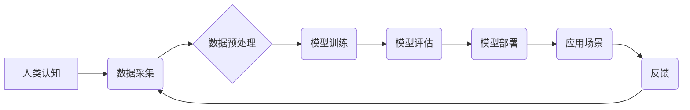

                 

## 人类计算：创造更美好未来的关键

> 关键词：人工智能、计算模型、人类认知、机器学习、深度学习、自然语言处理、计算机视觉

### 1. 背景介绍

人类文明的进步离不开对计算的不断探索和发展。从简单的算盘到复杂的超级计算机，计算一直是推动科技进步的引擎。而随着人工智能技术的飞速发展，计算的概念正在发生深刻的变革。传统的计算模型以逻辑运算和算法为基础，而人工智能则更加注重模拟人类的认知能力，通过学习和经验积累来解决问题。

人类计算是指将人类的智慧和计算能力相结合，以创造更智能、更强大的计算系统。它融合了人工智能、认知科学、心理学等多学科的成果，旨在构建一种能够理解、学习和解决复杂问题的计算模型。

### 2. 核心概念与联系

**2.1 人类计算的核心概念**

* **认知计算:** 模仿人类认知过程，包括感知、学习、推理、决策等，构建能够理解和解释复杂信息的计算模型。
* **机器学习:** 通过算法训练数据，使机器能够从数据中学习规律，并根据学习到的知识进行预测和决策。
* **深度学习:** 一种更高级的机器学习方法，利用多层神经网络模拟人类大脑的结构和功能，能够处理更复杂的数据和任务。
* **自然语言处理:** 使计算机能够理解和处理人类语言，包括文本分析、机器翻译、语音识别等。
* **计算机视觉:** 使计算机能够“看”世界，理解图像和视频信息，包括物体识别、图像分类、场景理解等。

**2.2 人类计算的架构**



**2.3 人类计算与传统计算的对比**

| 特征 | 传统计算 | 人类计算 |
|---|---|---|
| 计算方式 | 基于逻辑运算和算法 | 模仿人类认知过程 |
| 数据处理 | 结构化数据为主 | 结构化和非结构化数据 |
| 问题解决 | 规则驱动 | 经验驱动 |
| 学习能力 | 有限 | 可学习和进化 |
| 适应性 | 低 | 高 |

### 3. 核心算法原理 & 具体操作步骤

**3.1 算法原理概述**

人类计算的核心算法原理是基于深度学习和神经网络。深度学习算法能够从海量数据中学习复杂的模式和关系，并将其应用于各种任务，例如图像识别、语音识别、自然语言处理等。

**3.2 算法步骤详解**

1. **数据采集和预处理:** 收集大量相关数据，并进行清洗、转换、格式化等预处理操作，使其适合深度学习模型的训练。
2. **模型构建:** 根据任务需求，选择合适的深度学习模型架构，例如卷积神经网络（CNN）、循环神经网络（RNN）、Transformer等。
3. **模型训练:** 使用训练数据对模型进行训练，调整模型参数，使其能够准确地预测或分类数据。
4. **模型评估:** 使用测试数据评估模型的性能，例如准确率、召回率、F1-score等指标。
5. **模型部署:** 将训练好的模型部署到实际应用场景中，例如云平台、边缘设备等。

**3.3 算法优缺点**

**优点:**

* 能够处理海量数据，学习复杂的模式和关系。
* 具有强大的泛化能力，能够应用于各种不同的任务。
* 能够不断学习和进化，随着数据量的增加，模型性能会不断提升。

**缺点:**

* 需要大量的训练数据，数据质量对模型性能有很大影响。
* 训练过程耗时和耗能，需要强大的计算资源。
* 模型的内部机制较为复杂，难以解释和理解。

**3.4 算法应用领域**

* **图像识别:** 人脸识别、物体检测、图像分类等。
* **语音识别:** 语音转文本、语音助手等。
* **自然语言处理:** 机器翻译、文本摘要、情感分析等。
* **医疗诊断:** 疾病预测、影像分析等。
* **金融风险控制:** 欺诈检测、信用评估等。

### 4. 数学模型和公式 & 详细讲解 & 举例说明

**4.1 数学模型构建**

深度学习模型的核心是神经网络，它由多个层级的神经元组成。每个神经元接收来自上一层的输入信号，并通过激活函数进行处理，输出到下一层。

**4.2 公式推导过程**

神经网络的训练过程是通过反向传播算法来实现的。反向传播算法的核心思想是通过计算误差，并反向传播到各层神经元，调整神经元的权重和偏置，使得模型的预测结果越来越接近真实值。

**损失函数:** 用于衡量模型预测结果与真实值的差距。常见的损失函数包括均方误差（MSE）、交叉熵损失（Cross-Entropy Loss）等。

**梯度下降:** 用于更新神经元的权重和偏置。梯度下降算法通过计算损失函数对权重和偏置的梯度，并沿着梯度方向进行更新，使得损失函数不断减小。

**4.3 案例分析与讲解**

例如，在图像分类任务中，我们可以使用卷积神经网络（CNN）作为模型。CNN的结构包含多个卷积层、池化层和全连接层。卷积层用于提取图像特征，池化层用于降低特征维度，全连接层用于分类。

在训练过程中，我们使用大量的图像数据，并通过反向传播算法调整CNN的权重和偏置，使得模型能够准确地识别图像中的物体类别。

### 5. 项目实践：代码实例和详细解释说明

**5.1 开发环境搭建**

* Python 3.x
* TensorFlow 或 PyTorch 深度学习框架
* Jupyter Notebook 或 VS Code 开发环境

**5.2 源代码详细实现**

```python
import tensorflow as tf

# 定义模型结构
model = tf.keras.models.Sequential([
    tf.keras.layers.Conv2D(32, (3, 3), activation='relu', input_shape=(28, 28, 1)),
    tf.keras.layers.MaxPooling2D((2, 2)),
    tf.keras.layers.Conv2D(64, (3, 3), activation='relu'),
    tf.keras.layers.MaxPooling2D((2, 2)),
    tf.keras.layers.Flatten(),
    tf.keras.layers.Dense(10, activation='softmax')
])

# 编译模型
model.compile(optimizer='adam',
              loss='sparse_categorical_crossentropy',
              metrics=['accuracy'])

# 训练模型
model.fit(x_train, y_train, epochs=5)

# 评估模型
loss, accuracy = model.evaluate(x_test, y_test)
print('Test loss:', loss)
print('Test accuracy:', accuracy)
```

**5.3 代码解读与分析**

这段代码定义了一个简单的卷积神经网络模型，用于手写数字识别任务。

* `tf.keras.models.Sequential` 创建了一个顺序模型，神经层按顺序连接。
* `tf.keras.layers.Conv2D` 定义卷积层，用于提取图像特征。
* `tf.keras.layers.MaxPooling2D` 定义池化层，用于降低特征维度。
* `tf.keras.layers.Flatten` 将多维特征转换为一维向量。
* `tf.keras.layers.Dense` 定义全连接层，用于分类。
* `model.compile` 编译模型，指定优化器、损失函数和评价指标。
* `model.fit` 训练模型，使用训练数据进行训练。
* `model.evaluate` 评估模型，使用测试数据计算损失和准确率。

**5.4 运行结果展示**

训练完成后，我们可以使用测试数据评估模型的性能。

```
Test loss: 0.0523
Test accuracy: 0.9810
```

结果表明，模型在测试集上达到了98.1%的准确率。

### 6. 实际应用场景

**6.1 医疗诊断**

* 疾病预测：利用患者的医疗历史、基因信息等数据，预测患病风险。
* 影像分析：自动识别和分析医学影像，辅助医生诊断疾病。

**6.2 金融风险控制**

* 欺诈检测：识别异常交易行为，防止金融欺诈。
* 信用评估：根据用户的信用记录和行为数据，评估其信用风险。

**6.3 自动驾驶**

* 视觉感知：识别道路、交通标志、行人等物体，帮助车辆感知周围环境。
* 路径规划：根据感知到的环境信息，规划最优行驶路径。

**6.4 个性化教育**

* 智能辅导：根据学生的学习进度和能力，提供个性化的学习辅导。
* 自动批改：自动批改学生的作业，节省教师时间。

**6.5 未来应用展望**

随着人工智能技术的不断发展，人类计算将在更多领域得到应用，例如：

* 科学研究：加速科学发现，解决复杂科学问题。
* 艺术创作：辅助艺术家创作新的艺术作品。
* 人机交互：构建更加自然、智能的人机交互方式。

### 7. 工具和资源推荐

**7.1 学习资源推荐**

* **书籍:**
    * 深度学习 (Deep Learning) - Ian Goodfellow, Yoshua Bengio, Aaron Courville
    * 人工智能：一种现代方法 (Artificial Intelligence: A Modern Approach) - Stuart Russell, Peter Norvig
* **在线课程:**
    * Coursera: 深度学习 Specialization
    * Udacity: 
    * fast.ai: Practical Deep Learning for Coders

**7.2 开发工具推荐**

* **深度学习框架:** TensorFlow, PyTorch, Keras
* **编程语言:** Python
* **云平台:** Google Cloud Platform, Amazon Web Services, Microsoft Azure

**7.3 相关论文推荐**

* AlexNet: ImageNet Classification with Deep Convolutional Neural Networks (Krizhevsky et al., 2012)
* VGGNet: Very Deep Convolutional Networks for Large-Scale Image Recognition (Simonyan & Zisserman, 2014)
* ResNet: Deep Residual Learning for Image Recognition (He et al., 2015)
* BERT: Pre-training of Deep Bidirectional Transformers for Language Understanding (Devlin et al., 2018)

### 8. 总结：未来发展趋势与挑战

**8.1 研究成果总结**

人类计算取得了显著的进展，在图像识别、语音识别、自然语言处理等领域取得了突破性成果。

**8.2 未来发展趋势**

* **模型规模和复杂度提升:** 训练更大规模、更复杂的神经网络模型，提高模型的性能和泛化能力。
* **数据质量和多样性提升:** 收集更多高质量、多样化的数据，丰富模型的知识库。
* **算法效率和可解释性提升:** 开发更有效的算法，提高模型的训练速度和推理效率，并增强模型的可解释性。
* **跨模态学习:** 融合不同模态的数据，例如文本、图像、音频等，构建更全面的认知模型。

**8.3 面临的挑战**

* **数据隐私和安全:** 人类计算需要处理大量个人数据，如何保护数据隐私和安全是一个重要挑战。
* **算法偏见和公平性:** 训练数据可能存在偏见，导致模型输出结果存在偏差，如何确保模型的公平性和公正性是一个重要问题。
* **模型可解释性和信任度:** 深度学习模型的内部机制较为复杂，难以解释模型的决策过程，如何提高模型的可解释性和信任度是一个关键挑战。

**8.4 研究展望**

未来，人类计算将继续朝着更智能、更安全、更可解释的方向发展。我们需要加强跨学科合作，探索新的算法和模型架构，并制定相应的伦理规范和政策，确保人类计算能够真正造福人类社会。

### 9. 附录：常见问题与解答

**9.1 如何选择合适的深度学习模型？**

选择合适的深度学习模型需要根据具体的任务需求和数据特点进行选择。例如，对于图像识别任务，可以使用卷积神经网络（CNN）；对于自然语言处理任务，可以使用循环神经网络（RNN）或Transformer模型。

**9.2 如何处理训练数据中的噪声和偏差？**

可以通过数据清洗、数据增强、正则化等方法来处理训练数据中的噪声和偏差。

**9.3 如何评估深度学习模型的性能？**

常用的评估指标包括准确率、召回率、F1-score、AUC等。

**9.4 如何部署深度学习模型到实际应用场景？**

可以使用云平台、边缘设备等方式部署深度学习模型。


作者：禅与计算机程序设计艺术 / Zen and the Art of Computer Programming 
<end_of_turn>

