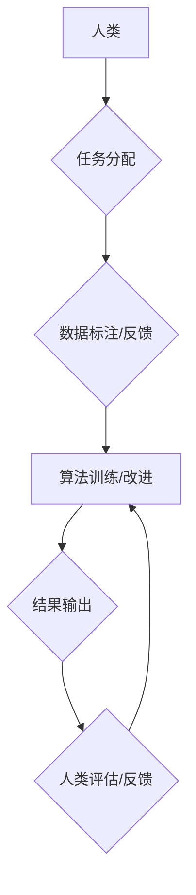

                 

## 人类计算：应用与案例分析

> 关键词：人类计算、计算任务、外包计算、协作计算、数据标注、人工智能、Crowdsourcing、案例分析

## 1. 背景介绍

随着人工智能技术的飞速发展，人类计算逐渐成为一个重要的研究领域。人类计算是指利用人类的智慧和认知能力来完成计算任务，它与传统的计算机计算相辅相成，在一些领域展现出独特的优势。

传统的计算机擅长处理大量数据和执行重复性任务，但对于需要理解、判断和决策的复杂问题，人类的智慧和创造力仍然是不可替代的。例如，图像识别、自然语言处理、数据分析等领域，人类的参与可以帮助提高算法的准确性和效率。

## 2. 核心概念与联系

### 2.1 人类计算的定义

人类计算是指利用人类的智慧和认知能力来完成计算任务，它可以是通过直接的输入（例如，人类标注数据）或间接的参与（例如，人类提供反馈和改进算法）。

### 2.2 人类计算的类型

人类计算可以分为以下几种类型：

* **外包计算 (Crowdsourcing):** 将计算任务分发给大量的志愿者或专业人员，通过网络平台进行协作完成。
* **协作计算 (Collaborative Computing):** 多个人类用户共同参与计算任务，通过共享信息和资源来提高效率。
* **混合计算 (Hybrid Computing):** 将人类计算和计算机计算相结合，发挥各自的优势。

### 2.3 人类计算的优势

* **灵活性:** 人类可以根据具体情况灵活调整计算策略，处理复杂和不确定的问题。
* **创造力:** 人类可以提出新的解决方案和创意，推动计算任务的创新发展。
* **成本效益:** 在某些情况下，利用人类计算可以比传统的计算机计算更经济高效。

### 2.4 人类计算的挑战

* **数据质量:** 人类输入的数据可能存在偏差和错误，需要进行有效的数据清洗和验证。
* **效率问题:** 人类计算的速度可能不如计算机计算快，需要寻找提高效率的方法。
* **伦理问题:** 人类计算涉及到隐私、公平性和责任等伦理问题，需要进行深入的探讨和规范。

**Mermaid 流程图**



## 3. 核心算法原理 & 具体操作步骤

### 3.1 算法原理概述

人类计算的核心算法原理是将复杂计算任务分解成多个简单子任务，然后通过人类的参与来完成这些子任务。常见的算法包括：

* **数据标注算法:** 利用人类标注数据来训练机器学习模型。
* **反馈机制算法:** 利用人类反馈来改进算法的性能。
* **协作推理算法:** 利用多个人类用户的知识和经验来进行推理和决策。

### 3.2 算法步骤详解

以数据标注算法为例，其具体操作步骤如下：

1. **任务定义:** 明确需要标注的数据类型和标注标准。
2. **数据准备:** 收集和预处理需要标注的数据。
3. **平台搭建:** 建立一个数据标注平台，方便人类用户进行标注。
4. **标注任务分配:** 将数据分配给不同的标注者。
5. **标注结果收集:** 收集标注者的标注结果。
6. **结果验证:** 对标注结果进行验证，确保其准确性和一致性。
7. **数据训练:** 利用标注好的数据训练机器学习模型。

### 3.3 算法优缺点

**优点:**

* **高准确率:** 人类可以根据上下文和语义进行判断，提高标注的准确率。
* **灵活性和适应性:** 人类可以根据任务需求调整标注策略，处理复杂和不确定的数据。

**缺点:**

* **效率问题:** 人类标注的速度相对较慢，成本较高。
* **一致性问题:** 不同标注者的标注结果可能存在差异，需要进行有效的数据清洗和校对。

### 3.4 算法应用领域

数据标注算法广泛应用于以下领域：

* **图像识别:** 标注图像中的物体、场景和人物。
* **自然语言处理:** 标注文本中的实体、关系和情感。
* **语音识别:** 标注语音中的单词和句子。
* **机器翻译:** 标注文本中的语义和语法关系。

## 4. 数学模型和公式 & 详细讲解 & 举例说明

### 4.1 数学模型构建

人类计算可以抽象为一个信息处理模型，其中人类扮演着信息处理和决策的角色。

**模型假设:**

* 人类可以接收、理解和处理信息。
* 人类可以根据信息进行判断和决策。
* 人类之间的信息交互可以提高整体处理效率。

**模型结构:**

* **输入层:** 包含需要处理的信息。
* **处理层:** 包含人类用户，负责信息处理和决策。
* **输出层:** 包含处理结果。

### 4.2 公式推导过程

假设一个简单的人类计算模型，其中n个人类用户分别处理m个数据点，每个用户处理一个数据点的平均时间为t，则总处理时间为：

$$T = n * m * t$$

### 4.3 案例分析与讲解

例如，在一个图像识别任务中，需要标注1000张图片，每个图片需要标注5个物体，共有10个标注者参与，每个标注者标注一个物体需要平均1分钟，则总处理时间为：

$$T = 10 * 1000 * 5 * 1 = 50000分钟$$

## 5. 项目实践：代码实例和详细解释说明

### 5.1 开发环境搭建

* **操作系统:** Linux/Windows/macOS
* **编程语言:** Python
* **框架:** Flask/Django
* **数据库:** MySQL/PostgreSQL

### 5.2 源代码详细实现

```python
from flask import Flask, render_template, request

app = Flask(__name__)

@app.route('/')
def index():
    return render_template('index.html')

@app.route('/submit', methods=['POST'])
def submit():
    data = request.form['data']
    # 数据处理逻辑
    return '数据已接收'

if __name__ == '__main__':
    app.run(debug=True)
```

**代码解读与分析:**

* 该代码实现了一个简单的网页应用，用于接收人类输入的数据。
* 用户可以通过网页表单提交数据，数据将被接收并进行处理。
* 该代码仅展示了数据接收和处理的基本逻辑，实际应用中需要根据具体任务需求进行扩展。

### 5.4 运行结果展示

运行该代码后，用户可以通过浏览器访问网页，提交数据并查看处理结果。

## 6. 实际应用场景

### 6.1 数据标注

* **图像识别:** 标注图像中的物体、场景和人物。
* **自然语言处理:** 标注文本中的实体、关系和情感。
* **语音识别:** 标注语音中的单词和句子。

### 6.2 协作推理

* **医学诊断:** 多位医生共同分析患者数据，提高诊断准确率。
* **法律判决:** 多位法官共同审理案件，做出更公正的判决。
* **科学研究:** 多位科学家共同分析实验数据，推动科学发现。

### 6.3 人工智能训练

* **机器学习模型训练:** 利用人类标注的数据训练机器学习模型。
* **深度学习模型优化:** 利用人类反馈来改进深度学习模型的性能。

### 6.4 未来应用展望

* **个性化教育:** 利用人类计算为学生提供个性化的学习方案。
* **智能客服:** 利用人类计算为用户提供更智能和人性化的客服服务。
* **创意设计:** 利用人类计算辅助设计师进行创意设计。

## 7. 工具和资源推荐

### 7.1 学习资源推荐

* **书籍:**

    * 人工智能：一种现代方法 (Artificial Intelligence: A Modern Approach)
    * 深度学习 (Deep Learning)

* **在线课程:**

    * Coursera: 人工智能
    * edX: 深度学习

### 7.2 开发工具推荐

* **数据标注平台:** Labelbox, Amazon Mechanical Turk
* **协作计算平台:** Google Colab, Kaggle

### 7.3 相关论文推荐

* **人类计算的定义和分类:**

    * Human Computation: A Survey (2015)

* **人类计算的应用案例:**

    * Crowdsourcing for Image Recognition: A Survey (2017)
    * Human-in-the-Loop Machine Learning: A Survey (2019)

## 8. 总结：未来发展趋势与挑战

### 8.1 研究成果总结

人类计算作为人工智能的重要组成部分，在数据标注、协作推理、人工智能训练等领域取得了显著成果。

### 8.2 未来发展趋势

* **自动化程度提高:** 利用人工智能技术自动完成部分人类计算任务，提高效率和准确率。
* **隐私保护增强:** 开发新的技术和方法来保护人类计算过程中产生的数据隐私。
* **应用场景拓展:** 将人类计算应用于更多领域，例如个性化教育、智能客服、创意设计等。

### 8.3 面临的挑战

* **数据质量问题:** 人类输入的数据可能存在偏差和错误，需要开发新的方法来提高数据质量。
* **效率问题:** 人类计算的速度相对较慢，需要寻找提高效率的方法。
* **伦理问题:** 人类计算涉及到隐私、公平性和责任等伦理问题，需要进行深入的探讨和规范。

### 8.4 研究展望

未来，人类计算的研究将更加注重自动化、隐私保护和伦理规范，并将其应用于更多领域，推动人工智能技术的进一步发展。

## 9. 附录：常见问题与解答

* **什么是人类计算？**

    人类计算是指利用人类的智慧和认知能力来完成计算任务。

* **人类计算有哪些优势？**

    人类计算具有灵活性、创造力和成本效益等优势。

* **人类计算有哪些挑战？**

    人类计算面临着数据质量、效率和伦理等挑战。


作者：禅与计算机程序设计艺术 / Zen and the Art of Computer Programming<end_of_turn>

