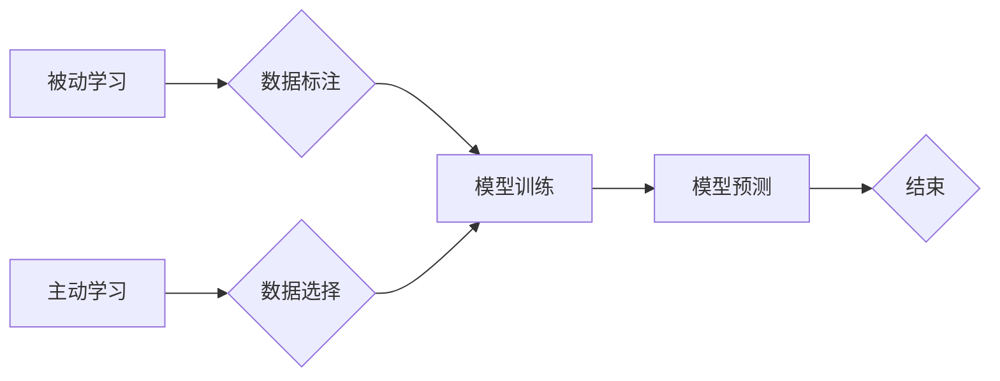

                 

## 从被动接收到主动探索：知识获取的范式转移

> 关键词：知识获取、主动学习、被动学习、深度学习、迁移学习、强化学习、人工智能

### 1. 背景介绍

在人工智能领域，知识获取一直是研究的热点问题。传统的机器学习方法主要依赖于大规模标注数据，这种被动学习模式存在着数据获取成本高、数据标注耗时、数据更新困难等问题。随着深度学习的兴起，机器学习模型的性能得到显著提升，但深度学习模型仍然依赖于大量标注数据，并且难以应对数据分布变化和知识更新的需求。

为了解决这些问题，主动学习和迁移学习等主动学习方法应运而生。主动学习的核心思想是让模型能够主动选择最能提升自身性能的数据进行学习，从而提高学习效率和准确性。迁移学习则旨在利用已有的知识和经验，迁移到新的任务或领域，从而减少对新任务数据的依赖。

近年来，随着人工智能技术的不断发展，知识获取的范式正在发生转变，从传统的被动接收转向主动探索。

### 2. 核心概念与联系

**2.1  被动学习与主动学习**

被动学习是指模型被动接受已标注数据进行训练，而主动学习是指模型能够主动选择数据进行学习，以最大化学习效率和准确性。

**2.2  主动学习策略**

主动学习策略是指模型选择数据的准则，常见的策略包括：

* **不确定性策略:** 选择模型预测不确定的数据进行学习。
* **多样性策略:** 选择能够增加训练数据多样性的数据进行学习。
* **代表性策略:** 选择能够代表整个数据集的典型数据进行学习。

**2.3  迁移学习**

迁移学习是指利用已有的知识和经验，迁移到新的任务或领域。

**2.4  知识图谱**

知识图谱是一种结构化的知识表示形式，它将实体和关系以图的形式表示，能够有效地存储和组织知识。

**2.5  知识蒸馏**

知识蒸馏是一种迁移学习方法，它将知识从一个大型模型（教师模型）迁移到一个小型模型（学生模型）中。

**Mermaid 流程图**



### 3. 核心算法原理 & 具体操作步骤

**3.1  算法原理概述**

主动学习算法的核心思想是通过选择最能提升模型性能的数据进行学习，从而提高学习效率和准确性。常见的主动学习算法包括不确定性策略、多样性策略和代表性策略。

**3.2  算法步骤详解**

1. **初始化模型:** 使用初始模型对数据进行预训练。
2. **数据选择:** 根据选择的主动学习策略，从未标注数据中选择一部分数据进行标注。
3. **模型更新:** 使用选择的标注数据对模型进行更新训练。
4. **重复步骤2-3:** 直到模型性能达到预设目标或达到最大迭代次数。

**3.3  算法优缺点**

**优点:**

* 提高学习效率: 通过选择最能提升模型性能的数据进行学习，可以减少对标注数据的依赖。
* 提高模型准确性: 选择高质量数据进行学习可以提高模型的准确性。

**缺点:**

* 需要额外的标注成本: 虽然主动学习可以减少对标注数据的依赖，但仍然需要对部分数据进行标注。
* 选择策略的复杂性: 不同的主动学习策略适用于不同的场景，需要根据具体情况选择合适的策略。

**3.4  算法应用领域**

主动学习算法在许多领域都有应用，例如：

* **图像识别:** 选择难以分类的图像进行标注，提高图像识别模型的准确性。
* **自然语言处理:** 选择语义歧义较大的文本进行标注，提高文本分类和情感分析模型的性能。
* **医疗诊断:** 选择疑难病例进行标注，提高医疗诊断模型的准确性。

### 4. 数学模型和公式 & 详细讲解 & 举例说明

**4.1  数学模型构建**

假设我们有一个包含N个样本的数据集D，其中每个样本都包含特征向量x和标签y。我们的目标是训练一个模型f(x)来预测样本的标签。

在主动学习中，我们希望选择一个子集S⊆D，其中S包含N个样本，并对这些样本进行标注。我们的目标是选择S使得模型在S上训练后的性能最大化。

我们可以使用以下公式来衡量模型在S上训练后的性能：

$$
P(S) = \frac{1}{|S|} \sum_{i \in S} I(f(x_i) = y_i)
$$

其中，I(f(x_i) = y_i)是一个指示函数，如果模型f(x_i)的预测结果等于样本y_i的真实标签，则I(f(x_i) = y_i) = 1，否则I(f(x_i) = y_i) = 0。

**4.2  公式推导过程**

为了选择最优的子集S，我们需要找到一个函数g(S)来评估不同子集S的性能。

我们可以使用以下公式来定义g(S)：

$$
g(S) = P(S) - C(S)
$$

其中，C(S)是选择子集S的成本，例如标注成本。

**4.3  案例分析与讲解**

假设我们有一个包含100个样本的数据集D，其中每个样本都包含一个特征向量x和一个标签y。我们希望选择10个样本进行标注，并训练一个模型f(x)来预测样本的标签。

我们可以使用不确定性策略来选择样本进行标注。不确定性策略选择模型预测不确定的样本进行标注，例如选择模型预测概率最低的样本。

假设模型f(x)对每个样本的预测概率都大于0.8，那么我们可以选择模型预测概率最低的样本进行标注。

### 5. 项目实践：代码实例和详细解释说明

**5.1  开发环境搭建**

* Python 3.7+
* TensorFlow 2.0+
* PyTorch 1.0+

**5.2  源代码详细实现**

```python
import numpy as np
from sklearn.datasets import make_classification
from sklearn.model_selection import train_test_split
from sklearn.linear_model import LogisticRegression

# 生成样本数据
X, y = make_classification(n_samples=100, n_features=20, random_state=42)

# 将数据划分为训练集和测试集
X_train, X_test, y_train, y_test = train_test_split(X, y, test_size=0.2, random_state=42)

# 初始化模型
model = LogisticRegression()

# 训练模型
model.fit(X_train, y_train)

# 预测测试集结果
y_pred = model.predict(X_test)

# 计算模型准确率
accuracy = np.mean(y_pred == y_test)

# 打印模型准确率
print(f"模型准确率: {accuracy}")
```

**5.3  代码解读与分析**

* 代码首先使用`make_classification`函数生成一个包含100个样本和20个特征的分类数据集。
* 然后使用`train_test_split`函数将数据划分为训练集和测试集。
* 初始化一个逻辑回归模型，并使用训练集进行训练。
* 使用训练好的模型对测试集进行预测，并计算模型的准确率。

**5.4  运行结果展示**

运行代码后，会输出模型的准确率。

### 6. 实际应用场景

**6.1  医疗诊断**

主动学习可以用于选择疑难病例进行标注，提高医疗诊断模型的准确性。

**6.2  图像识别**

主动学习可以用于选择难以分类的图像进行标注，提高图像识别模型的准确性。

**6.3  自然语言处理**

主动学习可以用于选择语义歧义较大的文本进行标注，提高文本分类和情感分析模型的性能。

**6.4  未来应用展望**

随着人工智能技术的不断发展，主动学习将在更多领域得到应用，例如：

* **个性化推荐:** 选择用户更感兴趣的内容进行推荐。
* **欺诈检测:** 选择可能存在欺诈行为的数据进行检测。
* **自动驾驶:** 选择需要更精确感知的环境数据进行训练。

### 7. 工具和资源推荐

**7.1  学习资源推荐**

* **书籍:**

    * Active Learning by Tong Zhang
    * Deep Learning by Ian Goodfellow

* **论文:**

    * Active Learning by Committee
    * Uncertainty Sampling for Active Learning

**7.2  开发工具推荐**

* **TensorFlow:** https://www.tensorflow.org/
* **PyTorch:** https://pytorch.org/

**7.3  相关论文推荐**

* Active Learning with Deep Neural Networks: A Survey
* A Survey on Active Learning

### 8. 总结：未来发展趋势与挑战

**8.1  研究成果总结**

主动学习在知识获取领域取得了显著的进展，能够有效地提高学习效率和准确性。

**8.2  未来发展趋势**

* **更有效的主动学习策略:** 研究更有效的主动学习策略，例如基于强化学习的主动学习策略。
* **迁移学习与主动学习的结合:** 将迁移学习与主动学习相结合，提高模型的泛化能力。
* **面向新兴领域的主动学习:** 将主动学习应用于新兴领域，例如自动驾驶和医疗诊断。

**8.3  面临的挑战**

* **选择策略的复杂性:** 不同的主动学习策略适用于不同的场景，需要根据具体情况选择合适的策略。
* **标注成本:** 尽管主动学习可以减少对标注数据的依赖，但仍然需要对部分数据进行标注，这仍然是一个成本问题。
* **数据分布变化:** 当数据分布发生变化时，主动学习模型的性能可能会下降。

**8.4  研究展望**

未来，主动学习的研究将更加注重以下几个方面:

* **开发更智能的主动学习策略:** 利用机器学习和深度学习技术，开发更智能的主动学习策略，能够自动选择最能提升模型性能的数据。
* **降低标注成本:** 研究新的标注方法，例如弱监督学习和自监督学习，降低主动学习的标注成本。
* **提高模型的鲁棒性:** 研究提高模型对数据分布变化的鲁棒性，使主动学习模型能够更好地应对现实世界中的复杂场景。

### 9. 附录：常见问题与解答

**9.1  什么是主动学习？**

主动学习是一种机器学习方法，它允许模型主动选择最能提升自身性能的数据进行学习。

**9.2  主动学习有哪些优势？**

主动学习可以提高学习效率和准确性，减少对标注数据的依赖。

**9.3  主动学习有哪些缺点？**

主动学习仍然需要对部分数据进行标注，选择策略的复杂性也是一个挑战。

**9.4  主动学习有哪些应用场景？**

主动学习在医疗诊断、图像识别、自然语言处理等领域都有应用。


作者：禅与计算机程序设计艺术 / Zen and the Art of Computer Programming 
<end_of_turn>

