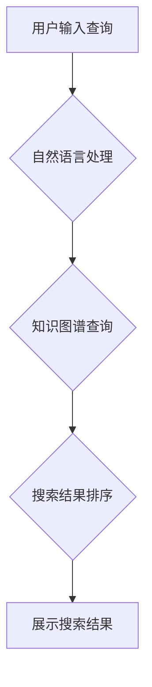

                 

## 信息过载与信息搜索指南：在庞大的信息海洋中找到所需的信息

> 关键词：信息过载、信息检索、搜索算法、自然语言处理、机器学习、知识图谱、信息架构、信息筛选

### 1. 背景介绍

在当今信息爆炸的时代，我们每天接触的海量信息呈指数级增长。从新闻、社交媒体到学术论文、技术文档，信息无处不在，却也带来了新的挑战：信息过载。过多的信息不仅难以消化，更可能导致我们无法有效地找到所需的信息，从而影响工作效率、学习成果甚至生活质量。

信息过载现象的产生，与互联网的快速发展、移动设备的普及以及数据存储和处理技术的进步密不可分。一方面，信息生产和传播速度加快，信息量呈爆炸式增长；另一方面，人们对信息的获取需求也日益强烈，希望能够快速、高效地找到所需的信息。

然而，传统的搜索引擎往往难以应对信息过载的挑战。它们主要依赖于关键词匹配，难以理解用户真实意图，且容易受到垃圾信息和误导性信息的干扰。因此，如何有效地应对信息过载，在庞大的信息海洋中找到所需的信息，成为当今社会面临的重要课题。

### 2. 核心概念与联系

信息搜索的核心在于理解用户需求，并根据这些需求从海量信息中筛选出最相关的结果。这涉及到多个核心概念和技术，包括：

* **信息检索 (Information Retrieval):**  信息检索是计算机科学的一个分支，旨在帮助用户从海量信息中找到所需的信息。它涉及到信息组织、索引、查询和排名等多个环节。
* **自然语言处理 (Natural Language Processing, NLP):** 自然语言处理是人工智能的一个分支，旨在使计算机能够理解和处理人类语言。在信息搜索中，NLP技术用于理解用户的搜索意图，并将其转换为计算机可以理解的查询。
* **机器学习 (Machine Learning):** 机器学习是人工智能的一个分支，旨在通过数据训练模型，使模型能够自动学习和改进。在信息搜索中，机器学习技术用于个性化推荐、垃圾信息过滤和搜索结果排名等方面。
* **知识图谱 (Knowledge Graph):** 知识图谱是一种数据结构，用于表示知识和关系。它将实体和关系组织成一个网络，可以帮助搜索引擎更好地理解用户查询的语义，并提供更准确、更全面的搜索结果。

**Mermaid 流程图**



### 3. 核心算法原理 & 具体操作步骤

#### 3.1 算法原理概述

信息搜索的核心算法通常基于信息检索模型，例如向量空间模型、概率模型和图模型等。这些模型将信息表示为向量或图，并利用数学算法计算信息之间的相似度或相关性。

* **向量空间模型:** 将文档和查询都表示为向量，向量中的每个维度代表一个词或主题。文档和查询之间的相似度可以通过向量之间的夹角或点积来计算。
* **概率模型:** 将信息检索看作是一个概率问题，假设用户查询和文档之间的关系服从某种概率分布。例如，TF-IDF模型计算文档中词的权重，PageRank算法计算网页的重要性。
* **图模型:** 将信息表示为图，其中节点代表实体，边代表关系。通过分析图结构，可以计算实体之间的相似度或相关性。

#### 3.2 算法步骤详解

以向量空间模型为例，信息搜索的具体步骤如下：

1. **预处理:** 对文档和查询进行预处理，例如去除停用词、词干化、词袋化等。
2. **特征提取:** 将预处理后的文档和查询转换为向量，每个维度代表一个词或主题。
3. **相似度计算:** 计算文档和查询之间的向量相似度，例如余弦相似度。
4. **排序:** 根据相似度排序文档，并将排序结果返回给用户。

#### 3.3 算法优缺点

* **优点:** 
    * 算法原理简单易懂，易于实现。
    * 可以处理大量文本数据。
    * 可以根据用户需求进行个性化排序。
* **缺点:** 
    * 难以理解用户复杂的搜索意图。
    * 对语义理解能力有限，容易受到噪声和误导性信息的干扰。
    * 难以处理结构化数据和多模态数据。

#### 3.4 算法应用领域

向量空间模型广泛应用于搜索引擎、信息推荐系统、文本分类等领域。

### 4. 数学模型和公式 & 详细讲解 & 举例说明

#### 4.1 数学模型构建

在信息检索中，常用的数学模型是TF-IDF模型。TF-IDF模型将文档中词的权重计算为两个部分的乘积：

* **TF (Term Frequency):** 词在文档中出现的频率。
* **IDF (Inverse Document Frequency):** 词在整个语料库中出现的频率的倒数。

#### 4.2 公式推导过程

TF-IDF模型的公式如下：

```latex
TF-IDF(t, d) = TF(t, d) * IDF(t)
```

其中：

* $t$ 代表一个词。
* $d$ 代表一个文档。
* $TF(t, d)$ 代表词 $t$ 在文档 $d$ 中出现的频率。
* $IDF(t)$ 代表词 $t$ 在整个语料库中出现的频率的倒数。

#### 4.3 案例分析与讲解

假设我们有一个语料库包含1000个文档，其中词“计算机”在500个文档中出现。那么，词“计算机”的IDF值为：

```latex
IDF(计算机) = log(1000 / 500) = log(2)
```

如果一个文档包含5个词“计算机”，那么该词在该文档中的TF值为：

```latex
TF(计算机, 文档) = 5 / 总词数
```

因此，该词在该文档中的TF-IDF值为：

```latex
TF-IDF(计算机, 文档) = (5 / 总词数) * log(2)
```

### 5. 项目实践：代码实例和详细解释说明

#### 5.1 开发环境搭建

本项目使用Python语言进行开发，所需的库包括NLTK、Scikit-learn等。

#### 5.2 源代码详细实现

```python
import nltk
from sklearn.feature_extraction.text import TfidfVectorizer

# 下载停用词列表
nltk.download('stopwords')

# 定义预处理函数
def preprocess_text(text):
    # 移除标点符号
    text = ''.join(c for c in text if c.isalnum() or c.isspace())
    # 转换为小写
    text = text.lower()
    # 移除停用词
    stop_words = nltk.corpus.stopwords.words('english')
    words = [word for word in text.split() if word not in stop_words]
    return ' '.join(words)

# 定义训练数据
documents = [
    "This is the first document.",
    "This document is the second document.",
    "And this is the third one.",
    "Is this the first document?"
]

# 预处理训练数据
processed_documents = [preprocess_text(doc) for doc in documents]

# 使用TF-IDF向量化
vectorizer = TfidfVectorizer()
tfidf_matrix = vectorizer.fit_transform(processed_documents)

# 打印TF-IDF矩阵
print(tfidf_matrix.toarray())
```

#### 5.3 代码解读与分析

* 代码首先下载停用词列表，并定义一个预处理函数，用于移除标点符号、转换为小写和移除停用词。
* 然后，定义训练数据，并使用预处理函数对数据进行预处理。
* 使用TF-IDF向量化器将预处理后的数据转换为TF-IDF矩阵。
* 最后，打印TF-IDF矩阵，展示每个文档中每个词的权重。

#### 5.4 运行结果展示

运行代码后，会输出一个TF-IDF矩阵，其中每个元素代表一个词在某个文档中的权重。

### 6. 实际应用场景

信息搜索技术广泛应用于各种场景，例如：

* **搜索引擎:** Google、Bing等搜索引擎利用信息检索技术帮助用户找到所需的信息。
* **电商平台:** 淘宝、京东等电商平台利用信息检索技术帮助用户找到感兴趣的商品。
* **社交媒体:** Facebook、Twitter等社交媒体平台利用信息检索技术帮助用户找到感兴趣的内容和用户。
* **学术研究:** 学术搜索引擎、文献管理系统等利用信息检索技术帮助用户查找和管理学术文献。

### 6.4 未来应用展望

随着人工智能、大数据和云计算技术的不断发展，信息搜索技术将朝着更加智能化、个性化和自动化方向发展。

* **更精准的搜索结果:** 利用深度学习等技术，更好地理解用户搜索意图，提供更精准的搜索结果。
* **个性化信息推荐:** 根据用户的兴趣爱好和行为模式，提供个性化的信息推荐。
* **跨模态信息搜索:** 能够处理文本、图像、音频等多种类型的多模态数据，提供更丰富的搜索体验。
* **主动式信息搜索:** 不需要用户主动输入查询，系统能够根据用户的上下文和需求主动提供相关信息。

### 7. 工具和资源推荐

#### 7.1 学习资源推荐

* **书籍:**
    * 信息检索导论 (Introduction to Information Retrieval)
    * 自然语言处理 (Natural Language Processing)
* **在线课程:**
    * Coursera: 自然语言处理
    * edX: 信息检索
* **博客和网站:**
    * Stanford NLP Group
    * Google AI Blog

#### 7.2 开发工具推荐

* **Python:** 广泛用于信息检索和自然语言处理开发。
* **Scikit-learn:** Python机器学习库，提供各种信息检索算法实现。
* **NLTK:** Python自然语言处理库，提供文本预处理、词性标注等功能。
* **Elasticsearch:** 开源搜索引擎，支持多种信息检索算法和功能。

#### 7.3 相关论文推荐

* **TF-IDF:** Salton, G., & McGill, M. (1983). Introduction to modern information retrieval. McGraw-Hill.
* **PageRank:** Brin, S., & Page, L. (1998). The anatomy of a large-scale hypertextual web search engine. Computer Networks and ISDN Systems, 30(1-7), 107-117.
* **BERT:** Devlin, J., Chang, M. W., Lee, K., & Toutanova, K. (2018). BERT: Pre-training of deep bidirectional transformers for language understanding. arXiv preprint arXiv:1810.04805.

### 8. 总结：未来发展趋势与挑战

#### 8.1 研究成果总结

信息搜索技术取得了显著的进展，从传统的关键词匹配模型发展到基于机器学习的深度学习模型，能够更好地理解用户需求，提供更精准、更个性化的搜索结果。

#### 8.2 未来发展趋势

未来信息搜索技术将朝着更加智能化、个性化和自动化方向发展，例如：

* **更深入的语义理解:** 利用深度学习等技术，更好地理解用户搜索意图，提供更精准的搜索结果。
* **个性化信息推荐:** 根据用户的兴趣爱好和行为模式，提供个性化的信息推荐。
* **跨模态信息搜索:** 能够处理文本、图像、音频等多种类型的多模态数据，提供更丰富的搜索体验。
* **主动式信息搜索:** 不需要用户主动输入查询，系统能够根据用户的上下文和需求主动提供相关信息。

#### 8.3 面临的挑战

信息搜索技术也面临着一些挑战，例如：

* **数据质量问题:** 信息搜索算法的性能依赖于数据质量，而海量数据中存在着噪声、错误和不完整的信息。
* **隐私保护问题:** 信息搜索技术需要处理大量用户数据，如何保护用户隐私是一个重要的挑战。
* **可解释性问题:** 深度学习模型的决策过程往往难以理解，如何提高模型的可解释性是一个重要的研究方向。

#### 8.4 研究展望

未来，信息搜索技术将继续朝着更加智能化、个性化和自动化方向发展，为用户提供更加便捷、高效的信息获取体验。


### 9. 附录：常见问题与解答

* **什么是信息检索？**

信息检索是指从海量信息中找到所需信息的过程。它涉及到信息组织、索引、查询和排名等多个环节。

* **什么是TF-IDF模型？**

TF-IDF模型是一种常用的信息检索模型，它将文档中词的权重计算为两个部分的乘积：词在文档中出现的频率 (TF) 和词在整个语料库中出现的频率的倒数 (IDF)。

* **如何评估信息检索系统的性能？**

常用的评估指标包括精确率、召回率和F1-score。精确率是指检索出的结果中正确结果的比例，召回率是指检索出的结果中所有正确结果的比例，F1-score是精确率和召回率的调和平均值。

* **如何提高信息检索系统的性能？**

可以从以下几个方面提高信息检索系统的性能：

* 优化预处理方法
* 选择合适的检索模型
* 使用高质量的数据进行训练
* 评估和调整系统参数


作者：禅与计算机程序设计艺术 / Zen and the Art of Computer Programming 
<end_of_turn>

