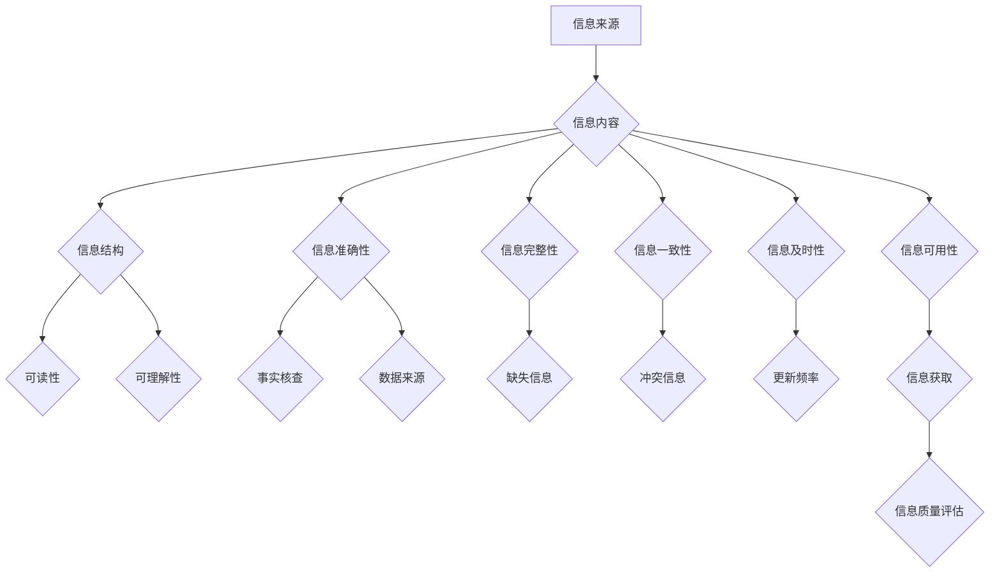

                 

## 信息过载与信息质量评估框架：批判性地评估和消费信息

> 关键词：信息过载、信息质量、评估框架、批判性思维、数据可视化、机器学习、深度学习、自然语言处理

### 1. 背景介绍

在当今数字时代，信息以前所未有的速度和规模涌入我们的生活。从社交媒体的实时更新到新闻网站的爆炸式增长，我们每天接触的海量信息量令人难以置信。然而，并非所有信息都是同等价值的。大量低质量、不准确或误导性的信息充斥其中，这导致了“信息过载”现象的出现。信息过载是指个体在面对过量信息时，难以有效地筛选、理解和处理信息的能力下降，从而导致认知疲劳、决策困难和效率低下。

信息过载不仅影响个人生活，也对企业和社会造成严重挑战。企业难以从海量数据中挖掘有价值的洞察，决策变得更加困难；社会公众难以辨别真假信息，容易受到误导和操纵。因此，如何有效地评估信息质量，批判性地消费信息，成为当今社会面临的重要课题。

### 2. 核心概念与联系

信息质量是指信息在满足特定需求时，其准确性、完整性、一致性、及时性和可用性等方面的程度。信息质量评估框架旨在提供一种系统性的方法，帮助我们对信息进行全面评估，并根据评估结果做出明智的决策。

**信息质量评估框架**



**核心概念原理和架构**

* **信息来源:** 评估信息的来源可靠性，例如网站信誉、作者专业背景等。
* **信息内容:** 评估信息的准确性、完整性、一致性和及时性。
* **信息结构:** 评估信息的组织方式和可读性，例如标题、段落、图表等。
* **信息准确性:** 评估信息的真实性和可靠性，可以通过事实核查、数据来源等方式进行评估。
* **信息完整性:** 评估信息的完整性，例如是否缺少关键信息或上下文。
* **信息一致性:** 评估信息的内部一致性和外部一致性，例如不同来源的信息是否一致。
* **信息及时性:** 评估信息的更新频率和有效性，例如新闻事件的时效性。
* **信息可用性:** 评估信息的获取方式和易用性，例如搜索引擎的排名、网站的导航等。

### 3. 核心算法原理 & 具体操作步骤

信息质量评估框架通常会结合多种算法和技术，例如机器学习、深度学习和自然语言处理等。

**3.1 算法原理概述**

机器学习算法可以从历史数据中学习，识别信息质量的特征，并对新信息进行预测。深度学习算法可以学习更复杂的特征，提高信息质量评估的准确性。自然语言处理技术可以帮助我们理解和分析文本信息，提取关键信息和识别潜在的误导性信息。

**3.2 算法步骤详解**

1. **数据收集:** 收集大量高质量和低质量信息的样本数据，并进行标注，例如标记信息的来源、内容、结构等特征。
2. **特征提取:** 使用自然语言处理技术提取文本信息中的关键特征，例如关键词、主题、情感倾向等。
3. **模型训练:** 使用机器学习或深度学习算法对训练数据进行训练，学习信息质量的特征和预测模型。
4. **模型评估:** 使用测试数据评估模型的性能，例如准确率、召回率、F1-score等。
5. **模型部署:** 将训练好的模型部署到实际应用场景中，对新信息进行评估和预测。

**3.3 算法优缺点**

* **优点:** 
    * 自动化信息质量评估，提高效率。
    * 能够识别复杂的特征，提高评估准确性。
    * 可以不断学习和改进，随着数据量的增加，模型性能会不断提升。
* **缺点:** 
    * 需要大量高质量的训练数据。
    * 模型的训练和部署需要一定的技术门槛。
    * 模型可能会受到数据偏差的影响，导致评估结果不准确。

**3.4 算法应用领域**

* **新闻媒体:** 识别虚假新闻和谣言，提高新闻质量。
* **搜索引擎:** 提升搜索结果的质量，提供更相关和可靠的信息。
* **电商平台:** 评估商品评论的真实性，防止虚假评价。
* **医疗保健:** 评估医疗信息的准确性和可靠性，提高医疗决策的质量。

### 4. 数学模型和公式 & 详细讲解 & 举例说明

信息质量评估框架可以利用数学模型和公式来量化信息质量的各个方面。

**4.1 数学模型构建**

信息质量可以被视为一个多维度的向量，每个维度代表一个信息质量指标，例如准确性、完整性、一致性、及时性和可用性。每个指标可以用一个数值来表示，数值越大，表示该指标越好。

**4.2 公式推导过程**

我们可以使用加权平均法来计算信息质量的总分。每个指标的权重可以根据其重要性进行设置。例如，对于新闻信息，准确性可能比及时性更重要，因此准确性的权重可以设置得更高。

**信息质量总分 = (权重1 * 指标1) + (权重2 * 指标2) + ... + (权重n * 指标n)**

**4.3 案例分析与讲解**

假设我们想评估一篇新闻文章的信息质量，并使用以下指标：

* **准确性:** 0.8
* **完整性:** 0.7
* **一致性:** 0.9
* **及时性:** 0.6
* **可用性:** 0.9

我们可以设置以下权重：

* **准确性:** 0.3
* **完整性:** 0.2
* **一致性:** 0.2
* **及时性:** 0.1
* **可用性:** 0.2

则该新闻文章的信息质量总分可以计算为：

**信息质量总分 = (0.3 * 0.8) + (0.2 * 0.7) + (0.2 * 0.9) + (0.1 * 0.6) + (0.2 * 0.9) = 0.72**

### 5. 项目实践：代码实例和详细解释说明

我们可以使用Python语言和机器学习库Scikit-learn来实现信息质量评估框架。

**5.1 开发环境搭建**

需要安装Python语言和Scikit-learn库。

**5.2 源代码详细实现**

```python
from sklearn.model_selection import train_test_split
from sklearn.linear_model import LogisticRegression
from sklearn.metrics import accuracy_score

# 加载数据
data = pd.read_csv('information_quality_data.csv')

# 划分训练集和测试集
X_train, X_test, y_train, y_test = train_test_split(data.drop('quality', axis=1), data['quality'], test_size=0.2)

# 创建逻辑回归模型
model = LogisticRegression()

# 训练模型
model.fit(X_train, y_train)

# 预测测试集
y_pred = model.predict(X_test)

# 计算模型准确率
accuracy = accuracy_score(y_test, y_pred)
print('模型准确率:', accuracy)
```

**5.3 代码解读与分析**

* 首先，我们加载数据并划分训练集和测试集。
* 然后，我们创建逻辑回归模型并训练模型。
* 最后，我们使用训练好的模型对测试集进行预测，并计算模型的准确率。

**5.4 运行结果展示**

运行代码后，会输出模型的准确率。

### 6. 实际应用场景

信息质量评估框架可以应用于各种场景，例如：

* **新闻媒体:** 识别虚假新闻和谣言，提高新闻质量。
* **搜索引擎:** 提升搜索结果的质量，提供更相关和可靠的信息。
* **电商平台:** 评估商品评论的真实性，防止虚假评价。
* **医疗保健:** 评估医疗信息的准确性和可靠性，提高医疗决策的质量。

**6.4 未来应用展望**

随着人工智能技术的不断发展，信息质量评估框架将更加智能化和自动化。未来，我们可以期待：

* 使用更先进的机器学习算法和深度学习模型，提高评估准确性。
* 利用自然语言处理技术，更深入地理解和分析文本信息，识别更复杂的误导性信息。
* 将信息质量评估框架集成到各种应用场景中，例如社交媒体、在线教育、智能家居等。

### 7. 工具和资源推荐

**7.1 学习资源推荐**

* **书籍:**
    * "Information Quality: Concepts, Methodologies, Tools, and Applications" by IGI Global
    * "Data Quality: Concepts, Methodologies, Tools, and Applications" by IGI Global
* **在线课程:**
    * Coursera: "Machine Learning" by Andrew Ng
    * edX: "Deep Learning" by Andrew Ng

**7.2 开发工具推荐**

* **Python:** 
    * Scikit-learn: 机器学习库
    * TensorFlow: 深度学习库
    * PyTorch: 深度学习库
* **数据可视化工具:**
    * Tableau
    * Power BI
    * matplotlib

**7.3 相关论文推荐**

* "A Survey of Information Quality Assessment Techniques" by Wang et al.
* "Deep Learning for Information Quality Assessment" by Liu et al.

### 8. 总结：未来发展趋势与挑战

信息质量评估框架是应对信息过载的重要解决方案，它可以帮助我们批判性地评估和消费信息，做出更明智的决策。未来，信息质量评估框架将朝着更加智能化、自动化和个性化的方向发展。

**8.1 研究成果总结**

* 已经开发出多种信息质量评估框架和算法，并取得了一定的成果。
* 机器学习和深度学习技术在信息质量评估领域得到了广泛应用，提高了评估准确性。
* 自然语言处理技术可以帮助我们更深入地理解和分析文本信息，识别更复杂的误导性信息。

**8.2 未来发展趋势**

* 使用更先进的机器学习算法和深度学习模型，提高评估准确性。
* 利用自然语言处理技术，更深入地理解和分析文本信息，识别更复杂的误导性信息。
* 将信息质量评估框架集成到各种应用场景中，例如社交媒体、在线教育、智能家居等。
* 开发更加个性化的信息质量评估框架，根据用户的需求和偏好进行定制。

**8.3 面临的挑战**

* 数据标注成本高，高质量的训练数据难以获取。
* 模型可能会受到数据偏差的影响，导致评估结果不准确。
* 如何评估非文本信息，例如图像、音频和视频的信息质量。

**8.4 研究展望**

* 研究更有效的机器学习算法和深度学习模型，提高评估准确性。
* 开发新的数据标注方法，降低数据标注成本。
* 研究如何评估非文本信息的信息质量。
* 将信息质量评估框架与其他技术结合，例如区块链技术，提高信息的可信度和安全性。

### 9. 附录：常见问题与解答

**Q1: 如何评估信息质量？**

A1: 信息质量评估框架可以提供一种系统性的方法，帮助我们评估信息质量。

**Q2: 信息质量评估框架有哪些应用场景？**

A2: 信息质量评估框架可以应用于新闻媒体、搜索引擎、电商平台、医疗保健等各种场景。

**Q3: 如何选择合适的机器学习算法？**

A3: 选择合适的机器学习算法需要根据具体的数据集和任务需求进行选择。

**Q4: 如何解决数据标注成本高的问题？**

A4: 可以探索新的数据标注方法，例如使用人工智能技术辅助标注。


作者：禅与计算机程序设计艺术 / Zen and the Art of Computer Programming 
<end_of_turn>

