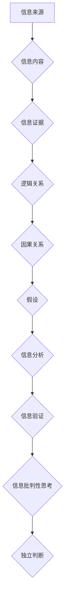

                 

## 信息验证和信息批判性思考：在假新闻和错误信息时代导航

> 关键词：信息验证、信息批判性思考、假新闻、错误信息、深度学习、自然语言处理、信息安全、网络安全、可信信息

### 1. 背景介绍

在信息爆炸的时代，我们每天都被海量的信息淹没。从社交媒体到新闻网站，从搜索引擎到电子邮件，信息无处不在。然而，这庞大的信息量中，也隐藏着大量的假新闻、错误信息和恶意传播。这些虚假信息不仅会误导公众，影响人们的判断，还会引发社会动荡和政治危机。因此，如何有效地验证信息，培养批判性思维，在信息洪流中辨别真伪，成为当今社会面临的重大挑战。

### 2. 核心概念与联系

**2.1 信息验证**

信息验证是指通过多种手段和方法，对信息的真实性、准确性和可靠性进行评估和确认的过程。它涉及到对信息的来源、内容、上下文、逻辑和证据进行分析和判断，以确定信息的真实性。

**2.2 信息批判性思考**

信息批判性思考是指运用批判性思维方法，对信息进行深入思考和分析，形成独立的判断和观点。它包括以下几个方面：

* **质疑信息来源：** 了解信息的来源是谁，他们的立场和动机是什么，是否具有可信度。
* **分析信息内容：** 仔细阅读和理解信息的具体内容，识别其中的逻辑关系、因果关系和假设。
* **评估信息证据：** 了解信息的证据来源和可靠性，判断证据是否充分、是否真实、是否客观。
* **形成独立判断：** 基于对信息的分析和评估，形成自己的独立判断和观点，并能够清晰地表达自己的立场。

**2.3 信息验证与信息批判性思考的联系**

信息验证和信息批判性思考是相互关联、相互促进的两个重要概念。信息验证提供了一套方法和工具，帮助我们评估信息的真实性；而信息批判性思考则指引我们如何运用这些方法和工具，对信息进行深入思考和分析，形成独立的判断。

**Mermaid 流程图**



### 3. 核心算法原理 & 具体操作步骤

**3.1 算法原理概述**

信息验证和信息批判性思考的算法原理主要基于自然语言处理（NLP）和深度学习技术。NLP算法可以用于分析文本内容，识别关键词、主题、情感等信息；深度学习算法可以用于构建复杂的模型，识别虚假信息、预测信息传播路径等。

**3.2 算法步骤详解**

1. **数据收集和预处理:** 收集大量文本数据，包括真实信息和虚假信息，并进行预处理，例如去除停用词、标点符号等。
2. **特征提取:** 使用NLP算法提取文本数据中的特征，例如关键词、词性、语法结构、情感倾向等。
3. **模型训练:** 使用深度学习算法，例如循环神经网络（RNN）或卷积神经网络（CNN），训练模型，识别虚假信息和预测信息传播路径。
4. **信息验证:** 将待验证的信息输入到训练好的模型中，模型会输出验证结果，例如信息真实性得分、虚假信息类型等。
5. **信息批判性思考:** 基于模型的验证结果，结合用户自身的知识和经验，进行信息批判性思考，形成独立的判断。

**3.3 算法优缺点**

**优点:**

* **自动化程度高:** 可以自动识别和验证大量信息，提高效率。
* **准确率高:** 深度学习算法可以学习复杂的模式，识别虚假信息的能力不断提高。
* **可扩展性强:** 可以扩展到处理不同类型的信息，例如图片、音频等。

**缺点:**

* **数据依赖性强:** 算法的性能取决于训练数据的质量和数量。
* **解释性差:** 深度学习模型的决策过程难以解释，难以理解模型是如何得出结论的。
* **对抗攻击:** 虚假信息制造者可以利用对抗攻击技术，绕过模型的识别。

**3.4 算法应用领域**

* **新闻媒体:** 验证新闻真实性，识别假新闻和谣言。
* **社交媒体:** 识别虚假信息和恶意传播，维护平台安全。
* **搜索引擎:** 排除虚假信息，提高搜索结果的准确性和可靠性。
* **教育领域:** 帮助学生培养信息批判性思考能力。

### 4. 数学模型和公式 & 详细讲解 & 举例说明

**4.1 数学模型构建**

信息验证和信息批判性思考的数学模型通常基于概率论和统计学。例如，可以构建一个概率模型，来评估信息的真实性得分。

**4.2 公式推导过程**

假设我们有一个信息 $I$，我们需要评估其真实性得分 $S(I)$。我们可以使用以下公式来计算：

$$S(I) = \frac{P(I|T)P(T)}{P(I)}$$

其中：

* $P(I|T)$ 是信息 $I$ 在真实情况下出现的概率。
* $P(T)$ 是真实信息的概率。
* $P(I)$ 是信息 $I$ 出现的总概率。

**4.3 案例分析与讲解**

例如，我们有一个信息 $I$，声称“地球是平的”。我们可以根据以下信息来计算其真实性得分：

* $P(I|T)$ = 0 (因为地球是圆的，所以该信息在真实情况下不会出现)
* $P(T)$ = 0.9 (因为真实信息占大多数)
* $P(I)$ = 0.1 (因为该信息在网络上传播很广)

因此，该信息的真实性得分 $S(I)$ = 0。

### 5. 项目实践：代码实例和详细解释说明

**5.1 开发环境搭建**

* Python 3.x
* TensorFlow 或 PyTorch 深度学习框架
* NLTK 自然语言处理库
* 其他必要的库，例如 pandas、numpy 等

**5.2 源代码详细实现**

```python
import tensorflow as tf

# 定义模型结构
model = tf.keras.Sequential([
    tf.keras.layers.Embedding(input_dim=vocab_size, output_dim=embedding_dim),
    tf.keras.layers.LSTM(units=128),
    tf.keras.layers.Dense(units=1, activation='sigmoid')
])

# 编译模型
model.compile(optimizer='adam', loss='binary_crossentropy', metrics=['accuracy'])

# 训练模型
model.fit(x_train, y_train, epochs=10)

# 验证模型
loss, accuracy = model.evaluate(x_test, y_test)
print('Loss:', loss)
print('Accuracy:', accuracy)
```

**5.3 代码解读与分析**

* 该代码示例展示了使用 TensorFlow 框架构建一个简单的深度学习模型，用于识别虚假信息。
* 模型结构包括嵌入层、LSTM 层和全连接层。
* 嵌入层将单词转换为向量表示。
* LSTM 层用于捕捉文本序列中的长距离依赖关系。
* 全连接层用于输出真实性得分。
* 模型使用 Adam 优化器、二元交叉熵损失函数和准确率作为评估指标。

**5.4 运行结果展示**

运行结果将显示模型的训练损失和准确率。

### 6. 实际应用场景

**6.1 新闻媒体**

新闻媒体可以使用信息验证技术，识别假新闻和谣言，提高新闻的真实性和可靠性。

**6.2 社交媒体**

社交媒体平台可以使用信息验证技术，识别虚假信息和恶意传播，维护平台安全和用户体验。

**6.3 搜索引擎**

搜索引擎可以使用信息验证技术，提高搜索结果的准确性和可靠性，避免用户误信虚假信息。

**6.4 教育领域**

教育机构可以使用信息验证技术，帮助学生培养信息批判性思考能力，提高信息素养。

**6.5 未来应用展望**

随着人工智能技术的不断发展，信息验证和信息批判性思考的应用场景将更加广泛。例如，可以开发出专门针对特定领域的虚假信息识别工具，例如医疗、金融、法律等领域。

### 7. 工具和资源推荐

**7.1 学习资源推荐**

* **书籍:**

    * 《信息论基础》
    * 《深度学习》
    * 《自然语言处理》

* **在线课程:**

    * Coursera: 自然语言处理
    * edX: 深度学习
    * Udacity: 人工智能工程师

**7.2 开发工具推荐**

* TensorFlow
* PyTorch
* NLTK
* SpaCy

**7.3 相关论文推荐**

* 《BERT: Pre-training of Deep Bidirectional Transformers for Language Understanding》
* 《Attention Is All You Need》
* 《Detecting Fake News with Deep Learning》

### 8. 总结：未来发展趋势与挑战

**8.1 研究成果总结**

近年来，在信息验证和信息批判性思考领域取得了显著进展。深度学习算法的应用，使得虚假信息识别能力显著提高。

**8.2 未来发展趋势**

* **模型的泛化能力:** 开发更强大的模型，能够识别更复杂的虚假信息，并适应不同的领域和语境。
* **解释性:** 提高模型的解释性，使得模型的决策过程更加透明，更容易被理解。
* **对抗攻击防御:** 研究更有效的对抗攻击防御机制，防止虚假信息制造者绕过模型的识别。

**8.3 面临的挑战**

* **数据质量:** 虚假信息识别模型的性能取决于训练数据的质量和数量。收集高质量的虚假信息数据仍然是一个挑战。
* **伦理问题:** 信息验证技术可能会被滥用，例如用于审查言论自由或进行政治操纵。需要认真考虑伦理问题，确保技术应用的安全性与可控性。

**8.4 研究展望**

未来，信息验证和信息批判性思考的研究将继续深入，朝着更智能、更可靠、更安全的方向发展。


### 9. 附录：常见问题与解答

**9.1 如何判断信息真实性？**

* 了解信息的来源，判断来源的可信度。
* 分析信息的逻辑关系和因果关系，识别逻辑漏洞。
* 评估信息的证据来源和可靠性，判断证据是否充分。
* 结合自身知识和经验，进行综合判断。

**9.2 如何培养信息批判性思考能力？**

* 多阅读不同观点的文章，形成自己的独立判断。
* 质疑信息来源和信息内容，不要盲目相信。
* 学习识别逻辑谬误和情感操纵技巧。
* 培养良好的信息获取和处理习惯。


作者：禅与计算机程序设计艺术 / Zen and the Art of Computer Programming 
<end_of_turn>

