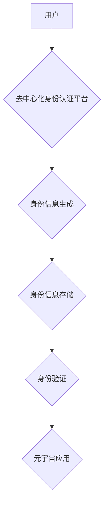

                 

## 元宇宙中的身份认证:去中心化信任体系

> 关键词：元宇宙、身份认证、去中心化、信任体系、区块链、加密技术、数字身份

## 1. 背景介绍

元宇宙概念的兴起，为人类社会带来了全新的虚拟交互体验，其沉浸式、交互式、持久性的特点，将彻底改变我们生活、工作、娱乐的方式。然而，元宇宙的蓬勃发展也面临着诸多挑战，其中身份认证问题尤为突出。

传统的集中式身份认证体系，依赖于中心化的机构或平台，存在着数据安全、隐私泄露、单点故障等风险。在元宇宙中，用户身份信息将更加丰富，涉及虚拟财产、社交关系、个人数据等多个维度，传统的认证体系难以满足其安全性和隐私保护需求。

去中心化身份认证体系，基于区块链等分布式技术，赋予用户对自身身份数据的自主控制权，能够有效解决传统认证体系的缺陷，为元宇宙构建更加安全、可靠、可信的信任体系提供解决方案。

## 2. 核心概念与联系

### 2.1  去中心化身份认证

去中心化身份认证是指用户身份信息不再存储在单一中心服务器上，而是分散存储在区块链网络中，用户拥有对自身身份数据的完全控制权。

### 2.2  信任体系

信任体系是指在元宇宙中，用户之间建立信任关系的机制和规则。去中心化身份认证是构建元宇宙信任体系的重要基础，它能够确保用户身份的真实性和不可篡改性，为用户之间的交互提供安全保障。

### 2.3  区块链技术

区块链技术是一种分布式账本技术，其特点是透明、不可篡改、安全可靠。在去中心化身份认证中，区块链技术用于存储和管理用户身份信息，确保身份数据的安全性。

**核心概念与架构流程图**



## 3. 核心算法原理 & 具体操作步骤

### 3.1  算法原理概述

去中心化身份认证算法通常基于密码学和区块链技术，其核心原理是使用加密技术生成用户身份标识，并将该标识存储在区块链网络中。用户在访问元宇宙应用时，只需提供其身份标识，即可进行身份验证。

### 3.2  算法步骤详解

1. **身份信息生成:** 用户在去中心化身份认证平台上注册，平台会根据用户的真实信息生成一个唯一的身份标识，并将其加密存储在用户的本地钱包中。

2. **身份信息存储:** 用户可以选择将身份标识存储在公共区块链网络中，也可以选择使用私有区块链网络。

3. **身份验证:** 用户在访问元宇宙应用时，需要提供其身份标识。元宇宙应用会将该标识发送到去中心化身份认证平台，平台会验证该标识的真实性和有效性，并返回验证结果。

### 3.3  算法优缺点

**优点:**

* **安全性:** 用户身份信息分散存储在区块链网络中，不易被攻击和篡改。
* **隐私保护:** 用户可以选择只公开部分身份信息，保护其隐私。
* **可信度:** 区块链技术的透明性和不可篡改性，确保身份信息的真实性和可靠性。

**缺点:**

* **技术复杂性:** 去中心化身份认证算法的实现需要较高的技术水平。
* **用户体验:** 用户需要学习使用去中心化身份认证平台，操作过程可能相对复杂。
* **监管挑战:** 去中心化身份认证体系的监管难度较大，需要制定相应的法律法规。

### 3.4  算法应用领域

* **元宇宙游戏:** 用户可以使用去中心化身份认证来创建虚拟角色，并保护其虚拟财产安全。
* **元宇宙社交:** 用户可以使用去中心化身份认证来建立信任关系，并进行安全的社交互动。
* **元宇宙电商:** 用户可以使用去中心化身份认证来进行身份验证，并保护其交易安全。

## 4. 数学模型和公式 & 详细讲解 & 举例说明

### 4.1  数学模型构建

去中心化身份认证系统可以抽象为一个图模型，其中用户节点代表元宇宙中的用户，身份信息节点代表用户的身份信息，连接线代表身份信息之间的关联关系。

**图模型:**

```
G = (V, E)
```

其中:

* **V:** 用户节点集合
* **E:** 身份信息节点集合

### 4.2  公式推导过程

**身份标识生成公式:**

$$
ID = h(PU, PI)
$$

其中:

* **ID:** 用户身份标识
* **PU:** 用户公钥
* **PI:** 用户私钥
* **h():** 哈希函数

**身份验证公式:**

$$
Verify(ID, PU, PI) = h(PU, PI) == ID
$$

其中:

* **Verify():** 身份验证函数

### 4.3  案例分析与讲解

假设Alice想要在元宇宙中创建虚拟角色，她需要生成一个唯一的身份标识。

1. Alice使用私钥PI生成公钥PU。
2. Alice使用哈希函数h()将公钥PU和私钥PI作为输入，生成身份标识ID。
3. Alice将身份标识ID存储在她的本地钱包中。

当Alice访问元宇宙游戏时，她需要提供身份标识ID进行身份验证。游戏服务器会使用Alice的公钥PU和私钥PI，通过哈希函数h()计算出身份标识ID，并与Alice提供的ID进行比较。如果两者一致，则验证成功，Alice可以进入游戏。

## 5. 项目实践：代码实例和详细解释说明

### 5.1  开发环境搭建

* **编程语言:** Solidity (以太坊智能合约语言)
* **开发工具:** Remix IDE (在线智能合约开发环境)
* **区块链网络:** 以太坊测试网络 (Rinkeby)

### 5.2  源代码详细实现

```solidity
pragma solidity ^0.8.0;

contract DecentralizedIdentity {

    mapping(address => string) public identities;

    function generateIdentity(string memory _identity) public {
        identities[msg.sender] = _identity;
    }

    function verifyIdentity(address _user, string memory _identity) public view returns (bool) {
        return identities[_user] == _identity;
    }
}
```

### 5.3  代码解读与分析

* **`pragma solidity ^0.8.0;`**: 指定合约使用的 Solidity 版本。
* **`contract DecentralizedIdentity { ... }`**: 定义一个名为 DecentralizedIdentity 的智能合约。
* **`mapping(address => string) public identities;`**: 定义一个映射数据结构，用于存储用户的地址和身份标识。
* **`function generateIdentity(string memory _identity) public { ... }`**: 定义一个函数，用于用户生成身份标识。
* **`function verifyIdentity(address _user, string memory _identity) public view returns (bool) { ... }`**: 定义一个函数，用于验证用户的身份标识。

### 5.4  运行结果展示

当用户调用 `generateIdentity()` 函数生成身份标识后，该标识将存储在智能合约的 `identities` 映射中，并与用户的地址关联。用户可以通过调用 `verifyIdentity()` 函数，验证其身份标识的有效性。

## 6. 实际应用场景

### 6.1  元宇宙游戏

去中心化身份认证可以帮助元宇宙游戏实现玩家身份的真实性和不可篡改性，保护玩家虚拟财产的安全。

### 6.2  元宇宙社交

去中心化身份认证可以帮助元宇宙社交平台建立用户之间的信任关系，防止虚假身份和网络欺诈。

### 6.3  元宇宙电商

去中心化身份认证可以帮助元宇宙电商平台实现用户身份的验证和授权，保障交易安全和用户隐私。

### 6.4  未来应用展望

随着元宇宙的发展，去中心化身份认证将应用于更多领域，例如元宇宙教育、元宇宙医疗、元宇宙金融等。

## 7. 工具和资源推荐

### 7.1  学习资源推荐

* **区块链技术入门书籍:** 《区块链技术入门》
* **去中心化身份认证技术文章:** 《去中心化身份认证: 元宇宙的信任基础》

### 7.2  开发工具推荐

* **Remix IDE:** 在线智能合约开发环境
* **Truffle Suite:** 智能合约开发工具

### 7.3  相关论文推荐

* **Decentralized Identity: A Primer**
* **Self-Sovereign Identity: A Technical Overview**

## 8. 总结：未来发展趋势与挑战

### 8.1  研究成果总结

去中心化身份认证技术为元宇宙构建安全、可靠、可信的信任体系提供了重要解决方案。

### 8.2  未来发展趋势

* **更完善的去中心化身份认证标准:** 为了促进去中心化身份认证技术的普及和应用，需要制定更完善的标准和规范。
* **更强大的去中心化身份认证平台:** 需要开发更强大的去中心化身份认证平台，提供更丰富的功能和服务。
* **更广泛的应用场景:** 去中心化身份认证技术将应用于更多元宇宙领域，例如元宇宙教育、元宇宙医疗、元宇宙金融等。

### 8.3  面临的挑战

* **技术复杂性:** 去中心化身份认证算法的实现需要较高的技术水平。
* **用户体验:** 用户需要学习使用去中心化身份认证平台，操作过程可能相对复杂。
* **监管挑战:** 去中心化身份认证体系的监管难度较大，需要制定相应的法律法规。

### 8.4  研究展望

未来，我们将继续研究和探索去中心化身份认证技术，使其更加安全、可靠、易用，为元宇宙的健康发展贡献力量。

## 9. 附录：常见问题与解答

**Q1: 去中心化身份认证与传统身份认证有什么区别？**

**A1:** 传统身份认证依赖于中心化的机构或平台，用户身份信息存储在单一服务器上，存在数据安全、隐私泄露、单点故障等风险。而去中心化身份认证则将用户身份信息分散存储在区块链网络中，用户拥有对自身身份数据的完全控制权，更加安全、可靠。

**Q2: 如何使用去中心化身份认证？**

**A2:** 用户需要注册一个去中心化身份认证平台，并生成一个唯一的身份标识。在访问元宇宙应用时，用户只需提供其身份标识，即可进行身份验证。

**Q3: 去中心化身份认证技术有哪些应用场景？**

**A3:** 去中心化身份认证技术可以应用于元宇宙游戏、元宇宙社交、元宇宙电商等多个领域，帮助构建安全、可靠、可信的信任体系。


作者：禅与计算机程序设计艺术 / Zen and the Art of Computer Programming 
<end_of_turn>

