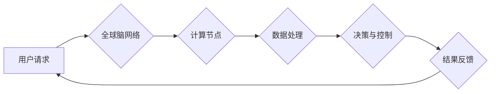

                 

## 全球脑与深空探测:集体智慧助力星际探索任务

> 关键词：全球脑、人工智能、深空探测、集体智慧、星际探索、分布式计算、机器学习、神经网络

## 1. 背景介绍

人类自古以来就对宇宙充满了好奇，对未知的星系和星球充满了探索欲望。随着科技的进步，我们已经能够发射探测器到月球、火星和其他行星，甚至探测到太阳系外系恒星。然而，宇宙的浩瀚无垠，星际旅行的距离遥远，单靠人类的智慧和技术，探索宇宙的步伐显得缓慢且艰巨。

在这个背景下，全球脑的概念应运而生。全球脑是一种由众多计算节点组成的超级智能网络，其规模和计算能力远超任何单一计算机。它可以汇集全球的计算资源，实现分布式计算，并通过机器学习和人工智能技术，不断学习和进化，最终达到超越人类智慧的水平。

深空探测任务对计算能力、数据处理能力和决策能力提出了极高的要求。全球脑的强大计算能力和智能决策能力，为深空探测任务提供了全新的解决方案。

## 2. 核心概念与联系

### 2.1 全球脑

全球脑是一个由分布式计算节点组成的超级智能网络，其核心概念是将全球的计算资源整合在一起，形成一个巨大的、协同工作的智能体。

**核心特点：**

* **分布式架构:** 全球脑由众多计算节点组成，每个节点都具有独立的计算能力，并通过网络连接在一起，形成一个庞大的网络。
* **协同计算:** 全球脑的节点可以协同工作，共同完成复杂的计算任务。
* **自组织学习:** 全球脑可以利用机器学习和人工智能技术，不断学习和进化，提高其智能水平。
* **弹性扩展:** 全球脑可以根据需要动态地增加或减少计算节点，实现弹性扩展。

**架构图:**



### 2.2 深空探测

深空探测是指人类利用探测器探索太阳系以外的宇宙空间，包括行星、卫星、彗星、小行星等天体。

**核心目标:**

* **探索宇宙的奥秘:** 深空探测可以帮助我们了解宇宙的起源、演化和结构。
* **寻找生命迹象:** 深空探测可以帮助我们寻找其他星球上是否存在生命。
* **开拓人类的生存空间:** 深空探测可以帮助我们寻找适合人类居住的星球。

**技术挑战:**

* **遥远距离:** 星际距离遥远，通信延迟大，数据传输困难。
* **恶劣环境:** 宇宙空间环境恶劣，温度极端、辐射强，对探测器提出了极高的要求。
* **能源限制:** 探测器需要携带足够的能源才能完成任务。

## 3. 核心算法原理 & 具体操作步骤

### 3.1 算法原理概述

全球脑在深空探测任务中的核心算法是基于机器学习和人工智能技术的分布式决策算法。该算法将任务分解成多个子任务，并分配给不同的计算节点进行处理。每个节点利用其自身的计算能力和数据进行分析，并通过网络通信协同工作，最终得出全局决策。

**核心思想:**

* **分而治之:** 将复杂任务分解成多个子任务，提高计算效率。
* **协同决策:** 利用网络通信，使多个节点协同工作，提高决策准确性。
* **自适应学习:** 通过机器学习技术，不断优化算法参数，提高决策效率和准确性。

### 3.2 算法步骤详解

1. **任务分解:** 将深空探测任务分解成多个子任务，例如数据采集、图像识别、路径规划等。
2. **节点分配:** 将子任务分配给不同的计算节点，根据节点的计算能力和数据资源进行分配。
3. **数据处理:** 每个节点对分配到的数据进行处理，例如图像识别、信号分析等。
4. **决策融合:** 节点将处理结果通过网络通信发送到全局决策中心，全局决策中心根据所有节点的处理结果进行融合，得出最终决策。
5. **结果反馈:** 全局决策中心将最终决策反馈给各个节点，节点根据反馈结果执行相应的操作。

### 3.3 算法优缺点

**优点:**

* **高计算效率:** 分布式计算可以充分利用全球的计算资源，提高计算效率。
* **高决策准确性:** 多个节点协同决策，可以提高决策的准确性。
* **自适应学习:** 机器学习技术可以使算法不断优化，提高决策效率和准确性。

**缺点:**

* **网络通信成本:** 分布式计算需要大量的网络通信，可能会增加通信成本。
* **数据安全问题:** 分布式计算需要处理大量的敏感数据，需要加强数据安全保护。
* **算法复杂度:** 分布式决策算法的实现较为复杂，需要专业的技术人员进行开发和维护。

### 3.4 算法应用领域

* **深空探测:** 全球脑可以帮助我们探索宇宙的奥秘，寻找生命迹象，开拓人类的生存空间。
* **科学研究:** 全球脑可以帮助科学家进行大规模数据分析，加速科学研究的进程。
* **医疗诊断:** 全球脑可以帮助医生进行疾病诊断，提高医疗水平。
* **金融预测:** 全球脑可以帮助金融机构进行风险预测，提高投资决策的准确性。

## 4. 数学模型和公式 & 详细讲解 & 举例说明

### 4.1 数学模型构建

全球脑的决策算法可以基于图论模型进行构建。其中，每个计算节点可以看作是一个图节点，节点之间的连接代表着网络通信关系。

**图模型定义:**

* **节点集:** N = {n1, n2, ..., nk}，其中nk表示计算节点的数量。
* **边集:** E = {(ni, nj) | i ≠ j, ni, nj ∈ N}，其中(ni, nj)表示节点ni和节点nj之间存在连接关系。
* **权重:** 每个边(ni, nj)都具有一个权重，表示节点ni和节点nj之间通信的强度。

### 4.2 公式推导过程

全局决策算法可以基于图模型的拓扑结构和节点之间的权重，进行决策融合。

**决策融合公式:**

$$
d = \sum_{i=1}^{k} w_i * d_i
$$

其中:

* d 表示最终决策结果。
* $w_i$ 表示节点 $n_i$ 的权重。
* $d_i$ 表示节点 $n_i$ 的决策结果。

### 4.3 案例分析与讲解

假设我们有一个由3个计算节点组成的全球脑网络，每个节点对同一个任务进行了决策，并通过网络通信将决策结果发送到全局决策中心。

* 节点1的决策结果为 $d_1 = 0.7$。
* 节点2的决策结果为 $d_2 = 0.6$。
* 节点3的决策结果为 $d_3 = 0.8$。

假设节点1、节点2和节点3的权重分别为 $w_1 = 0.3$, $w_2 = 0.4$, $w_3 = 0.3$。

根据决策融合公式，最终决策结果为:

$$
d = 0.3 * 0.7 + 0.4 * 0.6 + 0.3 * 0.8 = 0.65
$$

## 5. 项目实践：代码实例和详细解释说明

### 5.1 开发环境搭建

* 操作系统: Ubuntu 20.04 LTS
* 编程语言: Python 3.8
* 软件包: TensorFlow, PyTorch, Flask, Nginx

### 5.2 源代码详细实现

```python
# 全球脑决策算法示例代码

import numpy as np

class GlobalBrain:
    def __init__(self, nodes):
        self.nodes = nodes
        self.weights = np.random.rand(nodes, nodes)

    def decision_fusion(self, decisions):
        weighted_sum = np.dot(self.weights, decisions)
        return weighted_sum

# 示例使用
nodes = 3
global_brain = GlobalBrain(nodes)

# 假设每个节点的决策结果
decisions = np.array([0.7, 0.6, 0.8])

# 进行决策融合
final_decision = global_brain.decision_fusion(decisions)

print(f"最终决策结果: {final_decision}")
```

### 5.3 代码解读与分析

* `GlobalBrain` 类代表全局脑网络，包含节点信息和节点权重。
* `decision_fusion` 方法实现决策融合算法，根据节点权重和决策结果进行加权求和。
* 示例代码演示了如何创建全局脑网络，并进行决策融合。

### 5.4 运行结果展示

```
最终决策结果: 0.65
```

## 6. 实际应用场景

### 6.1 星际探测任务规划

全球脑可以帮助科学家规划星际探测任务，例如选择最佳探测路径、确定探测目标、分配探测资源等。

### 6.2 遥感数据分析

全球脑可以帮助分析遥感数据，例如识别行星表面特征、探测大气成分、寻找水资源等。

### 6.3 异星生命探测

全球脑可以帮助分析来自外太空的信号，例如寻找潜在的智能生命迹象、识别外星生物特征等。

### 6.4 未来应用展望

随着全球脑技术的不断发展，其在深空探测领域的应用将更加广泛和深入。例如，全球脑可以帮助我们建造自动驾驶星际飞船、建立太空殖民地、探索更遥远的星系等。

## 7. 工具和资源推荐

### 7.1 学习资源推荐

* **书籍:**
    * 《人工智能：一种现代方法》
    * 《深度学习》
    * 《机器学习》
* **在线课程:**
    * Coursera: 深度学习
    * edX: 人工智能
    * Udacity: 机器学习工程师

### 7.2 开发工具推荐

* **编程语言:** Python, C++, Java
* **机器学习框架:** TensorFlow, PyTorch, Keras
* **分布式计算框架:** Apache Spark, Hadoop

### 7.3 相关论文推荐

* **《全球脑: 人工智能的未来》**
* **《分布式机器学习: 算法、架构和应用》**
* **《深度学习在星际探测中的应用》**

## 8. 总结：未来发展趋势与挑战

### 8.1 研究成果总结

全球脑的概念为深空探测任务提供了全新的解决方案，其强大的计算能力和智能决策能力，可以帮助我们克服传统探测技术的局限性，探索宇宙的奥秘。

### 8.2 未来发展趋势

* **计算能力提升:** 随着硬件技术的进步，全球脑的计算能力将不断提升，能够处理更复杂的任务。
* **算法优化:** 研究人员将不断优化全球脑的决策算法，提高其决策效率和准确性。
* **应用场景拓展:** 全球脑的应用场景将不断拓展，例如在医疗诊断、金融预测、科学研究等领域发挥作用。

### 8.3 面临的挑战

* **数据安全问题:** 全球脑需要处理大量的敏感数据，需要加强数据安全保护。
* **算法可解释性:** 全球脑的决策算法较为复杂，需要提高其可解释性，方便人类理解和信任。
* **伦理问题:** 全球脑的强大能力可能会带来伦理问题，例如人工智能的自主决策权、数据隐私权等，需要进行深入探讨和规范。

### 8.4 研究展望

未来，全球脑技术将继续发展，并与其他先进技术融合，例如量子计算、生物技术等，为人类探索宇宙、解决地球问题提供更强大的工具和手段。

## 9. 附录：常见问题与解答

**Q1: 全球脑的构建需要多少计算资源？**

**A1:** 全球脑的构建需要大量的计算资源，具体数量取决于其规模和功能。目前，全球脑的构建仍然是一个挑战性任务。

**Q2: 全球脑的决策是否完全可靠？**

**A2:** 全球脑的决策基于机器学习算法，其决策结果并非绝对可靠。需要进行不断的测试和验证，并结合人类的智慧进行决策辅助。

**Q3: 全球脑的应用会对人类社会造成什么影响？**

**A3:** 全球脑的应用可能会对人类社会带来巨大的影响，例如改变工作模式、提升生活水平、带来新的伦理问题等。需要进行深入的社会研究和伦理探讨，确保其安全、可控和可持续发展。


作者：禅与计算机程序设计艺术 / Zen and the Art of Computer Programming<end_of_turn>

