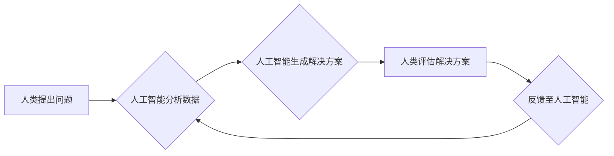

                 

## 创造更美好的世界：人类计算的终极目标

> 关键词：人工智能、计算模型、人类计算、算法优化、可持续发展、伦理规范、未来趋势

### 1. 背景介绍

人类文明的进步离不开对计算的不断探索和突破。从简单的算盘到复杂的超级计算机，计算一直是推动科技发展和社会进步的引擎。而随着人工智能技术的飞速发展，人类计算正迈入一个全新的时代。

当前，人工智能已经渗透到生活的方方面面，从智能手机的语音助手到自动驾驶汽车，从医疗诊断到金融交易，人工智能正在改变着我们的生活方式和工作模式。然而，人工智能的发展也面临着诸多挑战，例如算法偏见、数据隐私、安全风险等。

因此，我们需要思考如何利用人工智能技术创造更美好的世界，如何让计算更好地服务于人类，促进社会可持续发展。

### 2. 核心概念与联系

**2.1 人类计算的本质**

人类计算是指利用人类的智慧和计算能力，结合人工智能技术，共同完成复杂的任务。它强调人机协作，将人类的创造力、洞察力和判断力与人工智能的计算能力和数据处理能力相结合，从而实现超越单一智能的协同效应。

**2.2 人类计算的架构**

人类计算的架构通常包括以下几个关键要素：

* **人类智能:** 包括人类的认知能力、创造力、判断力和决策能力等。
* **人工智能技术:** 包括机器学习、深度学习、自然语言处理、计算机视觉等。
* **计算平台:** 提供计算资源和数据存储，支持人机协作。
* **交互机制:** 允许人类和人工智能系统进行有效沟通和协作。

**2.3 人类计算的流程图**



**2.4 人类计算的优势**

* **提高效率:** 人工智能可以自动化重复性任务，释放人类的精力，专注于更复杂和创造性的工作。
* **增强决策:** 人工智能可以提供数据驱动的洞察和建议，帮助人类做出更明智的决策。
* **促进创新:** 人机协作可以激发新的想法和解决方案，推动科技创新。

### 3. 核心算法原理 & 具体操作步骤

**3.1 算法原理概述**

人类计算的核心算法通常基于机器学习和深度学习技术。这些算法能够从海量数据中学习模式和规律，并根据学习到的知识进行预测、分类和决策。

**3.2 算法步骤详解**

1. **数据收集和预处理:** 收集相关数据，并进行清洗、转换和特征提取等预处理工作。
2. **模型选择:** 根据任务需求选择合适的机器学习算法，例如线性回归、逻辑回归、决策树、支持向量机等。
3. **模型训练:** 使用训练数据训练模型，调整模型参数，使其能够准确地预测或分类。
4. **模型评估:** 使用测试数据评估模型的性能，例如准确率、召回率、F1-score等。
5. **模型部署:** 将训练好的模型部署到实际应用场景中，用于进行预测或分类。

**3.3 算法优缺点**

* **优点:** 能够自动学习数据模式，无需人工编程，具有较高的自动化程度和适应性。
* **缺点:** 需要大量的训练数据，训练过程耗时且资源消耗大，容易受到数据偏差的影响。

**3.4 算法应用领域**

* **医疗诊断:** 利用机器学习算法分析患者的病历、影像数据等，辅助医生进行诊断。
* **金融风险控制:** 利用机器学习算法分析交易数据，识别潜在的金融风险。
* **个性化推荐:** 利用机器学习算法分析用户的行为数据，推荐个性化的商品或服务。

### 4. 数学模型和公式 & 详细讲解 & 举例说明

**4.1 数学模型构建**

在机器学习中，常用的数学模型包括线性回归模型、逻辑回归模型、支持向量机模型等。这些模型都基于一定的数学公式，用来描述数据之间的关系。

**4.2 公式推导过程**

例如，线性回归模型的目标是找到一条直线，能够最佳地拟合数据点。其数学公式如下：

$$y = wx + b$$

其中，$y$ 是预测值，$x$ 是输入特征，$w$ 是权重系数，$b$ 是偏置项。

通过最小化预测值与真实值之间的误差，可以求解出最佳的 $w$ 和 $b$ 值。

**4.3 案例分析与讲解**

假设我们有一组数据，记录了房屋面积和房屋价格的关系。我们可以使用线性回归模型来预测房屋价格。

首先，我们需要收集房屋面积和房屋价格的数据，并将其输入到线性回归模型中。模型会根据数据进行训练，找到最佳的 $w$ 和 $b$ 值。

然后，我们可以使用训练好的模型来预测新的房屋价格。例如，如果我们知道一个房屋的面积是 100 平方米，我们可以将 $x = 100$ 代入公式，得到预测价格 $y = wx + b$。

### 5. 项目实践：代码实例和详细解释说明

**5.1 开发环境搭建**

为了实现人类计算项目，我们需要搭建一个合适的开发环境。常用的开发环境包括 Python、Java、C++ 等编程语言，以及相关的机器学习库和框架，例如 TensorFlow、PyTorch、Scikit-learn 等。

**5.2 源代码详细实现**

以下是一个简单的机器学习项目代码实例，使用 Python 和 Scikit-learn 库实现线性回归模型：

```python
from sklearn.linear_model import LinearRegression
from sklearn.model_selection import train_test_split
import numpy as np

# 生成示例数据
X = np.array([[1], [2], [3], [4], [5]])
y = np.array([2, 4, 5, 4, 5])

# 将数据划分为训练集和测试集
X_train, X_test, y_train, y_test = train_test_split(X, y, test_size=0.2)

# 创建线性回归模型
model = LinearRegression()

# 训练模型
model.fit(X_train, y_train)

# 使用模型预测测试集数据
y_pred = model.predict(X_test)

# 评估模型性能
print('Coefficients:', model.coef_)
print('Intercept:', model.intercept_)
print('R-squared:', model.score(X_test, y_test))
```

**5.3 代码解读与分析**

这段代码首先生成了一些示例数据，然后将数据划分为训练集和测试集。接着，创建了一个线性回归模型，并使用训练集数据训练模型。最后，使用训练好的模型预测测试集数据，并评估模型的性能。

**5.4 运行结果展示**

运行这段代码后，会输出模型的系数、截距和 R-squared 值，这些指标可以用来评估模型的性能。

### 6. 实际应用场景

**6.1 智能医疗诊断**

人工智能可以辅助医生进行医疗诊断，例如分析患者的病历、影像数据等，识别潜在的疾病风险。

**6.2 个性化教育**

人工智能可以根据学生的学习进度和特点，提供个性化的学习内容和辅导，提高学习效率。

**6.3 智能交通管理**

人工智能可以优化交通流量，减少拥堵，提高交通效率。

**6.4 未来应用展望**

随着人工智能技术的不断发展，人类计算将在更多领域得到应用，例如：

* **科学研究:** 人工智能可以加速科学研究，例如药物研发、材料科学等。
* **艺术创作:** 人工智能可以辅助艺术家进行创作，例如音乐创作、绘画创作等。
* **社会治理:** 人工智能可以帮助政府部门进行决策，例如人口普查、资源管理等。

### 7. 工具和资源推荐

**7.1 学习资源推荐**

* **在线课程:** Coursera、edX、Udacity 等平台提供丰富的机器学习和人工智能课程。
* **书籍:** 《深度学习》、《机器学习实战》等书籍是学习人工智能的经典教材。
* **开源项目:** TensorFlow、PyTorch 等开源项目提供了丰富的代码示例和学习资源。

**7.2 开发工具推荐**

* **编程语言:** Python、Java、C++ 等编程语言是常用的人工智能开发语言。
* **机器学习库:** TensorFlow、PyTorch、Scikit-learn 等机器学习库提供了丰富的算法和工具。
* **云计算平台:** AWS、Azure、GCP 等云计算平台提供了强大的计算资源和服务。

**7.3 相关论文推荐**

* **AlphaGo论文:** 《Mastering the game of Go with deep neural networks and tree search》
* **BERT论文:** 《BERT: Pre-training of Deep Bidirectional Transformers for Language Understanding》
* **GPT-3论文:** 《Language Models are Few-Shot Learners》

### 8. 总结：未来发展趋势与挑战

**8.1 研究成果总结**

近年来，人工智能取得了长足的进步，在多个领域取得了突破性进展。例如，AlphaGo 击败了世界围棋冠军，BERT 模型在自然语言理解任务上取得了优异的成绩，GPT-3 模型展现了强大的文本生成能力。

**8.2 未来发展趋势**

未来，人工智能的发展将更加注重以下几个方面：

* **解释性 AI:** 提高人工智能模型的透明度和可解释性，帮助人类理解模型的决策过程。
* **联邦学习:** 允许在不共享原始数据的情况下进行模型训练，保护数据隐私。
* **边缘计算:** 将人工智能模型部署到边缘设备上，降低延迟和提高实时性。

**8.3 面临的挑战**

人工智能的发展也面临着诸多挑战，例如：

* **算法偏见:** 人工智能模型容易受到训练数据中的偏见影响，导致不公平的结果。
* **数据隐私:** 人工智能模型需要大量数据进行训练，如何保护数据隐私是一个重要问题。
* **安全风险:** 人工智能系统可能被恶意攻击，导致安全风险。

**8.4 研究展望**

为了克服这些挑战，我们需要加强人工智能伦理规范的建设，推动算法公平性研究，加强数据安全保护，并加强人工智能安全风险的评估和防控。


### 9. 附录：常见问题与解答

**9.1 如何选择合适的机器学习算法？**

选择合适的机器学习算法取决于具体的任务需求和数据特点。例如，对于分类任务，可以考虑使用逻辑回归、支持向量机、决策树等算法；对于回归任务，可以考虑使用线性回归、支持向量回归等算法。

**9.2 如何评估机器学习模型的性能？**

常用的机器学习模型性能评估指标包括准确率、召回率、F1-score、AUC等。

**9.3 如何解决机器学习模型的过拟合问题？**

过拟合是指机器学习模型在训练数据上表现很好，但在测试数据上表现较差。解决过拟合问题的方法包括：

* 减少模型复杂度
* 增加训练数据量
* 使用正则化技术

**9.4 如何保护机器学习模型的数据隐私？**

可以使用联邦学习等技术，在不共享原始数据的情况下进行模型训练。

**9.5 如何确保机器学习模型的安全可靠性？**

需要加强人工智能安全风险的评估和防控，并制定相应的安全策略和措施。


作者：禅与计算机程序设计艺术 / Zen and the Art of Computer Programming 
<end_of_turn>

