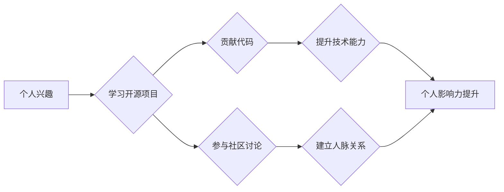

                 

## 利用开源项目构建个人影响力

> 关键词：开源项目、个人影响力、技术贡献、社区参与、职业发展、GitHub、软件开发、编程技能

## 1. 背景介绍

在当今科技日新月异的时代，个人影响力已成为技术领域不可或缺的资产。无论是寻求职业发展、拓展人脉，还是传播技术理念，拥有强大的个人影响力都将为你打开更多机遇。开源项目作为技术领域的重要组成部分，为个人提升影响力提供了绝佳的平台。

开源项目不仅可以帮助你学习和掌握先进的技术，更重要的是，参与开源项目可以让你与全球顶尖的开发者社区互动，积累宝贵的经验，并通过你的贡献获得认可和尊重。

## 2. 核心概念与联系

### 2.1 开源项目

开源项目是指源代码公开可供任何人免费使用、修改和再发布的软件项目。开源项目通常由开发者社区共同维护和发展，其核心价值在于：

* **透明度:** 源代码公开，任何人都可以查看和理解项目的设计和实现细节。
* **协作:** 开发者可以共同参与项目开发，分享经验和知识，加速项目进度。
* **创新:** 开放的代码库鼓励开发者进行创新和改进，推动技术进步。
* **社区:** 开源项目往往拥有活跃的开发者社区，提供技术支持、交流平台和学习资源。

### 2.2 个人影响力

个人影响力是指一个人在特定领域或群体中所拥有的影响力和号召力。它可以通过以下方式体现：

* **技术能力:** 掌握先进的技术技能，能够解决实际问题，并分享你的知识和经验。
* **项目贡献:** 参与开源项目，通过你的代码贡献和技术支持，为社区做出价值。
* **社区参与:** 在技术社区积极参与讨论，分享你的见解，并帮助他人解决问题。
* **内容创作:** 通过博客、文章、视频等形式，分享你的技术见解和经验，吸引关注和影响他人。

### 2.3 联系

开源项目和个人影响力之间存在着密切的联系。参与开源项目可以帮助你提升技术能力、积累项目经验、建立人脉关系，从而增强你的个人影响力。

**Mermaid 流程图**

## 3. 核心算法原理 & 具体操作步骤

### 3.1 算法原理概述

开源项目开发通常遵循敏捷开发方法论，其核心算法原理在于迭代开发、持续集成和持续交付。

* **迭代开发:** 将项目分解成多个小的迭代周期，每个周期都包含需求分析、设计、开发、测试和发布等阶段。
* **持续集成:** 开发者将代码频繁提交到代码库，并自动进行构建、测试和部署，确保代码质量和项目稳定性。
* **持续交付:** 将构建好的软件自动部署到测试环境和生产环境，实现快速交付和持续改进。

### 3.2 算法步骤详解

1. **项目选择:** 选择一个符合你兴趣和技能的开源项目参与。
2. **学习项目:** 仔细阅读项目文档、代码注释和贡献指南，了解项目的架构、功能和开发规范。
3. **贡献代码:** 提出 bug 报告、撰写文档、修复代码缺陷或开发新功能。
4. **代码审查:** 提交的代码需要经过社区开发者进行代码审查，确保代码质量和项目一致性。
5. **合并代码:** 通过代码审查后，你的代码将被合并到项目主分支，并发布到线上环境。

### 3.3 算法优缺点

**优点:**

* 提高技术能力: 通过参与开源项目，可以学习先进的技术和最佳实践。
* 积累项目经验: 参与开源项目可以让你积累实际的项目开发经验，包括需求分析、设计、开发、测试和部署等环节。
* 建立人脉关系: 与全球顶尖的开发者社区互动，建立人脉关系，拓展职业发展机会。
* 提升个人影响力: 通过你的代码贡献和技术支持，为开源社区做出价值，提升你的个人影响力。

**缺点:**

* 需要投入时间和精力: 参与开源项目需要投入一定的时间和精力，需要你具备持续学习和贡献的热情。
* 可能遇到技术挑战: 开源项目往往涉及复杂的技术问题，需要你具备一定的解决问题的能力。
* 需要与他人协作: 开源项目需要与他人协作，需要你具备良好的沟通和团队合作能力。

### 3.4 算法应用领域

开源项目应用领域广泛，涵盖了软件开发、数据科学、人工智能、网络安全等多个领域。

## 4. 数学模型和公式 & 详细讲解 & 举例说明

### 4.1 数学模型构建

开源项目开发可以抽象为一个复杂的系统，其核心数学模型可以基于图论和网络分析进行构建。

* **节点:** 代表项目中的各个组件，例如代码文件、测试用例、文档等。
* **边:** 代表组件之间的依赖关系，例如代码文件之间的调用关系、测试用例与代码文件之间的关联关系等。

通过构建这个图论模型，我们可以分析项目结构、依赖关系、代码复杂度等信息，从而更好地理解和管理开源项目。

### 4.2 公式推导过程

基于图论模型，我们可以推导一些公式来衡量开源项目的特性，例如：

* **代码复杂度:** 可以使用 Cyclomatic Complexity 等指标来衡量代码的复杂度，反映代码的逻辑分支数量和可测试性。
* **依赖关系强度:** 可以使用节点度、边权重等指标来衡量组件之间的依赖关系强度，反映项目模块化程度和维护难度。
* **社区活跃度:** 可以使用代码提交频率、issue数量、讨论活跃度等指标来衡量社区的活跃度，反映项目的发展势头和社区支持程度。

### 4.3 案例分析与讲解

例如，我们可以分析一个开源项目 GitHub 上的代码仓库，通过统计代码文件数量、代码行数、分支数量等信息，可以初步了解项目的规模和复杂度。

通过分析代码文件之间的依赖关系，我们可以发现哪些组件是核心组件，哪些组件是可独立维护的模块，从而更好地进行项目维护和升级。

## 5. 项目实践：代码实例和详细解释说明

### 5.1 开发环境搭建

参与开源项目需要搭建相应的开发环境，包括：

* **代码编辑器:** 选择一款适合你的代码编辑器，例如 VS Code、Sublime Text 等。
* **版本控制系统:** 使用 Git 作为版本控制系统，管理代码变更和协作开发。
* **开发工具:** 根据项目需求，安装相应的开发工具，例如编译器、调试器、测试框架等。

### 5.2 源代码详细实现

参与开源项目通常需要对项目代码进行修改和完善。具体实现步骤包括：

1. **克隆项目代码:** 使用 Git 命令克隆项目代码到本地仓库。
2. **创建分支:** 创建一个新的分支，用于开发你的修改内容。
3. **修改代码:** 根据项目需求，修改项目代码，并添加必要的注释和测试用例。
4. **提交代码:** 将修改后的代码提交到你的分支。
5. **发起合并请求:** 将你的分支合并到项目主分支，并提交合并请求给项目维护者。

### 5.3 代码解读与分析

开源项目代码通常包含详细的注释和文档，可以帮助你理解代码的逻辑和实现细节。

通过阅读代码注释、函数定义、类结构等信息，可以深入理解项目的架构设计和功能实现。

### 5.4 运行结果展示

修改后的代码需要进行测试和验证，确保代码功能正常，并不会引入新的 bug。

可以通过运行测试用例、模拟用户场景等方式，验证代码的正确性和稳定性。

## 6. 实际应用场景

开源项目在各个领域都有广泛的应用场景，例如：

* **软件开发:** 使用开源框架和库加速软件开发，降低开发成本和时间。
* **数据科学:** 使用开源数据分析工具和库进行数据挖掘、机器学习等工作。
* **人工智能:** 使用开源深度学习框架和模型进行人工智能算法开发和应用。
* **网络安全:** 使用开源安全工具和库进行网络安全检测、防御和响应。

### 6.4 未来应用展望

随着技术的不断发展，开源项目将扮演更加重要的角色，未来应用场景将更加广泛，例如：

* **云计算:** 使用开源云平台和工具构建和管理云应用。
* **物联网:** 使用开源物联网平台和协议构建物联网应用。
* **区块链:** 使用开源区块链框架和工具开发区块链应用。

## 7. 工具和资源推荐

### 7.1 学习资源推荐

* **GitHub:** https://github.com/
* **GitLab:** https://gitlab.com/
* **Stack Overflow:** https://stackoverflow.com/
* **开源中国:** https://www.oschina.net/

### 7.2 开发工具推荐

* **VS Code:** https://code.visualstudio.com/
* **Sublime Text:** https://www.sublimetext.com/
* **Docker:** https://www.docker.com/
* **Kubernetes:** https://kubernetes.io/

### 7.3 相关论文推荐

* **The Linux Kernel: An Open Source Success Story:** https://www.usenix.org/system/files/conference/hotos2009/hotos2009-paper-torvalds.pdf
* **Open Source Software Development: A Review of the Literature:** https://dl.acm.org/doi/10.1145/2937723.2937730

## 8. 总结：未来发展趋势与挑战

### 8.1 研究成果总结

开源项目已经成为技术领域的重要组成部分，为技术发展和创新做出了巨大贡献。

参与开源项目可以帮助个人提升技术能力、积累项目经验、建立人脉关系，并通过你的贡献获得认可和尊重。

### 8.2 未来发展趋势

开源项目将继续朝着更加开放、协作、创新和可持续的方向发展，未来趋势包括：

* **更广泛的应用场景:** 开源项目将应用于更多领域，例如云计算、物联网、区块链等。
* **更强大的社区支持:** 开源社区将更加活跃，提供更丰富的学习资源、技术支持和合作机会。
* **更先进的技术栈:** 开源项目将采用更先进的技术栈，例如人工智能、机器学习、区块链等。

### 8.3 面临的挑战

开源项目也面临一些挑战，例如：

* **代码质量:** 确保开源项目的代码质量和稳定性。
* **社区维护:** 吸引和留住活跃的社区开发者，持续维护和发展开源项目。
* **商业模式:** 探索开源项目的商业模式，确保项目的可持续发展。

### 8.4 研究展望

未来研究方向包括：

* **开源项目管理:** 研究更有效的开源项目管理方法，提高项目效率和质量。
* **开源社区建设:** 研究如何构建更加活跃和健康的开源社区，吸引更多开发者参与。
* **开源项目商业化:** 研究开源项目的商业化模式，探索开源项目的可持续发展路径。

## 9. 附录：常见问题与解答

### 9.1 如何选择合适的开源项目参与？

选择开源项目时，可以考虑以下因素：

* **兴趣:** 选择你感兴趣的领域和技术方向的项目。
* **技能:** 选择你具备一定技能和经验的项目。
* **社区活跃度:** 选择社区活跃度高的项目，可以获得更多帮助和支持。
* **项目规模:** 选择适合你时间和精力投入的项目规模。

### 9.2 如何进行代码贡献？

代码贡献流程包括：

1. **阅读项目文档:** 了解项目的架构、功能和开发规范。
2. **提出 bug 报告:** 如果发现项目中的 bug，可以提交 bug 报告。
3. **撰写文档:** 可以撰写项目文档，例如用户指南、API 文档等。
4. **修复代码缺陷:** 可以修复项目中的代码缺陷。
5. **开发新功能:** 可以开发新的项目功能。

### 9.3 如何与开源社区互动？

可以通过以下方式与开源社区互动：

* **参与讨论:** 在项目论坛、邮件列表等平台上参与讨论，分享你的见解和经验。
* **提出问题:** 如果遇到问题，可以向社区开发者提问，寻求帮助。
* **提供帮助:** 帮助其他开发者解决问题，分享你的知识和经验。

作者：禅与计算机程序设计艺术 / Zen and the Art of Computer Programming

<end_of_turn>

