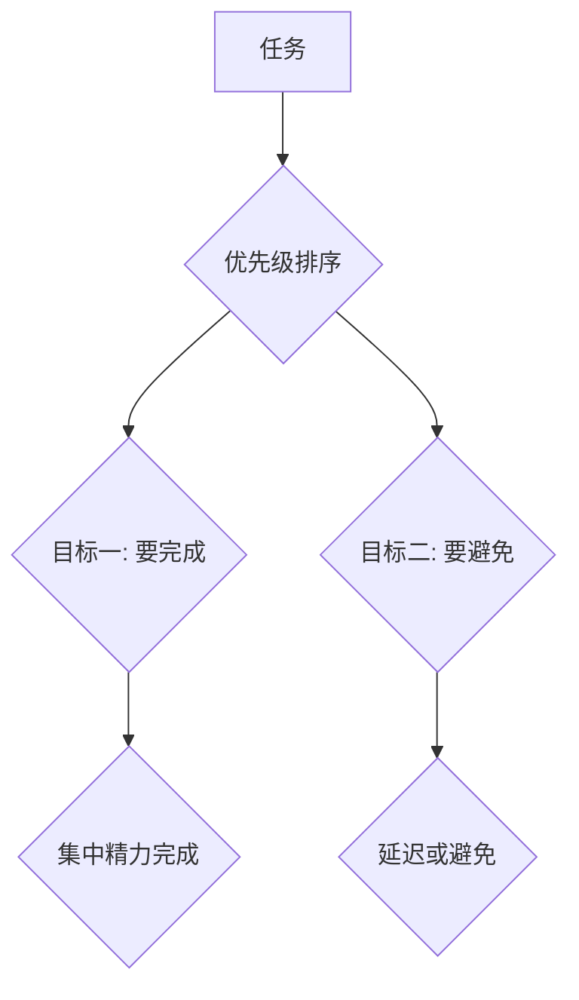

                 

## 双目标清单:管理者如何高效专注

> 关键词：双目标清单、高效专注、时间管理、优先级排序、目标设定、项目管理、生产力提升

## 1. 背景介绍

在当今快节奏的科技时代，信息爆炸和任务繁多已经成为IT管理者们面临的共同挑战。如何高效地管理时间，专注于最重要的工作，成为了提升个人和团队生产力的关键。传统的单目标清单方法，往往难以应对复杂的任务和多重优先级，容易导致精力分散，效率低下。

双目标清单是一种全新的时间管理方法，它通过设定两个相互关联的目标，帮助管理者明确优先级，集中精力，提高工作效率。这种方法源于管理学和心理学的研究，并得到了广泛的实践验证。

## 2. 核心概念与联系

双目标清单的核心概念是将任务分解成两个相互关联的目标：

* **目标一：**  **“要完成”的目标**，代表着当下最重要的任务，需要立即投入精力完成。
* **目标二：**  **“要避免”的目标**，代表着可能干扰或拖延“要完成”目标的任务，需要避免或延迟处理。

**Mermaid 流程图**



通过设定这两个目标，管理者可以：

* **明确优先级：**  将任务按照重要性和紧急程度进行排序，确保优先完成最重要的任务。
* **集中精力：**  避免被无关紧要的任务分散注意力，专注于完成“要完成”的目标。
* **提高效率：**  通过避免干扰和拖延，提高工作效率，更快地完成目标。

## 3. 核心算法原理 & 具体操作步骤

### 3.1  算法原理概述

双目标清单的算法原理基于以下几个关键点：

* **任务分解：** 将复杂的任务分解成更小的、可管理的子任务。
* **优先级排序：**  根据任务的重要性、紧急程度和对目标的贡献进行排序。
* **目标设定：**  设定两个相互关联的目标，明确“要完成”和“要避免”。
* **专注执行：**  集中精力完成“要完成”的目标，避免被“要避免”的目标干扰。

### 3.2  算法步骤详解

1. **任务清单：** 列出所有需要完成的任务，包括工作、学习、个人生活等方面。
2. **任务分解：** 将每个任务分解成更小的、可管理的子任务。
3. **优先级排序：**  根据任务的重要性、紧急程度和对目标的贡献进行排序。可以使用艾森豪威尔矩阵、莫斯科矩阵等方法进行排序。
4. **目标设定：**  选择最重要的任务作为“要完成”的目标，选择可能干扰或拖延“要完成”目标的任务作为“要避免”的目标。
5. **集中执行：**  集中精力完成“要完成”的目标，避免被“要避免”的目标干扰。可以使用番茄工作法、时间阻塞法等方法提高专注力。
6. **定期回顾：**  定期回顾双目标清单，调整目标和任务，确保始终保持高效专注。

### 3.3  算法优缺点

**优点：**

* **提高效率：**  通过明确优先级和集中精力，提高工作效率。
* **减少压力：**  通过避免干扰和拖延，减少工作压力。
* **增强专注力：**  通过定期回顾和调整，增强专注力。

**缺点：**

* **需要时间投入：**  制定双目标清单需要一定的思考和时间投入。
* **可能过于简单：**  对于复杂的任务，双目标清单可能过于简单，无法提供更细致的指导。
* **需要不断调整：**  随着任务和环境的变化，双目标清单需要不断调整和更新。

### 3.4  算法应用领域

双目标清单适用于各种场景，包括：

* **项目管理：**  帮助项目经理明确项目目标和优先级，集中精力完成关键任务。
* **个人时间管理：**  帮助个人高效安排时间，提高工作和生活效率。
* **团队协作：**  帮助团队成员明确各自职责和目标，提高团队协作效率。

## 4. 数学模型和公式 & 详细讲解 & 举例说明

双目标清单的算法原理可以抽象为一个数学模型，其中：

* **T** 代表任务集合
* **P** 代表优先级排序函数
* **C** 代表“要完成”目标
* **A** 代表“要避免”目标

**数学模型构建**

```
C = P(T)
A = T - C
```

其中，**P(T)** 函数将任务集合 **T** 按优先级排序，得到“要完成”目标 **C**。

**公式推导过程**

* **优先级排序函数 P(T)** 可以根据不同的排序标准进行定义，例如：

    * **重要性与紧急程度：**  使用艾森豪威尔矩阵或莫斯科矩阵进行排序。
    * **对目标的贡献：**  根据任务对最终目标的贡献程度进行排序。

* **“要避免”目标 A** 是通过从任务集合 **T** 中去除“要完成”目标 **C** 得到的。

**案例分析与讲解**

假设一个IT项目经理需要完成以下任务：

* **T1:**  撰写项目计划书
* **T2:**  组织团队会议
* **T3:**  处理紧急bug修复
* **T4:**  学习新技术

根据重要性和紧急程度，可以将任务进行排序：

* **P(T) = {T3, T1, T2, T4}**

因此，“要完成”目标 **C** 为 **T3** 和 **T1**， “要避免”目标 **A** 为 **T2** 和 **T4**。

## 5. 项目实践：代码实例和详细解释说明

### 5.1  开发环境搭建

双目标清单可以利用各种工具实现，例如：

* **笔记软件：**  Notion、Evernote、Obsidian 等
* **项目管理软件：**  Trello、Asana、Jira 等
* **编程语言：**  Python、JavaScript 等

本例使用Python语言和简单的文本文件实现双目标清单。

### 5.2  源代码详细实现

```python
# 双目标清单实现

def create_task_list():
    """创建任务列表"""
    tasks = []
    while True:
        task = input("请输入任务 (输入空行退出): ")
        if not task:
            break
        tasks.append(task)
    return tasks

def sort_tasks(tasks):
    """根据优先级排序任务"""
    # 使用艾森豪威尔矩阵进行排序
    # ...
    return sorted_tasks

def set_goals(tasks):
    """设定“要完成”和“要避免”目标"""
    # 选择最重要的任务作为“要完成”目标
    # 选择可能干扰或拖延“要完成”目标的任务作为“要避免”目标
    # ...
    return complete_goal, avoid_goal

def display_goals(complete_goal, avoid_goal):
    """显示双目标清单"""
    print("要完成的目标:")
    for task in complete_goal:
        print(f"- {task}")
    print("\n要避免的目标:")
    for task in avoid_goal:
        print(f"- {task}")

if __name__ == "__main__":
    tasks = create_task_list()
    sorted_tasks = sort_tasks(tasks)
    complete_goal, avoid_goal = set_goals(sorted_tasks)
    display_goals(complete_goal, avoid_goal)
```

### 5.3  代码解读与分析

* **create_task_list() 函数：**  获取用户输入的任务列表。
* **sort_tasks() 函数：**  根据优先级排序任务列表。
* **set_goals() 函数：**  根据排序结果，设定“要完成”和“要避免”目标。
* **display_goals() 函数：**  将双目标清单以清晰的格式展示给用户。

### 5.4  运行结果展示

```
请输入任务 (输入空行退出): 撰写项目计划书
请输入任务 (输入空行退出): 组织团队会议
请输入任务 (输入空行退出): 处理紧急bug修复
请输入任务 (输入空行退出): 学习新技术
请输入任务 (输入空行退出):

要完成的目标:
- 处理紧急bug修复
- 撰写项目计划书

要避免的目标:
- 组织团队会议
- 学习新技术
```

## 6. 实际应用场景

双目标清单在IT领域有着广泛的应用场景，例如：

* **软件开发：**  帮助开发人员明确每日工作目标，提高代码编写效率。
* **项目管理：**  帮助项目经理明确项目关键任务，协调团队资源，确保项目按时完成。
* **技术文档编写：**  帮助技术人员集中精力撰写高质量的技术文档，提高文档的准确性和完整性。
* **技术学习：**  帮助技术人员制定学习计划，明确学习目标，提高学习效率。

### 6.4  未来应用展望

随着人工智能和自动化技术的不断发展，双目标清单的应用场景将更加广泛，例如：

* **智能任务分配：**  利用人工智能算法，根据任务重要性和紧急程度，智能分配任务给不同人员。
* **自动提醒和提醒：**  利用智能提醒功能，提醒用户完成“要完成”目标，避免被“要避免”目标干扰。
* **个性化双目标清单：**  根据用户的个人习惯和工作风格，定制个性化的双目标清单。

## 7. 工具和资源推荐

### 7.1  学习资源推荐

* **书籍：**
    * 《Getting Things Done: The Art of Stress-Free Productivity》 by David Allen
    * 《Eat That Frog!: 21 Great Ways to Stop Procrastinating and Get More Done in Less Time》 by Brian Tracy
* **博客和网站：**
    * Zen Habits
    * Lifehacker
    * Getting Things Done

### 7.2  开发工具推荐

* **笔记软件：**
    * Notion
    * Evernote
    * Obsidian
* **项目管理软件：**
    * Trello
    * Asana
    * Jira

### 7.3  相关论文推荐

* **The Eisenhower Matrix: A Framework for Prioritizing Tasks**
* **The Pomodoro Technique: A Time Management Method for Improved Focus and Productivity**
* **The Impact of Task Prioritization on Productivity and Stress Levels**

## 8. 总结：未来发展趋势与挑战

### 8.1  研究成果总结

双目标清单是一种高效的管理时间和提高专注力的方法，它通过明确优先级和集中精力，帮助管理者和个人更高效地完成工作和学习任务。

### 8.2  未来发展趋势

随着人工智能和自动化技术的不断发展，双目标清单将更加智能化和个性化，能够更好地适应用户的需求。

### 8.3  面临的挑战

* **如何更准确地评估任务重要性和紧急程度**
* **如何更好地避免干扰和拖延**
* **如何将双目标清单与其他时间管理方法结合使用**

### 8.4  研究展望

未来研究将重点关注以下几个方面：

* **开发更智能的双目标清单系统**
* **研究不同用户群体对双目标清单的接受度和效果**
* **探索双目标清单在不同领域和场景的应用**

## 9. 附录：常见问题与解答

**Q1：如何设定“要完成”和“要避免”目标？**

**A1：**  “要完成”目标应该优先完成，对最终目标贡献最大，而“要避免”目标则可能干扰或拖延“要完成”目标。可以使用艾森豪威尔矩阵或莫斯科矩阵进行排序，根据任务的重要性、紧急程度和对目标的贡献进行选择。

**Q2：如何避免被“要避免”目标干扰？**

**A2：**  可以使用番茄工作法、时间阻塞法等方法提高专注力，将“要避免”目标设定为特定时间段处理，避免在“要完成”目标处理过程中被干扰。

**Q3：双目标清单适合所有场景吗？**

**A3：**  双目标清单是一种通用的时间管理方法，但对于一些非常复杂的任务，可能需要更细致的分解和规划。


作者：禅与计算机程序设计艺术 / Zen and the Art of Computer Programming 
<end_of_turn>

