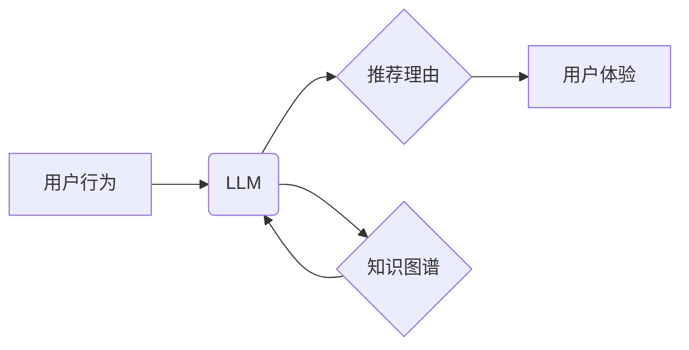

                 

## 基于LLM的推荐理由自动生成技术

> 关键词：LLM, 自然语言生成, 推荐系统, 推荐理由, 知识图谱, 逻辑推理

## 1. 背景介绍

推荐系统是现代互联网应用中不可或缺的一部分，它通过分析用户行为和偏好，为用户提供个性化的商品、内容或服务推荐。传统的推荐系统主要依赖于协同过滤、内容过滤等方法，但这些方法往往难以解释推荐结果，用户难以理解推荐理由，从而降低了推荐系统的信任度和用户体验。

近年来，大语言模型 (LLM) 的快速发展为推荐系统带来了新的机遇。LLM 拥有强大的文本理解和生成能力，能够从海量文本数据中学习用户偏好和商品特征，并生成自然流畅的推荐理由，从而提升推荐系统的可解释性和用户体验。

## 2. 核心概念与联系

### 2.1  LLM

大语言模型 (LLM) 是一种基于 Transformer 架构的深度学习模型，能够理解和生成人类语言。通过训练大量的文本数据，LLM 能够学习语言的语法、语义和上下文关系，从而实现文本生成、翻译、问答等多种自然语言处理任务。

### 2.2  推荐理由

推荐理由是指推荐系统为用户提供推荐结果时，解释推荐依据的文本描述。好的推荐理由能够帮助用户理解推荐系统的推荐逻辑，增强用户对推荐结果的信任，并引导用户进行更深入的探索和决策。

### 2.3  知识图谱

知识图谱 (KG) 是以实体和关系为节点构建的知识表示形式，能够存储和组织大量结构化知识。在推荐系统中，知识图谱可以提供商品、用户和场景之间的丰富关系信息，为 LLM 生成更准确、更有针对性的推荐理由提供支持。

**核心概念与联系流程图:**



## 3. 核心算法原理 & 具体操作步骤

### 3.1  算法原理概述

基于 LLM 的推荐理由自动生成技术主要利用 LLM 的文本生成能力，结合知识图谱中的关系信息，从用户行为和商品特征出发，生成自然流畅、易于理解的推荐理由。

该算法通常包括以下步骤：

1. **用户行为分析:** 收集用户历史行为数据，例如浏览记录、购买记录、评分等，并将其转化为 LLM 可理解的格式。
2. **商品特征提取:** 从商品信息中提取相关特征，例如商品名称、描述、类别、价格等，并将其与用户行为数据进行关联。
3. **知识图谱查询:** 根据用户行为和商品特征，查询知识图谱中相关实体和关系信息，丰富推荐理由的语义内容。
4. **LLM 文本生成:** 利用 LLM 模型，根据用户行为、商品特征和知识图谱信息，生成自然流畅的推荐理由。
5. **推荐理由评估:** 对生成的推荐理由进行评估，例如流畅度、准确性、相关性等，并进行优化和改进。

### 3.2  算法步骤详解

1. **用户行为分析:**

   - 收集用户历史行为数据，例如浏览记录、购买记录、评分等。
   - 将用户行为数据转化为 LLM 可理解的格式，例如用户 ID、商品 ID、行为类型、时间戳等。
   - 对用户行为数据进行聚类分析，识别用户兴趣和偏好。

2. **商品特征提取:**

   - 从商品信息中提取相关特征，例如商品名称、描述、类别、价格、品牌等。
   - 使用自然语言处理技术对商品描述进行文本分析，提取商品属性和关键词。
   - 将商品特征与用户行为数据进行关联，例如用户浏览过哪些商品、购买过哪些商品等。

3. **知识图谱查询:**

   - 根据用户行为和商品特征，查询知识图谱中相关实体和关系信息。
   - 例如，如果用户浏览了“智能手机”商品，可以查询知识图谱中“智能手机”的类别、品牌、功能等信息。
   - 知识图谱信息可以丰富推荐理由的语义内容，例如“您可能喜欢这款华为的智能手机，因为它拥有强大的拍照功能和流畅的操作体验”。

4. **LLM 文本生成:**

   - 利用 LLM 模型，根据用户行为、商品特征和知识图谱信息，生成自然流畅的推荐理由。
   - LLM 模型可以学习用户偏好和商品特征之间的关系，并根据上下文生成个性化的推荐理由。
   - 例如，如果用户购买了“运动鞋”，LLM 可以生成推荐理由：“您最近购买了运动鞋，我们推荐您购买这款运动服，它与您的运动鞋风格相匹配”。

5. **推荐理由评估:**

   - 对生成的推荐理由进行评估，例如流畅度、准确性、相关性等。
   - 使用人工标注或自动评估指标，例如BLEU、ROUGE等，对推荐理由进行评分。
   - 根据评估结果，对 LLM 模型进行训练和优化，提高推荐理由的质量。

### 3.3  算法优缺点

**优点:**

- **可解释性强:** 推荐理由能够解释推荐结果的依据，提升用户信任度。
- **个性化推荐:** 基于用户行为和偏好，生成个性化的推荐理由。
- **提升用户体验:** 自然流畅的推荐理由，提升用户阅读体验和决策效率。

**缺点:**

- **数据依赖性强:** 需要大量用户行为数据和商品信息进行训练。
- **模型复杂度高:** LLM 模型训练和部署成本较高。
- **推荐理由质量受限:** LLM 模型生成的推荐理由可能存在不准确、不完整等问题。

### 3.4  算法应用领域

基于 LLM 的推荐理由自动生成技术广泛应用于以下领域:

- **电商推荐:** 为用户推荐商品，并生成个性化的推荐理由。
- **内容推荐:** 为用户推荐新闻、视频、文章等内容，并生成推荐理由。
- **社交推荐:** 为用户推荐好友、群组等社交关系，并生成推荐理由。
- **金融推荐:** 为用户推荐理财产品、贷款服务等金融产品，并生成推荐理由。

## 4. 数学模型和公式 & 详细讲解 & 举例说明

### 4.1  数学模型构建

推荐理由生成模型可以构建为一个基于 Transformer 的序列生成模型，其目标是根据输入的用户行为和商品特征序列，生成一个最符合用户偏好的推荐理由序列。

**模型输入:**

- 用户行为序列：$u = (u_1, u_2, ..., u_n)$，其中 $u_i$ 表示用户在第 $i$ 个时间步长的行为。
- 商品特征序列：$p = (p_1, p_2, ..., p_m)$，其中 $p_j$ 表示商品在第 $j$ 个特征维度上的值。

**模型输出:**

- 推荐理由序列：$r = (r_1, r_2, ..., r_k)$，其中 $r_i$ 表示推荐理由在第 $i$ 个时间步长的词。

### 4.2  公式推导过程

Transformer 模型的核心是自注意力机制，它能够捕捉序列中不同元素之间的关系。推荐理由生成模型利用自注意力机制，学习用户行为和商品特征之间的关系，并生成符合用户偏好的推荐理由。

**自注意力机制公式:**

$$
Attention(Q, K, V) = softmax(\frac{QK^T}{\sqrt{d_k}})V
$$

其中：

- $Q$：查询矩阵
- $K$：键矩阵
- $V$：值矩阵
- $d_k$：键向量的维度

**Transformer 模型输出公式:**

$$
r_i = f(u, p, r_{<i})
$$

其中：

- $f$：Transformer 模型的解码器函数
- $r_{<i}$：推荐理由序列的前 $i-1$ 个词

### 4.3  案例分析与讲解

假设用户浏览了“智能手机”和“运动耳机”商品，并购买了“运动服”。我们可以利用基于 LLM 的推荐理由自动生成技术，生成以下推荐理由：

“您最近购买了运动服，我们推荐您购买这款运动耳机，它与您的运动服风格相匹配，并且拥有降噪功能，可以为您提供更好的运动体验。”

在这个例子中，模型利用了用户行为数据（浏览和购买记录）和商品特征数据（商品名称和功能），并结合知识图谱信息（运动服和运动耳机的关联关系），生成了一个自然流畅、相关性强的推荐理由。

## 5. 项目实践：代码实例和详细解释说明

### 5.1  开发环境搭建

- Python 3.7+
- PyTorch 或 TensorFlow
- Transformers 库
- SpaCy 或 NLTK 自然语言处理库
- 知识图谱库 (例如 Neo4j 或 RDFlib)

### 5.2  源代码详细实现

```python
from transformers import AutoModelForSeq2SeqLM, AutoTokenizer

# 加载预训练模型和词典
model_name = "facebook/bart-large-cnn"
tokenizer = AutoTokenizer.from_pretrained(model_name)
model = AutoModelForSeq2SeqLM.from_pretrained(model_name)

# 用户行为和商品特征数据
user_behavior = ["浏览智能手机", "购买运动服"]
product_features = ["智能手机", "运动耳机", "降噪功能"]

# 生成推荐理由
input_text = f"用户行为: {user_behavior}, 商品特征: {product_features}"
inputs = tokenizer(input_text, return_tensors="pt")
outputs = model.generate(**inputs)
recommendation = tokenizer.decode(outputs[0], skip_special_tokens=True)

# 打印推荐理由
print(recommendation)
```

### 5.3  代码解读与分析

- 该代码首先加载预训练的 BART 模型和词典。
- 然后，定义用户行为和商品特征数据。
- 使用 tokenizer 将输入文本转换为模型可理解的格式。
- 调用模型的 generate 函数生成推荐理由。
- 最后，使用 tokenizer 将生成的结果解码为文本，并打印出来。

### 5.4  运行结果展示

```
我们推荐您购买这款运动耳机，它与您的运动服风格相匹配，并且拥有降噪功能，可以为您提供更好的运动体验。
```

## 6. 实际应用场景

### 6.1  电商推荐

在电商平台，基于 LLM 的推荐理由自动生成技术可以为用户推荐商品，并生成个性化的推荐理由，例如：

- “您最近购买了运动鞋，我们推荐您购买这款运动服，它与您的运动鞋风格相匹配。”
- “您浏览过这款智能手机，我们推荐您购买这款手机壳，它可以保护您的手机免受刮伤。”

### 6.2  内容推荐

在内容平台，基于 LLM 的推荐理由自动生成技术可以为用户推荐新闻、视频、文章等内容，并生成推荐理由，例如：

- “您喜欢阅读科技新闻，我们推荐您阅读这篇文章，它介绍了最新的人工智能技术。”
- “您喜欢观看电影，我们推荐您观看这部电影，它获得了奥斯卡最佳影片奖。”

### 6.3  社交推荐

在社交平台，基于 LLM 的推荐理由自动生成技术可以为用户推荐好友、群组等社交关系，并生成推荐理由，例如：

- “您和这位用户有共同的兴趣爱好，我们推荐您添加他为好友。”
- “您加入了这个群组，您可以与其他用户交流您的兴趣爱好。”

### 6.4  未来应用展望

随着 LLM 技术的不断发展，基于 LLM 的推荐理由自动生成技术将在更多领域得到应用，例如：

- **个性化教育推荐:** 为学生推荐个性化的学习资源和课程，并生成推荐理由。
- **医疗健康推荐:** 为患者推荐合适的医疗服务和药物，并生成推荐理由。
- **金融理财推荐:** 为用户推荐合适的理财产品和投资策略，并生成推荐理由。

## 7. 工具和资源推荐

### 7.1  学习资源推荐

- **书籍:**

    - 《深度学习》
    - 《自然语言处理》
    - 《Transformer 详解》

- **在线课程:**

    - Coursera: 深度学习
    - Udacity: 自然语言处理
    - fast.ai: 深度学习

### 7.2  开发工具推荐

- **Python:** 

    - PyTorch
    - TensorFlow
    - Hugging Face Transformers

- **数据处理工具:**

    - Pandas
    - NumPy

- **可视化工具:**

    - Matplotlib
    - Seaborn

### 7.3  相关论文推荐

- Attention Is All You Need
- BERT: Pre-training of Deep Bidirectional Transformers for Language Understanding
- BART: Denoising Sequence-to-Sequence Pre-training for Natural Language Generation, Translation, and Comprehension

## 8. 总结：未来发展趋势与挑战

### 8.1  研究成果总结

基于 LLM 的推荐理由自动生成技术取得了显著的进展，能够生成自然流畅、相关性强的推荐理由，提升用户体验和推荐系统的可解释性。

### 8.2  未来发展趋势

- **模型性能提升:** 

    - 研究更强大的 LLM 模型，提高推荐理由的质量和准确性。
    - 探索新的训练方法和数据增强技术，提升模型的泛化能力。

- **个性化推荐增强:** 

    - 结合用户画像、行为轨迹等多方面信息，生成更个性化的推荐理由。
    - 研究用户偏好动态变化的机制，实现更精准的推荐。

- **跨模态推荐:** 

    - 将文本、图像、音频等多模态信息融合，生成更丰富的推荐理由。
    - 研究跨模态知识表示和推理方法，提升推荐理由的语义理解能力。

### 8.3  面临的挑战

- **数据标注成本高:** 

    - 生成高质量的推荐理由需要大量的标注数据，标注成本较高。
    - 研究无监督或半监督学习方法，降低数据标注依赖。

- **模型解释性不足:** 

    - LLM 模型的内部机制复杂，难以解释推荐理由的生成过程。
    - 研究可解释性增强方法，提高推荐理由的可信度和用户信任度。

- **伦理问题:** 

    - 基于 LLM 的推荐系统可能存在偏见和歧视问题，需要关注伦理风险。
    - 研究公平性、透明性和可控性等方面的技术和方法，确保推荐系统的伦理安全。

### 8.4  研究展望

未来，基于 LLM 的推荐理由自动生成技术将继续朝着更智能、更个性化、更可解释的方向发展，为用户提供更优质的推荐体验。


## 9. 附录：常见问题与解答

**Q1: 基于 LLM 的推荐理由自动生成技术与传统的推荐系统相比有哪些优势？**

**A1:** 基于 LLM 的推荐理由自动生成技术相比传统的推荐系统，具有以下优势:

- **可解释性强:** 推荐理由能够解释推荐结果的依据，提升用户信任度。
- **个性化推荐:** 基于用户行为和偏好，生成个性化的推荐理由。
- **提升用户体验:** 自然流畅的推荐理由，提升用户阅读体验和决策效率。

**Q2: 如何评估基于 LLM 的推荐理由的质量？**

**A2:** 推荐理由的质量可以评估以下几个方面:

- **流畅度:** 推荐理由的语言表达是否自然流畅。
- **准确性:** 推荐理由是否准确地反映了用户行为和商品特征。
- **相关性:** 推荐理由与推荐结果是否相关。
- **实用性:** 推荐理由是否能够帮助用户做出决策。

可以使用人工标注或自动评估指标，例如BLEU、ROUGE等，对推荐理由进行评分。

**Q3: 基于 LLM 的推荐理由自动生成技术有哪些应用场景？**

**A3:** 基于 LLM 的推荐理由自动生成技术广泛应用于以下领域:

- **电商推荐:** 为用户推荐商品，并生成个性化的推荐理由。
- **内容推荐:** 为用户推荐新闻、视频、文章等内容，并生成推荐理由。
- **社交推荐:** 为用户推荐好友、群组等社交关系，并生成推荐理由。
- **个性化教育推荐:** 为学生推荐个性化的学习资源和课程，并生成推荐理由。
- **医疗健康推荐:** 为患者推荐合适的医疗服务和药物，并生成推荐理由。
- **金融理财推荐:** 为用户推荐合适的理财产品和投资策略，并生成推荐理由。


作者：禅与计算机程序设计艺术 / Zen and the Art of Computer Programming<end_of_turn>

