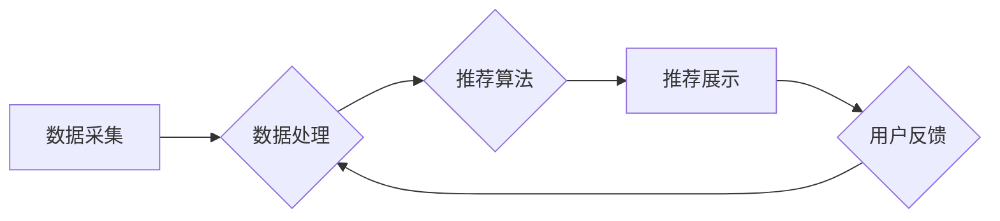

                 

## 大数据与AI 驱动的电商推荐系统：以准确率、多样性与用户体验为目标

> 关键词：电商推荐系统、大数据、人工智能、协同过滤、内容过滤、深度学习、准确率、多样性、用户体验

## 1. 背景介绍

在当今数字经济时代，电商平台已成为人们购物的首选方式。然而，面对海量商品和日益增长的用户需求，如何精准推荐用户感兴趣的产品成为了电商平台发展面临的重大挑战。传统的推荐系统主要依靠商品分类和用户浏览历史等静态信息，难以满足用户个性化需求和多样化体验。

大数据和人工智能技术的兴起为电商推荐系统带来了新的机遇。大数据技术能够收集和分析海量用户行为数据，人工智能技术则能够挖掘数据中的潜在模式和关系，从而实现更精准、更个性化的商品推荐。

## 2. 核心概念与联系

电商推荐系统旨在根据用户的兴趣、偏好、购买历史等信息，预测用户对商品的潜在兴趣，并推荐相关商品。

**2.1 核心概念**

* **用户:** 电商平台上的购物者，拥有独特的兴趣、偏好和购买行为。
* **商品:** 电商平台上销售的产品，拥有丰富的属性信息和用户评价。
* **推荐:** 将用户可能感兴趣的商品展示给用户，引导用户进行购买。

**2.2 系统架构**

电商推荐系统通常由以下几个模块组成：

* **数据采集模块:** 收集用户行为数据、商品信息数据等。
* **数据处理模块:** 对收集到的数据进行清洗、预处理、特征提取等操作。
* **推荐算法模块:** 基于用户和商品数据，预测用户对商品的兴趣，并生成推荐结果。
* **推荐展示模块:** 将推荐结果展示给用户，并根据用户反馈进行优化。

**2.3 Mermaid 流程图**



## 3. 核心算法原理 & 具体操作步骤

**3.1 算法原理概述**

电商推荐系统常用的算法主要有协同过滤和内容过滤两种。

* **协同过滤:** 基于用户的历史行为数据，预测用户对商品的兴趣。
* **内容过滤:** 基于商品的属性信息，推荐与用户兴趣相符的商品。

近年来，深度学习算法也逐渐应用于电商推荐系统，能够更好地挖掘用户和商品之间的复杂关系。

**3.2 算法步骤详解**

**3.2.1 协同过滤算法**

1. **用户-商品矩阵构建:** 将用户和商品信息存储在一个矩阵中，每个元素表示用户对商品的评分或购买行为。
2. **相似用户/商品查找:** 根据用户行为数据，计算用户之间的相似度或商品之间的相似度。
3. **推荐生成:** 为用户推荐与其相似用户喜欢的商品，或推荐与用户喜欢的商品相似的商品。

**3.2.2 内容过滤算法**

1. **商品特征提取:** 将商品的属性信息提取为特征向量。
2. **用户兴趣建模:** 根据用户的历史行为数据，构建用户的兴趣向量。
3. **推荐生成:** 计算商品特征向量与用户兴趣向量的相似度，推荐相似度高的商品。

**3.3 算法优缺点**

| 算法类型 | 优点 | 缺点 |
|---|---|---|
| 协同过滤 | 能够发现隐性关系，推荐个性化商品 | 数据稀疏性问题，冷启动问题 |
| 内容过滤 | 基于商品属性，推荐更精准 | 难以发现用户隐性需求 |
| 深度学习 | 能够挖掘复杂关系，提升推荐准确率 | 需要大量数据训练，模型复杂度高 |

**3.4 算法应用领域**

协同过滤和内容过滤算法广泛应用于电商推荐系统、电影推荐系统、音乐推荐系统等领域。深度学习算法则在个性化推荐、精准营销等领域展现出强大的潜力。

## 4. 数学模型和公式 & 详细讲解 & 举例说明

**4.1 数学模型构建**

协同过滤算法通常使用用户-商品评分矩阵进行建模。假设用户集合为U，商品集合为I，则用户-商品评分矩阵R为一个m×n的矩阵，其中m=|U|，n=|I|。每个元素R(u,i)表示用户u对商品i的评分。

**4.2 公式推导过程**

协同过滤算法的推荐过程通常基于相似度计算。常用的相似度度量方法包括余弦相似度和皮尔逊相关系数。

* **余弦相似度:**

$$
\text{cosine}(u,v) = \frac{\mathbf{u} \cdot \mathbf{v}}{\|\mathbf{u}\| \|\mathbf{v}\|}
$$

其中，u和v分别表示两个用户的评分向量，$\mathbf{u} \cdot \mathbf{v}$表示两个向量的点积，$\|\mathbf{u}\|$和$\|\mathbf{v}\|$分别表示两个向量的模长。

* **皮尔逊相关系数:**

$$
\text{pearson}(u,v) = \frac{\sum_{i=1}^{n}(R(u,i) - \bar{R}_u)(R(v,i) - \bar{R}_v)}{\sqrt{\sum_{i=1}^{n}(R(u,i) - \bar{R}_u)^2} \sqrt{\sum_{i=1}^{n}(R(v,i) - \bar{R}_v)^2}}
$$

其中，$\bar{R}_u$和$\bar{R}_v$分别表示用户u和用户v的平均评分。

**4.3 案例分析与讲解**

假设有两个用户A和B，他们的评分向量分别为：

* $\mathbf{A} = [4, 3, 5, 2]$
* $\mathbf{B} = [3, 5, 2, 4]$

我们可以使用余弦相似度计算A和B之间的相似度：

$$
\text{cosine}(A,B) = \frac{(4 \times 3) + (3 \times 5) + (5 \times 2) + (2 \times 4)}{\sqrt{4^2 + 3^2 + 5^2 + 2^2} \sqrt{3^2 + 5^2 + 2^2 + 4^2}} = 0.8
$$

结果表明，A和B之间的相似度为0.8，说明他们具有相似的口味。

## 5. 项目实践：代码实例和详细解释说明

**5.1 开发环境搭建**

推荐系统开发环境通常需要以下软件：

* Python 3.x
* Jupyter Notebook
* Scikit-learn
* TensorFlow/PyTorch

**5.2 源代码详细实现**

以下是一个简单的协同过滤推荐系统的代码示例：

```python
import numpy as np
from sklearn.metrics.pairwise import cosine_similarity

# 用户-商品评分矩阵
ratings = np.array([
    [5, 4, 3, 2],
    [4, 5, 2, 3],
    [3, 2, 5, 4],
    [2, 3, 4, 5]
])

# 计算用户之间的余弦相似度
user_similarity = cosine_similarity(ratings)

# 获取用户1的相似用户
similar_users = np.argsort(user_similarity[0])[::-1][1:]

# 推荐给用户1的商品
recommended_items = np.mean(ratings[similar_users], axis=0)
```

**5.3 代码解读与分析**

* 首先，我们定义了一个用户-商品评分矩阵。
* 然后，我们使用Scikit-learn库中的`cosine_similarity`函数计算用户之间的余弦相似度。
* 接着，我们获取用户1的相似用户，并计算他们对商品的平均评分。
* 最后，我们推荐给用户1这些平均评分最高的商品。

**5.4 运行结果展示**

运行上述代码后，我们可以得到用户1的推荐商品列表。

## 6. 实际应用场景

**6.1 电商平台推荐**

电商平台利用推荐系统推荐商品给用户，提高用户购物体验和转化率。

**6.2 内容平台推荐**

内容平台利用推荐系统推荐文章、视频、音乐等内容给用户，提高用户粘性和活跃度。

**6.3 社交平台推荐**

社交平台利用推荐系统推荐朋友、群组、话题等内容给用户，提高用户社交互动和参与度。

**6.4 未来应用展望**

随着大数据和人工智能技术的不断发展，电商推荐系统将更加智能化、个性化和精准化。未来，推荐系统将能够：

* 更深入地理解用户的需求和偏好。
* 提供更个性化的商品推荐和服务。
* 预测用户的购买行为，进行精准营销。
* 与其他系统协同工作，提供更全面的用户体验。

## 7. 工具和资源推荐

**7.1 学习资源推荐**

* **书籍:**
    * 《推荐系统》
    * 《深度学习》
* **在线课程:**
    * Coursera: Recommender Systems
    * Udacity: Deep Learning Nanodegree

**7.2 开发工具推荐**

* **Python:** 
    * Scikit-learn
    * TensorFlow
    * PyTorch
* **Spark:** 
    * Apache Spark MLlib

**7.3 相关论文推荐**

* **协同过滤:**
    * Collaborative Filtering: A User-Based Approach
* **内容过滤:**
    * Content-Based Recommendation Systems
* **深度学习:**
    * Deep Learning for Recommender Systems


## 8. 总结：未来发展趋势与挑战

**8.1 研究成果总结**

大数据和人工智能技术的应用极大地推动了电商推荐系统的发展，使得推荐系统更加智能化、个性化和精准化。

**8.2 未来发展趋势**

未来，电商推荐系统将朝着以下几个方向发展：

* **更深入的用户理解:** 利用自然语言处理、情感分析等技术，更深入地理解用户的需求和偏好。
* **更精准的推荐:** 利用深度学习、强化学习等技术，提高推荐的准确率和个性化程度。
* **更丰富的交互体验:** 利用虚拟现实、增强现实等技术，提供更丰富的用户交互体验。

**8.3 面临的挑战**

电商推荐系统的发展也面临着一些挑战：

* **数据稀疏性:** 用户行为数据往往是稀疏的，难以训练有效的推荐模型。
* **冷启动问题:** 新用户和新商品难以获得推荐，需要新的算法和策略解决。
* **公平性问题:** 推荐算法可能存在偏见，导致不公平的推荐结果。

**8.4 研究展望**

未来，我们需要继续研究新的算法和技术，解决电商推荐系统面临的挑战，并探索更智能、更个性化、更公平的推荐体验。

## 9. 附录：常见问题与解答

**9.1 如何解决数据稀疏性问题？**

* 使用矩阵分解技术，将用户-商品评分矩阵分解成低维向量，降低数据维度。
* 使用协同过滤算法的改进版本，例如基于因子分解的协同过滤算法。
* 使用内容过滤算法，结合商品属性信息进行推荐。

**9.2 如何解决冷启动问题？**

* 利用用户画像、商品描述等信息，对新用户和新商品进行初始化推荐。
* 使用基于内容过滤的推荐算法，对新商品进行推荐。
* 利用用户的社交关系，推荐与用户相似用户的商品。

**9.3 如何保证推荐结果的公平性？**

* 使用公平性度量指标，评估推荐算法的公平性。
* 使用对抗训练等技术，减少推荐算法的偏见。
* 构建透明可解释的推荐系统，让用户了解推荐结果背后的逻辑。


作者：禅与计算机程序设计艺术 / Zen and the Art of Computer Programming 
<end_of_turn>

