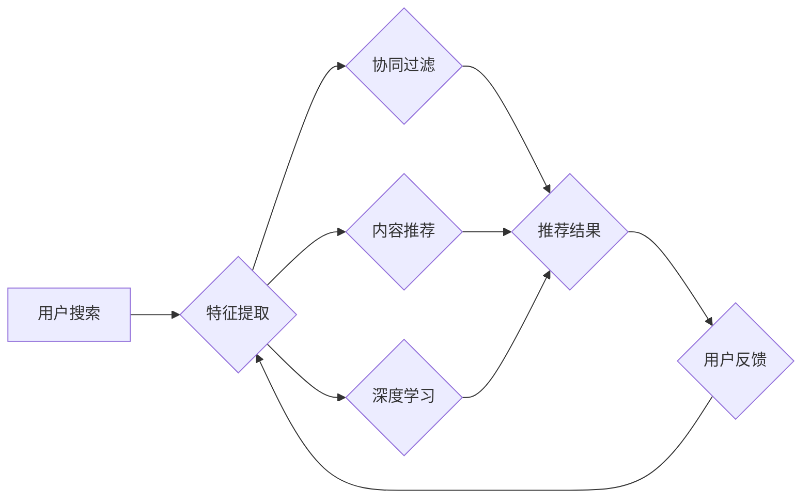

                 

## 大数据时代的电商搜索推荐：AI 模型融合技术是核心

> 关键词：电商搜索推荐、AI模型融合、深度学习、协同过滤、内容推荐、个性化推荐、大数据

## 1. 背景介绍

随着电商行业的蓬勃发展，用户对商品的搜索和推荐需求日益增长。传统的基于关键词匹配的搜索方式已难以满足用户个性化需求，而搜索推荐系统作为连接用户需求与商品信息的桥梁，显得尤为重要。大数据时代，海量用户行为数据、商品信息和市场趋势为电商搜索推荐提供了丰富的素材，同时也带来了新的挑战。如何有效挖掘数据中的价值，构建精准、个性化的搜索推荐系统，成为电商企业亟需解决的关键问题。

AI 模型融合技术作为一种新兴的搜索推荐技术，通过结合多种机器学习算法，例如深度学习、协同过滤、内容推荐等，构建多层次、多维度的推荐模型，能够更精准地理解用户需求，提供更个性化的商品推荐，从而提升用户体验和转化率。

## 2. 核心概念与联系

### 2.1  电商搜索推荐系统

电商搜索推荐系统是指在电商平台上，根据用户搜索行为、浏览历史、购买记录等数据，为用户推荐相关商品的系统。其核心目标是提高用户搜索结果的准确性和相关性，引导用户找到所需商品，并提升用户购物体验和转化率。

### 2.2  AI 模型融合

AI 模型融合是指将多种机器学习算法组合在一起，构建更强大的推荐模型。通过融合不同算法的优势，可以弥补单一算法的不足，提高推荐模型的准确性和鲁棒性。

**Mermaid 流程图**



### 2.3  推荐算法

常见的电商搜索推荐算法包括：

* **协同过滤:** 基于用户与用户之间的相似性或商品与商品之间的相似性进行推荐。
* **内容推荐:** 基于商品的属性、描述等内容信息进行推荐。
* **深度学习:** 利用深度神经网络学习用户行为和商品特征之间的复杂关系，进行推荐。

## 3. 核心算法原理 & 具体操作步骤

### 3.1  算法原理概述

协同过滤算法是一种基于用户行为相似性的推荐算法。其核心思想是：如果用户A和用户B在过去的行为相似，那么用户A喜欢的东西，用户B也可能喜欢。

### 3.2  算法步骤详解

1. **数据预处理:** 收集用户行为数据，例如用户对商品的评分、购买记录、浏览历史等，并进行清洗、去重、格式化等处理。
2. **相似度计算:** 计算用户之间的相似度或商品之间的相似度。常用的相似度度量方法包括余弦相似度、皮尔逊相关系数等。
3. **推荐生成:** 根据用户与其他用户的相似度，推荐用户可能感兴趣的商品。

### 3.3  算法优缺点

**优点:**

* 能够发现用户隐性需求，推荐用户可能没有想到的商品。
* 算法简单易实现。

**缺点:**

* 数据稀疏性问题: 当用户行为数据稀疏时，算法难以准确计算相似度。
* 冷启动问题: 新用户或新商品难以获得推荐。

### 3.4  算法应用领域

协同过滤算法广泛应用于电商推荐、电影推荐、音乐推荐等领域。

## 4. 数学模型和公式 & 详细讲解 & 举例说明

### 4.1  数学模型构建

协同过滤算法的数学模型通常基于矩阵分解。假设用户集合为U，商品集合为I，用户对商品的评分矩阵为R，其中R(u,i)表示用户u对商品i的评分。

目标是将评分矩阵R分解成两个低维矩阵，分别表示用户特征矩阵和商品特征矩阵。

### 4.2  公式推导过程

常用的协同过滤算法包括基于用户的协同过滤和基于物品的协同过滤。

**基于用户的协同过滤:**

假设用户特征矩阵为P，商品特征矩阵为Q。则用户u对商品i的评分可以表示为：

$$R(u,i) \approx P(u) \cdot Q(i)$$

其中，P(u)表示用户u的特征向量，Q(i)表示商品i的特征向量。

**基于物品的协同过滤:**

假设用户特征矩阵为P，商品特征矩阵为Q。则用户u对商品i的评分可以表示为：

$$R(u,i) \approx P(u) \cdot Q(i)$$

其中，P(u)表示用户u的特征向量，Q(i)表示商品i的特征向量。

### 4.3  案例分析与讲解

假设有一个评分矩阵R，其中R(1,1)=5，R(1,2)=3，R(2,1)=4，R(2,2)=2。

可以使用协同过滤算法将这个评分矩阵分解成两个低维矩阵，例如：

* 用户特征矩阵P:

```
[0.8, 0.6]
[0.2, 0.4]
```

* 商品特征矩阵Q:

```
[0.9, 0.1]
[0.1, 0.9]
```

通过计算P(1) * Q(1) 和 P(2) * Q(2)，可以得到用户1对商品1的评分为4.32，用户2对商品1的评分为0.88，与原始评分矩阵中的值相近。

## 5. 项目实践：代码实例和详细解释说明

### 5.1  开发环境搭建

* Python 3.x
* scikit-learn
* pandas
* numpy

### 5.2  源代码详细实现

```python
import pandas as pd
from sklearn.metrics.pairwise import cosine_similarity

# 加载评分数据
ratings = pd.read_csv('ratings.csv')

# 计算用户之间的余弦相似度
user_similarity = cosine_similarity(ratings)

# 获取用户1的相似用户
similar_users = user_similarity[0].argsort()[:-6:-1]

# 推荐给用户1的商品
recommended_items = ratings.iloc[similar_users, :].mean().sort_values(ascending=False)

# 打印推荐结果
print(recommended_items)
```

### 5.3  代码解读与分析

* 代码首先加载评分数据，并使用scikit-learn库中的cosine_similarity函数计算用户之间的余弦相似度。
* 然后，根据用户1的相似度排序，获取其相似用户。
* 最后，根据相似用户的评分，计算出用户1可能感兴趣的商品，并打印推荐结果。

### 5.4  运行结果展示

运行代码后，将输出用户1可能感兴趣的商品列表，以及每个商品的评分。

## 6. 实际应用场景

### 6.1  电商平台商品推荐

电商平台可以利用AI模型融合技术，根据用户的浏览历史、购买记录、搜索行为等数据，推荐用户可能感兴趣的商品。

### 6.2  个性化广告推荐

广告平台可以利用AI模型融合技术，根据用户的兴趣爱好、行为特征等数据，推荐个性化的广告。

### 6.3  内容推荐系统

新闻网站、视频网站等平台可以利用AI模型融合技术，根据用户的阅读习惯、观看历史等数据，推荐用户可能感兴趣的内容。

### 6.4  未来应用展望

随着大数据和人工智能技术的不断发展，AI模型融合技术在电商搜索推荐领域的应用将更加广泛和深入。未来，AI模型融合技术将能够：

* 更精准地理解用户需求，提供更个性化的商品推荐。
* 更好地应对数据稀疏性和冷启动问题。
* 与其他技术，例如自然语言处理、计算机视觉等相结合，构建更智能的推荐系统。

## 7. 工具和资源推荐

### 7.1  学习资源推荐

* **书籍:**
    * 《推荐系统实践》
    * 《深度学习》
* **在线课程:**
    * Coursera: Recommender Systems
    * Udacity: Deep Learning Nanodegree

### 7.2  开发工具推荐

* **Python:** 
    * scikit-learn
    * pandas
    * numpy
* **Spark:** 
    * Apache Spark MLlib

### 7.3  相关论文推荐

* **Collaborative Filtering for Implicit Feedback Datasets**
* **Deep Learning for Recommender Systems**

## 8. 总结：未来发展趋势与挑战

### 8.1  研究成果总结

AI模型融合技术在电商搜索推荐领域取得了显著成果，能够有效提升推荐精准度和用户体验。

### 8.2  未来发展趋势

未来，AI模型融合技术将朝着以下方向发展：

* **更深层次的模型融合:** 将多种深度学习算法融合在一起，构建更强大的推荐模型。
* **更个性化的推荐:** 利用用户行为数据、兴趣爱好等多方面信息，提供更个性化的商品推荐。
* **更智能的推荐:** 与其他技术，例如自然语言处理、计算机视觉等相结合，构建更智能的推荐系统。

### 8.3  面临的挑战

AI模型融合技术也面临一些挑战：

* **数据质量问题:** 

推荐模型的准确性依赖于数据质量，数据不完整、不准确会影响推荐效果。
* **模型解释性问题:** 

深度学习模型的内部机制复杂，难以解释推荐结果，这可能会导致用户对推荐结果的信任度降低。
* **隐私保护问题:** 

推荐系统需要收集和使用用户的个人信息，如何保护用户隐私是一个重要的挑战。

### 8.4  研究展望

未来，需要进一步研究如何解决数据质量问题、提高模型解释性、保护用户隐私等挑战，推动AI模型融合技术在电商搜索推荐领域的更广泛应用。

## 9. 附录：常见问题与解答

### 9.1  Q1: 协同过滤算法的缺点是什么？

**A1:** 协同过滤算法的主要缺点是：

* 数据稀疏性问题: 当用户行为数据稀疏时，算法难以准确计算相似度。
* 冷启动问题: 新用户或新商品难以获得推荐。

### 9.2  Q2: 如何解决协同过滤算法的冷启动问题？

**A2:** 

解决协同过滤算法的冷启动问题的方法包括：

* 利用用户属性信息进行推荐。
* 利用商品属性信息进行推荐。
* 使用混合推荐算法，结合协同过滤算法和其他推荐算法。

### 9.3  Q3: AI模型融合技术有哪些应用场景？

**A3:** AI模型融合技术广泛应用于以下场景：

* 电商平台商品推荐
* 个性化广告推荐
* 内容推荐系统
* 音乐推荐
* 电影推荐

作者：禅与计算机程序设计艺术 / Zen and the Art of Computer Programming


<end_of_turn>

