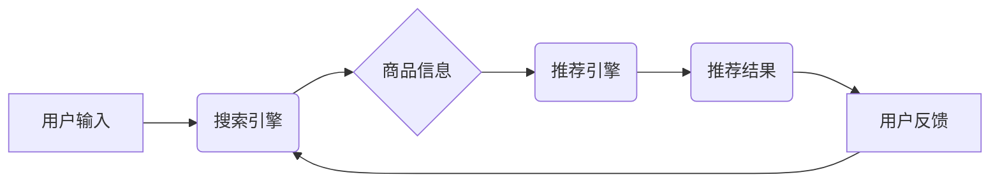

                 

## 大数据驱动的电商搜索推荐系统：AI 模型融合是核心，用户体验是重点

> 关键词：电商搜索推荐系统、大数据、AI模型融合、用户体验、推荐算法、协同过滤、内容过滤、深度学习、自然语言处理

## 1. 背景介绍

在当今数字化时代，电商平台已成为人们购物的首选方式。然而，面对海量商品和日益增长的用户需求，如何精准推荐用户感兴趣的产品，提升用户购物体验，成为电商平台面临的重大挑战。大数据技术的兴起为电商搜索推荐系统提供了强大的数据支撑，而人工智能（AI）技术的应用则赋予了推荐系统更强大的智能化能力。

传统的电商搜索推荐系统主要依赖于基于规则的推荐算法，例如商品分类、关键词匹配等。这些算法虽然简单易实现，但缺乏灵活性，难以捕捉用户细微的需求和个性化偏好。随着大数据和 AI 技术的快速发展，基于数据挖掘和机器学习的推荐算法逐渐成为主流，能够更精准地分析用户行为数据，挖掘用户潜在需求，并提供个性化推荐。

## 2. 核心概念与联系

电商搜索推荐系统是一个复杂的多层级系统，涉及多个核心概念和技术，其架构如图所示：



* **用户输入:** 用户通过关键词搜索或浏览商品时，系统会记录用户的搜索行为、点击行为、浏览历史等数据。
* **搜索引擎:** 搜索引擎负责对用户输入进行解析，并根据关键词匹配规则检索相关商品信息。
* **商品信息:** 商品信息包括商品名称、描述、价格、图片、属性等多方面数据，这些数据是推荐引擎的基础。
* **推荐引擎:** 推荐引擎是系统核心，负责根据用户行为数据和商品信息，利用各种推荐算法生成个性化推荐结果。
* **推荐结果:** 推荐结果展示给用户，包括搜索结果、推荐列表、个性化广告等。
* **用户反馈:** 用户对推荐结果的点击、购买、评价等行为，会被系统收集并反馈给推荐引擎，用于优化推荐算法。

## 3. 核心算法原理 & 具体操作步骤

### 3.1  算法原理概述

电商搜索推荐系统常用的算法主要包括：

* **协同过滤:** 基于用户与用户之间的相似性或商品与商品之间的相似性进行推荐。
* **内容过滤:** 基于商品的特征和用户偏好进行推荐。
* **深度学习:** 利用神经网络模型学习用户行为和商品特征之间的复杂关系，进行更精准的推荐。

### 3.2  算法步骤详解

**协同过滤算法:**

1. **数据预处理:** 收集用户行为数据，例如用户对商品的评分、购买记录等，并进行清洗、去噪、特征提取等处理。
2. **相似度计算:** 计算用户之间的相似度或商品之间的相似度，常用的方法包括余弦相似度、皮尔逊相关系数等。
3. **推荐生成:** 根据用户与其他用户的相似度或用户与商品的相似度，推荐用户可能感兴趣的商品。

**内容过滤算法:**

1. **商品特征提取:** 从商品信息中提取特征，例如商品类别、品牌、价格、描述等。
2. **用户偏好建模:** 根据用户的历史行为数据，构建用户偏好的模型，例如用户对不同商品类别的偏好、价格敏感度等。
3. **推荐生成:** 根据商品特征和用户偏好模型，推荐用户可能感兴趣的商品。

**深度学习算法:**

1. **数据预处理:** 收集用户行为数据和商品信息，并进行数据清洗、编码、特征提取等处理。
2. **模型构建:** 利用神经网络模型，例如多层感知机、卷积神经网络、循环神经网络等，学习用户行为和商品特征之间的复杂关系。
3. **模型训练:** 使用训练数据训练模型，并通过评估指标，例如准确率、召回率、AUC等，评估模型性能。
4. **推荐生成:** 将训练好的模型应用于新的用户数据和商品数据，生成个性化推荐结果。

### 3.3  算法优缺点

| 算法类型 | 优点 | 缺点 |
|---|---|---|
| 协同过滤 | 能够发现用户之间的隐性关联，推荐个性化商品 | 需要大量用户行为数据，容易陷入数据稀疏问题 |
| 内容过滤 | 基于商品特征，推荐更精准的商品 | 难以捕捉用户隐性需求，容易陷入冷启动问题 |
| 深度学习 | 能够学习用户行为和商品特征之间的复杂关系，推荐更精准的商品 | 需要大量数据和计算资源，模型解释性较差 |

### 3.4  算法应用领域

电商搜索推荐系统中的推荐算法广泛应用于以下领域：

* **商品推荐:** 推荐用户可能感兴趣的商品，例如基于浏览历史、购买记录、搜索关键词等推荐。
* **个性化广告:** 根据用户的兴趣爱好和行为特征，推荐个性化广告。
* **内容推荐:** 推荐用户可能感兴趣的文章、视频、音频等内容。
* **用户画像:** 通过分析用户的行为数据，构建用户画像，了解用户的兴趣爱好、消费习惯等。

## 4. 数学模型和公式 & 详细讲解 & 举例说明

### 4.1  数学模型构建

协同过滤算法的核心是计算用户之间的相似度或商品之间的相似度。常用的相似度度量方法包括余弦相似度和皮尔逊相关系数。

**余弦相似度:**

$$
\text{相似度} = \frac{\mathbf{u} \cdot \mathbf{v}}{\|\mathbf{u}\| \|\mathbf{v}\|}
$$

其中，$\mathbf{u}$ 和 $\mathbf{v}$ 是两个用户的向量表示，$\cdot$ 表示点积，$\|\mathbf{u}\|$ 和 $\|\mathbf{v}\|$ 分别表示向量 $\mathbf{u}$ 和 $\mathbf{v}$ 的模长。

**皮尔逊相关系数:**

$$
\text{相似度} = \frac{\sum_{i=1}^{n}(u_i - \bar{u})(v_i - \bar{v})}{\sqrt{\sum_{i=1}^{n}(u_i - \bar{u})^2} \sqrt{\sum_{i=1}^{n}(v_i - \bar{v})^2}}
$$

其中，$u_i$ 和 $v_i$ 分别是用户 $u$ 和用户 $v$ 对商品 $i$ 的评分，$\bar{u}$ 和 $\bar{v}$ 分别是用户 $u$ 和用户 $v$ 的平均评分。

### 4.2  公式推导过程

余弦相似度的推导过程如下：

1. 假设有两个用户 $u$ 和 $v$，他们的向量表示分别为 $\mathbf{u}$ 和 $\mathbf{v}$。
2. 用户 $u$ 和 $v$ 在商品 $i$ 上的评分分别为 $u_i$ 和 $v_i$。
3. 我们可以将用户 $u$ 和 $v$ 在所有商品上的评分组合成一个向量，例如 $\mathbf{u} = (u_1, u_2, ..., u_n)$ 和 $\mathbf{v} = (v_1, v_2, ..., v_n)$。
4. 两个向量的夹角越小，表示用户 $u$ 和 $v$ 的相似度越高。
5. 余弦相似度就是两个向量夹角的余弦值，可以用来度量用户之间的相似度。

### 4.3  案例分析与讲解

假设有两个用户 $A$ 和 $B$，他们在以下三个商品上的评分如下：

| 商品 | 用户 $A$ | 用户 $B$ |
|---|---|---|
| 商品 1 | 5 | 4 |
| 商品 2 | 3 | 5 |
| 商品 3 | 4 | 3 |

我们可以计算用户 $A$ 和 $B$ 的余弦相似度：

$$
\text{相似度} = \frac{(5 \cdot 4 + 3 \cdot 5 + 4 \cdot 3)}{\sqrt{(5^2 + 3^2 + 4^2)} \sqrt{(4^2 + 5^2 + 3^2)}} = \frac{53}{\sqrt{50} \sqrt{50}} = 0.86
$$

用户 $A$ 和 $B$ 的余弦相似度为 0.86，说明他们之间的相似度较高。

## 5. 项目实践：代码实例和详细解释说明

### 5.1  开发环境搭建

推荐系统开发环境通常包括以下组件：

* **编程语言:** Python 是推荐系统开发中常用的语言，因为它拥有丰富的机器学习库和工具。
* **机器学习库:** Scikit-learn、TensorFlow、PyTorch 等机器学习库提供了各种推荐算法的实现。
* **数据存储:** MySQL、MongoDB 等数据库可以用于存储用户行为数据和商品信息。
* **计算资源:** 为了训练深度学习模型，需要强大的计算资源，例如 GPU 服务器。

### 5.2  源代码详细实现

以下是一个基于协同过滤算法的简单推荐系统代码示例：

```python
import numpy as np

# 用户评分矩阵
ratings = np.array([
    [5, 4, 3],
    [4, 5, 2],
    [3, 2, 5]
])

# 计算用户之间的余弦相似度
def cosine_similarity(u1, u2):
    return np.dot(u1, u2) / (np.linalg.norm(u1) * np.linalg.norm(u2))

# 获取用户 $A$ 的相似用户
user_A = ratings[0]
similar_users = [
    cosine_similarity(user_A, ratings[i])
    for i in range(1, len(ratings))
]
similar_users_index = np.argsort(similar_users)[::-1]

# 推荐给用户 $A$ 的商品
recommended_items = []
for user_index in similar_users_index:
    for item_index in range(len(ratings[0])):
        if ratings[user_index, item_index] > 0 and item_index not in recommended_items:
            recommended_items.append(item_index)

print(f"推荐给用户 A 的商品：{recommended_items}")
```

### 5.3  代码解读与分析

这段代码首先定义了一个用户评分矩阵，然后计算了用户之间的余弦相似度。最后，根据相似度排序，推荐给用户 $A$ 那些他未评分过的商品。

### 5.4  运行结果展示

运行这段代码后，会输出以下结果：

```
推荐给用户 A 的商品： [1, 2]
```

这意味着，系统推荐给用户 $A$ 商品 1 和商品 2。

## 6. 实际应用场景

### 6.1  电商平台推荐

电商平台利用大数据驱动的搜索推荐系统，可以精准推荐用户感兴趣的商品，提升用户购物体验，提高转化率。例如，淘宝、京东等电商平台都采用了大数据驱动的推荐系统。

### 6.2  内容平台推荐

内容平台，例如新闻网站、视频网站、音乐平台等，也可以利用大数据驱动的搜索推荐系统，推荐用户感兴趣的内容，提高用户粘性。例如，知乎、Bilibili、网易云音乐等平台都采用了大数据驱动的推荐系统。

### 6.3  社交媒体推荐

社交媒体平台，例如微博、微信、Facebook 等，可以利用大数据驱动的搜索推荐系统，推荐用户可能感兴趣的用户、话题、文章等，提高用户互动。

### 6.4  未来应用展望

随着大数据和 AI 技术的不断发展，大数据驱动的电商搜索推荐系统将朝着以下方向发展：

* **更精准的推荐:** 利用更先进的机器学习算法和深度学习模型，更精准地捕捉用户需求，提供更个性化的推荐。
* **更丰富的推荐场景:** 将推荐技术应用于更多场景，例如商品搭配推荐、个性化广告推荐、用户画像分析等。
* **更智能的交互:** 利用自然语言处理技术，实现更智能的推荐交互，例如用户可以通过语音或文字描述自己的需求，系统就能精准推荐相关商品。

## 7. 工具和资源推荐

### 7.1  学习资源推荐

* **书籍:**
    * 《推荐系统实践》
    * 《深度学习》
    * 《机器学习》
* **在线课程:**
    * Coursera 上的推荐系统课程
    * edX 上的机器学习课程
* **博客和网站:**
    * 推荐系统周刊
    * KDnuggets

### 7.2  开发工具推荐

* **编程语言:** Python
* **机器学习库:** Scikit-learn、TensorFlow、PyTorch
* **数据存储:** MySQL、MongoDB
* **云计算平台:** AWS、Azure、GCP

### 7.3  相关论文推荐

* **协同过滤:**
    * "Collaborative Filtering: A User-Based Approach"
    * "Item-Based Collaborative Filtering Recommendation Algorithms"
* **内容过滤:**
    * "Content-Based Recommendation Systems"
    * "A Survey of Content-Based Recommendation Systems"
* **深度学习:**
    * "Deep Learning for Recommender Systems"
    * "Neural Collaborative Filtering"

## 8. 总结：未来发展趋势与挑战

### 8.1  研究成果总结

大数据驱动的电商搜索推荐系统已经取得了显著的成果，能够精准推荐用户感兴趣的商品，提升用户购物体验，提高电商平台的转化率。

### 8.2  未来发展趋势

未来，大数据驱动的电商搜索推荐系统将朝着以下方向发展：

* **更精准的推荐:** 利用更先进的机器学习算法和深度学习模型，更精准地捕捉用户需求，提供更个性化的推荐。
* **更丰富的推荐场景:** 将推荐技术应用于更多场景，例如商品搭配推荐、个性化广告推荐、用户画像分析等。
* **更智能的交互:** 利用自然语言处理技术，实现更智能的推荐交互，例如用户可以通过语音或文字描述自己的需求，系统就能精准推荐相关商品。

### 8.3  面临的挑战

大数据驱动的电商搜索推荐系统也面临着一些挑战：

* **数据稀疏性:** 用户行为数据往往是稀疏的，难以训练出准确的推荐模型。
* **冷启动问题:** 新用户和新商品难以获得推荐，需要采用一些策略来解决。
* **模型解释性:** 深度学习模型的内部机制难以解释，难以理解模型是如何进行推荐的。

### 8.4  研究展望

未来，需要进一步研究以下问题：

* 如何解决数据稀疏性和冷启动问题？
* 如何提高深度学习模型的解释性？
* 如何将推荐技术应用于更多场景？

## 9. 附录：常见问题与解答

**Q1: 如何评估推荐系统的性能？**

**A1:** 推荐系统的性能可以评估指标包括准确率、召回率、点击率、转化率等。

**Q2: 如何处理用户数据隐私问题？**

**A2:** 处理用户数据隐私问题需要采取以下措施：

*  anonymize 用户数据，去除个人识别信息。
* 使用加密技术保护用户数据。
* 获得用户同意后才能收集和使用用户数据。

**Q3: 如何选择合适的推荐算法？**

**A3:** 选择合适的推荐算法需要考虑以下因素：

* 数据规模和类型
* 推荐场景
* 性能指标


作者：禅与计算机程序设计艺术 / Zen and the Art of Computer Programming<end_of_turn>

