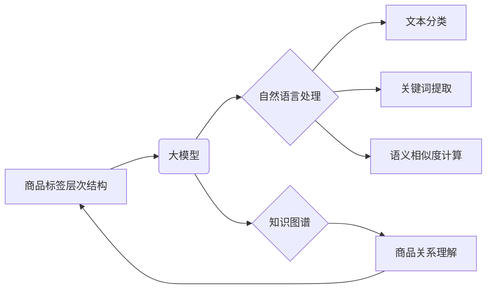

                 

## 大模型在商品标签层次结构优化中的应用

> 关键词：大模型、商品标签、层次结构优化、自然语言处理、推荐系统、知识图谱、信息检索

## 1. 背景介绍

随着电商平台的蓬勃发展，商品标签体系建设已成为提升用户体验、优化商品搜索和推荐的关键环节。传统的商品标签体系往往依赖人工标注，存在标签冗余、不规范、难以维护等问题，难以满足用户日益增长的个性化需求。

大模型的出现为商品标签层次结构优化带来了新的机遇。大模型凭借其强大的语义理解和文本生成能力，能够自动学习商品属性和关系，构建更加精准、灵活、可扩展的标签体系。

## 2. 核心概念与联系

### 2.1 商品标签层次结构

商品标签层次结构是指将商品按照一定的逻辑关系进行分类和组织的树形结构。层次结构可以将商品信息进行多层次的细分，方便用户快速定位目标商品。

### 2.2 大模型

大模型是指参数量巨大、训练数据海量的人工智能模型。大模型能够通过深度学习技术，学习复杂的语言模式和知识关系，在自然语言处理、图像识别、语音合成等领域展现出强大的能力。

### 2.3 自然语言处理 (NLP)

自然语言处理是指让计算机能够理解、处理和生成人类语言的技术。NLP技术在商品标签层次结构优化中扮演着关键角色，例如：

* **文本分类:** 将商品描述文本分类到不同的标签类别。
* **关键词提取:** 从商品描述文本中提取关键信息作为标签。
* **语义相似度计算:** 计算商品标签之间的语义相似度，用于构建层次结构。

### 2.4 知识图谱

知识图谱是一种结构化的知识表示形式，将实体和关系以图的形式表示。知识图谱可以帮助大模型理解商品之间的关联关系，构建更加准确的商品标签层次结构。

**核心概念与联系流程图**



## 3. 核心算法原理 & 具体操作步骤

### 3.1 算法原理概述

大模型在商品标签层次结构优化中的应用主要基于以下算法原理：

* **深度学习:** 利用深度神经网络学习商品属性和关系，构建商品标签映射模型。
* **Transformer:** 采用Transformer架构，捕捉商品标签之间的长距离依赖关系，提高标签层次结构的准确性。
* **图神经网络:** 利用图神经网络学习商品之间的关系，构建更加丰富的商品标签层次结构。

### 3.2 算法步骤详解

1. **数据预处理:** 收集商品描述文本、商品属性信息、用户行为数据等，并进行清洗、格式化、标注等操作。
2. **特征提取:** 利用预训练的语言模型或其他特征提取方法，从商品描述文本中提取语义特征。
3. **模型训练:** 利用深度学习算法，训练商品标签映射模型，将商品描述文本映射到相应的标签类别。
4. **层次结构构建:** 根据模型预测结果，构建商品标签层次结构，并进行优化和调整。
5. **评估与迭代:** 利用指标如准确率、召回率、F1-score等评估模型性能，并根据评估结果进行模型迭代优化。

### 3.3 算法优缺点

**优点:**

* **自动化:** 大模型能够自动学习商品属性和关系，减少人工标注的成本和时间。
* **精准度:** 大模型能够学习复杂的语义模式，构建更加精准的商品标签层次结构。
* **可扩展性:** 大模型能够处理海量数据，并随着数据量的增加不断提升性能。

**缺点:**

* **计算资源:** 训练大模型需要大量的计算资源和时间。
* **数据依赖:** 大模型的性能依赖于训练数据的质量和数量。
* **解释性:** 大模型的决策过程较为复杂，难以解释其背后的逻辑。

### 3.4 算法应用领域

大模型在商品标签层次结构优化中的应用不仅限于电商平台，还可以应用于以下领域：

* **知识管理:** 自动构建知识库的分类体系，提高知识检索效率。
* **信息检索:** 优化搜索引擎的关键词匹配和结果排序。
* **内容推荐:** 根据用户兴趣和行为，推荐相关商品或内容。

## 4. 数学模型和公式 & 详细讲解 & 举例说明

### 4.1 数学模型构建

商品标签层次结构优化可以看作是一个分类问题，可以使用概率模型来描述商品标签之间的关系。例如，可以使用贝叶斯网络来表示商品属性和标签之间的依赖关系。

**贝叶斯网络**

贝叶斯网络是一种概率图模型，用于表示随机变量之间的依赖关系。在商品标签层次结构优化中，可以将商品属性作为节点，标签作为节点，并用边表示它们之间的依赖关系。

### 4.2 公式推导过程

假设我们有一个商品描述文本 $x$，需要将其分类到标签 $y$ 中。可以使用以下公式计算 $x$ 属于标签 $y$ 的概率：

$$P(y|x) = \frac{P(x|y)P(y)}{P(x)}$$

其中：

* $P(y|x)$ 是 $x$ 属于标签 $y$ 的条件概率。
* $P(x|y)$ 是给定标签 $y$ 的情况下，$x$ 出现的概率。
* $P(y)$ 是标签 $y$ 出现的概率。
* $P(x)$ 是 $x$ 出现的概率。

### 4.3 案例分析与讲解

例如，假设我们有一个商品描述文本 "红色运动鞋"，需要将其分类到 "鞋子"、"服装" 和 "运动用品" 三个标签中。

我们可以根据商品属性和标签之间的依赖关系，构建一个贝叶斯网络。例如，"红色" 属性可能与 "鞋子" 和 "服装" 标签相关，而 "运动鞋" 属性可能与 "运动用品" 标签相关。

然后，我们可以使用贝叶斯公式计算 "红色运动鞋" 属于每个标签的概率。根据计算结果，我们可以将 "红色运动鞋" 分类到 "鞋子" 和 "运动用品" 标签中。

## 5. 项目实践：代码实例和详细解释说明

### 5.1 开发环境搭建

* Python 3.7+
* TensorFlow 2.0+
* PyTorch 1.0+
* NLTK
* SpaCy

### 5.2 源代码详细实现

```python
# 导入必要的库
import tensorflow as tf
from tensorflow.keras.layers import Embedding, LSTM, Dense

# 定义模型
model = tf.keras.Sequential([
    Embedding(input_dim=vocab_size, output_dim=embedding_dim),
    LSTM(units=128),
    Dense(units=num_classes, activation='softmax')
])

# 编译模型
model.compile(optimizer='adam',
              loss='sparse_categorical_crossentropy',
              metrics=['accuracy'])

# 训练模型
model.fit(x_train, y_train, epochs=10, batch_size=32)

# 评估模型
loss, accuracy = model.evaluate(x_test, y_test)
print('Loss:', loss)
print('Accuracy:', accuracy)
```

### 5.3 代码解读与分析

* **Embedding层:** 将单词转换为稠密的向量表示。
* **LSTM层:** 学习文本序列中的长距离依赖关系。
* **Dense层:** 将 LSTM层的输出映射到标签类别。
* **softmax激活函数:** 将输出转换为概率分布，用于预测标签类别。

### 5.4 运行结果展示

训练完成后，我们可以使用模型预测新的商品标签。例如，对于商品描述文本 "蓝色牛仔裤"，模型可以预测其属于 "服装" 和 "裤子" 标签。

## 6. 实际应用场景

大模型在商品标签层次结构优化的实际应用场景非常广泛，例如：

* **淘宝:** 利用大模型自动生成商品标签，提高商品搜索和推荐的精准度。
* **京东:** 使用大模型构建商品知识图谱，为用户提供更丰富的商品信息和个性化推荐。
* **亚马逊:** 利用大模型优化商品分类体系，提高用户购物体验。

### 6.4 未来应用展望

随着大模型技术的不断发展，其在商品标签层次结构优化中的应用将更加广泛和深入。例如：

* **多模态商品标签:** 将文本、图像、视频等多模态信息融合，构建更加全面的商品标签体系。
* **个性化商品标签:** 根据用户的兴趣和行为，生成个性化的商品标签，提供更加精准的商品推荐。
* **动态商品标签:** 根据商品的实时变化，动态更新商品标签，保持标签体系的准确性和时效性。

## 7. 工具和资源推荐

### 7.1 学习资源推荐

* **Stanford NLP Group:** https://nlp.stanford.edu/
* **Hugging Face:** https://huggingface.co/
* **OpenAI:** https://openai.com/

### 7.2 开发工具推荐

* **TensorFlow:** https://www.tensorflow.org/
* **PyTorch:** https://pytorch.org/
* **SpaCy:** https://spacy.io/

### 7.3 相关论文推荐

* **BERT: Pre-training of Deep Bidirectional Transformers for Language Understanding**
* **GPT-3: Language Models are Few-Shot Learners**
* **Graph Convolutional Networks for Web-Scale Recommender Systems**

## 8. 总结：未来发展趋势与挑战

### 8.1 研究成果总结

大模型在商品标签层次结构优化领域取得了显著的成果，能够自动学习商品属性和关系，构建更加精准、灵活、可扩展的标签体系。

### 8.2 未来发展趋势

未来，大模型在商品标签层次结构优化领域的应用将更加深入和广泛，例如：

* **多模态商品标签:** 将文本、图像、视频等多模态信息融合，构建更加全面的商品标签体系。
* **个性化商品标签:** 根据用户的兴趣和行为，生成个性化的商品标签，提供更加精准的商品推荐。
* **动态商品标签:** 根据商品的实时变化，动态更新商品标签，保持标签体系的准确性和时效性。

### 8.3 面临的挑战

大模型在商品标签层次结构优化领域也面临一些挑战，例如：

* **数据质量:** 大模型的性能依赖于训练数据的质量和数量，需要不断收集和清洗高质量的商品数据。
* **计算资源:** 训练大模型需要大量的计算资源和时间，需要开发更加高效的训练算法和硬件平台。
* **解释性:** 大模型的决策过程较为复杂，难以解释其背后的逻辑，需要开发更加可解释的模型和算法。

### 8.4 研究展望

未来，我们需要继续探索大模型在商品标签层次结构优化领域的应用，解决上述挑战，并推动该领域的发展。


## 9. 附录：常见问题与解答

**Q1: 大模型训练需要多少数据？**

A1: 大模型训练需要海量数据，通常需要百万甚至数十亿条数据才能达到较好的效果。

**Q2: 如何评估大模型的性能？**

A2: 可以使用准确率、召回率、F1-score等指标评估大模型的性能。

**Q3: 大模型的训练成本很高吗？**

A3: 由于大模型需要大量的计算资源和时间，其训练成本较高。

**作者：禅与计算机程序设计艺术 / Zen and the Art of Computer Programming**<end_of_turn>

