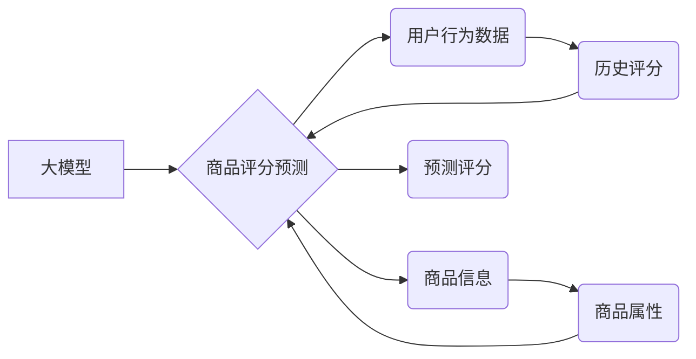

                 

## 大模型在商品评分预测中的应用

> 关键词：大模型、商品评分预测、深度学习、Transformer、BERT、自然语言处理、推荐系统

## 1. 背景介绍

在当今数据爆炸的时代，商品评分预测已成为电商平台、社交媒体和用户体验优化中不可或缺的一部分。准确的商品评分预测可以帮助用户快速找到符合自己需求的商品，提高用户满意度和购物体验。同时，对于商家而言，商品评分预测可以帮助他们了解用户对商品的评价，从而改进产品设计、优化营销策略，最终提升销售额和品牌形象。

传统商品评分预测方法主要依赖于基于规则的算法和统计模型，例如协同过滤、基于内容的过滤和矩阵分解等。然而，这些方法在面对海量数据和复杂用户行为时，往往难以准确捕捉用户偏好和商品特征之间的微妙关系。

近年来，深度学习技术的快速发展为商品评分预测带来了新的机遇。大模型，特别是基于Transformer架构的模型，凭借其强大的语义理解能力和泛化能力，在商品评分预测领域取得了显著的成果。

## 2. 核心概念与联系

### 2.1  大模型

大模型是指参数规模庞大、训练数据海量的人工智能模型。它们通常拥有数十亿甚至数千亿个参数，能够学习到更复杂的模式和关系。

### 2.2  商品评分预测

商品评分预测是指利用历史用户行为数据和商品信息，预测用户对特定商品的评分。

### 2.3  Transformer架构

Transformer是一种新型的神经网络架构，其核心是自注意力机制，能够有效捕捉序列数据中的长距离依赖关系。

**核心概念与联系流程图**



## 3. 核心算法原理 & 具体操作步骤

### 3.1  算法原理概述

大模型在商品评分预测中的应用主要基于以下核心算法原理：

* **嵌入层:** 将用户和商品信息转化为低维向量表示，以便模型进行学习和计算。
* **自注意力机制:** 捕捉用户行为数据和商品信息之间的关系，学习到用户对不同商品属性的关注程度。
* **多层感知机:** 对自注意力机制输出进行进一步的处理，学习到更复杂的评分预测模型。
* **输出层:** 将模型的输出映射到评分范围，得到最终的预测评分。

### 3.2  算法步骤详解

1. **数据预处理:** 收集用户行为数据和商品信息，进行清洗、转换和特征工程。
2. **数据编码:** 将用户和商品信息转化为数字向量表示，例如使用Word2Vec或GloVe进行词嵌入。
3. **模型训练:** 使用大模型框架，例如BERT或GPT，训练评分预测模型。
4. **模型评估:** 使用测试数据评估模型的性能，例如使用均方误差 (MSE) 或平均绝对误差 (MAE) 作为评价指标。
5. **模型部署:** 将训练好的模型部署到线上环境，用于实时预测商品评分。

### 3.3  算法优缺点

**优点:**

* 能够学习到更复杂的评分预测模型，提高预测精度。
* 对海量数据和复杂用户行为具有较强的处理能力。
* 具有良好的泛化能力，可以应用于不同的商品类型和用户群体。

**缺点:**

* 训练成本高，需要大量的计算资源和训练数据。
* 模型解释性较差，难以理解模型的决策过程。
* 对数据质量要求较高，数据噪声和偏差会影响模型性能。

### 3.4  算法应用领域

大模型在商品评分预测领域的应用不仅限于电商平台，还可以应用于以下领域:

* **社交媒体:** 预测用户对帖子、评论和产品的评价。
* **电影和音乐:** 预测用户对电影、音乐和艺术作品的评分。
* **旅游:** 预测用户对酒店、餐厅和旅游景点的评价。
* **教育:** 预测学生对课程和教材的评价。

## 4. 数学模型和公式 & 详细讲解 & 举例说明

### 4.1  数学模型构建

大模型在商品评分预测中的数学模型通常基于深度学习框架，例如TensorFlow或PyTorch。模型结构通常包括多层感知机、自注意力机制和嵌入层。

### 4.2  公式推导过程

由于模型结构复杂，公式推导过程较为繁琐，这里只列举一些关键公式：

* **自注意力机制:**

$$
Attention(Q, K, V) = \frac{exp(Q \cdot K^T / \sqrt{d_k})}{exp(Q \cdot K^T / \sqrt{d_k})} \cdot V
$$

其中，Q、K、V分别代表查询矩阵、键矩阵和值矩阵，$d_k$代表键向量的维度。

* **多层感知机:**

$$
h_l = \sigma(W_l \cdot h_{l-1} + b_l)
$$

其中，$h_l$代表第l层的隐藏状态，$W_l$和$b_l$分别代表第l层的权重矩阵和偏置向量，$\sigma$代表激活函数。

### 4.3  案例分析与讲解

假设我们有一个电商平台，想要预测用户对商品的评分。我们可以使用大模型训练一个评分预测模型，输入用户历史购买记录和商品属性信息，输出用户对该商品的评分预测。

例如，用户A购买了以下商品：

* 手机：三星Galaxy S22
* 耳机：苹果AirPods Pro
* 书籍：三体

商品属性信息包括：

* 手机：品牌、型号、价格、屏幕尺寸
* 耳机：品牌、型号、价格、降噪效果
* 书籍：作者、出版社、价格、评分

我们可以将这些数据输入到大模型中，训练一个评分预测模型。模型训练完成后，我们可以输入新的商品信息，例如华为Mate50，预测用户对该商品的评分。

## 5. 项目实践：代码实例和详细解释说明

### 5.1  开发环境搭建

* Python 3.7+
* TensorFlow 2.0+
* PyTorch 1.0+
* CUDA Toolkit 10.2+

### 5.2  源代码详细实现

```python
import tensorflow as tf

# 定义评分预测模型
model = tf.keras.Sequential([
    tf.keras.layers.Embedding(input_dim=vocab_size, output_dim=embedding_dim),
    tf.keras.layers.LSTM(units=128),
    tf.keras.layers.Dense(units=1, activation='linear')
])

# 编译模型
model.compile(optimizer='adam', loss='mse')

# 训练模型
model.fit(x_train, y_train, epochs=10)

# 评估模型
loss = model.evaluate(x_test, y_test)
print('Loss:', loss)

# 预测评分
predictions = model.predict(x_new)
print('Predictions:', predictions)
```

### 5.3  代码解读与分析

* **Embedding层:** 将用户和商品信息转化为低维向量表示。
* **LSTM层:** 捕捉用户行为数据和商品信息之间的关系。
* **Dense层:** 对LSTM层输出进行进一步的处理，学习到评分预测模型。
* **编译模型:** 使用Adam优化器和均方误差损失函数编译模型。
* **训练模型:** 使用训练数据训练模型。
* **评估模型:** 使用测试数据评估模型的性能。
* **预测评分:** 使用训练好的模型预测新的商品评分。

### 5.4  运行结果展示

运行结果将显示模型的训练损失和测试损失，以及对新商品的评分预测结果。

## 6. 实际应用场景

### 6.1  电商平台

* **商品推荐:** 根据用户的评分历史和商品属性，推荐用户可能感兴趣的商品。
* **个性化营销:** 根据用户的评分偏好，推送个性化的广告和促销活动。
* **商品优化:** 分析用户对商品的评分反馈，改进商品设计和功能。

### 6.2  社交媒体

* **内容推荐:** 根据用户的评分历史和内容属性，推荐用户可能感兴趣的内容。
* **用户画像:** 分析用户的评分偏好，构建用户画像，进行精准营销。
* **社区管理:** 识别和过滤恶意评论，维护社区秩序。

### 6.3  其他领域

* **电影和音乐:** 预测用户对电影、音乐和艺术作品的评分，提供个性化推荐。
* **旅游:** 预测用户对酒店、餐厅和旅游景点的评分，帮助用户选择合适的旅行目的地。
* **教育:** 预测学生对课程和教材的评价，帮助老师改进教学方法。

### 6.4  未来应用展望

随着大模型技术的不断发展，其在商品评分预测领域的应用将更加广泛和深入。未来，我们可以期待以下应用场景:

* **多模态评分预测:** 将文本、图像、音频等多模态数据融合，构建更准确的评分预测模型。
* **动态评分预测:** 基于用户行为和商品属性的实时变化，进行动态评分预测。
* **解释性评分预测:** 提高模型的解释性，帮助用户理解模型的决策过程。

## 7. 工具和资源推荐

### 7.1  学习资源推荐

* **书籍:**
    * Deep Learning by Ian Goodfellow, Yoshua Bengio, and Aaron Courville
    * Natural Language Processing with Python by Steven Bird, Ewan Klein, and Edward Loper
* **在线课程:**
    * TensorFlow Tutorials: https://www.tensorflow.org/tutorials
    * PyTorch Tutorials: https://pytorch.org/tutorials/

### 7.2  开发工具推荐

* **TensorFlow:** https://www.tensorflow.org/
* **PyTorch:** https://pytorch.org/
* **Hugging Face Transformers:** https://huggingface.co/transformers/

### 7.3  相关论文推荐

* BERT: Pre-training of Deep Bidirectional Transformers for Language Understanding
* Transformer: Attention Is All You Need
* XLNet: Generalized Autoregressive Pretraining for Language Understanding

## 8. 总结：未来发展趋势与挑战

### 8.1  研究成果总结

大模型在商品评分预测领域取得了显著的成果，能够学习到更复杂的评分预测模型，提高预测精度。

### 8.2  未来发展趋势

未来，大模型在商品评分预测领域的应用将更加广泛和深入，包括多模态评分预测、动态评分预测和解释性评分预测等。

### 8.3  面临的挑战

大模型在商品评分预测领域也面临一些挑战，例如训练成本高、模型解释性差和数据质量要求高。

### 8.4  研究展望

未来研究方向包括降低大模型的训练成本、提高模型的解释性、开发更鲁棒的数据处理方法和探索新的应用场景。

## 9. 附录：常见问题与解答

* **Q: 大模型的训练成本很高，如何降低训练成本？**

* **A:** 可以使用预训练模型进行微调，减少训练数据和训练时间。还可以使用分布式训练技术，将模型训练任务分摊到多个机器上。

* **Q: 大模型的解释性差，如何提高模型的解释性？**

* **A:** 可以使用可解释机器学习 (XAI) 技术，例如LIME和SHAP，解释模型的决策过程。也可以设计更易于理解的模型架构。

* **Q: 大模型对数据质量要求高，如何处理数据质量问题？**

* **A:** 可以使用数据清洗和预处理技术，去除数据噪声和偏差。还可以使用数据增强技术，增加训练数据的数量和多样性。


作者：禅与计算机程序设计艺术 / Zen and the Art of Computer Programming 
<end_of_turn>

