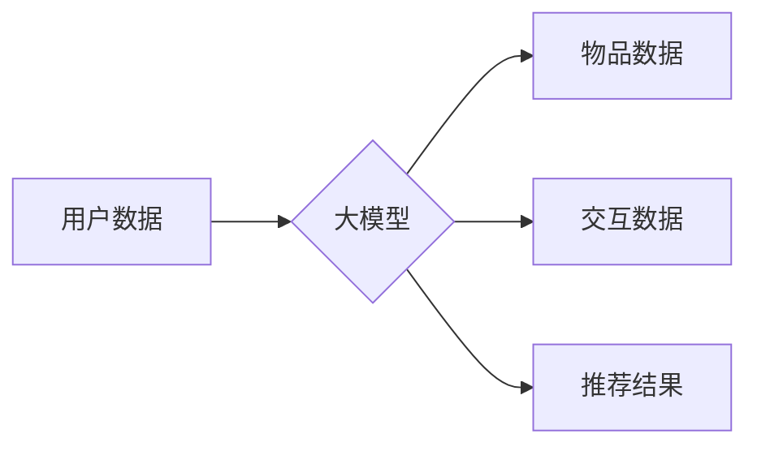

                 

## 大模型在推荐：统一与融合

> 关键词：大模型、推荐系统、统一架构、融合技术、深度学习、Transformer、个性化推荐

### 1. 背景介绍

推荐系统作为信息过滤和个性化内容呈现的重要工具，在电商、社交媒体、视频平台等领域发挥着越来越重要的作用。传统推荐系统主要依赖于特征工程和规则匹配，但随着数据规模和用户行为的复杂性增加，这些方法逐渐难以满足用户的个性化需求。

近年来，大模型技术在自然语言处理、计算机视觉等领域取得了突破性进展，其强大的学习能力和泛化能力为推荐系统带来了新的机遇。大模型能够从海量数据中学习到更丰富的用户偏好和物品特征，从而提供更精准、更个性化的推荐结果。

### 2. 核心概念与联系

大模型在推荐系统中的应用主要体现在以下几个方面：

* **统一架构:** 大模型可以统一学习用户、物品和交互信息，构建一个端到端的推荐模型，避免传统推荐系统中各个模块之间信息孤岛的问题。
* **融合技术:** 大模型可以融合文本、图像、视频等多种数据类型，构建多模态推荐模型，提供更全面的用户体验。
* **个性化推荐:** 大模型可以根据用户的历史行为、兴趣偏好等信息，个性化推荐物品，提高用户满意度。

**Mermaid 流程图:**



### 3. 核心算法原理 & 具体操作步骤

#### 3.1  算法原理概述

大模型在推荐系统中的核心算法主要基于深度学习，其中Transformer模型由于其强大的序列建模能力，在推荐领域得到了广泛应用。Transformer模型通过自注意力机制学习用户和物品之间的关系，并利用多头注意力机制捕捉不同层次的语义信息，从而实现更精准的推荐。

#### 3.2  算法步骤详解

1. **数据预处理:** 收集用户、物品和交互数据，并进行清洗、转换、编码等预处理操作。
2. **模型构建:** 根据具体任务需求，选择合适的Transformer模型架构，并进行参数初始化。
3. **模型训练:** 使用训练数据训练模型，优化模型参数，使模型能够准确预测用户对物品的兴趣。
4. **模型评估:** 使用测试数据评估模型性能，并根据评估结果进行模型调优。
5. **推荐系统部署:** 将训练好的模型部署到线上环境，为用户提供个性化推荐服务。

#### 3.3  算法优缺点

**优点:**

* **精准度高:** Transformer模型能够学习到用户和物品之间的复杂关系，从而提供更精准的推荐结果。
* **泛化能力强:** 大模型能够从海量数据中学习到更丰富的知识，具有较强的泛化能力，能够适应不同的推荐场景。
* **可扩展性强:** 大模型可以根据需要进行扩展，例如增加数据维度、增加模型层数等，从而提高模型性能。

**缺点:**

* **训练成本高:** 大模型的训练需要大量的计算资源和时间，成本较高。
* **部署成本高:** 大模型的部署需要强大的硬件支持，部署成本较高。
* **可解释性低:** 大模型的决策过程较为复杂，难以解释模型的推荐结果。

#### 3.4  算法应用领域

大模型在推荐系统中的应用领域非常广泛，例如：

* **电商推荐:** 为用户推荐商品、优惠券、促销活动等。
* **社交媒体推荐:** 为用户推荐好友、话题、文章等。
* **视频平台推荐:** 为用户推荐视频、电视剧、电影等。
* **音乐平台推荐:** 为用户推荐歌曲、专辑、歌手等。

### 4. 数学模型和公式 & 详细讲解 & 举例说明

#### 4.1  数学模型构建

Transformer模型的核心是自注意力机制，其数学模型可以表示为：

$$
Attention(Q, K, V) = \frac{exp(Q \cdot K^T / \sqrt{d_k})}{exp(Q \cdot K^T / \sqrt{d_k})} \cdot V
$$

其中：

* $Q$：查询矩阵
* $K$：键矩阵
* $V$：值矩阵
* $d_k$：键向量的维度

#### 4.2  公式推导过程

自注意力机制通过计算查询向量与键向量的点积，并使用softmax函数进行归一化，从而得到每个键向量的重要性权重。然后，将这些权重与值向量相乘，得到最终的注意力输出。

#### 4.3  案例分析与讲解

例如，在推荐系统中，用户历史行为可以表示为查询向量，物品特征可以表示为键向量，物品评分可以表示为值向量。通过自注意力机制，模型可以学习到用户对不同物品的兴趣程度，并根据用户的历史行为和物品特征，预测用户对新物品的兴趣。

### 5. 项目实践：代码实例和详细解释说明

#### 5.1  开发环境搭建

推荐系统开发环境通常包括以下组件：

* **编程语言:** Python
* **深度学习框架:** TensorFlow、PyTorch
* **数据处理工具:** Pandas、NumPy
* **云计算平台:** AWS、Azure、GCP

#### 5.2  源代码详细实现

```python
import tensorflow as tf

# 定义Transformer模型
class Transformer(tf.keras.Model):
    def __init__(self, vocab_size, embedding_dim, num_heads, num_layers):
        super(Transformer, self).__init__()
        self.embedding = tf.keras.layers.Embedding(vocab_size, embedding_dim)
        self.transformer_layers = tf.keras.layers.StackedRNNCells([
            tf.keras.layers.MultiHeadAttention(num_heads=num_heads, key_dim=embedding_dim)
            for _ in range(num_layers)
        ])

    def call(self, inputs):
        embeddings = self.embedding(inputs)
        outputs = self.transformer_layers(embeddings)
        return outputs

# 训练模型
model = Transformer(vocab_size=10000, embedding_dim=128, num_heads=8, num_layers=6)
model.compile(optimizer='adam', loss='mse')
model.fit(train_data, train_labels, epochs=10)

# 推理模型
predictions = model.predict(test_data)
```

#### 5.3  代码解读与分析

* 代码首先定义了一个Transformer模型，包含嵌入层、多头注意力层和堆叠的RNN单元。
* 然后，使用训练数据训练模型，并使用均方误差损失函数和Adam优化器。
* 最后，使用测试数据进行推理，得到推荐结果。

#### 5.4  运行结果展示

运行结果可以包括以下指标：

* **准确率:** 模型预测用户兴趣的准确率。
* **召回率:** 模型推荐出用户感兴趣物品的比例。
* **NDCG:** Normalized Discounted Cumulative Gain，衡量推荐结果的排序质量。

### 6. 实际应用场景

大模型在推荐系统中的实际应用场景非常广泛，例如：

* **个性化商品推荐:** 根据用户的历史购买记录、浏览记录、评分等信息，为用户推荐个性化的商品。
* **内容推荐:** 根据用户的兴趣爱好、阅读习惯、观看历史等信息，为用户推荐个性化的文章、视频、音乐等内容。
* **广告推荐:** 根据用户的兴趣爱好、行为特征等信息，为用户推荐个性化的广告。

#### 6.4  未来应用展望

未来，大模型在推荐系统中的应用将更加广泛和深入，例如：

* **多模态推荐:** 融合文本、图像、视频等多种数据类型，提供更全面的用户体验。
* **实时推荐:** 基于用户的实时行为，提供更精准的推荐结果。
* **解释性推荐:** 提高模型的可解释性，让用户能够理解模型推荐的原因。

### 7. 工具和资源推荐

#### 7.1  学习资源推荐

* **书籍:**
    * Deep Learning by Ian Goodfellow, Yoshua Bengio, and Aaron Courville
    * Attention Is All You Need by Ashish Vaswani et al.
* **课程:**
    * Stanford CS224N: Natural Language Processing with Deep Learning
    * Deep Learning Specialization by Andrew Ng

#### 7.2  开发工具推荐

* **深度学习框架:** TensorFlow、PyTorch
* **数据处理工具:** Pandas、NumPy
* **云计算平台:** AWS、Azure、GCP

#### 7.3  相关论文推荐

* Attention Is All You Need
* BERT: Pre-training of Deep Bidirectional Transformers for Language Understanding
* Transformer-XL: Attentive Language Modeling Beyond Millions of Tokens

### 8. 总结：未来发展趋势与挑战

#### 8.1  研究成果总结

大模型在推荐系统领域取得了显著的成果，能够提供更精准、更个性化的推荐结果。

#### 8.2  未来发展趋势

未来，大模型在推荐系统中的应用将更加广泛和深入，例如多模态推荐、实时推荐、解释性推荐等。

#### 8.3  面临的挑战

大模型在推荐系统中的应用也面临一些挑战，例如训练成本高、部署成本高、可解释性低等。

#### 8.4  研究展望

未来研究方向包括降低大模型的训练和部署成本、提高模型的可解释性、探索新的大模型架构等。

### 9. 附录：常见问题与解答

#### 9.1  常见问题

* 大模型的训练需要多少计算资源？
* 如何部署大模型到线上环境？
* 如何评估大模型的推荐性能？

#### 9.2  解答

* 大模型的训练需要大量的计算资源，例如GPU集群。
* 大模型的部署需要强大的硬件支持，例如TPU。
* 大模型的推荐性能可以评估指标，例如准确率、召回率、NDCG等。


作者：禅与计算机程序设计艺术 / Zen and the Art of Computer Programming 
<end_of_turn>

