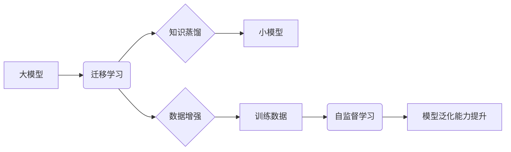

                 

## 大模型视角下推荐系统的模型泛化能力提升技术

> 关键词：大模型、推荐系统、模型泛化、迁移学习、知识蒸馏、数据增强、自监督学习

## 1. 背景介绍

推荐系统作为信息过滤和个性化服务的重要组成部分，在电商、社交媒体、视频平台等领域发挥着越来越重要的作用。随着大模型技术的快速发展，大模型在推荐系统中的应用也日益广泛。然而，大模型在推荐系统中的泛化能力仍然面临着挑战。

传统推荐系统通常依赖于海量用户行为数据进行训练，但这些数据往往存在领域限制和数据漂移问题，导致模型在面对新用户、新商品或新场景时表现不佳。大模型虽然拥有强大的学习能力，但其训练成本高昂，需要大量的标注数据，并且容易过拟合训练数据，导致泛化能力不足。

因此，提升大模型在推荐系统中的泛化能力成为一个重要的研究方向。

## 2. 核心概念与联系

### 2.1 模型泛化能力

模型泛化能力是指模型在面对未知数据时，能够保持良好性能的能力。一个好的推荐系统应该能够准确地预测用户对新商品的兴趣，并能够适应不断变化的用户偏好和市场环境。

### 2.2 大模型

大模型是指参数量巨大、训练数据量庞大的深度学习模型。大模型通常具有强大的表示能力和泛化能力，能够学习到更复杂的模式和特征。

### 2.3 迁移学习

迁移学习是一种机器学习方法，它利用已训练好的模型在源任务上的知识，迁移到目标任务中进行训练。迁移学习可以有效地降低模型训练成本，并提升模型在目标任务上的泛化能力。

### 2.4 知识蒸馏

知识蒸馏是一种迁移学习方法，它将知识从一个大模型（教师模型）蒸馏到一个小模型（学生模型）中。知识蒸馏可以有效地压缩大模型的知识，并提高小模型的泛化能力。

### 2.5 数据增强

数据增强是一种数据预处理技术，它通过对现有数据进行一些变换，例如旋转、缩放、裁剪等，生成新的数据样本。数据增强可以有效地增加训练数据量，并提升模型的泛化能力。

### 2.6 自监督学习

自监督学习是一种无需人工标注数据就能进行训练的机器学习方法。自监督学习通过设计一些预训练任务，例如语言建模、图像分类等，让模型学习到一些通用的知识和特征。

**核心概念与架构流程图**



## 3. 核心算法原理 & 具体操作步骤

### 3.1 算法原理概述

提升大模型在推荐系统中的泛化能力主要通过以下几种方法：

* **迁移学习:** 利用已训练好的大模型在其他领域的知识，迁移到推荐系统中进行训练。
* **知识蒸馏:** 将大模型的知识蒸馏到一个更小的模型中，降低模型复杂度，提高泛化能力。
* **数据增强:** 通过对现有数据进行一些变换，增加训练数据量，提升模型的泛化能力。
* **自监督学习:** 利用自监督学习方法，让模型学习到一些通用的知识和特征，提高模型的泛化能力。

### 3.2 算法步骤详解

**迁移学习:**

1. 选择一个与推荐系统相关的源任务，例如用户画像分析、商品分类等。
2. 在源任务上训练一个大模型。
3. 将源任务模型的参数迁移到推荐系统模型中进行微调。

**知识蒸馏:**

1. 选择一个大模型作为教师模型，一个小的模型作为学生模型。
2. 使用教师模型对训练数据进行预测，并将其输出作为学生模型的监督信号。
3. 训练学生模型，使其模仿教师模型的预测结果。

**数据增强:**

1. 对现有数据进行一些变换，例如旋转、缩放、裁剪等，生成新的数据样本。
2. 将增强后的数据与原始数据一起用于训练模型。

**自监督学习:**

1. 设计一些预训练任务，例如语言建模、图像分类等。
2. 使用自监督学习方法训练大模型，使其学习到一些通用的知识和特征。
3. 将预训练后的模型用于推荐系统中进行微调。

### 3.3 算法优缺点

| 算法 | 优点 | 缺点 |
|---|---|---|
| 迁移学习 | 降低训练成本，提升泛化能力 | 需要找到合适的源任务，源任务与目标任务之间存在一定的相关性 |
| 知识蒸馏 | 压缩模型大小，提高效率 | 需要选择合适的教师模型和学生模型 |
| 数据增强 | 增加训练数据量，提升泛化能力 | 可能导致数据分布不均匀，影响模型性能 |
| 自监督学习 | 不需要人工标注数据，学习到更通用的知识 | 预训练任务的设计需要精心考虑，训练时间较长 |

### 3.4 算法应用领域

* **电商推荐:** 提升商品推荐的准确性和个性化程度。
* **社交媒体推荐:** 提升用户兴趣内容的推荐效果。
* **视频平台推荐:** 提升用户观看视频的兴趣和粘性。
* **新闻推荐:** 提升用户获取新闻信息的效率和准确性。

## 4. 数学模型和公式 & 详细讲解 & 举例说明

### 4.1 数学模型构建

推荐系统的核心目标是预测用户对物品的评分或点击概率。常用的数学模型包括协同过滤模型、内容基模型和混合模型。

**协同过滤模型:**

协同过滤模型基于用户的历史行为数据，预测用户对物品的评分或点击概率。

**内容基模型:**

内容基模型基于物品的特征信息，预测用户对物品的评分或点击概率。

**混合模型:**

混合模型结合了协同过滤模型和内容基模型的优点，提高了推荐系统的准确性和个性化程度。

### 4.2 公式推导过程

**协同过滤模型中的用户-物品评分预测公式:**

$$
\hat{r}_{u,i} = \mu + b_u + b_i + \sum_{j \in N(u)} \frac{r_{u,j} \cdot \operatorname{sim}(u, j)}{\sum_{k \in N(u)} \operatorname{sim}(u, k)}
$$

其中:

* $\hat{r}_{u,i}$ 是预测用户 $u$ 对物品 $i$ 的评分。
* $\mu$ 是全局平均评分。
* $b_u$ 是用户 $u$ 的偏差。
* $b_i$ 是物品 $i$ 的偏差。
* $r_{u,j}$ 是用户 $u$ 对物品 $j$ 的真实评分。
* $\operatorname{sim}(u, j)$ 是用户 $u$ 和用户 $j$ 之间的相似度。
* $N(u)$ 是用户 $u$ 的邻居用户集合。

### 4.3 案例分析与讲解

假设我们有一个电商平台，用户 $u$ 对商品 $i$ 的评分未知，但我们知道用户 $u$ 和用户 $v$ 的评分相似度较高，并且用户 $v$ 对商品 $i$ 的评分为 5 分。

根据协同过滤模型的公式，我们可以预测用户 $u$ 对商品 $i$ 的评分为:

$$
\hat{r}_{u,i} = \mu + b_u + b_i + \frac{r_{u,v} \cdot \operatorname{sim}(u, v)}{\sum_{k \in N(u)} \operatorname{sim}(u, k)}
$$

其中，$r_{u,v}$ 是用户 $u$ 和用户 $v$ 的评分相似度，$\operatorname{sim}(u, v)$ 是用户 $u$ 和用户 $v$ 之间的相似度。

## 5. 项目实践：代码实例和详细解释说明

### 5.1 开发环境搭建

* Python 3.7+
* TensorFlow 2.0+
* PyTorch 1.0+
* CUDA 10.0+

### 5.2 源代码详细实现

```python
# 导入必要的库
import tensorflow as tf

# 定义模型结构
class RecommenderModel(tf.keras.Model):
    def __init__(self, embedding_dim, num_users, num_items):
        super(RecommenderModel, self).__init__()
        self.user_embedding = tf.keras.layers.Embedding(num_users, embedding_dim)
        self.item_embedding = tf.keras.layers.Embedding(num_items, embedding_dim)
        self.dense = tf.keras.layers.Dense(1)

    def call(self, user_ids, item_ids):
        user_embeddings = self.user_embedding(user_ids)
        item_embeddings = self.item_embedding(item_ids)
        combined_embeddings = user_embeddings * item_embeddings
        predictions = self.dense(combined_embeddings)
        return predictions

# 构建模型实例
model = RecommenderModel(embedding_dim=64, num_users=1000, num_items=10000)

# 定义损失函数和优化器
loss_fn = tf.keras.losses.MeanSquaredError()
optimizer = tf.keras.optimizers.Adam(learning_rate=0.001)

# 训练模型
# ...

# 预测用户对物品的评分
predictions = model.predict(user_ids=[1, 2, 3], item_ids=[4, 5, 6])
```

### 5.3 代码解读与分析

* **模型结构:** 该代码定义了一个简单的推荐模型，它使用嵌入层将用户和物品的ID映射到低维向量空间，然后使用一个全连接层进行评分预测。
* **损失函数:** 使用均方误差作为损失函数，用于衡量模型预测评分与真实评分之间的差异。
* **优化器:** 使用Adam优化器进行模型训练，它是一种常用的优化算法，能够有效地更新模型参数。
* **训练过程:** 训练过程需要使用训练数据进行模型训练，并使用验证数据进行模型评估。

### 5.4 运行结果展示

训练完成后，可以使用测试数据对模型进行评估，并展示模型的预测结果。

## 6. 实际应用场景

### 6.1 电商推荐

大模型在电商推荐系统中可以用于个性化商品推荐、新品推荐、跨界推荐等场景。

### 6.2 社交媒体推荐

大模型可以用于社交媒体平台上的内容推荐、好友推荐、兴趣小组推荐等场景。

### 6.3 视频平台推荐

大模型可以用于视频平台上的视频推荐、用户画像分析、内容分类等场景。

### 6.4 未来应用展望

随着大模型技术的不断发展，其在推荐系统中的应用场景将会更加广泛，例如：

* **多模态推荐:** 将文本、图像、音频等多种模态信息融合在一起，进行更精准的推荐。
* **个性化解释:** 为用户提供推荐结果的个性化解释，提高用户对推荐结果的理解和信任。
* **动态推荐:** 根据用户的实时行为和环境变化，动态调整推荐结果。

## 7. 工具和资源推荐

### 7.1 学习资源推荐

* **书籍:**
    * 《深度学习》
    * 《自然语言处理》
    * 《推荐系统》
* **在线课程:**
    * Coursera: 深度学习
    * Udacity: 自然语言处理
    * fast.ai: 深度学习

### 7.2 开发工具推荐

* **TensorFlow:** 开源深度学习框架
* **PyTorch:** 开源深度学习框架
* **Scikit-learn:** 机器学习库

### 7.3 相关论文推荐

* **BERT: Pre-training of Deep Bidirectional Transformers for Language Understanding**
* **GPT-3: Language Models are Few-Shot Learners**
* **DALL-E: Creating Images from Text**

## 8. 总结：未来发展趋势与挑战

### 8.1 研究成果总结

大模型在推荐系统中的应用取得了显著的成果，例如：

* 提升了推荐系统的准确性和个性化程度。
* 降低了模型训练成本。
* 扩展了推荐系统的应用场景。

### 8.2 未来发展趋势

* **多模态推荐:** 将文本、图像、音频等多种模态信息融合在一起，进行更精准的推荐。
* **个性化解释:** 为用户提供推荐结果的个性化解释，提高用户对推荐结果的理解和信任。
* **动态推荐:** 根据用户的实时行为和环境变化，动态调整推荐结果。

### 8.3 面临的挑战

* **模型训练成本:** 大模型的训练成本非常高，需要大量的计算资源和数据。
* **数据安全和隐私:** 大模型的训练需要使用大量的用户数据，如何保证数据安全和隐私是一个重要的挑战。
* **模型解释性:** 大模型的决策过程往往是复杂的，难以解释，如何提高模型的解释性是一个重要的研究方向。

### 8.4 研究展望

未来，大模型在推荐系统中的应用将会更加广泛和深入，需要进一步研究以下问题:

* 如何降低大模型的训练成本，使其更易于部署和使用。
* 如何保证大模型的公平性和可解释性，避免模型歧视和偏见。
* 如何将大模型与其他人工智能技术融合，构建更智能的推荐系统。

## 9. 附录：常见问题与解答

**Q1: 大模型的泛化能力为什么不如传统模型？**

A1: 大模型虽然拥有强大的学习能力，但其训练数据量庞大，容易过拟合训练数据，导致泛化能力不足。

**Q2: 如何提升大模型的泛化能力？**

A2: 可以通过迁移学习、知识蒸馏、数据增强、自监督学习等方法提升大模型的泛化能力。

**Q3: 大模型的训练成本很高，如何降低训练成本？**

A3: 可以通过模型压缩、参数共享、分布式训练等方法降低大模型的训练成本。

**作者：禅与计算机程序设计艺术 / Zen and the Art of Computer Programming**<end_of_turn>

