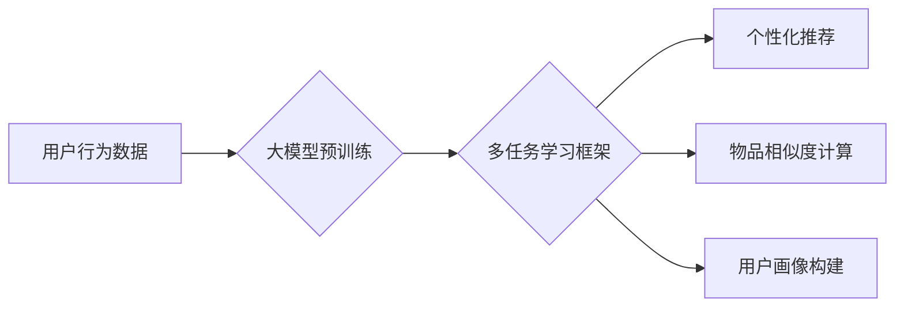

                 

## 大模型驱动的推荐系统多任务学习框架

> 关键词：大模型、推荐系统、多任务学习、深度学习、Transformer、个性化推荐、协同过滤、内容过滤

## 1. 背景介绍

推荐系统作为信息过滤和个性化内容呈现的关键技术，在电商、社交媒体、视频平台等领域发挥着越来越重要的作用。传统的推荐系统主要依赖于协同过滤和内容过滤等方法，但这些方法在数据稀疏、冷启动问题和用户行为多样性方面存在局限性。

近年来，大模型的兴起为推荐系统带来了新的机遇。大模型拥有强大的语义理解和泛化能力，能够从海量数据中学习到更丰富的用户偏好和物品特征，从而提升推荐系统的准确性和个性化程度。

多任务学习 (Multi-Task Learning, MTL) 作为一种机器学习范式，可以有效地利用不同任务之间的共享知识，提升模型的整体性能。将多任务学习与大模型相结合，可以构建更强大的推荐系统，解决传统方法难以克服的挑战。

## 2. 核心概念与联系

### 2.1  大模型

大模型是指参数量达到数十亿甚至千亿级别的深度学习模型。它们通过训练海量文本数据，学习到丰富的语言表示和知识，能够进行自然语言理解、文本生成、机器翻译等多种任务。

### 2.2  推荐系统

推荐系统旨在根据用户的历史行为、偏好和上下文信息，预测用户对特定物品的兴趣，并推荐最相关的物品。

### 2.3  多任务学习

多任务学习是指训练一个模型来同时学习多个相关任务。通过共享底层特征和知识，MTL 可以提升模型的泛化能力和整体性能。

**核心架构流程图**



## 3. 核心算法原理 & 具体操作步骤

### 3.1  算法原理概述

大模型驱动的推荐系统多任务学习框架的核心算法原理是将多个推荐任务整合到一个统一的框架中，共享模型参数，并通过联合优化目标函数来训练模型。

常见的推荐任务包括：

* **个性化推荐:** 根据用户的历史行为和偏好，推荐个性化的物品。
* **物品相似度计算:** 计算不同物品之间的相似度，推荐与用户已喜欢的物品相似的物品。
* **用户画像构建:** 从用户的行为数据中学习用户的兴趣、偏好和特征，构建用户画像。

### 3.2  算法步骤详解

1. **数据预处理:** 收集用户行为数据、物品信息等数据，并进行清洗、转换和特征工程。
2. **大模型预训练:** 使用海量文本数据预训练大模型，例如BERT、GPT等，学习到丰富的语义表示和知识。
3. **多任务学习框架构建:** 设计多任务学习框架，将多个推荐任务整合到一个统一的模型中，共享模型参数。
4. **模型训练:** 使用联合优化目标函数，训练多任务学习模型。目标函数通常包含多个任务的损失函数，并通过权重平衡来控制不同任务的重要性。
5. **模型评估:** 使用测试数据评估模型的性能，例如准确率、召回率、NDCG等指标。
6. **模型部署:** 将训练好的模型部署到线上环境，为用户提供个性化推荐服务。

### 3.3  算法优缺点

**优点:**

* **提升推荐精度:** 通过共享知识和联合优化，MTL 可以提升模型的整体性能，提高推荐的准确性和个性化程度。
* **解决数据稀疏问题:** MTL 可以利用不同任务之间的关联性，缓解数据稀疏问题，提升模型的泛化能力。
* **降低训练成本:** 共享模型参数可以减少模型参数量，降低训练成本。

**缺点:**

* **任务选择:** 选择合适的任务组合至关重要，任务之间需要有一定的相关性。
* **模型复杂度:** MTL 模型的复杂度较高，需要更多的计算资源和训练时间。
* **任务冲突:** 不同任务的目标可能存在冲突，需要通过权重平衡等方法来解决。

### 3.4  算法应用领域

大模型驱动的推荐系统多任务学习框架在以下领域具有广泛的应用前景：

* **电商推荐:** 个性化商品推荐、新品推荐、关联推荐等。
* **社交媒体推荐:** 朋友推荐、内容推荐、话题推荐等。
* **视频平台推荐:** 视频推荐、用户画像构建、内容分类等。
* **音乐平台推荐:** 音乐推荐、用户偏好分析、音乐分类等。

## 4. 数学模型和公式 & 详细讲解 & 举例说明

### 4.1  数学模型构建

假设我们有 $N$ 个用户，$M$ 个物品，以及 $D$ 个任务。每个用户 $u$ 对物品 $i$ 的评分记为 $r_{ui}$。

多任务学习框架的目标是学习一个模型 $f(x)$，其中 $x$ 是用户和物品的特征向量，能够同时预测用户对不同物品的评分，并完成其他推荐任务。

模型可以表示为：

$$
f(x) = W_1 x_1 + W_2 x_2 + ... + W_D x_D
$$

其中，$W_i$ 是第 $i$ 个任务的权重矩阵，$x_i$ 是第 $i$ 个任务的特征向量。

### 4.2  公式推导过程

多任务学习的目标函数通常是所有任务损失函数的加权平均：

$$
L = \sum_{i=1}^{D} \lambda_i L_i
$$

其中，$L_i$ 是第 $i$ 个任务的损失函数，$\lambda_i$ 是第 $i$ 个任务的权重。

损失函数的具体形式取决于不同的推荐任务。例如，个性化推荐任务可以使用均方误差 (MSE) 作为损失函数，物品相似度计算任务可以使用余弦相似度作为损失函数。

### 4.3  案例分析与讲解

假设我们有一个电商平台，需要构建一个推荐系统，完成以下三个任务：

* **个性化商品推荐:** 根据用户的历史购买记录，推荐个性化的商品。
* **商品相似度计算:** 计算不同商品之间的相似度，推荐与用户已购买商品相似的商品。
* **用户画像构建:** 从用户的行为数据中学习用户的兴趣、偏好和特征，构建用户画像。

我们可以使用大模型驱动的推荐系统多任务学习框架，将这三个任务整合到一个统一的模型中。

模型可以学习到用户和商品的语义表示，并根据这些表示预测用户对不同商品的评分，计算商品之间的相似度，以及构建用户画像。

## 5. 项目实践：代码实例和详细解释说明

### 5.1  开发环境搭建

* Python 3.7+
* PyTorch 1.7+
* Transformers 4.0+
* CUDA 11.0+

### 5.2  源代码详细实现

```python
import torch
import torch.nn as nn
from transformers import BertModel

class MultiTaskRecommender(nn.Module):
    def __init__(self, bert_model_name, num_users, num_items, hidden_size):
        super(MultiTaskRecommender, self).__init__()
        self.bert = BertModel.from_pretrained(bert_model_name)
        self.user_embedding = nn.Embedding(num_users, hidden_size)
        self.item_embedding = nn.Embedding(num_items, hidden_size)
        self.task1_head = nn.Linear(hidden_size, 1)
        self.task2_head = nn.Linear(hidden_size, hidden_size)
        self.task3_head = nn.Linear(hidden_size, hidden_size)

    def forward(self, user_ids, item_ids):
        bert_output = self.bert(input_ids=torch.tensor([user_ids, item_ids]))
        user_embedding = self.user_embedding(user_ids)
        item_embedding = self.item_embedding(item_ids)
        
        # Task 1: Personalized Recommendation
        task1_output = self.task1_head(torch.cat((user_embedding, item_embedding), dim=1))

        # Task 2: Item Similarity Calculation
        task2_output = self.task2_head(torch.cat((user_embedding, item_embedding), dim=1))

        # Task 3: User Profiling
        task3_output = self.task3_head(torch.cat((user_embedding, item_embedding), dim=1))

        return task1_output, task2_output, task3_output
```

### 5.3  代码解读与分析

* **模型结构:** 该代码实现了一个多任务学习框架，使用BERT模型作为预训练模型，并添加了三个任务头，分别用于个性化推荐、物品相似度计算和用户画像构建。
* **数据输入:** 模型接受用户ID和物品ID作为输入，并使用嵌入层将它们转换为向量表示。
* **特征融合:** 模型将用户和物品的向量表示进行拼接，作为输入传递给任务头。
* **任务输出:** 每个任务头输出不同的结果，例如，个性化推荐任务输出用户对物品的评分预测，物品相似度计算任务输出物品之间的相似度得分，用户画像构建任务输出用户的兴趣特征向量。

### 5.4  运行结果展示

运行代码后，可以得到每个任务的预测结果，并进行评估。例如，可以使用均方误差 (MSE) 评估个性化推荐任务的性能，可以使用余弦相似度评估物品相似度计算任务的性能，可以使用准确率评估用户画像构建任务的性能。

## 6. 实际应用场景

### 6.1  电商推荐

大模型驱动的推荐系统多任务学习框架可以用于电商平台的个性化商品推荐、新品推荐、关联推荐等场景。

例如，可以利用用户购买历史、浏览记录、评价等数据，构建用户画像，并根据用户画像推荐个性化的商品。

### 6.2  社交媒体推荐

在社交媒体平台，大模型驱动的推荐系统可以用于推荐朋友、内容、话题等。

例如，可以利用用户的关注关系、点赞记录、评论等数据，构建用户兴趣图谱，并根据用户兴趣图谱推荐相关的用户、内容和话题。

### 6.3  视频平台推荐

视频平台可以利用大模型驱动的推荐系统，推荐个性化的视频内容、用户感兴趣的频道、相关视频等。

例如，可以利用用户的观看历史、点赞记录、评论等数据，构建用户兴趣偏好模型，并根据用户兴趣偏好模型推荐相关的视频内容。

### 6.4  未来应用展望

随着大模型技术的不断发展，大模型驱动的推荐系统多任务学习框架将在更多领域得到应用，例如：

* **医疗健康:** 推荐个性化的医疗方案、疾病诊断辅助、药物推荐等。
* **教育培训:** 推荐个性化的学习资源、课程推荐、学习计划制定等。
* **金融投资:** 推荐个性化的理财产品、投资策略、风险管理建议等。

## 7. 工具和资源推荐

### 7.1  学习资源推荐

* **书籍:**
    * Deep Learning by Ian Goodfellow, Yoshua Bengio, and Aaron Courville
    * Hands-On Machine Learning with Scikit-Learn, Keras & TensorFlow by Aurélien Géron
* **课程:**
    * Stanford CS224N: Natural Language Processing with Deep Learning
    * DeepLearning.AI TensorFlow Specialization

### 7.2  开发工具推荐

* **Python:** 
* **PyTorch:** 深度学习框架
* **Transformers:** 预训练模型库
* **TensorBoard:** 可视化工具

### 7.3  相关论文推荐

* **BERT: Pre-training of Deep Bidirectional Transformers for Language Understanding**
* **Multi-Task Learning: A Survey**
* **Deep Learning for Recommender Systems**

## 8. 总结：未来发展趋势与挑战

### 8.1  研究成果总结

大模型驱动的推荐系统多任务学习框架取得了显著的成果，在提升推荐精度、解决数据稀疏问题、降低训练成本等方面表现出色。

### 8.2  未来发展趋势

* **模型规模和能力提升:** 随着计算资源的不断发展，大模型的规模和能力将进一步提升，带来更强大的推荐性能。
* **多模态学习:** 将文本、图像、音频等多模态数据融合到推荐系统中，提升推荐的准确性和个性化程度。
* **联邦学习:** 利用联邦学习技术，在保护用户隐私的前提下，训练更强大的推荐模型。

### 8.3  面临的挑战

* **模型训练成本:** 大模型的训练成本较高，需要大量的计算资源和时间。
* **数据安全和隐私:** 大模型需要训练海量数据，如何保证数据安全和用户隐私是一个重要的挑战。
* **模型解释性和可解释性:** 大模型的决策过程较为复杂，如何提高模型的解释性和可解释性是一个重要的研究方向。

### 8.4  研究展望

未来，大模型驱动的推荐系统多任务学习框架将继续朝着更智能、更个性化、更安全的方向发展，为用户提供更优质的推荐服务。


## 9. 附录：常见问题与解答

**Q1: 大模型驱动的推荐系统多任务学习框架与传统的推荐系统相比有哪些优势？**

**A1:** 大模型驱动的推荐系统多任务学习框架相比传统的推荐系统，具有以下优势：

* 提升推荐精度：通过共享知识和联合优化，MTL 可以提升模型的整体性能，提高推荐的准确性和个性化程度。
* 解决数据稀疏问题：MTL 可以利用不同任务之间的关联性，缓解数据稀疏问题，提升模型的泛化能力。
* 降低训练成本：共享模型参数可以减少模型参数量，降低训练成本。

**Q2: 如何选择合适的任务组合？**

**A2:** 选择合适的任务组合至关重要，任务之间需要有一定的相关性。例如，个性化推荐、物品相似度计算和用户画像构建都是相关的任务，可以一起整合到一个多任务学习框架中。

**Q3: 如何解决模型训练成本高的问题？**

**A3:** 

* 使用更有效的训练算法，例如梯度下降变种算法。
* 利用云计算平台的计算资源，加速模型训练。
* 采用模型压缩技术，减少模型参数量。

**Q4: 如何保证数据安全和用户隐私？**

**A4:** 

* 使用联邦学习技术，在保护用户隐私的前提下，训练更强大的推荐模型。
* 对用户数据进行匿名化处理，保护用户隐私。
* 遵守相关数据安全和隐私保护法规。


作者：禅与计算机程序设计艺术 / Zen and the Art of Computer Programming<end_of_turn>

