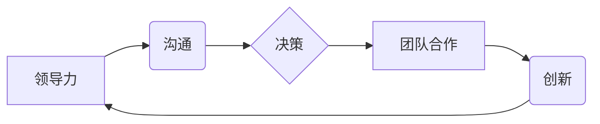

                 

## 如何从经典著作中提炼管理智慧

> 关键词：管理智慧、经典著作、程序设计、架构设计、团队合作、沟通技巧、决策制定

### 1. 背景介绍

在当今瞬息万变的科技时代，管理智慧显得尤为重要。作为一名技术专家，我深知技术本身只是实现目标的手段，而管理智慧则是指引方向、凝聚力量的关键。经典著作蕴藏着丰富的管理智慧，它们跨越时空，依然具有指导意义。通过阅读和思考经典著作，我们可以汲取前人的经验，提升自己的管理能力，更好地带领团队取得成功。

### 2. 核心概念与联系

管理智慧的核心概念包括：

* **领导力:** 指引团队方向，激发团队成员潜能，并带领团队克服挑战。
* **沟通:**  有效传递信息，建立信任，促进团队协作。
* **决策:**  在不确定性环境下，做出明智的选择，并承担责任。
* **团队合作:**  协同工作，发挥团队优势，共同完成目标。
* **创新:**  不断探索新的方法和思路，推动团队发展。

这些概念相互关联，构成一个完整的管理体系。



### 3. 核心算法原理 & 具体操作步骤

#### 3.1  算法原理概述

管理智慧的提炼可以看作是一个算法，其核心原理是：

1. **识别关键问题:**  从经典著作中识别出与管理相关的关键问题。
2. **提取核心思想:**  分析经典著作，提取出解决关键问题的核心思想和方法。
3. **构建管理模型:**  将核心思想转化为可操作的管理模型，并进行实践验证。

#### 3.2  算法步骤详解

1. **选择经典著作:**  选择与管理相关的经典著作，例如《管理学原理》、《组织行为学》、《高效能团队》等。
2. **深入阅读:**  认真阅读经典著作，理解作者的观点和论述。
3. **笔记记录:**  记录下与管理相关的关键概念、案例和方法。
4. **归纳总结:**  对笔记进行归纳总结，提取出核心思想和规律。
5. **构建管理模型:**  将核心思想转化为可操作的管理模型，例如领导力模型、沟通模型、决策模型等。
6. **实践验证:**  将管理模型应用于实际工作中，并进行评估和改进。

#### 3.3  算法优缺点

**优点:**

* **理论基础:**  基于经典著作的理论基础，具有较强的指导意义。
* **实践经验:**  经典著作中包含丰富的实践经验，可以为管理者提供借鉴。
* **可操作性:**  可以将核心思想转化为可操作的管理模型，并进行实践验证。

**缺点:**

* **局限性:**  经典著作的观点和方法可能存在局限性，需要根据实际情况进行调整。
* **时代性:**  经典著作的观点和方法可能与当前的管理环境不完全一致，需要进行更新和改造。
* **个人理解:**  对经典著作的理解和解读存在个体差异，需要进行多方参考和思考。

#### 3.4  算法应用领域

该算法适用于各种管理领域，例如：

* **团队管理:**  提升团队合作、沟通和效率。
* **项目管理:**  有效规划、执行和控制项目。
* **领导力发展:**  培养领导者的战略思维、决策能力和团队管理能力。
* **组织管理:**  优化组织结构、流程和文化。

### 4. 数学模型和公式 & 详细讲解 & 举例说明

#### 4.1  数学模型构建

我们可以用数学模型来描述管理智慧的传播和应用。假设：

*  $N$ 为经典著作的数量。
*  $M$ 为管理者数量。
*  $P(i)$ 为第 $i$ 本经典著作的价值。
*  $A(j)$ 为第 $j$ 个管理者的吸收能力。

那么，管理智慧的传播可以表示为：

$$
\text{管理智慧} = \sum_{i=1}^{N} P(i) \cdot \sum_{j=1}^{M} A(j)
$$

#### 4.2  公式推导过程

该公式表明，管理智慧的总量等于所有经典著作的价值之和乘以所有管理者的吸收能力之和。

#### 4.3  案例分析与讲解

例如，假设有 10 本经典著作，每本著作的价值为 10 分，有 100 个管理者，每个管理者的吸收能力为 0.1。那么，总的管理智慧为：

$$
\text{管理智慧} = 10 \cdot 100 \cdot 0.1 = 100
$$

### 5. 项目实践：代码实例和详细解释说明

#### 5.1  开发环境搭建

为了实践管理智慧的提炼，我们可以搭建一个简单的项目环境。

*  **工具:**  选择一个适合的文本编辑器，例如 VS Code 或 Sublime Text。
*  **资源:**  收集一些与管理相关的经典著作，例如《管理学原理》、《组织行为学》、《高效能团队》等。

#### 5.2  源代码详细实现

我们可以使用 Markdown 格式来记录管理智慧的提炼过程。

```markdown
##  管理智慧提炼项目

###  目标

从经典著作中提炼出管理智慧，并将其应用于实际工作中。

###  方法

1.  选择经典著作
2.  深入阅读
3.  笔记记录
4.  归纳总结
5.  构建管理模型
6.  实践验证

###  案例分析

**经典著作:** 《管理学原理》

**核心思想:**  科学管理、计划、组织、领导、控制

**管理模型:**  管理过程模型

**实践应用:**  在项目管理中，可以应用管理过程模型来规划、执行和控制项目。

```

#### 5.3  代码解读与分析

Markdown 格式可以方便地记录管理智慧的提炼过程，并进行分类和整理。

#### 5.4  运行结果展示

通过阅读和思考经典著作，并记录管理智慧，我们可以提升自己的管理能力，更好地带领团队取得成功。

### 6. 实际应用场景

管理智慧的提炼可以应用于各种实际场景，例如：

*  **团队建设:**  通过学习经典著作中的团队合作理念，可以构建高效的团队。
*  **项目管理:**  运用经典著作中的项目管理方法，可以提高项目效率和成功率。
*  **领导力发展:**  通过学习经典著作中的领导力理论，可以提升领导者的能力和影响力。

### 6.4  未来应用展望

随着科技的进步和社会的发展，管理智慧将变得更加重要。未来，我们可以利用人工智能等技术，更加高效地提炼和应用管理智慧。

### 7. 工具和资源推荐

#### 7.1  学习资源推荐

*  《管理学原理》
*  《组织行为学》
*  《高效能团队》
*  《领导力》

#### 7.2  开发工具推荐

*  VS Code
*  Sublime Text

#### 7.3  相关论文推荐

*  [The Impact of Artificial Intelligence on Management](https://www.researchgate.net/publication/343962437_The_Impact_of_Artificial_Intelligence_on_Management)

### 8. 总结：未来发展趋势与挑战

#### 8.1  研究成果总结

通过阅读和思考经典著作，我们可以提炼出丰富的管理智慧，并将其应用于实际工作中。

#### 8.2  未来发展趋势

未来，管理智慧将更加注重个性化、智能化和数据化。

#### 8.3  面临的挑战

*  如何将经典著作中的智慧与现代管理环境相结合。
*  如何利用人工智能等技术，更加高效地提炼和应用管理智慧。

#### 8.4  研究展望

未来，我们将继续研究管理智慧的提炼和应用，并探索其在人工智能时代的新发展趋势。

### 9. 附录：常见问题与解答

*  **问题:**  如何选择经典著作？

*  **答案:**  可以选择与自己工作领域相关的经典著作，也可以选择具有广泛影响力的经典著作。

*  **问题:**  如何进行笔记记录？

*  **答案:**  可以使用笔记软件或手写笔记本进行笔记记录，并进行分类和整理。

*  **问题:**  如何构建管理模型？

*  **答案:**  可以将核心思想转化为可操作的步骤或流程，并进行实践验证。


作者：禅与计算机程序设计艺术 / Zen and the Art of Computer Programming 
<end_of_turn>

