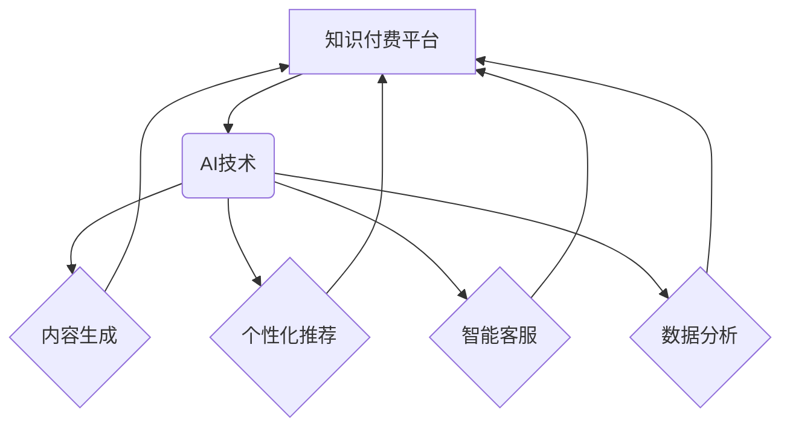

                 

## 如何利用AI技术提升知识付费效率

> 关键词：人工智能、知识付费、效率提升、内容生成、个性化推荐、智能客服、数据分析、机器学习

## 1. 背景介绍

知识付费行业近年来发展迅速，从线上课程、付费咨询到会员体系，各种模式层出不穷。然而，随着市场竞争的加剧，如何提升知识付费的效率，更好地服务用户，成为行业面临的共同挑战。

传统知识付费模式存在一些弊端：

* **内容生产效率低:**  优质知识内容的创作需要大量时间和精力，单靠人力难以满足市场需求。
* **用户匹配度低:**  平台难以精准匹配用户需求和合适的知识内容，导致用户体验不佳。
* **服务体验差:**  用户在学习过程中缺乏个性化指导和互动，难以获得最佳学习效果。

人工智能技术的出现为知识付费行业带来了新的机遇。AI可以帮助知识付费平台解决上述问题，提升效率，提升用户体验。

## 2. 核心概念与联系

**2.1 核心概念**

* **知识付费:** 指的是通过付费的方式获取知识、技能和经验。
* **人工智能 (AI):**  模拟人类智能的计算机系统，能够学习、推理和解决问题。
* **机器学习 (ML):**  人工智能的一个子领域，通过算法从数据中学习，不断改进自身性能。

**2.2 架构关系**



**2.3 核心联系**

AI技术可以应用于知识付费平台的各个环节，实现内容生成、个性化推荐、智能客服、数据分析等功能，从而提升知识付费的效率和用户体验。

## 3. 核心算法原理 & 具体操作步骤

**3.1 算法原理概述**

本节将介绍几种常用的AI算法，以及它们在知识付费领域的应用。

* **自然语言处理 (NLP):**  用于处理和理解人类语言，可以应用于内容生成、智能客服等领域。
* **机器翻译:**  将一种语言翻译成另一种语言，可以帮助知识付费平台提供多语言服务。
* **文本摘要:**  将长篇文本压缩成短篇摘要，可以帮助用户快速了解内容要点。
* **情感分析:**  分析文本中的情感倾向，可以帮助平台了解用户对内容的反馈。
* **推荐系统:**  根据用户的历史行为和偏好，推荐相关的知识内容。

**3.2 算法步骤详解**

以内容生成为例，详细介绍其算法步骤：

1. **数据收集:**  收集大量相关领域的文本数据，例如书籍、文章、论文等。
2. **数据预处理:**  对收集到的数据进行清洗、格式化和标注等处理，使其适合模型训练。
3. **模型选择:**  选择合适的深度学习模型，例如GPT-3、BERT等，用于生成文本内容。
4. **模型训练:**  利用预处理后的数据训练模型，使其能够生成高质量的文本内容。
5. **内容生成:**  输入特定主题或关键词，模型根据训练数据生成相应的文本内容。
6. **内容审核:**  对生成的文本内容进行审核，确保其准确性、原创性和质量。

**3.3 算法优缺点**

* **优点:**  可以自动生成高质量的知识内容，提高内容生产效率。
* **缺点:**  生成的文本内容可能缺乏深度和原创性，需要人工审核和修改。

**3.4 算法应用领域**

* **自动生成课程内容:**  根据课程主题，自动生成课程讲义、习题、案例等。
* **创作个性化学习计划:**  根据用户的学习目标和进度，自动生成个性化的学习计划。
* **生成知识问答:**  根据用户提出的问题，自动生成相关知识的答案。

## 4. 数学模型和公式 & 详细讲解 & 举例说明

**4.1 数学模型构建**

推荐系统通常使用协同过滤算法，其核心思想是基于用户的相似度或物品的相似度进行推荐。

**4.2 公式推导过程**

协同过滤算法中常用的公式包括：

* **用户相似度计算公式:**

$$
Sim(u_i, u_j) = \frac{\sum_{k=1}^{n} r_{i,k} * r_{j,k}}{\sqrt{\sum_{k=1}^{n} r_{i,k}^2} * \sqrt{\sum_{k=1}^{n} r_{j,k}^2}}
$$

其中：

* $u_i$ 和 $u_j$ 表示两个用户。
* $r_{i,k}$ 和 $r_{j,k}$ 表示用户 $u_i$ 和 $u_j$ 对物品 $k$ 的评分。
* $n$ 表示物品总数。

* **物品相似度计算公式:**

$$
Sim(i, j) = \frac{\sum_{u=1}^{m} r_{u,i} * r_{u,j}}{\sqrt{\sum_{u=1}^{m} r_{u,i}^2} * \sqrt{\sum_{u=1}^{m} r_{u,j}^2}}
$$

其中：

* $i$ 和 $j$ 表示两个物品。
* $r_{u,i}$ 和 $r_{u,j}$ 表示用户 $u$ 对物品 $i$ 和 $j$ 的评分。
* $m$ 表示用户总数。

**4.3 案例分析与讲解**

假设有一个电影推荐系统，用户对电影的评分如下：

| 用户 | 电影 A | 电影 B | 电影 C |
|---|---|---|---|
| 用户 1 | 5 | 3 | 4 |
| 用户 2 | 4 | 5 | 2 |
| 用户 3 | 3 | 4 | 5 |

我们可以使用上述公式计算用户之间的相似度和电影之间的相似度，然后根据相似度进行推荐。例如，如果用户 1 想看电影，我们可以根据用户 1 和其他用户的相似度，推荐用户 2 和用户 3 喜欢的电影。

## 5. 项目实践：代码实例和详细解释说明

**5.1 开发环境搭建**

本项目使用 Python 语言开发，需要安装以下软件：

* Python 3.x
* TensorFlow 或 PyTorch
* Jupyter Notebook

**5.2 源代码详细实现**

以下代码示例展示了如何使用 TensorFlow 实现一个简单的文本生成模型：

```python
import tensorflow as tf

# 定义模型结构
model = tf.keras.Sequential([
    tf.keras.layers.Embedding(input_dim=10000, output_dim=128),
    tf.keras.layers.LSTM(128),
    tf.keras.layers.Dense(10000, activation='softmax')
])

# 编译模型
model.compile(loss='sparse_categorical_crossentropy', optimizer='adam')

# 训练模型
model.fit(x_train, y_train, epochs=10)

# 生成文本
text = model.predict(x_test)
```

**5.3 代码解读与分析**

* `Embedding` 层将单词转换为向量表示。
* `LSTM` 层用于处理文本序列数据。
* `Dense` 层输出每个单词的概率分布。
* `sparse_categorical_crossentropy` 是文本分类的损失函数。
* `adam` 是常用的优化算法。

**5.4 运行结果展示**

训练完成后，模型可以用于生成新的文本内容。

## 6. 实际应用场景

**6.1 内容生成**

* 自动生成课程讲义、习题、案例等。
* 创作个性化学习计划。
* 生成知识问答。

**6.2 个性化推荐**

* 根据用户的学习目标和进度，推荐相关的知识内容。
* 根据用户的兴趣爱好，推荐相关的课程和资源。

**6.3 智能客服**

* 自动回答用户常见问题。
* 提供个性化的学习指导和建议。

**6.4 数据分析**

* 分析用户学习行为，了解用户需求和痛点。
* 评估课程效果，改进教学内容。

**6.5 未来应用展望**

* 更智能的个性化学习体验。
* 更精准的知识推荐。
* 更丰富的互动学习方式。

## 7. 工具和资源推荐

**7.1 学习资源推荐**

* **在线课程:** Coursera、edX、Udacity 等平台提供丰富的AI课程。
* **书籍:** 《深度学习》、《机器学习实战》等书籍介绍了AI的基础知识和应用。
* **开源项目:** TensorFlow、PyTorch 等开源项目提供了丰富的AI工具和资源。

**7.2 开发工具推荐**

* **Python:**  AI开发的常用语言。
* **Jupyter Notebook:**  交互式编程环境，方便AI模型开发和调试。
* **TensorFlow/PyTorch:**  主流的深度学习框架。

**7.3 相关论文推荐**

* **Attention Is All You Need:**  介绍了Transformer模型，用于自然语言处理任务。
* **BERT: Pre-training of Deep Bidirectional Transformers for Language Understanding:**  介绍了BERT模型，用于文本理解任务。
* **Generative Pre-trained Transformer 3 (GPT-3):**  介绍了GPT-3模型，用于文本生成任务。

## 8. 总结：未来发展趋势与挑战

**8.1 研究成果总结**

AI技术在知识付费领域的应用取得了显著成果，例如内容生成、个性化推荐、智能客服等功能得到了广泛应用。

**8.2 未来发展趋势**

* **更智能的AI模型:**  未来将开发更智能、更强大的AI模型，能够更好地理解和生成人类语言，提供更个性化的学习体验。
* **更丰富的交互方式:**  AI技术将与其他技术融合，例如虚拟现实、增强现实等，提供更丰富的交互方式，提升学习的趣味性和沉浸感。
* **更精准的数据分析:**  AI技术将能够更精准地分析用户学习行为，提供更个性化的学习建议和指导。

**8.3 面临的挑战**

* **数据安全和隐私保护:**  AI模型的训练需要大量数据，如何保证数据安全和用户隐私保护是一个重要的挑战。
* **算法偏见:**  AI模型可能存在算法偏见，导致推荐结果不公平，需要不断改进算法，消除偏见。
* **伦理问题:**  AI技术的发展也带来了一些伦理问题，例如内容原创性、知识产权等，需要社会共同探讨和解决。

**8.4 研究展望**

未来，AI技术将继续推动知识付费行业的发展，为用户提供更智能、更便捷、更个性化的学习体验。


## 9. 附录：常见问题与解答

**9.1 如何选择合适的AI模型？**

选择合适的AI模型需要根据具体的应用场景和数据特点进行选择。例如，文本生成任务可以使用GPT-3模型，而推荐系统可以使用协同过滤算法。

**9.2 如何解决AI模型的算法偏见问题？**

可以采用以下方法解决算法偏见问题：

* 使用更公平的数据集进行模型训练。
* 在模型训练过程中加入公平性约束。
* 对模型输出进行调优，消除偏见。

**9.3 如何保证数据安全和用户隐私保护？**

可以采用以下方法保证数据安全和用户隐私保护：

* 对用户数据进行匿名化处理。
* 使用加密技术保护用户数据。
* 遵守相关数据安全和隐私保护法规。


作者：禅与计算机程序设计艺术 / Zen and the Art of Computer Programming 
<end_of_turn>

