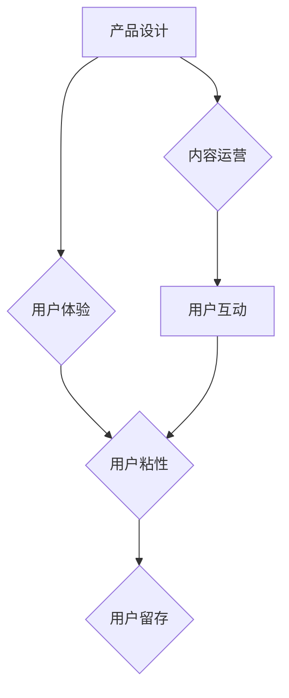

                 

## 如何提高知识付费产品的用户留存率

> 关键词：知识付费、用户留存、产品设计、用户体验、数据分析、内容运营、社区建设、付费转化

## 1. 背景介绍

知识付费行业近年来发展迅速，涌现出大量优质的知识产品。然而，用户留存率一直是知识付费产品面临的挑战。用户付费购买知识产品后，往往存在着“付费后不复购”的现象，导致产品生命周期缩短，收益难以持续。提高用户留存率，对于知识付费产品的长期发展至关重要。

## 2. 核心概念与联系

**2.1 用户留存率的概念**

用户留存率是指在特定时间段内，仍然活跃使用产品的用户比例。它是一个衡量产品用户粘性的重要指标。

**2.2 用户留存率与知识付费产品的关系**

知识付费产品的核心价值在于提供持续的知识增值和学习体验。用户留存率直接反映了用户对产品价值的认可和持续学习的意愿。

**2.3 影响用户留存率的因素**

* **产品质量:** 内容深度、实用性、更新频率等因素直接影响用户对产品的满意度和复购意愿。
* **用户体验:** 产品界面、交互设计、学习流程等方面都需要优化，以提供流畅、便捷的学习体验。
* **社区氛围:** 建立活跃的学习社区，促进用户之间的交流和互动，增强用户粘性。
* **营销策略:** 吸引新用户的同时，也要注重用户运营，提供个性化服务和内容推荐。

**2.4 用户留存率提升的架构**



## 3. 核心算法原理 & 具体操作步骤

**3.1 算法原理概述**

用户留存率的计算和分析通常采用一些统计学算法和模型，例如：

* **Cohort Analysis:** 将用户按注册时间分组，分析不同群体的留存率变化趋势。
* **Survival Analysis:** 将用户留存视为一个生存事件，利用生存分析模型预测用户留存概率。
* **Recurrent Neural Networks (RNN):** 利用RNN模型学习用户行为序列，预测用户未来的留存行为。

**3.2 算法步骤详解**

* **数据收集:** 收集用户注册时间、登录时间、学习时长、付费行为等数据。
* **数据清洗:** 去除无效数据、缺失值等，确保数据质量。
* **数据分析:** 使用上述算法模型对数据进行分析，计算用户留存率、识别留存关键因素。
* **模型优化:** 根据分析结果，调整算法参数、模型结构，提高预测精度。

**3.3 算法优缺点**

* **Cohort Analysis:** 优点：易于理解、操作简单；缺点：无法捕捉用户行为的动态变化。
* **Survival Analysis:** 优点：能够捕捉用户行为的复杂性；缺点：模型复杂度较高，需要专业知识。
* **Recurrent Neural Networks (RNN):** 优点：能够学习用户行为的长期依赖关系；缺点：训练时间长，参数量大。

**3.4 算法应用领域**

* **知识付费产品:** 预测用户留存率、优化产品设计、内容运营策略。
* **电商平台:** 预测用户复购率、个性化推荐商品。
* **社交媒体:** 预测用户活跃度、优化用户体验。

## 4. 数学模型和公式 & 详细讲解 & 举例说明

**4.1 数学模型构建**

用户留存率可以定义为特定时间段内，仍然活跃使用产品的用户比例。

**4.2 公式推导过程**

假设在时间点 $t$ 注册的用户总数为 $N(t)$，在时间点 $t+k$ 仍然活跃的用户数量为 $L(t,k)$，则用户留存率 $R(t,k)$ 可以表示为：

$$R(t,k) = \frac{L(t,k)}{N(t)}$$

**4.3 案例分析与讲解**

例如，假设一个知识付费平台在某一天注册了 1000 个新用户，一周后仍然活跃的用户有 600 人，则该平台一周的留存率为：

$$R(t,7) = \frac{600}{1000} = 0.6$$

即 60% 的新用户在一周后仍然活跃使用平台。

## 5. 项目实践：代码实例和详细解释说明

**5.1 开发环境搭建**

* Python 3.x
* Pandas
* Matplotlib

**5.2 源代码详细实现**

```python
import pandas as pd
import matplotlib.pyplot as plt

# 数据加载
data = pd.read_csv('user_data.csv')

# 计算留存率
data['date'] = pd.to_datetime(data['date'])
data['day'] = data['date'].dt.dayofyear
cohort_data = data.groupby('day')['user_id'].count().reset_index()
cohort_data.rename(columns={'user_id': 'total_users'}, inplace=True)

# 计算留存率
for i in range(1, 31):
    cohort_data['day_' + str(i)] = cohort_data['day'].apply(lambda x: 1 if x >= i else 0)
    cohort_data['retention_rate_' + str(i)] = cohort_data['day_' + str(i)].rolling(window=i).mean()

# 数据可视化
plt.figure(figsize=(10, 6))
plt.plot(cohort_data['day'], cohort_data['retention_rate_1'], label='Day 1')
plt.plot(cohort_data['day'], cohort_data['retention_rate_7'], label='Day 7')
plt.plot(cohort_data['day'], cohort_data['retention_rate_14'], label='Day 14')
plt.xlabel('Day')
plt.ylabel('Retention Rate')
plt.title('User Retention Rate')
plt.legend()
plt.show()
```

**5.3 代码解读与分析**

* 代码首先加载用户数据，并计算用户注册日期和天数。
* 然后，根据用户注册日期，计算不同天数的留存率。
* 最后，使用 Matplotlib 库绘制留存率曲线，直观展示用户留存趋势。

**5.4 运行结果展示**

运行代码后，会生成一个展示用户留存率趋势的曲线图。

## 6. 实际应用场景

**6.1 知识付费产品运营**

* 识别用户留存关键因素，优化产品设计和内容运营策略。
* 预测用户留存率，制定精准的营销推广计划。
* 建立用户画像，提供个性化学习推荐和服务。

**6.2 社交媒体平台**

* 预测用户活跃度，优化平台功能和用户体验。
* 识别用户群体，进行精准内容推送和广告投放。
* 促进用户互动，增强平台粘性。

**6.3 电商平台**

* 预测用户复购率，优化商品推荐和促销策略。
* 识别用户行为模式，提供个性化购物体验。
* 建立用户忠诚度，提高平台用户生命周期价值。

**6.4 未来应用展望**

随着人工智能技术的不断发展，用户留存率的预测和分析将更加精准和智能化。未来，我们可以期待：

* 利用深度学习模型，更准确地预测用户留存行为。
* 基于用户行为数据，提供更个性化的学习推荐和服务。
* 建立更智能的社区系统，促进用户互动和协作。

## 7. 工具和资源推荐

**7.1 学习资源推荐**

* **书籍:**
    * 《用户留存分析》
    * 《数据分析实战》
* **在线课程:**
    * Coursera: 数据分析与机器学习
    * Udemy: 用户留存分析与预测

**7.2 开发工具推荐**

* **Python:** 数据分析和机器学习的常用语言。
* **Pandas:** 数据处理和分析库。
* **Matplotlib:** 数据可视化库。
* **Scikit-learn:** 机器学习库。

**7.3 相关论文推荐**

* **Cohort Analysis for User Retention Prediction**
* **Survival Analysis for User Churn Prediction**
* **Recurrent Neural Networks for User Behavior Prediction**

## 8. 总结：未来发展趋势与挑战

**8.1 研究成果总结**

本文介绍了知识付费产品用户留存率的概念、影响因素、算法原理、实践案例以及未来发展趋势。

**8.2 未来发展趋势**

* **人工智能技术:** 利用人工智能技术，更精准地预测用户留存行为，提供个性化学习推荐和服务。
* **数据分析:** 深入挖掘用户行为数据，识别留存关键因素，优化产品设计和运营策略。
* **社区建设:** 建立更活跃的学习社区，促进用户互动和协作，增强用户粘性。

**8.3 面临的挑战**

* **数据质量:** 确保用户数据准确、完整、及时，为留存分析提供可靠基础。
* **算法模型:** 开发更精准、更有效的留存预测模型，应对用户行为的复杂性。
* **用户隐私:** 保护用户隐私，合理利用用户数据，构建用户信任。

**8.4 研究展望**

未来，我们将继续深入研究用户留存率的预测和分析，探索更智能、更有效的留存策略，为知识付费产品的发展提供技术支持。

## 9. 附录：常见问题与解答

**9.1 如何提高用户留存率？**

* 提供高质量、实用性强的知识产品。
* 优化用户体验，提供流畅、便捷的学习流程。
* 建立活跃的学习社区，促进用户互动和交流。
* 提供个性化学习推荐和服务。
* 定期收集用户反馈，不断优化产品和服务。

**9.2 什么是Cohort Analysis？**

Cohort Analysis 是将用户按注册时间分组，分析不同群体的留存率变化趋势的一种方法。

**9.3 如何使用 Python 计算用户留存率？**

可以使用 Pandas 和 Matplotlib 库，根据用户注册日期和活跃时间，计算不同天数的留存率，并绘制留存率曲线。


作者：禅与计算机程序设计艺术 / Zen and the Art of Computer Programming 
<end_of_turn>

