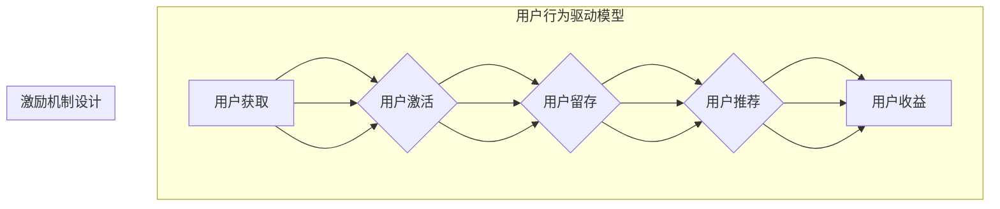

                 

## 如何进行有效的用户激励计划

> 关键词：用户激励、行为驱动、游戏化设计、心理学原理、数据分析、奖励机制、用户体验

## 1. 背景介绍

在当今数字化时代，用户获取和留存是任何互联网产品和服务的核心命题。如何有效激励用户，引导他们持续使用产品，并最终转化为忠实用户，是企业持续发展的关键。传统的营销手段已经难以满足用户日益多元化的需求，因此，设计合理的激励计划，以用户行为为驱动，成为企业提升用户粘性和增长的重要策略。

## 2. 核心概念与联系

用户激励计划的核心在于理解用户行为，并通过设计合理的激励机制，引导用户完成预期的行为。

**2.1 用户行为驱动模型**

用户行为驱动模型通常基于心理学原理，将用户行为分为不同的阶段，并针对每个阶段设计相应的激励策略。常见的模型包括：

* **AARRR漏斗模型:**  关注用户从获取到留存的整个生命周期，包括吸引 (Acquisition)、激活 (Activation)、留存 (Retention)、推荐 (Referral) 和收益 (Revenue)。
* **用户旅程模型:**  从用户的视角出发，描绘用户与产品交互的整个过程，并针对不同阶段的用户需求和行为，设计个性化的激励方案。

**2.2  激励机制设计**

激励机制的设计需要考虑以下几个关键因素：

* **目标用户:**  不同的用户群体有不同的需求和动机，激励机制需要针对不同用户群体的特点进行定制。
* **行为目标:**  明确需要引导用户完成的具体行为，例如注册、登录、分享、购买等。
* **激励类型:**  常见的激励类型包括：
    * **物质奖励:**  例如优惠券、积分、礼品等。
    * **社会奖励:**  例如点赞、评论、排行榜等。
    * **成就奖励:**  例如解锁新功能、获得成就感等。
* **激励强度:**  激励强度需要根据用户的行为目标和参与程度进行调整，避免过度激励或激励不足。

**2.3  流程图**



## 3. 核心算法原理 & 具体操作步骤

**3.1 算法原理概述**

用户激励计划的算法原理主要基于行为分析和预测模型。通过收集用户行为数据，分析用户行为模式，并利用机器学习算法，预测用户的未来行为，从而设计更精准的激励策略。

**3.2 算法步骤详解**

1. **数据收集:** 收集用户行为数据，例如注册时间、登录频率、使用时长、购买记录、评论点赞等。
2. **数据清洗:** 对收集到的数据进行清洗和预处理，去除无效数据和噪声数据，确保数据质量。
3. **特征提取:** 从用户行为数据中提取特征，例如用户活跃度、用户偏好、用户价值等。
4. **模型训练:** 利用机器学习算法，例如回归模型、分类模型、聚类模型等，对用户行为数据进行建模，预测用户的未来行为。
5. **策略制定:** 根据模型预测结果，制定相应的激励策略，例如针对不同用户群体的个性化激励、针对不同行为的差异化激励等。
6. **策略评估:**  对激励策略的效果进行评估，例如用户留存率、用户转化率、用户满意度等，并根据评估结果进行策略调整。

**3.3 算法优缺点**

* **优点:** 
    * 能够精准预测用户行为，设计更有效的激励策略。
    * 能够根据用户行为变化动态调整激励策略，提高激励效果。
    * 能够量化激励效果，方便评估和优化。
* **缺点:** 
    * 需要大量的用户行为数据进行训练，数据质量对模型效果至关重要。
    * 模型训练和部署需要一定的技术成本。
    * 算法本身存在一定的局限性，无法完全预测用户的复杂行为。

**3.4 算法应用领域**

* **游戏:**  设计游戏内奖励机制，提高玩家参与度和留存率。
* **电商:**  根据用户购买行为，推荐个性化商品和优惠活动，提高转化率。
* **社交媒体:**  根据用户互动行为，推荐好友和内容，提高用户活跃度。
* **教育:**  根据用户学习进度，提供个性化学习建议和奖励，提高学习效率。

## 4. 数学模型和公式 & 详细讲解 & 举例说明

**4.1 数学模型构建**

用户激励计划的数学模型通常基于强化学习理论，将用户行为视为一个马尔可夫决策过程 (MDP)。

* **状态空间:**  用户在产品中的状态，例如用户等级、用户积分、用户偏好等。
* **动作空间:**  用户可以执行的动作，例如注册、登录、购买、分享等。
* **奖励函数:**  用户执行特定动作后获得的奖励，例如积分、优惠券、成就感等。
* **转移概率:**  用户从一个状态转移到另一个状态的概率。

**4.2 公式推导过程**

强化学习的目标是找到一个最优策略，使得用户在整个交互过程中获得最大的总奖励。最优策略可以通过动态规划算法或蒙特卡罗方法来求解。

* **Bellman方程:**  描述了用户在不同状态下选择不同动作的期望奖励。
* **价值函数:**  表示用户在特定状态下获得的期望总奖励。

**4.3 案例分析与讲解**

例如，一个游戏应用可以使用强化学习算法来设计用户激励计划。

* **状态空间:**  用户等级、用户积分、用户游戏进度等。
* **动作空间:**  玩家可以执行的动作，例如完成任务、购买道具、邀请好友等。
* **奖励函数:**  玩家完成任务获得经验值和金币，购买道具获得游戏优势，邀请好友获得额外奖励等。
* **转移概率:**  玩家完成任务后升级，购买道具后获得相应能力，邀请好友后获得新玩家等。

通过训练强化学习模型，游戏应用可以根据用户的行为模式，动态调整奖励机制，引导玩家完成预期的行为，提高玩家的参与度和留存率。

## 5. 项目实践：代码实例和详细解释说明

**5.1 开发环境搭建**

* **编程语言:** Python
* **机器学习库:** scikit-learn, TensorFlow, PyTorch
* **数据存储:** MySQL, MongoDB

**5.2 源代码详细实现**

```python
# 导入必要的库
import pandas as pd
from sklearn.model_selection import train_test_split
from sklearn.linear_model import LogisticRegression

# 加载用户行为数据
data = pd.read_csv("user_behavior.csv")

# 数据预处理
# ...

# 将数据分为训练集和测试集
X_train, X_test, y_train, y_test = train_test_split(data.drop("target", axis=1), data["target"], test_size=0.2)

# 训练逻辑回归模型
model = LogisticRegression()
model.fit(X_train, y_train)

# 模型评估
# ...

# 使用模型预测用户行为
predictions = model.predict(X_test)

# ...
```

**5.3 代码解读与分析**

* 代码首先导入必要的库，例如 pandas 用于数据处理，scikit-learn 用于机器学习模型训练。
* 然后加载用户行为数据，并进行数据预处理，例如缺失值处理、特征工程等。
* 将数据分为训练集和测试集，用于模型训练和评估。
* 使用逻辑回归模型训练用户行为预测模型。
* 最后使用模型预测用户行为，并进行评估。

**5.4 运行结果展示**

* 模型评估指标，例如准确率、召回率、F1-score等。
* 用户行为预测结果，例如用户是否会购买商品、是否会分享内容等。

## 6. 实际应用场景

**6.1 游戏应用**

* **新手引导:**  通过游戏内任务和奖励，引导新用户熟悉游戏规则和玩法。
* **用户留存:**  根据用户活跃度和游戏进度，提供个性化奖励和活动，提高用户留存率。
* **付费转化:**  根据用户游戏行为，推荐付费道具和服务，提高付费转化率。

**6.2 电商应用**

* **用户注册:**  提供注册奖励，例如优惠券、积分等，鼓励用户注册账号。
* **商品推荐:**  根据用户浏览和购买历史，推荐个性化商品，提高商品转化率。
* **会员体系:**  建立会员体系，提供不同等级的会员权益和奖励，提高用户忠诚度。

**6.3 社交媒体应用**

* **用户活跃度:**  通过点赞、评论、分享等行为，给予用户奖励，提高用户活跃度。
* **内容推荐:**  根据用户兴趣和行为，推荐个性化内容，提高用户粘性。
* **用户增长:**  鼓励用户邀请好友，提供邀请奖励，扩大用户群体。

**6.4 未来应用展望**

随着人工智能技术的不断发展，用户激励计划将更加智能化、个性化和精准化。

* **更深入的用户行为分析:**  利用更先进的机器学习算法，对用户行为进行更深入的分析，挖掘用户潜在需求和动机。
* **更个性化的激励策略:**  根据用户的个人特征、行为模式和偏好，设计更个性化的激励策略，提高激励效果。
* **更丰富的激励形式:**  除了传统的物质奖励和社会奖励，未来将出现更多形式的激励，例如虚拟奖励、体验奖励等。


## 7. 工具和资源推荐

**7.1 学习资源推荐**

* **书籍:**
    * 《行为设计》
    * 《激励用户：设计用户体验的艺术》
    * 《Hooked：如何打造让人上瘾的产品》
* **在线课程:**
    * Coursera:  用户体验设计
    * Udemy:  行为心理学
    * edX:  数据分析

**7.2 开发工具推荐**

* **数据分析工具:**  Tableau, Power BI
* **机器学习平台:**  Google Cloud AI Platform, Amazon SageMaker
* **用户行为分析工具:**  Mixpanel, Amplitude

**7.3 相关论文推荐**

* **《用户激励机制设计与分析》**
* **《基于强化学习的用户激励策略》**
* **《游戏化设计在用户激励中的应用》**

## 8. 总结：未来发展趋势与挑战

**8.1 研究成果总结**

用户激励计划的研究取得了显著进展，从传统的营销手段向数据驱动、个性化、智能化方向发展。

**8.2 未来发展趋势**

* **更精准的用户行为预测:**  利用更先进的机器学习算法，对用户行为进行更精准的预测。
* **更个性化的激励策略:**  根据用户的个人特征、行为模式和偏好，设计更个性化的激励策略。
* **更丰富的激励形式:**  除了传统的物质奖励和社会奖励，未来将出现更多形式的激励，例如虚拟奖励、体验奖励等。

**8.3 面临的挑战**

* **数据隐私保护:**  用户行为数据涉及个人隐私，需要采取有效的措施保护用户数据安全。
* **算法公平性:**  用户激励计划的算法需要确保公平性，避免歧视或偏见。
* **激励机制的长期有效性:**  用户对激励机制的敏感度会随着时间的推移而降低，需要不断调整和优化激励策略。

**8.4 研究展望**

未来，用户激励计划的研究将更加注重用户体验、数据隐私保护和算法公平性。


## 9. 附录：常见问题与解答

**9.1 如何评估用户激励计划的有效性？**

用户激励计划的有效性可以通过以下指标进行评估：

* **用户留存率:**  用户在一段时间内持续使用产品的比例。
* **用户转化率:**  用户完成特定行为的比例，例如注册、购买、分享等。
* **用户活跃度:**  用户在一段时间内与产品交互的频率。
* **用户满意度:**  用户对产品和激励计划的满意程度。

**9.2 如何设计个性化的用户激励计划？**

个性化的用户激励计划需要根据用户的个人特征、行为模式和偏好进行定制。

* **用户画像:**  收集用户数据，构建用户画像，了解用户的兴趣、需求和行为模式。
* **行为分析:**  分析用户的行为数据，识别用户的行为特征和偏好。
* **激励策略定制:**  根据用户的画像和行为分析结果，设计个性化的激励策略，例如提供个性化的推荐、定制化的奖励等。

**9.3 如何避免用户对激励计划产生依赖？**

* **梯度奖励:**  逐渐减少奖励强度，避免用户过度依赖奖励。
* **多样化激励:**  提供多种形式的激励，例如物质奖励、社会奖励、成就奖励等，避免用户对单一奖励产生依赖。
* **价值创造:**  设计激励计划的同时，也要注重产品本身的价值创造，让用户在使用产品过程中获得真正的价值。


作者：禅与计算机程序设计艺术 / Zen and the Art of Computer Programming 
<end_of_turn>

