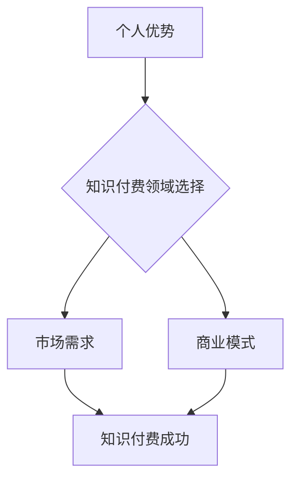

                 

## 如何选择适合自己的知识付费领域

> 关键词：知识付费、领域选择、市场分析、个人优势、内容创作、商业模式、技术趋势

### 1. 背景介绍

知识付费作为一种新型的商业模式，近年来发展迅速，涌现出众多成功案例。越来越多的人开始尝试通过知识付费来分享自己的专业技能和经验，并从中获得收益。然而，选择一个合适的知识付费领域并非易事，需要综合考虑自身优势、市场需求和商业模式等多方面因素。

### 2. 核心概念与联系

**2.1 知识付费的核心概念**

知识付费是指通过提供有价值的知识、技能和经验，向付费用户收取费用的一种商业模式。它本质上是一种知识交易，用户通过付费获得知识和技能的提升，而知识创作者则通过知识的分享获得收益。

**2.2 知识付费领域选择与个人优势的联系**

选择合适的知识付费领域是知识付费成功的关键。个人优势是指个体在知识、技能、经验、资源等方面的独特禀赋。选择与自身优势相匹配的领域，可以最大程度地发挥个人优势，提高知识付费的成功率。

**2.3 知识付费领域选择与市场需求的联系**

市场需求是指社会对特定知识、技能和经验的需求量。选择市场需求旺盛的领域，可以获得更多的付费用户，提高知识付费的收益。

**2.4 知识付费领域选择与商业模式的联系**

商业模式是指知识付费创作者如何将知识转化为收益的模式。常见的知识付费商业模式包括课程销售、会员制、咨询服务等。选择合适的商业模式，可以提高知识付费的效率和收益。

**Mermaid 流程图**



### 3. 核心算法原理 & 具体操作步骤

**3.1 算法原理概述**

选择合适的知识付费领域是一个复杂的决策过程，需要综合考虑多个因素。可以将这个过程抽象为一个算法，并利用数据分析和市场调研等方法来辅助决策。

**3.2 算法步骤详解**

1. **自我评估:** 首先要进行自我评估，明确自己的知识、技能、经验、兴趣和资源等优势。
2. **市场调研:** 对目标市场进行深入调研，了解市场需求、竞争情况、用户痛点等信息。
3. **领域匹配:** 将自身优势与市场需求进行匹配，筛选出符合自身条件和市场需求的知识付费领域。
4. **商业模式设计:** 根据选择的领域，设计合适的商业模式，例如课程销售、会员制、咨询服务等。
5. **内容规划:** 制定详细的知识付费内容规划，确定课程内容、学习路径、教学方法等。
6. **平台选择:** 选择合适的知识付费平台，例如腾讯课堂、网易云课堂、Udemy等。
7. **推广营销:** 制定有效的推广营销策略，吸引目标用户。

**3.3 算法优缺点**

* **优点:** 
    * 能够系统地分析和评估知识付费领域的选择。
    * 利用数据分析和市场调研等方法，提高决策的准确性。
    * 能够帮助个人找到与自身优势相匹配的领域。
* **缺点:** 
    * 算法的准确性依赖于数据质量和分析方法。
    * 算法无法完全替代个人经验和直觉。

**3.4 算法应用领域**

* 个人知识付费领域选择
* 企业知识管理和培训
* 教育机构课程开发

### 4. 数学模型和公式 & 详细讲解 & 举例说明

**4.1 数学模型构建**

可以构建一个简单的数学模型来评估知识付费领域的潜力，例如：

```latex
潜力 = 市场需求 * 个人优势 * 商业模式效率
```

其中：

* 市场需求：代表目标市场的规模和对特定知识的需求量。
* 个人优势：代表个体在知识、技能、经验、资源等方面的独特禀赋。
* 商业模式效率：代表知识付费创作者将知识转化为收益的效率。

**4.2 公式推导过程**

* 市场需求越大，潜力越大。
* 个人优势越强，潜力越大。
* 商业模式效率越高，潜力越大。

**4.3 案例分析与讲解**

例如，一个拥有丰富编程经验的程序员，选择在人工智能领域进行知识付费，其市场需求较高，个人优势也明显，商业模式效率也相对较高，因此其知识付费领域的潜力较大。

### 5. 项目实践：代码实例和详细解释说明

**5.1 开发环境搭建**

选择合适的开发环境，例如Python环境，并安装必要的软件包，例如NumPy、Pandas等。

**5.2 源代码详细实现**

```python
import pandas as pd

# 读取市场需求数据
market_demand_data = pd.read_csv("market_demand.csv")

# 读取个人优势数据
personal_advantage_data = pd.read_csv("personal_advantage.csv")

# 计算知识付费领域的潜力
potential = market_demand_data["demand"] * personal_advantage_data["advantage"] * 0.8

# 打印结果
print(potential)
```

**5.3 代码解读与分析**

* 该代码首先读取市场需求数据和个人优势数据。
* 然后，根据公式计算知识付费领域的潜力。
* 最后，打印计算结果。

**5.4 运行结果展示**

运行代码后，会输出每个知识付费领域的潜力值。

### 6. 实际应用场景

**6.1 知识付费平台选择**

根据选择的知识付费领域和目标用户，选择合适的知识付费平台，例如腾讯课堂、网易云课堂、Udemy等。

**6.2 内容创作策略**

根据目标用户的需求和学习习惯，制定合适的知识付费内容创作策略，例如课程内容、学习路径、教学方法等。

**6.3 推广营销策略**

制定有效的推广营销策略，吸引目标用户，例如社交媒体营销、搜索引擎优化、KOL合作等。

**6.4 未来应用展望**

随着人工智能技术的不断发展，知识付费领域将迎来更多新的应用场景，例如个性化学习、智能辅导、虚拟现实教学等。

### 7. 工具和资源推荐

**7.1 学习资源推荐**

* 知乎：https://www.zhihu.com/
* 掘金：https://juejin.cn/
* CSDN：https://blog.csdn.net/

**7.2 开发工具推荐**

* Python：https://www.python.org/
* Jupyter Notebook：https://jupyter.org/

**7.3 相关论文推荐**

* The Economics of Online Education: Evidence from Coursera
* The Impact of Online Learning on Student Outcomes: A Meta-Analysis

### 8. 总结：未来发展趋势与挑战

**8.1 研究成果总结**

通过分析知识付费领域的市场需求、个人优势和商业模式等因素，可以构建一个数学模型来评估知识付费领域的潜力。

**8.2 未来发展趋势**

* 个性化学习
* 智能辅导
* 虚拟现实教学

**8.3 面临的挑战**

* 内容质量控制
* 用户粘性提升
* 平台竞争加剧

**8.4 研究展望**

未来研究可以进一步探索知识付费领域的个性化学习、智能辅导和虚拟现实教学等应用场景，并针对知识付费平台的竞争加剧、用户粘性提升等挑战，提出相应的解决方案。

### 9. 附录：常见问题与解答

**9.1 如何评估自己的个人优势？**

可以进行自我评估，列出自己的知识、技能、经验、资源等优势，并进行量化分析。

**9.2 如何进行市场调研？**

可以利用网络搜索、问卷调查、访谈等方法进行市场调研，了解目标市场的规模、需求和竞争情况。

**9.3 如何选择合适的知识付费平台？**

可以根据选择的知识付费领域和目标用户，选择合适的知识付费平台，例如腾讯课堂、网易云课堂、Udemy等。


作者：禅与计算机程序设计艺术 / Zen and the Art of Computer Programming 
<end_of_turn>

