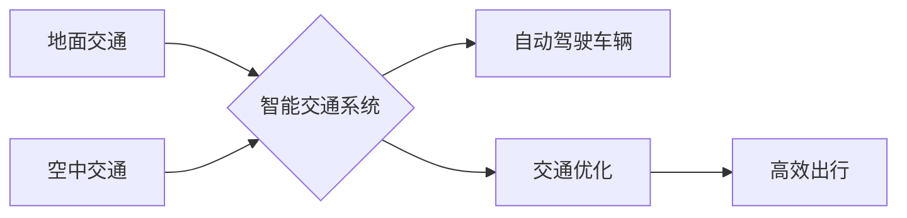

                 

## 2050年的交通出行：从地面到空中

> 关键词：自动驾驶、空中交通、无人机、城市规划、人工智能、交通管理、智能交通系统

### 1. 背景介绍

21世纪，交通出行已经成为人类社会不可或缺的一部分，它不仅影响着人们的生活质量，也深刻地塑造着城市形态和经济发展。然而，随着人口增长和城市化进程的加速，传统交通模式面临着越来越多的挑战：拥堵、污染、安全隐患等问题日益突出。

为了应对这些挑战，人们开始探索新的交通出行方式，将目光投向了未来科技的应用。自动驾驶、空中交通、无人机等新兴技术，为2050年的交通出行带来了前所未有的机遇。

### 2. 核心概念与联系

2050年的交通出行将不再局限于地面，而是形成一个多层次、立体化的交通网络，将地面交通与空中交通有机结合。

**核心概念：**

* **自动驾驶:**  车辆能够自动感知周围环境，并根据预设规则或人工智能算法自主行驶。
* **空中交通:** 利用无人机、飞行汽车等空中交通工具，在城市上方建立空中交通网络。
* **智能交通系统:** 通过传感器、通信网络、数据分析等技术，实现交通流量的实时监测、优化和控制。

**架构流程图:**



### 3. 核心算法原理 & 具体操作步骤

#### 3.1  算法原理概述

自动驾驶的核心算法主要包括：

* **感知算法:** 利用传感器（摄像头、雷达、激光雷达等）获取车辆周围环境信息，并进行数据处理和分析。
* **决策算法:** 根据感知到的环境信息，判断车辆下一步的动作，例如加速、减速、转向等。
* **控制算法:** 将决策结果转化为车辆的实际控制指令，例如油门、刹车、方向盘等。

#### 3.2  算法步骤详解

1. **数据采集:** 传感器收集车辆周围环境信息，包括道路状况、其他车辆位置、行人信息等。
2. **数据预处理:** 对采集到的原始数据进行滤波、去噪等处理，提取有效信息。
3. **目标检测与识别:** 利用计算机视觉算法，识别道路上的目标，例如车辆、行人、交通信号灯等。
4. **路径规划:** 根据目标检测结果和车辆自身状态，规划出最优行驶路径。
5. **决策控制:** 根据路径规划结果，生成车辆的控制指令，控制车辆的加速、减速、转向等动作。

#### 3.3  算法优缺点

**优点:**

* **安全性:** 自动驾驶系统能够提高驾驶安全性，减少人为错误导致的交通事故。
* **效率:** 自动驾驶系统能够优化交通流量，减少拥堵，提高交通效率。
* **舒适性:** 自动驾驶系统能够提供更舒适的驾驶体验，减轻驾驶疲劳。

**缺点:**

* **技术复杂性:** 自动驾驶系统涉及多个领域的复杂技术，开发和测试难度较大。
* **成本高昂:** 自动驾驶系统的硬件和软件成本较高，普及率有限。
* **伦理问题:** 自动驾驶系统在遇到紧急情况时，如何做出决策，涉及伦理道德问题。

#### 3.4  算法应用领域

自动驾驶算法广泛应用于：

* **乘用车:** 自动驾驶汽车、自动驾驶出租车等。
* **商用车:** 自动驾驶卡车、自动驾驶货车等。
* **公共交通:** 自动驾驶公交车、自动驾驶地铁等。
* **物流运输:** 自动驾驶无人配送车等。

### 4. 数学模型和公式 & 详细讲解 & 举例说明

#### 4.1  数学模型构建

自动驾驶系统的路径规划可以利用数学模型进行优化。常用的路径规划模型包括：

* **最短路径算法:** 例如 Dijkstra 算法，用于寻找从起点到终点的最短路径。
* **A* 算法:** 结合启发式搜索和最短路径算法，能够更有效地寻找最优路径。
* **动态规划:** 用于解决多阶段决策问题，例如车辆在复杂路况下的路径规划。

#### 4.2  公式推导过程

**Dijkstra 算法:**

设 $G = (V, E)$ 为一个图，其中 $V$ 为节点集合，$E$ 为边集合。$d(u, v)$ 表示节点 $u$ 到节点 $v$ 的距离。

Dijkstra 算法的目标是找到从起点节点 $s$ 到目标节点 $t$ 的最短路径。

算法步骤：

1. 初始化距离数组 $d$，$d(s, s) = 0$，$d(s, v) = \infty$ ( $v \neq s$ )。
2. 创建一个集合 $S$，用于存储已访问的节点。
3. 循环执行以下步骤，直到 $t$ 被添加到 $S$ 中：
    * 选择距离 $s$ 最短的节点 $u$，将其添加到 $S$ 中。
    * 对于 $u$ 的所有邻居节点 $v$，如果 $d(s, u) + d(u, v) < d(s, v)$，则更新 $d(s, v)$。

#### 4.3  案例分析与讲解

假设有一个城市道路网络，需要规划从 A 点到 B 点的最短路径。可以使用 Dijkstra 算法计算出最短路径，并返回路径上的所有节点。

### 5. 项目实践：代码实例和详细解释说明

#### 5.1  开发环境搭建

* 操作系统: Ubuntu 20.04 LTS
* 编程语言: Python 3.8
* 软件包:

    * ROS (Robot Operating System)
    * OpenCV (计算机视觉库)
    * NumPy (数值计算库)
    * TensorFlow (深度学习框架)

#### 5.2  源代码详细实现

```python
# 自动驾驶车辆路径规划代码示例

import rospy
from nav_msgs.msg import Path
from geometry_msgs.msg import PoseStamped

class PathPlanner:
    def __init__(self):
        self.path = Path()
        self.path.header.frame_id = "map"
        self.pose_pub = rospy.Publisher("/path", Path, queue_size=10)

    def plan_path(self, start_pose, goal_pose):
        # 使用 Dijkstra 算法或其他路径规划算法计算最短路径
        # ...

        # 将路径转换为 PoseStamped 消息
        # ...

        self.path.poses = path_poses
        self.pose_pub.publish(self.path)

if __name__ == "__main__":
    rospy.init_node("path_planner")
    planner = PathPlanner()

    # 获取车辆当前位置和目标位置
    start_pose = rospy.get_param("/start_pose")
    goal_pose = rospy.get_param("/goal_pose")

    # 规划路径
    planner.plan_path(start_pose, goal_pose)

    rospy.spin()
```

#### 5.3  代码解读与分析

* 该代码定义了一个 `PathPlanner` 类，用于规划车辆路径。
* `__init__` 方法初始化路径消息和发布器。
* `plan_path` 方法接收车辆当前位置和目标位置作为参数，使用 Dijkstra 算法或其他路径规划算法计算最短路径。
* 将计算出的路径转换为 `PoseStamped` 消息，并通过发布器发布到 `/path` 主题。

#### 5.4  运行结果展示

运行该代码后，车辆将根据规划好的路径进行行驶。

### 6. 实际应用场景

#### 6.1  自动驾驶出租车

自动驾驶出租车能够提供安全、便捷、高效的出行服务，缓解城市交通拥堵，提高城市交通效率。

#### 6.2  无人配送服务

无人配送车能够自动完成商品配送任务，提高配送效率，降低物流成本。

#### 6.3  智能交通管理

智能交通系统能够实时监测交通流量，优化交通信号灯控制，减少交通拥堵，提高交通安全。

#### 6.4  未来应用展望

未来，自动驾驶技术将更加成熟，应用场景将更加广泛，例如：

* **空中交通:** 利用无人机、飞行汽车等空中交通工具，在城市上方建立空中交通网络，缓解地面交通拥堵。
* **个性化出行:** 根据用户的出行需求，提供个性化的出行方案，例如自动驾驶汽车接送服务、无人机送餐服务等。
* **智慧城市:** 自动驾驶技术将与其他智能城市技术融合，构建更加智慧、便捷、高效的城市生活环境。

### 7. 工具和资源推荐

#### 7.1  学习资源推荐

* **书籍:**

    * 《自动驾驶汽车》
    * 《人工智能》
    * 《机器学习》

* **在线课程:**

    * Coursera: 自动驾驶汽车课程
    * Udacity: 自动驾驶工程师课程

#### 7.2  开发工具推荐

* **ROS (Robot Operating System):** 用于机器人开发的开源软件框架。
* **OpenCV (计算机视觉库):** 用于图像处理和计算机视觉的开源库。
* **NumPy (数值计算库):** 用于数值计算的开源库。
* **TensorFlow (深度学习框架):** 用于深度学习的开源框架。

#### 7.3  相关论文推荐

* **论文:**

    * 《End-to-End Learning for Self-Driving Cars》
    * 《Deep Reinforcement Learning for Autonomous Driving》
    * 《A Survey of Autonomous Driving: Techniques, Applications, and Challenges》

### 8. 总结：未来发展趋势与挑战

#### 8.1  研究成果总结

近年来，自动驾驶技术取得了显著进展，从感知、决策、控制等方面都取得了突破。自动驾驶汽车已经从实验室走向现实道路，并在部分地区开始试点运营。

#### 8.2  未来发展趋势

* **更智能的算法:** 深度学习、强化学习等人工智能技术将进一步提升自动驾驶系统的智能水平，使其能够更好地理解复杂路况，做出更安全、更合理的决策。
* **更安全的系统:** 自动驾驶系统将更加注重安全性，采用多重冗余设计、安全验证等技术，降低事故风险。
* **更广泛的应用:** 自动驾驶技术将应用于更多领域，例如物流运输、公共交通、农业等。

#### 8.3  面临的挑战

* **技术挑战:** 自动驾驶系统仍然面临着一些技术挑战，例如复杂路况下的感知和决策、安全保障等。
* **法律法规:** 自动驾驶技术的应用需要完善的法律法规，明确责任归属、保险机制等问题。
* **社会接受度:** 部分人对自动驾驶技术存在安全和隐私方面的担忧，需要通过宣传教育提高公众的接受度。

#### 8.4  研究展望

未来，自动驾驶技术将继续朝着更智能、更安全、更广泛的方向发展，为人类社会带来更加便捷、高效、安全的出行体验。


### 9. 附录：常见问题与解答

**Q1: 自动驾驶汽车真的安全吗？**

A1: 自动驾驶汽车的安全性仍然是一个研究热点，但目前的技术已经能够在一定程度上提高驾驶安全性。自动驾驶系统能够避免一些人为错误导致的交通事故，例如疲劳驾驶、酒后驾驶等。

**Q2: 自动驾驶汽车会取代人类司机吗？**

A2: 自动驾驶技术的发展可能会改变驾驶行业，但不会完全取代人类司机。未来，人类司机可能更多地承担一些需要人类判断和决策的任务，例如紧急情况下的处理。

**Q3: 自动驾驶汽车的成本高吗？**

A3: 目前，自动驾驶汽车的成本较高，但随着技术的成熟和规模化生产，成本将会逐渐降低。

**Q4: 自动驾驶汽车的法律法规如何保障？**

A4: 自动驾驶技术的应用需要完善的法律法规，明确责任归属、保险机制等问题。各国政府正在积极制定相关法律法规，为自动驾驶技术的应用提供保障。


作者：禅与计算机程序设计艺术 / Zen and the Art of Computer Programming 
<end_of_turn>

