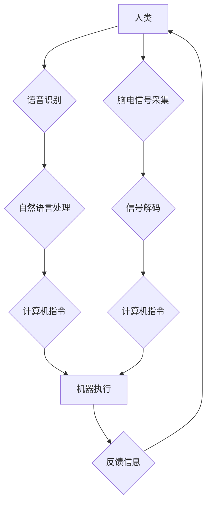

                 

## 2050年的人机交互：从语音交互到脑机接口的人机融合

> 关键词：人机交互、语音识别、自然语言处理、脑机接口、神经网络、深度学习、人工智能、未来技术、科技趋势

### 1. 背景介绍

人类与机器的交互方式一直在不断演进。从最初的命令行界面到如今的图形用户界面，再到越来越普及的语音交互，每一次进步都极大地改变了我们与技术的互动方式。然而，这些交互方式仍然局限于外部物理操作，无法真正实现与机器的深度融合。

2050年，随着人工智能、神经科学和生物工程等领域的飞速发展，人机交互将迎来一场革命性的变革。我们将告别传统的键盘、鼠标和语音输入，迈向更加自然、直观、无障碍的人机融合时代。

### 2. 核心概念与联系

**2.1 人机交互 (Human-Computer Interaction, HCI)**

人机交互是指人类与计算机之间进行信息交换和操作的整个过程。它涉及到用户界面设计、用户体验、认知心理学、计算机科学等多个领域。

**2.2 语音交互 (Speech Interaction)**

语音交互是一种通过语音命令和对话与计算机进行交互的方式。它利用语音识别技术将语音转换为文本，再通过自然语言处理技术理解用户的意图，最终执行相应的操作。

**2.3 脑机接口 (Brain-Computer Interface, BCI)**

脑机接口是一种直接连接大脑和外部设备的技术，它能够读取大脑的电信号，并将其转换为计算机指令，实现人脑与机器的双向通信。

**2.4 人机融合 (Human-Machine Fusion)**

人机融合是指将人类的认知能力和机器的计算能力有机结合，形成一个新的智能系统。它超越了传统的输入输出模式，实现了人脑与机器的深度交互和协同工作。

**2.5 流程图**



### 3. 核心算法原理 & 具体操作步骤

**3.1 算法原理概述**

人机交互的核心算法涉及语音识别、自然语言处理、脑机接口等多个领域。

* **语音识别算法**：利用机器学习和深度学习技术，将语音信号转换为文本。常见的算法包括隐马尔可夫模型 (HMM)、条件随机场 (CRF) 和深度神经网络 (DNN)。

* **自然语言处理算法**：理解和处理人类语言，包括文本分析、情感分析、机器翻译等。常用的算法包括词嵌入、句法分析和语义分析。

* **脑机接口算法**：解码脑电信号，识别用户的意图和指令。常用的算法包括支持向量机 (SVM)、神经网络和深度学习。

**3.2 算法步骤详解**

**语音识别算法步骤：**

1. **语音信号采集:** 使用麦克风采集用户的语音信号。
2. **语音预处理:** 对语音信号进行降噪、增益调整等处理，提高识别精度。
3. **特征提取:** 从语音信号中提取特征，例如梅尔频率倒谱系数 (MFCC)。
4. **模型训练:** 使用训练数据训练语音识别模型，例如 DNN 模型。
5. **语音识别:** 将语音信号输入训练好的模型，识别出用户的语音内容。

**自然语言处理算法步骤:**

1. **文本预处理:** 对文本进行清洗、分词、词性标注等处理，去除停用词、标点符号等。
2. **词嵌入:** 将单词映射到向量空间，捕捉单词之间的语义关系。
3. **句法分析:** 分析文本的语法结构，识别句子成分和关系。
4. **语义分析:** 理解文本的含义，识别主题、情感、意图等。

**脑机接口算法步骤:**

1. **脑电信号采集:** 使用脑电图仪采集用户的脑电信号。
2. **信号预处理:** 对脑电信号进行滤波、去噪等处理，去除干扰信号。
3. **特征提取:** 从脑电信号中提取特征，例如脑波频率、脑波幅度等。
4. **模型训练:** 使用训练数据训练脑机接口模型，例如 SVM 模型。
5. **信号解码:** 将脑电信号输入训练好的模型，解码出用户的意图和指令。

**3.3 算法优缺点**

**语音识别算法:**

* **优点:** 自然、便捷、无障碍。
* **缺点:** 识别精度受环境噪声、说话者口音等因素影响。

**自然语言处理算法:**

* **优点:** 能够理解和处理复杂的语言信息。
* **缺点:** 理解上下文和歧义性语言仍然存在挑战。

**脑机接口算法:**

* **优点:** 能够实现无障碍、直接的脑机交互。
* **缺点:** 技术尚不成熟，成本高昂，存在安全和伦理问题。

**3.4 算法应用领域**

* **语音识别算法:** 语音助手、语音搜索、自动语音转录、语音控制等。
* **自然语言处理算法:** 机器翻译、聊天机器人、文本摘要、情感分析等。
* **脑机接口算法:** 辅助残疾人控制设备、治疗脑损伤、增强人机交互等。

### 4. 数学模型和公式 & 详细讲解 & 举例说明

**4.1 数学模型构建**

语音识别算法通常使用隐马尔可夫模型 (HMM) 来建模语音信号的概率分布。HMM 是一种统计模型，它假设语音信号是由一系列隐藏状态生成的，每个状态对应一个音素或音节。

**4.2 公式推导过程**

HMM 的核心公式包括：

* **状态转移概率矩阵 A:** 描述不同状态之间的转移概率。
* **观测概率矩阵 B:** 描述每个状态对应的观测概率，即语音信号的概率分布。
* **初始状态概率向量 π:** 描述初始状态的概率分布。

**4.3 案例分析与讲解**

假设我们有一个简单的语音识别模型，它有两个隐藏状态：S1 和 S2，分别对应音素 "a" 和 "b"。

* 状态转移概率矩阵 A:

```
A = [[0.7, 0.3],
     [0.2, 0.8]]
```

* 观测概率矩阵 B:

```
B = [[0.8, 0.2],
     [0.3, 0.7]]
```

* 初始状态概率向量 π:

```
π = [0.5, 0.5]
```

当输入语音信号为 "ab" 时，HMM 会根据上述概率矩阵计算出最可能的隐藏状态序列，从而识别出语音内容。

### 5. 项目实践：代码实例和详细解释说明

**5.1 开发环境搭建**

* 操作系统: Ubuntu 20.04
* Python 版本: 3.8
* 必要的库: TensorFlow, PyTorch, NumPy, Scikit-learn

**5.2 源代码详细实现**

以下是一个简单的语音识别模型的代码示例，使用 TensorFlow 框架实现：

```python
import tensorflow as tf

# 定义模型结构
model = tf.keras.models.Sequential([
  tf.keras.layers.Dense(128, activation='relu', input_shape=(13,)),
  tf.keras.layers.Dense(64, activation='relu'),
  tf.keras.layers.Dense(10, activation='softmax')
])

# 编译模型
model.compile(optimizer='adam',
              loss='sparse_categorical_crossentropy',
              metrics=['accuracy'])

# 训练模型
model.fit(x_train, y_train, epochs=10)

# 评估模型
loss, accuracy = model.evaluate(x_test, y_test)
print('Loss:', loss)
print('Accuracy:', accuracy)
```

**5.3 代码解读与分析**

* 该代码定义了一个简单的多层感知机 (MLP) 模型，用于语音识别。
* 模型输入是一个 13 维的特征向量，代表语音信号的特征。
* 模型输出是一个 10 维的概率向量，代表 10 个可能的音素或音节。
* 模型使用 Adam 优化器，交叉熵损失函数，并使用准确率作为评估指标。

**5.4 运行结果展示**

训练完成后，模型可以用来识别新的语音信号。

### 6. 实际应用场景

**6.1 语音交互应用场景**

* **智能语音助手:** 例如 Siri, Alexa, Google Assistant 等，可以理解用户的语音指令，并执行相应的操作，例如播放音乐、设置闹钟、查询天气等。
* **语音搜索:** 例如语音搜索引擎，可以理解用户的语音查询，并返回相关的搜索结果。
* **语音控制:** 例如语音控制汽车、智能家居设备等，可以实现无障碍的设备控制。

**6.2 脑机接口应用场景**

* **辅助残疾人:** 例如帮助瘫痪患者控制轮椅、机械臂等，恢复部分肢体功能。
* **治疗脑损伤:** 例如帮助脑卒中患者恢复语言、运动功能等。
* **增强人机交互:** 例如实现脑电控制游戏、虚拟现实等，提升人机交互体验。

**6.4 未来应用展望**

* **更自然、更智能的人机交互:** 未来的人机交互将更加自然、智能，能够理解用户的意图和情感，并提供更加个性化的服务。
* **脑机融合的广泛应用:** 脑机接口技术将应用于更广泛的领域，例如医疗、教育、娱乐等，改变人们的生活方式。
* **人机协同工作:** 人类和机器将更加紧密地协同工作，共同解决复杂问题，创造更大的价值。

### 7. 工具和资源推荐

**7.1 学习资源推荐**

* **书籍:**
    * 人机交互设计 (Don Norman)
    * 自然语言处理 (Jurafsky & Martin)
    * 脑机接口 (Nicolelis)
* **在线课程:**
    * Coursera: 人机交互、自然语言处理、机器学习
    * edX: 脑机接口、人工智能

**7.2 开发工具推荐**

* **语音识别:** Kaldi, CMU Sphinx, Google Cloud Speech-to-Text
* **自然语言处理:** NLTK, SpaCy, Stanford CoreNLP
* **脑机接口:** OpenBCI, Muse, EEGlab

**7.3 相关论文推荐**

* **语音识别:**
    * Deep Speech 2: End-to-End Speech Recognition in English and Mandarin
    * Connectionist Temporal Classification: Labelling Sequence Data with Recurrent Neural Networks
* **自然语言处理:**
    * Attention Is All You Need
    * BERT: Pre-training of Deep Bidirectional Transformers for Language Understanding
* **脑机接口:**
    * Brain-Computer Interfaces: A Review
    * A Brain-Computer Interface System for Controlling a Robotic Arm

### 8. 总结：未来发展趋势与挑战

**8.1 研究成果总结**

近年来，人机交互领域取得了显著进展，语音识别、自然语言处理、脑机接口等技术不断成熟。这些技术已经应用于越来越多的领域，改变着人们的生活方式。

**8.2 未来发展趋势**

* **更智能、更个性化的交互:** 未来的人机交互将更加智能、个性化，能够理解用户的意图和情感，并提供更加定制化的服务。
* **跨模态交互:** 人机交互将不再局限于单一模式，例如语音、文本、图像等多种模式将融合在一起，实现更加丰富的交互体验。
* **增强现实和虚拟现实:** 人机交互将与增强现实和虚拟现实技术相结合，创造更加沉浸式的交互体验。

**8.3 面临的挑战**

* **技术挑战:** 脑机接口技术尚不成熟，需要进一步突破技术瓶颈。
* **伦理挑战:** 人机融合引发了伦理问题，例如隐私保护、数据安全、人机关系等。
* **社会挑战:** 人机交互的普及可能会导致社会结构和就业模式的改变，需要进行相应的社会适应和调整。

**8.4 研究展望**

未来，人机交互领域将继续朝着更智能、更自然、更融合的方向发展。我们需要加强基础研究，突破技术瓶颈，并积极应对伦理和社会挑战，推动人机交互技术健康发展，造福人类社会。

### 9. 附录：常见问题与解答

**9.1 如何提高语音识别的准确率？**

* 使用高质量的语音数据进行训练。
* 优化语音信号预处理方法。
* 选择合适的语音识别算法和模型。
* 提高模型的训练精度。

**9.2 脑机接口技术有哪些应用场景？**

* 辅助残疾人控制设备。
* 治疗脑损伤。
* 增强人机交互。

**9.3 人机融合会带来哪些伦理问题？**

* 隐私保护。
* 数据安全。
* 人机关系。


作者：禅与计算机程序设计艺术 / Zen and the Art of Computer Programming 
<end_of_turn>

