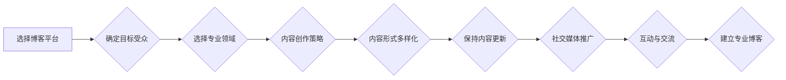

                 

## 建立专业博客：深度分享你的知识和见解

> 关键词：人工智能、机器学习、深度学习、博客、技术分享、知识传播、专业写作

### 1. 背景介绍

在当今科技飞速发展的时代，知识更新迭代日新月异。作为一名技术从业者，不断学习和分享知识至关重要。建立专业博客，可以成为你展示专业能力、建立个人品牌、与同行交流学习的有效平台。

### 2. 核心概念与联系

**2.1 博客平台选择**

选择合适的博客平台是建立专业博客的第一步。常见的博客平台包括：

* **自建博客:**  拥有更高的定制化程度和控制权，但需要一定的技术基础和维护成本。
* **开源博客平台:**  如WordPress、Ghost等，提供丰富的插件和主题，易于使用和维护。
* **云端博客平台:**  如Medium、Substack等，提供便捷的发布和管理功能，但功能和定制化程度相对有限。

**2.2 内容创作策略**

* **确定目标受众:**  明确你的博客目标受众是谁，他们的兴趣和需求是什么，以便创作更精准的内容。
* **选择专业领域:**  专注于你熟悉的技术领域，并深入研究和思考，提供独到的见解和价值。
* **内容形式多样化:**  除了文字文章，还可以尝试使用图片、视频、代码示例等多种形式，提升内容的吸引力和互动性。
* **保持内容更新:**  定期发布高质量的内容，保持博客活跃度，吸引读者持续关注。

**2.3 社交媒体推广**

利用社交媒体平台，例如Twitter、LinkedIn等，推广你的博客文章，扩大影响力。

**2.4 互动与交流**

积极回复读者评论，参与技术社区讨论，与同行交流学习，建立良好的互动关系。

**Mermaid 流程图**

### 3. 核心算法原理 & 具体操作步骤

**3.1 算法原理概述**

**3.2 算法步骤详解**

**3.3 算法优缺点**

**3.4 算法应用领域**

### 4. 数学模型和公式 & 详细讲解 & 举例说明

**4.1 数学模型构建**

**4.2 公式推导过程**

**4.3 案例分析与讲解**

### 5. 项目实践：代码实例和详细解释说明

**5.1 开发环境搭建**

**5.2 源代码详细实现**

**5.3 代码解读与分析**

**5.4 运行结果展示**

### 6. 实际应用场景

**6.1 应用场景介绍**

**6.2 案例分析**

**6.3 优势与局限性**

**6.4 未来应用展望**

### 7. 工具和资源推荐

**7.1 学习资源推荐**

**7.2 开发工具推荐**

**7.3 相关论文推荐**

### 8. 总结：未来发展趋势与挑战

**8.1 研究成果总结**

**8.2 未来发展趋势**

**8.3 面临的挑战**

**8.4 研究展望**

### 9. 附录：常见问题与解答

**9.1 常见问题**

**9.2 问题解答**

作者：禅与计算机程序设计艺术 / Zen and the Art of Computer Programming 

<end_of_turn>

