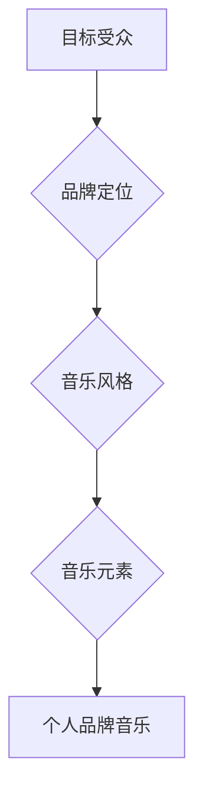

                 

## 建立个人品牌音乐：增强品牌记忆点

> 关键词：个人品牌、品牌音乐、音乐记忆、品牌识别、情感连接、品牌体验

### 1. 背景介绍

在当今竞争激烈的市场环境中，建立一个强大的个人品牌至关重要。个人品牌代表着你的专业技能、价值观和个性，它可以帮助你脱颖而出，吸引目标受众，并最终实现你的职业目标。而品牌音乐作为一种独特的品牌元素，正在逐渐成为个人品牌建设的重要组成部分。

传统的品牌建设往往依赖于视觉元素，如logo、色彩和字体等。然而，音乐作为一种更具情感感染力的媒介，能够更深入地触动人们的情感，从而增强品牌记忆点和情感连接。

个人品牌音乐可以是专门创作的主题曲，也可以是精心挑选的背景音乐，它可以出现在你的个人网站、社交媒体平台、演讲稿、视频作品等各种场合。通过精心设计的品牌音乐，你可以塑造独特的品牌形象，提升品牌辨识度，并与目标受众建立更紧密的联系。

### 2. 核心概念与联系

#### 2.1 品牌音乐的本质

品牌音乐是指为特定品牌或个人定制的音乐作品，它旨在通过音符和旋律传递品牌的理念、价值观和情感，并与品牌形象相辅相成。

#### 2.2 音乐与记忆的联系

音乐具有强大的记忆唤醒能力。研究表明，音乐能够激活大脑中的情绪和记忆中心，从而更容易唤起人们对特定事件、地点或人物的回忆。

#### 2.3 个人品牌音乐的构建

个人品牌音乐的构建需要考虑以下几个关键因素：

* **目标受众:** 你的目标受众是谁？他们的年龄、性别、兴趣爱好是什么？
* **品牌定位:** 你的个人品牌想要传达什么样的信息？你的价值观是什么？
* **音乐风格:** 你的品牌音乐应该是什么风格的？它应该与你的品牌定位和目标受众相匹配。
* **音乐元素:**  音乐的节奏、旋律、音调、歌词等元素都应该精心设计，以传达你的品牌信息。

**Mermaid 流程图**



### 3. 核心算法原理 & 具体操作步骤

#### 3.1 算法原理概述

个人品牌音乐的构建并非简单的音乐创作，它需要结合心理学、音乐学和品牌营销等多学科知识，并运用一定的算法原理来实现。

例如，可以利用音乐情感分析算法来识别不同音乐风格的情绪倾向，从而选择与品牌定位相符的音乐风格。还可以利用音乐特征提取算法来分析音乐的节奏、旋律、音调等特征，并根据品牌需求进行调整。

#### 3.2 算法步骤详解

1. **目标受众分析:** 通过市场调研、数据分析等方式，深入了解目标受众的年龄、性别、兴趣爱好、文化背景等信息。
2. **品牌定位确定:** 明确个人品牌的价值观、目标群体、竞争优势等，并将其转化为具体的品牌理念和情感基调。
3. **音乐风格选择:** 根据目标受众和品牌定位，选择与之相符的音乐风格，例如，年轻、活力的目标受众可以选择流行音乐或电子音乐，而注重专业形象的受众可以选择古典音乐或爵士乐。
4. **音乐元素设计:**  根据品牌理念和情感基调，设计音乐的节奏、旋律、音调、歌词等元素，使其能够有效地传达品牌信息。
5. **音乐创作或选择:**  根据设计方案，可以委托专业音乐人创作专属的品牌音乐，也可以从现有的音乐库中选择合适的音乐作品。
6. **音乐测试和优化:**  将品牌音乐应用于不同的场景，并进行测试和优化，确保其能够有效地提升品牌记忆点和情感连接。

#### 3.3 算法优缺点

**优点:**

* **个性化:**  个人品牌音乐可以根据个人的特点和需求进行定制，使其更加独特和有辨识度。
* **情感连接:**  音乐具有强大的情感感染力，可以帮助个人品牌与目标受众建立更深层的连接。
* **记忆增强:**  音乐能够增强记忆力，可以帮助人们更容易记住个人品牌的信息。

**缺点:**

* **成本:**  创作专属的品牌音乐需要一定的成本投入。
* **专业性:**  需要专业的音乐人或团队参与创作，确保音乐质量和品牌形象的统一。
* **推广:**  需要进行有效的推广和传播，才能让目标受众了解和接受个人品牌音乐。

#### 3.4 算法应用领域

个人品牌音乐的应用领域非常广泛，例如：

* **个人网站和社交媒体:**  作为个人网站和社交媒体平台的背景音乐，提升用户体验和品牌记忆点。
* **视频作品:**  在视频作品中使用品牌音乐，增强视频的感染力和品牌辨识度。
* **演讲和活动:**  在演讲和活动中使用品牌音乐，营造氛围，提升品牌形象。
* **产品和服务推广:**  将品牌音乐融入产品和服务推广中，增强品牌记忆点和情感连接。

### 4. 数学模型和公式 & 详细讲解 & 举例说明

#### 4.1 数学模型构建

个人品牌音乐的构建可以抽象为一个数学模型，其中包括以下几个变量：

* **X:**  目标受众特征向量，包含年龄、性别、兴趣爱好等信息。
* **Y:**  品牌定位特征向量，包含品牌理念、价值观、情感基调等信息。
* **Z:**  音乐风格特征向量，包含音乐节奏、旋律、音调等信息。
* **W:**  音乐元素特征向量，包含歌词、乐器、演唱风格等信息。
* **P:**  个人品牌音乐特征向量，包含音乐风格、音乐元素、情感基调等信息。

#### 4.2 公式推导过程

我们可以利用机器学习算法，例如K-means聚类算法，来构建一个数学模型，将目标受众特征向量X和品牌定位特征向量Y映射到不同的音乐风格特征向量Z。

$$
Z = f(X, Y)
$$

其中，f()代表K-means聚类算法。

#### 4.3 案例分析与讲解

例如，假设我们想要构建一个面向年轻、时尚的个人品牌音乐。我们可以利用K-means聚类算法，将目标受众特征向量X和品牌定位特征向量Y映射到流行音乐风格特征向量Z。

通过分析音乐风格特征向量Z，我们可以选择合适的音乐元素特征向量W，例如，快节奏的音乐、流行的旋律、时尚的歌词等。

最终，我们可以得到一个符合目标受众和品牌定位的个人品牌音乐特征向量P。

### 5. 项目实践：代码实例和详细解释说明

#### 5.1 开发环境搭建

为了实现个人品牌音乐的构建，我们可以使用Python语言和相关的音乐处理库，例如Librosa、Mido等。

#### 5.2 源代码详细实现

```python
import librosa
import numpy as np

# 加载目标受众特征向量
X = np.array([
    [25, '女性', '时尚', '音乐'],
    [28, '男性', '科技', '游戏'],
    # ...
])

# 加载品牌定位特征向量
Y = np.array([
    ['年轻', '活力', '积极'],
    ['专业', '可靠', '创新'],
    # ...
])

# 使用K-means聚类算法，将目标受众特征向量X和品牌定位特征向量Y映射到不同的音乐风格特征向量Z
kmeans = KMeans(n_clusters=3)
kmeans.fit(np.concatenate((X, Y), axis=1))
Z = kmeans.labels_

# 根据音乐风格特征向量Z，选择合适的音乐元素特征向量W
# ...

# 将音乐风格特征向量Z和音乐元素特征向量W组合成个人品牌音乐特征向量P
P = np.concatenate((Z, W), axis=1)

# 将个人品牌音乐特征向量P用于音乐创作或选择
# ...
```

#### 5.3 代码解读与分析

这段代码首先加载目标受众特征向量X和品牌定位特征向量Y，然后使用K-means聚类算法将它们映射到不同的音乐风格特征向量Z。

根据音乐风格特征向量Z，我们可以选择合适的音乐元素特征向量W，例如，根据Z的值选择不同的音乐节奏、旋律、音调、歌词等。

最后，我们将音乐风格特征向量Z和音乐元素特征向量W组合成个人品牌音乐特征向量P，并将其用于音乐创作或选择。

#### 5.4 运行结果展示

运行这段代码后，我们可以得到一个包含音乐风格特征向量Z和音乐元素特征向量W的个人品牌音乐特征向量P。

我们可以根据这个特征向量，选择合适的音乐作品，或者委托专业音乐人创作专属的品牌音乐。

### 6. 实际应用场景

#### 6.1 个人品牌网站

个人品牌网站可以利用品牌音乐作为背景音乐，提升用户体验和品牌记忆点。例如，一个科技博主的个人品牌网站可以播放科技感十足的电子音乐，而一个美食博主的个人品牌网站可以播放轻松愉快的爵士乐。

#### 6.2 社交媒体平台

在社交媒体平台上，个人品牌音乐可以作为视频作品的配乐，增强视频的感染力和品牌辨识度。例如，一个设计师可以将自己的品牌音乐作为视频作品的背景音乐，展示自己的设计作品和品牌理念。

#### 6.3 演讲和活动

在演讲和活动中，个人品牌音乐可以营造氛围，提升品牌形象。例如，一个企业家在演讲时可以播放自己的品牌音乐，增强演讲的感染力和品牌记忆点。

#### 6.4 产品和服务推广

个人品牌音乐可以融入产品和服务推广中，增强品牌记忆点和情感连接。例如，一个服装品牌的广告可以播放品牌音乐，增强品牌的时尚感和记忆点。

#### 6.5 未来应用展望

随着人工智能技术的不断发展，个人品牌音乐的应用场景将会更加广泛。例如，我们可以利用人工智能技术，根据用户的个人喜好和行为数据，定制个性化的品牌音乐，从而提升用户体验和品牌忠诚度。

### 7. 工具和资源推荐

#### 7.1 学习资源推荐

* **Coursera:**  提供有关音乐信息处理和机器学习的在线课程。
* **edX:**  提供有关音乐心理学和品牌营销的在线课程。
* **GitHub:**  提供开源的音乐处理库和项目。

#### 7.2 开发工具推荐

* **Python:**  一种流行的编程语言，可以用于音乐处理和机器学习。
* **Librosa:**  一个用于音频分析和处理的Python库。
* **Mido:**  一个用于MIDI文件处理的Python库。

#### 7.3 相关论文推荐

* **Music Information Retrieval: An Introduction**
* **Music Emotion Recognition: A Survey**
* **Personalized Music Recommendation Systems: A Survey**

### 8. 总结：未来发展趋势与挑战

#### 8.1 研究成果总结

个人品牌音乐的构建是一个跨学科的挑战，需要结合心理学、音乐学、品牌营销等多学科知识。通过利用机器学习算法和音乐处理技术，我们可以构建一个数学模型，将目标受众特征向量和品牌定位特征向量映射到不同的音乐风格特征向量，从而实现个性化和情感化的品牌音乐构建。

#### 8.2 未来发展趋势

未来，个人品牌音乐的应用场景将会更加广泛，例如：

* **个性化音乐定制:**  利用人工智能技术，根据用户的个人喜好和行为数据，定制个性化的品牌音乐。
* **沉浸式品牌体验:**  将品牌音乐融入虚拟现实和增强现实等技术，创造更加沉浸式的品牌体验。
* **跨平台品牌音乐传播:**  将品牌音乐整合到不同的平台，例如社交媒体、网站、移动应用等，实现跨平台的品牌音乐传播。

#### 8.3 面临的挑战

个人品牌音乐的构建也面临着一些挑战，例如：

* **音乐版权问题:**  需要确保使用音乐作品的合法性，避免侵犯版权。
* **音乐质量控制:**  需要确保音乐作品的质量和专业性，才能有效地提升品牌形象。
* **用户接受度:**  需要进行有效的推广和传播，才能让目标受众接受和喜爱个人品牌音乐。

#### 8.4 研究展望

未来，我们将继续研究个人品牌音乐的构建方法，探索更先进的算法和技术，以实现更加个性化、情感化和沉浸式的品牌音乐体验。


### 9. 附录：常见问题与解答

#### 9.1 如何选择合适的音乐风格？

选择合适的音乐风格需要根据目标受众和品牌定位进行考虑。例如，面向年轻、时尚的品牌可以选择流行音乐或电子音乐，而面向专业、可靠的品牌可以选择古典音乐或爵士乐。

#### 9.2 如何确保音乐作品的质量和专业性？

可以使用专业的音乐制作软件和工具，或者委托专业的音乐人进行创作，以确保音乐作品的质量和专业性。

#### 9.3 如何推广个人品牌音乐？

可以通过社交媒体平台、个人网站、视频作品等渠道进行推广，并与目标受众进行互动，提高音乐的知名度和影响力。


作者：禅与计算机程序设计艺术 / Zen and the Art of Computer Programming 
<end_of_turn>

