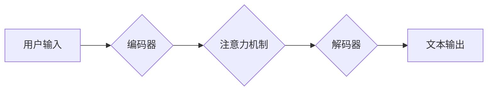

                 

## 微软ALL IN AI:快速用ChatGPT改造产品线

> 关键词：ChatGPT, 人工智能, 微软, 产品改造, 语言模型, 应用程序开发, 效率提升

## 1. 背景介绍

人工智能（AI）正以惊人的速度发展，其影响力正在深刻地改变着我们生活的方方面面。作为AI领域领军者，微软在过去几年里持续加大对AI技术的投入，并将其融入到各个产品和服务中。2023年，微软宣布全面拥抱AI，将ChatGPT等先进语言模型技术整合到其产品生态系统中，开启了“AI First”的新时代。

ChatGPT作为一款强大的开源语言模型，拥有强大的文本生成、理解和对话能力。它能够理解自然语言，并生成流畅、连贯、富有逻辑的文本。这使得ChatGPT在众多领域拥有广泛的应用前景，例如：

* **客户服务:** ChatGPT可以作为智能客服，自动回答用户常见问题，提高客户服务效率。
* **内容创作:** ChatGPT可以帮助作家、记者、营销人员等创作高质量的文本内容，例如文章、博客、广告文案等。
* **教育:** ChatGPT可以作为智能学习助手，帮助学生学习新知识、完成作业、提高学习效率。
* **软件开发:** ChatGPT可以辅助程序员编写代码、生成代码文档、调试程序等，提高开发效率。

## 2. 核心概念与联系

### 2.1 ChatGPT架构

ChatGPT基于Transformer模型架构，是一种深度学习模型，能够有效地处理序列数据，例如文本。Transformer模型的核心是“注意力机制”，它能够学习文本中单词之间的关系，从而更好地理解文本的语义。

ChatGPT模型由多个Transformer编码器和解码器层组成，通过训练大量的文本数据，学习到语言的语法、语义和上下文关系。

**Mermaid 流程图:**



### 2.2 微软Azure与ChatGPT

微软Azure是云计算平台，提供各种云服务，包括AI服务。微软将ChatGPT集成到Azure平台，使得开发者可以方便地使用ChatGPT进行产品开发。

Azure OpenAI Service是微软提供的ChatGPTAPI服务，开发者可以通过API调用ChatGPT模型，获取文本生成、理解和对话等功能。

## 3. 核心算法原理 & 具体操作步骤

### 3.1 算法原理概述

ChatGPT的核心算法是基于Transformer模型的语言模型训练算法。该算法通过以下步骤实现：

1. **数据预处理:** 将文本数据进行清洗、分词、标记等预处理操作，使其能够被模型理解。
2. **模型训练:** 使用大量的文本数据训练Transformer模型，学习语言的语法、语义和上下文关系。
3. **模型评估:** 使用测试数据评估模型的性能，例如准确率、流畅度等。
4. **模型调优:** 根据评估结果，调整模型参数，提高模型性能。

### 3.2 算法步骤详解

1. **输入编码:** 将用户输入的文本序列转换为数字向量，作为模型的输入。
2. **注意力机制:** 模型使用注意力机制学习文本中单词之间的关系，并赋予每个单词不同的权重。
3. **解码生成:** 模型根据输入序列和注意力机制的结果，生成相应的文本序列。
4. **输出解码:** 将生成的数字向量转换为文本，作为模型的输出。

### 3.3 算法优缺点

**优点:**

* **强大的文本生成能力:** ChatGPT能够生成流畅、连贯、富有逻辑的文本。
* **良好的语义理解能力:** ChatGPT能够理解文本的语义和上下文关系。
* **可定制性强:** 开发者可以根据自己的需求，对ChatGPT模型进行微调。

**缺点:**

* **训练数据依赖:** ChatGPT的性能取决于训练数据的质量和数量。
* **可能产生偏差:** 如果训练数据存在偏差，ChatGPT可能会生成带有偏见的文本。
* **缺乏真实世界知识:** ChatGPT的知识主要来自于训练数据，缺乏对真实世界事件的实时了解。

### 3.4 算法应用领域

ChatGPT的应用领域非常广泛，包括：

* **聊天机器人:** 开发智能客服、聊天伴侣等应用。
* **内容创作:** 帮助作家、记者、营销人员等创作高质量的文本内容。
* **教育:** 作为智能学习助手，帮助学生学习新知识、完成作业。
* **软件开发:** 辅助程序员编写代码、生成代码文档、调试程序等。
* **研究:** 用于自然语言处理、机器学习等领域的科研研究。

## 4. 数学模型和公式 & 详细讲解 & 举例说明

### 4.1 数学模型构建

ChatGPT模型的核心是Transformer模型，其数学模型构建基于以下几个关键概念：

* **词嵌入:** 将每个单词映射到一个低维向量空间，表示单词的语义信息。
* **注意力机制:** 计算每个单词与其他单词之间的相关性，并赋予每个单词不同的权重。
* **多头注意力:** 使用多个注意力头，从不同的角度学习单词之间的关系。
* **前馈神经网络:** 对每个单词的嵌入向量进行非线性变换，提取更深层次的语义信息。

### 4.2 公式推导过程

Transformer模型的注意力机制公式如下：

$$
Attention(Q, K, V) = softmax(\frac{QK^T}{\sqrt{d_k}})V
$$

其中：

* $Q$：查询矩阵
* $K$：键矩阵
* $V$：值矩阵
* $d_k$：键向量的维度
* $softmax$：softmax函数，用于归一化注意力权重

### 4.3 案例分析与讲解

假设我们有一句话“The cat sat on the mat”，我们想要计算“cat”与其他单词之间的注意力权重。

1. 将每个单词转换为词嵌入向量。
2. 计算“cat”与其他单词的键向量之间的点积，并进行归一化。
3. 使用softmax函数将点积结果转换为注意力权重。
4. 将注意力权重与值向量相乘，得到“cat”与其他单词的加权平均值，作为“cat”的上下文信息。

## 5. 项目实践：代码实例和详细解释说明

### 5.1 开发环境搭建

为了使用ChatGPT进行项目开发，我们需要搭建一个开发环境。

1. 创建一个Azure账户。
2. 订阅Azure OpenAI Service。
3. 安装Python和必要的库，例如OpenAI库。

### 5.2 源代码详细实现

以下是一个简单的Python代码示例，演示如何使用Azure OpenAI Service调用ChatGPT模型生成文本：

```python
import openai

# 设置API密钥
openai.api_key = "YOUR_API_KEY"

# 定义输入文本
prompt = "写一首关于春天的诗"

# 调用ChatGPT模型
response = openai.Completion.create(
    engine="text-davinci-003",
    prompt=prompt,
    max_tokens=100,
    temperature=0.7
)

# 打印生成文本
print(response.choices[0].text)
```

### 5.3 代码解读与分析

* `openai.api_key = "YOUR_API_KEY"`：设置Azure OpenAI Service的API密钥。
* `prompt = "写一首关于春天的诗"`：定义输入文本，即要生成诗歌的主题。
* `openai.Completion.create(...)`：调用ChatGPT模型的生成文本接口。
* `engine="text-davinci-003"`：指定使用的ChatGPT模型版本。
* `max_tokens=100`：限制生成的文本长度为100个单词。
* `temperature=0.7`：控制文本生成的随机性，温度值越高，生成的文本越随机。
* `response.choices[0].text`：获取生成的文本内容。

### 5.4 运行结果展示

运行以上代码，ChatGPT模型会生成一首关于春天的诗歌。

## 6. 实际应用场景

### 6.1 客户服务

ChatGPT可以作为智能客服，自动回答用户常见问题，例如产品信息、订单查询、退换货政策等。

* **优点:** 24/7小时在线，快速响应，提高客户服务效率。
* **缺点:** 无法处理复杂问题，可能无法满足所有用户的需求。

### 6.2 内容创作

ChatGPT可以帮助作家、记者、营销人员等创作高质量的文本内容，例如文章、博客、广告文案等。

* **优点:** 提高创作效率，克服写作瓶颈，生成多样化的内容。
* **缺点:** 生成的内容可能缺乏原创性，需要人工进行修改和润色。

### 6.3 教育

ChatGPT可以作为智能学习助手，帮助学生学习新知识、完成作业、提高学习效率。

* **优点:** 提供个性化的学习辅导，解答学生疑问，提高学习兴趣。
* **缺点:** 不能完全替代老师的教学，需要学生进行独立思考和学习。

### 6.4 未来应用展望

ChatGPT的应用场景还在不断扩展，未来可能应用于：

* **代码生成:** 自动生成代码，提高开发效率。
* **翻译:** 实现更准确、流畅的文本翻译。
* **语音合成:** 生成自然、逼真的语音。
* **个性化推荐:** 根据用户的喜好，推荐个性化的内容。

## 7. 工具和资源推荐

### 7.1 学习资源推荐

* **OpenAI官方文档:** https://platform.openai.com/docs/
* **HuggingFace Transformers库文档:** https://huggingface.co/docs/transformers/index
* **Coursera深度学习课程:** https://www.coursera.org/learn/deep-learning

### 7.2 开发工具推荐

* **Azure OpenAI Service:** https://azure.microsoft.com/en-us/services/cognitive-services/openai/
* **Python:** https://www.python.org/
* **Jupyter Notebook:** https://jupyter.org/

### 7.3 相关论文推荐

* **Attention Is All You Need:** https://arxiv.org/abs/1706.03762
* **BERT: Pre-training of Deep Bidirectional Transformers for Language Understanding:** https://arxiv.org/abs/1810.04805

## 8. 总结：未来发展趋势与挑战

### 8.1 研究成果总结

ChatGPT的出现标志着人工智能领域取得了重大突破，其强大的文本生成能力和语义理解能力为众多领域带来了新的可能性。

### 8.2 未来发展趋势

未来，ChatGPT模型将会更加强大，其应用场景将会更加广泛。

* **模型规模更大:** 模型参数量将会进一步增加，提升模型的性能和能力。
* **多模态融合:** 将文本与其他模态数据，例如图像、音频、视频等进行融合，实现更全面的理解和生成。
* **个性化定制:** 根据用户的需求，对ChatGPT模型进行个性化定制，使其能够更好地服务于特定领域或用户群体。

### 8.3 面临的挑战

ChatGPT的发展也面临着一些挑战：

* **数据安全和隐私:** ChatGPT模型的训练需要大量数据，如何保证数据的安全和隐私是一个重要问题。
* **算法偏见:** 如果训练数据存在偏见，ChatGPT模型可能会生成带有偏见的文本，需要采取措施解决算法偏见问题。
* **伦理问题:** ChatGPT的强大能力也可能被用于恶意目的，例如生成虚假信息、进行网络攻击等，需要制定相应的伦理规范和监管机制。

### 8.4 研究展望

未来，我们需要继续深入研究ChatGPT模型的原理和应用，探索其在更多领域的新应用场景，同时也要关注其带来的伦理和社会问题，确保其健康、可持续发展。

## 9. 附录：常见问题与解答

**Q1: 如何使用ChatGPT生成代码？**

A1: 可以使用ChatGPT的代码生成功能，向模型提供代码的描述或需求，模型会尝试生成相应的代码。

**Q2: ChatGPT生成的文本是否原创？**

A2: ChatGPT生成的文本基于其训练数据，可能存在重复或相似的内容。

**Q3: 如何避免ChatGPT生成带有偏见的文本？**

A3: 确保训练数据的多样性和代表性，并对模型进行定期评估和调整，以减少算法偏见。

**Q4: ChatGPT的安全性如何保证？**

A4: Azure OpenAI Service提供安全性和隐私保护机制，确保模型的使用安全可靠。

**Q5: ChatGPT的未来发展方向是什么？**

A5: 未来ChatGPT模型将会更加强大，其应用场景将会更加广泛，例如多模态融合、个性化定制等。


作者：禅与计算机程序设计艺术 / Zen and the Art of Computer Programming 
<end_of_turn>

