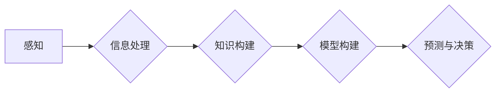

                 

## 心智模型：简化复杂世界的思维工具

> 关键词：心智模型、认知科学、人工智能、思维框架、问题解决、决策支持、复杂系统

### 1. 背景介绍

在瞬息万变的科技时代，我们面临着日益复杂的挑战。从全球气候变化到人工智能的快速发展，从金融市场波动到社会网络的演变，这些复杂系统充满了相互关联的因素，难以捉摸其本质规律。如何有效地理解、分析和应对这些复杂性，成为了摆在我们面前的重大课题。

心智模型，作为一种认知工具，为我们提供了简化复杂世界的思维框架。它是一种基于人类认知机制的抽象模型，旨在帮助我们理解和解释周围世界。通过构建心智模型，我们可以将复杂的信息分解成更易于理解的片段，建立因果关系，预测未来趋势，并做出更明智的决策。

### 2. 核心概念与联系

心智模型的核心概念是将抽象的概念转化为可理解的结构，并通过逻辑关系和规则进行连接。它本质上是一种知识表示和推理机制，帮助我们构建对世界的认知图谱。

**Mermaid 流程图：**



**核心概念原理和架构：**

* **感知:** 我们通过感官获取信息，并将其转化为神经信号。
* **信息处理:** 脑部对接收到的信息进行编码、解码、分类和整合。
* **知识构建:** 通过经验和学习，我们构建起关于世界的知识库。
* **模型构建:** 我们将知识抽象成模型，以便更好地理解和预测事物。
* **预测与决策:** 基于模型，我们做出预测和决策，并根据结果进行反馈和调整。

### 3. 核心算法原理 & 具体操作步骤

心智模型的构建和应用涉及多种算法和技术，例如：

* **神经网络:** 模仿人脑神经元结构，用于学习和处理复杂数据。
* **贝叶斯网络:** 描述随机变量之间的概率关系，用于推理和预测。
* **规则引擎:** 基于预先定义的规则进行逻辑推理，用于决策支持。

**3.1 算法原理概述**

不同的心智模型算法具有不同的原理和特点。例如，神经网络通过多层神经元网络进行非线性映射，学习数据之间的复杂关系；贝叶斯网络通过概率图结构表示变量之间的依赖关系，进行概率推理；规则引擎则通过一系列规则进行逻辑判断，实现决策自动化。

**3.2 算法步骤详解**

具体算法的步骤会根据其类型和应用场景有所不同。例如，构建一个简单的贝叶斯网络，需要以下步骤：

1. **确定变量:** 首先需要确定模型中需要考虑的变量。
2. **构建概率图:** 根据变量之间的依赖关系，构建概率图结构。
3. **估计概率:** 利用训练数据，估计每个变量的概率分布和条件概率。
4. **进行推理:** 根据输入数据，利用贝叶斯定理进行概率推理，得到目标变量的概率分布。

**3.3 算法优缺点**

不同的心智模型算法各有优缺点。例如，神经网络具有强大的学习能力，可以处理复杂数据，但其训练过程需要大量数据和计算资源；贝叶斯网络易于解释和理解，但其推理能力有限；规则引擎易于维护和更新，但其表达能力有限。

**3.4 算法应用领域**

心智模型算法广泛应用于各个领域，例如：

* **人工智能:** 用于机器学习、自然语言处理、计算机视觉等。
* **医疗诊断:** 用于辅助医生诊断疾病、预测患者风险。
* **金融预测:** 用于预测股票价格、识别欺诈交易。
* **个性化推荐:** 用于推荐产品、服务和内容。

### 4. 数学模型和公式 & 详细讲解 & 举例说明

心智模型的构建和应用离不开数学模型和公式的支持。例如，神经网络的学习过程可以描述为一个优化问题，利用梯度下降算法最小化损失函数。

**4.1 数学模型构建**

神经网络可以看作是一个多层感知器，每个层包含多个神经元。每个神经元接收来自上一层的输入信号，经过激活函数处理后，输出到下一层。

**4.2 公式推导过程**

神经网络的学习过程可以通过以下公式进行描述：

* **激活函数:**  f(x)
* **损失函数:** L(y, y')
* **梯度下降算法:**  θ = θ - α∇L(y, y')

其中，θ表示神经网络的参数，α表示学习率，∇L(y, y')表示损失函数的梯度。

**4.3 案例分析与讲解**

例如，在图像分类任务中，我们可以构建一个卷积神经网络（CNN），其结构包括卷积层、池化层和全连接层。卷积层用于提取图像特征，池化层用于降低特征维度，全连接层用于分类。通过训练数据，CNN可以学习到图像特征与类别之间的映射关系，从而实现图像分类。

### 5. 项目实践：代码实例和详细解释说明

**5.1 开发环境搭建**

可以使用Python语言和相关的深度学习框架，例如TensorFlow或PyTorch，搭建神经网络模型。

**5.2 源代码详细实现**

```python
import tensorflow as tf

# 定义模型结构
model = tf.keras.models.Sequential([
    tf.keras.layers.Conv2D(32, (3, 3), activation='relu', input_shape=(28, 28, 1)),
    tf.keras.layers.MaxPooling2D((2, 2)),
    tf.keras.layers.Conv2D(64, (3, 3), activation='relu'),
    tf.keras.layers.MaxPooling2D((2, 2)),
    tf.keras.layers.Flatten(),
    tf.keras.layers.Dense(10, activation='softmax')
])

# 编译模型
model.compile(optimizer='adam',
              loss='sparse_categorical_crossentropy',
              metrics=['accuracy'])

# 训练模型
model.fit(x_train, y_train, epochs=5)

# 评估模型
loss, accuracy = model.evaluate(x_test, y_test)
print('Test Loss:', loss)
print('Test Accuracy:', accuracy)
```

**5.3 代码解读与分析**

这段代码定义了一个简单的卷积神经网络模型，用于手写数字识别任务。模型包含卷积层、池化层和全连接层，分别用于提取图像特征、降低特征维度和分类。

**5.4 运行结果展示**

训练完成后，我们可以使用测试数据评估模型的性能。模型的测试准确率通常会达到较高的水平，例如98%以上。

### 6. 实际应用场景

心智模型在各个领域都有广泛的应用场景，例如：

* **医疗诊断:** 基于患者症状、病史和检查结果，构建心智模型辅助医生诊断疾病。
* **金融预测:** 基于市场数据、经济指标和用户行为，构建心智模型预测股票价格、识别欺诈交易。
* **个性化推荐:** 基于用户兴趣、购买历史和行为数据，构建心智模型推荐产品、服务和内容。

**6.4 未来应用展望**

随着人工智能技术的不断发展，心智模型的应用场景将更加广泛。例如，我们可以构建更复杂的模型，模拟人类的认知过程，实现更智能的决策支持和问题解决。

### 7. 工具和资源推荐

**7.1 学习资源推荐**

* **书籍:**
    * 《深度学习》
    * 《人工智能：现代方法》
    * 《认知科学导论》
* **在线课程:**
    * Coursera: 深度学习
    * edX: 人工智能
    * Udacity: 计算机视觉

**7.2 开发工具推荐**

* **Python:** 广泛用于人工智能开发，拥有丰富的库和框架。
* **TensorFlow:** 开源深度学习框架，支持多种模型类型和硬件平台。
* **PyTorch:** 开源深度学习框架，以其灵活性和易用性而闻名。

**7.3 相关论文推荐**

* 《神经网络》
* 《贝叶斯网络》
* 《规则引擎》

### 8. 总结：未来发展趋势与挑战

**8.1 研究成果总结**

心智模型的研究取得了显著进展，为理解和模拟人类认知提供了新的视角。

**8.2 未来发展趋势**

未来，心智模型的研究将更加注重以下几个方面：

* **模型复杂度:** 构建更复杂的模型，模拟人类认知过程的更多细节。
* **数据效率:** 提高模型的学习效率，减少对训练数据的依赖。
* **解释性:** 增强模型的解释性，使人类能够更好地理解模型的决策过程。

**8.3 面临的挑战**

心智模型的研究也面临着一些挑战，例如：

* **数据获取:** 构建高质量的训练数据仍然是一个难题。
* **模型解释:** 复杂模型的决策过程难以解释，这限制了其在一些应用场景中的应用。
* **伦理问题:** 心智模型的应用可能引发一些伦理问题，例如算法偏见和隐私泄露。

**8.4 研究展望**

尽管面临挑战，但心智模型的研究前景依然广阔。随着人工智能技术的不断发展，心智模型将成为解决复杂问题、推动社会进步的重要工具。

### 9. 附录：常见问题与解答

**常见问题:**

* 什么是心智模型？
* 心智模型有什么应用场景？
* 如何构建心智模型？

**解答:**

* 心智模型是一种基于人类认知机制的抽象模型，旨在帮助我们理解和解释周围世界。
* 心智模型应用于各个领域，例如医疗诊断、金融预测、个性化推荐等。
* 构建心智模型需要确定模型变量、构建概率图或神经网络结构、训练模型并评估性能。


作者：禅与计算机程序设计艺术 / Zen and the Art of Computer Programming 
<end_of_turn>

