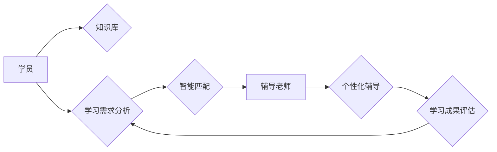

                 

## 打造知识付费的一对一辅导服务

> 关键词：知识付费、一对一辅导、人工智能、个性化学习、机器学习、深度学习、推荐系统

## 1. 背景介绍

知识付费市场近年来蓬勃发展，人们越来越重视持续学习和提升自身技能。其中，一对一辅导服务作为一种个性化、定制化的学习方式，逐渐受到越来越多的关注。传统的线下一对一辅导服务存在着时间和地域限制，而线上一对一辅导服务则能够突破这些限制，为用户提供更加便捷、灵活的学习体验。

然而，线上一对一辅导服务也面临着一些挑战，例如：

* **匹配效率低:**  辅导老师和学员之间缺乏有效的匹配机制，导致资源浪费和学习效果不佳。
* **个性化程度不足:**  传统的线上辅导模式往往采用标准化的课程和教学内容，难以满足不同学员个性化的学习需求。
* **辅导质量难以保证:**  线上辅导平台缺乏有效的质量控制机制，导致部分辅导老师水平参差不齐。

## 2. 核心概念与联系

为了解决上述问题，我们可以利用人工智能技术打造更加智能、高效、个性化的线上一对一辅导服务。

**核心概念:**

* **个性化学习:**  根据学员的学习目标、知识水平、学习风格等信息，定制化学习方案和辅导内容。
* **智能匹配:**  利用机器学习算法，对辅导老师和学员进行精准匹配，提高匹配效率和学习效果。
* **实时反馈:**  通过人工智能技术，对学员的学习情况进行实时监控和分析，及时提供个性化的反馈和建议。

**架构图:**



## 3. 核心算法原理 & 具体操作步骤

### 3.1  算法原理概述

**智能匹配算法:**

* **基于用户的协同过滤:**  根据学员的学习历史、偏好和评价信息，推荐与之学习风格和知识需求相匹配的辅导老师。
* **基于内容的推荐:**  根据辅导老师的教学经验、擅长科目和教学风格等信息，推荐与学员学习目标相匹配的辅导老师。
* **混合推荐:**  结合协同过滤和内容推荐算法，提高推荐的准确性和个性化程度。

**个性化学习算法:**

* **知识图谱:**  构建知识图谱，将知识点和学习路径进行关联，为学员提供更加清晰、结构化的学习内容。
* **学习路径推荐:**  根据学员的学习目标和进度，推荐个性化的学习路径和学习资源。
* **智能练习:**  根据学员的学习情况，生成个性化的练习题，帮助学员巩固知识和提升技能。

### 3.2  算法步骤详解

**智能匹配算法步骤:**

1. 收集学员和辅导老师的特征信息，例如学习历史、偏好、评价、教学经验、擅长科目等。
2. 利用机器学习算法，构建学员和辅导老师之间的相似度模型。
3. 根据学员的学习需求，从所有辅导老师中筛选出最匹配的候选人。
4. 利用推荐算法，对候选辅导老师进行排序，并推荐给学员。

**个性化学习算法步骤:**

1. 收集学员的学习目标、知识水平、学习风格等信息。
2. 根据学员的信息，构建个性化的学习路径和学习资源推荐模型。
3. 根据学员的学习进度和反馈，动态调整学习路径和学习内容。
4. 利用智能练习系统，生成个性化的练习题，帮助学员巩固知识和提升技能。

### 3.3  算法优缺点

**智能匹配算法:**

* **优点:**  能够根据学员和辅导老师的个性化需求进行精准匹配，提高匹配效率和学习效果。
* **缺点:**  需要大量的用户数据进行训练，否则算法效果难以保证。

**个性化学习算法:**

* **优点:**  能够根据学员的学习目标和进度，提供定制化的学习内容和学习路径，提高学习效率和效果。
* **缺点:**  需要复杂的算法模型和大量的学习资源，开发和维护成本较高。

### 3.4  算法应用领域

* **教育培训:**  为学生提供个性化的学习辅导和学习路径推荐。
* **职业技能培训:**  为职场人士提供定制化的职业技能培训和职业发展指导。
* **语言学习:**  为语言学习者提供个性化的语言学习辅导和学习资源推荐。

## 4. 数学模型和公式 & 详细讲解 & 举例说明

### 4.1  数学模型构建

**协同过滤推荐模型:**

* **用户-项目评分矩阵:**  将用户和项目（例如辅导老师和学员）的交互信息表示为一个评分矩阵，其中每个元素表示用户对项目的评分。
* **相似度计算:**  利用余弦相似度等算法计算用户之间的相似度或项目之间的相似度。

**公式:**

$$
\text{相似度}(u_i, u_j) = \frac{\sum_{k=1}^{n} r_{u_i, k} \cdot r_{u_j, k}}{\sqrt{\sum_{k=1}^{n} r_{u_i, k}^2} \cdot \sqrt{\sum_{k=1}^{n} r_{u_j, k}^2}}
$$

其中：

* $u_i$ 和 $u_j$ 表示两个用户。
* $r_{u_i, k}$ 和 $r_{u_j, k}$ 表示用户 $u_i$ 和 $u_j$ 对项目 $k$ 的评分。
* $n$ 表示项目总数。

**举例说明:**

假设有两个用户 Alice 和 Bob，他们对三个辅导老师的评分如下：

| 辅导老师 | Alice | Bob |
|---|---|---|
| A | 5 | 4 |
| B | 3 | 5 |
| C | 4 | 3 |

根据上述评分矩阵，我们可以计算 Alice 和 Bob 的相似度。

### 4.2  公式推导过程

**内容推荐算法:**

* **TF-IDF:**  利用 TF-IDF 算法计算辅导老师和学员的知识点之间的相关性。
* **Word2Vec:**  利用 Word2Vec 算法将知识点表示为向量，计算知识点之间的语义相似度。

**公式:**

$$
\text{TF-IDF}(t, d) = \frac{tf(t, d)}{df(t)} \cdot \log \frac{N}{df(t)}
$$

其中：

* $t$ 表示一个知识点。
* $d$ 表示一个文档（例如辅导老师的教学内容）。
* $tf(t, d)$ 表示知识点 $t$ 在文档 $d$ 中的词频。
* $df(t)$ 表示知识点 $t$ 在所有文档中出现的频率。
* $N$ 表示文档总数。

### 4.3  案例分析与讲解

**案例分析:**

假设 Alice 是一位学习 Python 的学员，Bob 是一位擅长 Python 教学经验丰富的辅导老师。

* **协同过滤推荐:**  如果 Alice 的学习历史和评价信息与其他学习 Python 的学员相似，那么系统会推荐 Bob 作为 Alice 的辅导老师。
* **内容推荐:**  如果 Bob 的教学内容中包含大量关于 Python 的知识点，并且这些知识点与 Alice 的学习目标相匹配，那么系统也会推荐 Bob 作为 Alice 的辅导老师。

## 5. 项目实践：代码实例和详细解释说明

### 5.1  开发环境搭建

* **操作系统:**  Linux/macOS/Windows
* **编程语言:**  Python
* **框架:**  Flask/Django
* **数据库:**  MySQL/PostgreSQL
* **机器学习库:**  Scikit-learn/TensorFlow/PyTorch

### 5.2  源代码详细实现

```python
# 智能匹配算法示例代码

from sklearn.metrics.pairwise import cosine_similarity

# 用户-项目评分矩阵
ratings_matrix = {
    'user1': {'teacher1': 5, 'teacher2': 3, 'teacher3': 4},
    'user2': {'teacher1': 4, 'teacher2': 5, 'teacher3': 3},
    'user3': {'teacher1': 3, 'teacher2': 4, 'teacher3': 5},
}

# 计算用户之间的相似度
user_similarity = cosine_similarity(ratings_matrix)

# 根据用户相似度推荐辅导老师
def recommend_teacher(user_id):
    # 获取用户与其他用户的相似度
    similarity_scores = user_similarity[ratings_matrix.keys().index(user_id)]
    # 排序相似度，选择相似度最高的辅导老师
    recommended_teachers = sorted(ratings_matrix.keys(), key=lambda teacher_id: similarity_scores[ratings_matrix.keys().index(teacher_id)], reverse=True)
    # 返回推荐的辅导老师列表
    return recommended_teachers[:3]

# 获取用户推荐的辅导老师
recommended_teachers = recommend_teacher('user1')
print(f'推荐给 user1 的辅导老师: {recommended_teachers}')
```

### 5.3  代码解读与分析

* **评分矩阵:**  代码中定义了一个评分矩阵，用于存储用户对辅导老师的评分信息。
* **相似度计算:**  利用 Scikit-learn 库中的 `cosine_similarity` 函数计算用户之间的相似度。
* **推荐算法:**  `recommend_teacher` 函数根据用户相似度，推荐与之相似的用户的辅导老师。

### 5.4  运行结果展示

运行上述代码，将输出推荐给 `user1` 的辅导老师列表。

## 6. 实际应用场景

### 6.1  教育培训

* **个性化学习辅导:**  为学生提供个性化的学习辅导和学习路径推荐，帮助学生提高学习效率和成绩。
* **在线课程推荐:**  根据学生的学习目标和兴趣，推荐合适的在线课程和学习资源。

### 6.2  职业技能培训

* **定制化职业技能培训:**  根据职场人士的职业目标和技能需求，提供定制化的职业技能培训和职业发展指导。
* **在线技能测试和评估:**  为职场人士提供在线技能测试和评估，帮助他们了解自己的技能水平和发展方向。

### 6.3  语言学习

* **个性化语言学习辅导:**  为语言学习者提供个性化的语言学习辅导和学习资源推荐，帮助他们提高语言学习效率和效果。
* **在线语言练习和互动:**  为语言学习者提供在线语言练习和互动平台，帮助他们巩固语言知识和提升语言表达能力。

### 6.4  未来应用展望

* **虚拟现实/增强现实辅导:**  利用虚拟现实和增强现实技术，为学员提供更加沉浸式的学习体验。
* **人工智能辅助教学:**  利用人工智能技术，辅助老师进行教学工作，例如自动批改作业、提供个性化学习建议等。
* **跨语言学习支持:**  支持多语言学习，为全球用户提供更加便捷的学习服务。

## 7. 工具和资源推荐

### 7.1  学习资源推荐

* **机器学习:**  
    * 《机器学习》 - 周志华
    * Andrew Ng 的机器学习课程 (Coursera)
* **深度学习:**  
    * 《深度学习》 - Ian Goodfellow, Yoshua Bengio, Aaron Courville
    * fast.ai 深度学习课程
* **推荐系统:**  
    * 《推荐系统实践》 - 王欣
    * 《推荐系统算法》 -  李航

### 7.2  开发工具推荐

* **Python:**  Python 是一种非常适合机器学习和人工智能开发的编程语言。
* **Scikit-learn:**  Scikit-learn 是一个用于机器学习的 Python 库，提供了许多常用的算法和工具。
* **TensorFlow/PyTorch:**  TensorFlow 和 PyTorch 是两种流行的深度学习框架。
* **Flask/Django:**  Flask 和 Django 是两种流行的 Python Web 框架，可以用于构建 Web 应用。

### 7.3  相关论文推荐

* **协同过滤推荐:**  
    * "Collaborative Filtering for Implicit Feedback Datasets" -  Rendle et al.
* **内容推荐:**  
    * "Learning to Rank for Information Retrieval" -  Freund et al.
* **深度学习推荐:**  
    * "Neural Collaborative Filtering" -  Koren et al.

## 8. 总结：未来发展趋势与挑战

### 8.1  研究成果总结

* **智能匹配算法:**  协同过滤和内容推荐算法在智能匹配领域取得了显著成果，能够有效地推荐符合用户需求的辅导老师。
* **个性化学习算法:**  知识图谱、学习路径推荐和智能练习等算法能够为学员提供更加个性化的学习体验。
* **深度学习应用:**  深度学习技术在推荐系统和个性化学习领域展现出巨大的潜力，未来将推动知识付费服务的发展。

### 8.2  未来发展趋势

* **更精准的匹配:**  利用更先进的机器学习算法和数据分析技术，实现更加精准的学员和辅导老师匹配。
* **更个性化的学习体验:**  利用人工智能技术，为学员提供更加个性化的学习内容、学习路径和学习反馈。
* **更丰富的学习资源:**  整合更多优质的学习资源，例如在线课程、视频教程、练习题等，丰富学员的学习体验。

### 8.3  面临的挑战

* **数据质量:**  智能匹配和个性化学习算法依赖于高质量的用户数据，数据质量不足将影响算法效果。
* **算法复杂度:**  一些先进的机器学习算法计算复杂度较高，需要强大的计算资源支持。
* **隐私保护:**  收集和使用用户数据需要严格遵守隐私保护规定，确保用户数据安全。

### 8.4  研究展望

* **探索更有效的推荐算法:**  研究更先进的推荐算法，例如基于图神经网络的推荐算法，提高推荐的准确性和个性化程度。
* **开发更智能的学习助手:**  开发更智能的学习助手，能够根据学员的学习情况提供个性化的学习建议和帮助。
* **构建更加开放的学习生态:**  构建更加开放的学习生态，鼓励更多优质的学习资源和服务参与进来。

## 9. 附录：常见问题与解答

**Q1:  如何保证辅导老师的质量？**

**A1:**  平台可以采用多重机制来保证辅导老师的质量，例如：

* **严格的筛选机制:**  对辅导老师进行严格的资质审核，确保其具备相应的教学经验和专业能力。
* **学员评价体系:**  建立学员评价体系，让学员对辅导老师进行评价，并根据评价结果进行排名和筛选。
* **平台监督机制:**  平台可以对辅导老师的教学内容进行监督，确保其符合平台的教学规范和质量标准。

**Q2:  如何保护用户隐私？**

**A2:**  平台将严格遵守隐私保护规定，采取以下措施保护用户隐私：

* **数据加密:**  用户数据传输和存储过程中采用加密技术，防止数据泄露。
* **匿名化处理:**  在进行数据分析和算法训练时，将用户数据匿名化处理，保护用户个人信息。
* **用户隐私设置:**  提供用户隐私设置功能，允许用户控制自己的数据共享范围。


作者：禅与计算机程序设计艺术 / Zen and the Art of Computer Programming<end_of_turn>

