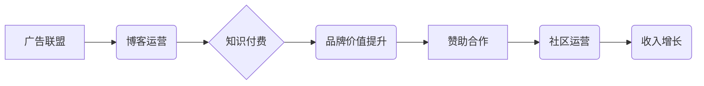

                 

## 技术博客变现：策略与方法

> 关键词：技术博客、变现策略、内容营销、广告联盟、赞助合作、知识付费、电商平台、社区运营、个人品牌

## 1. 背景介绍

在互联网时代，技术博客已成为技术人员展示专业技能、分享知识经验、建立个人品牌的重要平台。然而，仅仅拥有优质的技术内容并不能保证博客的成功。如何将技术博客变现，获得经济回报，是许多技术博主面临的共同挑战。

随着互联网的发展，技术博客变现的方式也日益多样化。从传统的广告联盟到知识付费、电商平台等新兴模式，技术博主们拥有更多选择。本文将深入探讨技术博客变现的策略与方法，帮助技术博主们实现博客价值，获得可持续的收入。

## 2. 核心概念与联系

**2.1 技术博客变现的核心概念**

技术博客变现的核心概念是将博客内容转化为经济价值。这可以通过多种方式实现，例如：

* **广告联盟:** 博主在博客上嵌入广告，通过广告点击或展示获得收益。
* **赞助合作:** 博主与企业或品牌合作，撰写推广内容或提供技术支持，获得赞助费用。
* **知识付费:** 博主将技术知识或经验打包成付费课程、电子书或会员服务，向读者提供更高价值的内容。
* **电商平台:** 博主在博客上销售相关产品或服务，例如技术书籍、软件工具或咨询服务。
* **社区运营:** 博主建立技术社区，通过会员订阅、付费服务或赞助合作获得收入。

**2.2 技术博客变现的联系**

技术博客变现的各个模式之间存在着相互联系和协同作用。例如，通过广告联盟获得收入可以支持博客运营，而知识付费可以提升博客的品牌价值，吸引更多读者和赞助商。

**2.3 变现模式关系图**



## 3. 核心算法原理 & 具体操作步骤

**3.1 算法原理概述**

技术博客变现的核心算法原理是内容营销。通过创作优质、有价值的技术内容，吸引目标读者，建立信任关系，最终实现变现目标。

**3.2 算法步骤详解**

1. **确定目标读者:** 首先要明确博客的目标读者群体，了解他们的兴趣、需求和阅读习惯。
2. **创作优质内容:**  创作原创、有价值的技术内容，例如技术教程、案例分析、行业趋势解读等。
3. **优化内容结构:**  使用清晰的标题、段落和列表，使内容易于阅读和理解。
4. **推广内容:**  通过社交媒体、搜索引擎优化等方式推广博客内容，吸引更多读者。
5. **建立社区:**  建立技术社区，与读者互动交流，建立信任关系。
6. **选择变现模式:**  根据博客内容、目标读者和自身情况选择合适的变现模式。
7. **持续运营:**  持续创作优质内容，优化博客运营，不断提升博客价值。

**3.3 算法优缺点**

* **优点:** 内容营销是一种长期有效的变现策略，可以建立品牌价值，吸引忠实读者。
* **缺点:** 内容营销需要投入大量时间和精力，效果可能需要一段时间才能显现。

**3.4 算法应用领域**

内容营销适用于所有类型的技术博客，例如编程博客、数据科学博客、人工智能博客等。

## 4. 数学模型和公式 & 详细讲解 & 举例说明

**4.1 数学模型构建**

技术博客变现可以看作是一个系统，其中包括内容生产、用户获取、用户转化和收入生成等环节。我们可以用数学模型来描述这些环节之间的关系。

例如，我们可以用以下公式来描述博客收入与用户数量的关系：

$$
R = k * U * C
$$

其中：

* $R$ 表示博客收入
* $U$ 表示博客用户数量
* $C$ 表示每个用户产生的平均收入
* $k$ 是一个常数，代表用户转化率和收入分配比例

**4.2 公式推导过程**

这个公式的推导过程基于以下假设：

* 博客收入主要来源于用户付费行为
* 用户转化率是用户数量和收入之间的一个重要影响因素
* 每个用户的平均收入是固定的

**4.3 案例分析与讲解**

假设一个技术博客拥有10000个用户，每个用户产生的平均收入为1美元，那么根据公式，博客的收入为：

$$
R = k * 10000 * 1 = 10000k
$$

如果用户转化率为10%，那么 $k$ 的值就为0.1，博客的收入为：

$$
R = 10000 * 0.1 = 1000美元
$$

## 5. 项目实践：代码实例和详细解释说明

**5.1 开发环境搭建**

技术博客的开发环境搭建可以根据个人需求选择不同的平台和工具。例如，可以使用WordPress、Ghost、Hexo等博客平台，或者使用Node.js、Python等语言搭建自定义博客。

**5.2 源代码详细实现**

由于技术博客的代码实现方式多种多样，这里只提供一个简单的WordPress博客主题代码示例：

```html
<!DOCTYPE html>
<html>
<head>
    <title>技术博客</title>
    <link rel="stylesheet" href="style.css">
</head>
<body>
    <header>
        <h1>技术博客</h1>
    </header>
    <main>
        <article>
            <h2>技术文章标题</h2>
            <p>技术文章内容</p>
        </article>
    </main>
    <footer>
        <p>&copy; 2023 技术博客</p>
    </footer>
</body>
</html>
```

**5.3 代码解读与分析**

这段代码是一个简单的HTML页面，包含了博客的标题、文章内容和页脚等基本元素。

**5.4 运行结果展示**

将这段代码保存为index.html文件，然后在浏览器中打开，即可看到一个简单的技术博客页面。

## 6. 实际应用场景

技术博客变现的实际应用场景非常广泛，例如：

* **技术人员个人品牌建设:** 技术人员可以通过技术博客展示自己的专业技能和经验，建立个人品牌，吸引潜在雇主或客户。
* **企业技术推广:** 企业可以通过技术博客发布技术文章、案例分析等内容，推广企业技术和产品，提升品牌知名度。
* **开源项目社区运营:** 开源项目团队可以通过技术博客发布项目更新、技术文档等内容，吸引开发者参与项目开发，构建开源社区。

**6.4 未来应用展望**

随着人工智能、虚拟现实等技术的不断发展，技术博客的变现模式将更加多样化。例如，我们可以看到：

* **人工智能辅助内容创作:** 人工智能可以帮助技术博主生成高质量的技术内容，提高创作效率。
* **虚拟现实技术博客:** 虚拟现实技术可以为技术博客提供更沉浸式的体验，吸引更多读者。
* **区块链技术博客变现:** 区块链技术可以为技术博客提供更安全、透明的变现模式。

## 7. 工具和资源推荐

**7.1 学习资源推荐**

* **书籍:** 《内容营销》、《博客运营》、《SEO优化》
* **网站:** Moz、SEMrush、HubSpot
* **课程:** Udemy、Coursera、Skillshare

**7.2 开发工具推荐**

* **博客平台:** WordPress、Ghost、Hexo
* **内容管理系统:** Drupal、Joomla
* **代码编辑器:** Visual Studio Code、Sublime Text、Atom

**7.3 相关论文推荐**

* **内容营销研究论文:** "Content Marketing: A Review of the Literature"
* **博客运营研究论文:** "The Impact of Blogging on Brand Awareness and Customer Engagement"
* **SEO优化研究论文:** "Search Engine Optimization: A Comprehensive Guide"

## 8. 总结：未来发展趋势与挑战

**8.1 研究成果总结**

技术博客变现是一个不断发展和完善的领域。通过内容营销、社区运营、技术创新等方式，技术博主们可以实现博客价值，获得可持续的收入。

**8.2 未来发展趋势**

未来，技术博客变现将更加注重用户体验、个性化定制和数据分析。人工智能、虚拟现实等新兴技术也将为技术博客变现提供新的机遇。

**8.3 面临的挑战**

技术博客变现也面临着一些挑战，例如内容竞争激烈、用户注意力分散、变现模式不断变化等。技术博主们需要不断学习和适应，才能在竞争激烈的市场中脱颖而出。

**8.4 研究展望**

未来，我们需要进一步研究技术博客变现的最佳实践、用户行为模式和新兴技术应用，为技术博主们提供更有效的变现策略和工具。

## 9. 附录：常见问题与解答

**9.1 如何选择合适的变现模式？**

选择合适的变现模式需要根据博客内容、目标读者和自身情况进行综合考虑。

**9.2 如何提高博客内容的质量？**

提高博客内容的质量需要不断学习、积累经验、关注用户需求和市场趋势。

**9.3 如何推广博客内容？**

推广博客内容可以通过社交媒体、搜索引擎优化、邮件营销等方式进行。

**9.4 如何建立技术社区？**

建立技术社区需要提供有价值的内容、积极互动、营造良好的社区氛围。


作者：禅与计算机程序设计艺术 / Zen and the Art of Computer Programming 
<end_of_turn>

