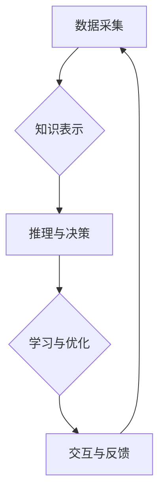

                 

## 拓展认知边界：人类计算的科学探索

> 关键词：人类计算、认知增强、人工智能、神经网络、计算模型、算法优化、未来趋势

### 1. 背景介绍

人类文明的进步离不开对认知的不断拓展。从语言的诞生到文字的出现，从农业文明到信息时代，每一次认知的飞跃都推动着人类社会向前发展。而随着人工智能技术的快速发展，我们正站在一个新的历史节点上，即将开启人类计算的新时代。

人类计算是指利用计算机技术辅助人类进行思考、学习和创造，从而拓展人类认知边界。它不仅仅是简单的计算工具，更是一种全新的思维方式和认知模式。人类计算的核心在于将人类的智慧和计算机的计算能力有机结合，发挥两者互补优势，实现超越单一智能的协同效应。

### 2. 核心概念与联系

**2.1 人类计算的本质**

人类计算的核心概念是将人类的认知过程数字化，并将其融入到计算机系统中。这包括：

* **知识表示:** 将人类的知识和经验以计算机可理解的形式进行表示，例如符号、网络、规则等。
* **推理与决策:** 利用计算机的计算能力进行逻辑推理和决策，辅助人类做出更明智的选择。
* **学习与适应:** 构建能够学习和适应新知识的计算模型，使人类计算系统能够不断进化和完善。

**2.2 人类计算与人工智能的关系**

人类计算与人工智能是相辅相成的。人工智能技术为人类计算提供了强大的工具和基础，而人类计算则为人工智能的发展提供了新的方向和目标。

* 人工智能技术可以帮助构建更智能的计算模型，例如深度学习、强化学习等，从而提高人类计算的效率和准确性。
* 人类计算则可以帮助人工智能更好地理解和模拟人类的认知过程，从而使人工智能更加人性化和智能化。

**2.3 人类计算的架构**

人类计算系统通常由以下几个主要部分组成：

* **数据采集与处理:** 收集人类的认知数据，例如文本、图像、音频等，并进行预处理和分析。
* **知识表示与推理:** 将数据转化为计算机可理解的知识表示，并利用推理引擎进行逻辑推理和决策。
* **学习与优化:** 利用机器学习算法对系统进行训练和优化，使其能够不断学习和适应新的知识和环境。
* **交互与反馈:** 提供用户友好的交互界面，并根据用户的反馈进行系统调整和改进。



### 3. 核心算法原理 & 具体操作步骤

**3.1 算法原理概述**

人类计算的核心算法原理是基于神经网络的深度学习。深度学习算法能够从海量数据中自动学习特征和模式，从而实现对复杂认知任务的处理。

**3.2 算法步骤详解**

1. **数据预处理:** 将原始数据进行清洗、转换和格式化，使其能够被深度学习模型所接受。
2. **网络结构设计:** 根据具体任务需求设计深度神经网络的结构，包括层数、节点数量、激活函数等。
3. **参数初始化:** 为网络中的每个参数赋予初始值，这些值通常是随机生成的。
4. **前向传播:** 将输入数据通过网络层层传递，最终得到输出结果。
5. **反向传播:** 计算输出结果与真实值的误差，并根据误差反向调整网络参数，使模型的预测结果更加准确。
6. **迭代训练:** 重复前向传播和反向传播的过程，直到模型的性能达到预设的目标。

**3.3 算法优缺点**

**优点:**

* 能够自动学习特征，无需人工特征工程。
* 能够处理海量数据，并从中发现隐藏的模式。
* 能够实现对复杂认知任务的处理，例如图像识别、自然语言处理等。

**缺点:**

* 训练过程需要大量的计算资源和时间。
* 模型的解释性较差，难以理解模型的决策过程。
* 对训练数据的质量要求较高，数据偏差会导致模型性能下降。

**3.4 算法应用领域**

深度学习算法在各个领域都有广泛的应用，例如：

* **计算机视觉:** 图像识别、目标检测、图像分割等。
* **自然语言处理:** 文本分类、情感分析、机器翻译等。
* **语音识别:** 语音转文本、语音合成等。
* **医疗诊断:** 病理图像分析、疾病预测等。
* **金融分析:** 风险评估、欺诈检测等。

### 4. 数学模型和公式 & 详细讲解 & 举例说明

**4.1 数学模型构建**

深度学习模型的核心是神经网络，它由多个层级的神经元组成。每个神经元接收来自前一层神经元的输入信号，并通过激活函数进行处理，最终输出信号到下一层神经元。

**4.2 公式推导过程**

深度学习模型的训练过程基于梯度下降算法。梯度下降算法的目标是找到一个能够使模型预测结果与真实值误差最小的参数值。

* **损失函数:** 用于衡量模型预测结果与真实值的误差。常见的损失函数包括均方误差、交叉熵等。
* **梯度:** 损失函数对每个参数的偏导数，表示参数变化对损失函数的影响。
* **学习率:** 控制参数更新幅度的参数。

梯度下降算法的迭代公式如下：

$$
\theta_{i} = \theta_{i} - \alpha \frac{\partial L}{\partial \theta_{i}}
$$

其中：

* $\theta_{i}$ 是第 i 个参数
* $\alpha$ 是学习率
* $\frac{\partial L}{\partial \theta_{i}}$ 是损失函数对第 i 个参数的梯度

**4.3 案例分析与讲解**

例如，在图像识别任务中，我们可以使用卷积神经网络（CNN）作为深度学习模型。CNN 可以自动学习图像特征，并将其用于分类。

训练 CNN 模型的过程包括：

1. 将图像数据预处理，例如调整大小、归一化等。
2. 设计 CNN 网络结构，包括卷积层、池化层、全连接层等。
3. 使用梯度下降算法训练模型，并选择合适的损失函数和学习率。
4. 评估模型性能，例如准确率、召回率等。

### 5. 项目实践：代码实例和详细解释说明

**5.1 开发环境搭建**

为了进行人类计算项目实践，我们需要搭建一个合适的开发环境。常用的开发环境包括：

* **Python:** 人工智能领域最流行的编程语言，拥有丰富的深度学习库和工具。
* **TensorFlow:** Google 开发的开源深度学习框架，支持多种硬件平台和模型类型。
* **PyTorch:** Facebook 开发的开源深度学习框架，以其灵活性和易用性而闻名。
* **Jupyter Notebook:** 用于交互式编程和数据可视化的工具，方便进行深度学习模型的开发和调试。

**5.2 源代码详细实现**

以下是一个使用 TensorFlow 实现简单的图像分类模型的代码示例：

```python
import tensorflow as tf

# 定义模型结构
model = tf.keras.models.Sequential([
  tf.keras.layers.Conv2D(32, (3, 3), activation='relu', input_shape=(28, 28, 1)),
  tf.keras.layers.MaxPooling2D((2, 2)),
  tf.keras.layers.Conv2D(64, (3, 3), activation='relu'),
  tf.keras.layers.MaxPooling2D((2, 2)),
  tf.keras.layers.Flatten(),
  tf.keras.layers.Dense(10, activation='softmax')
])

# 编译模型
model.compile(optimizer='adam',
              loss='sparse_categorical_crossentropy',
              metrics=['accuracy'])

# 训练模型
model.fit(x_train, y_train, epochs=5)

# 评估模型
loss, accuracy = model.evaluate(x_test, y_test)
print('Test loss:', loss)
print('Test accuracy:', accuracy)
```

**5.3 代码解读与分析**

这段代码定义了一个简单的卷积神经网络模型，用于分类 MNIST 手写数字数据集。

* `tf.keras.models.Sequential`: 创建一个顺序模型，层级结构清晰。
* `tf.keras.layers.Conv2D`: 卷积层，用于提取图像特征。
* `tf.keras.layers.MaxPooling2D`: 池化层，用于降低特征图尺寸，提高模型鲁棒性。
* `tf.keras.layers.Flatten`: 将多维特征图转换为一维向量。
* `tf.keras.layers.Dense`: 全连接层，用于分类。
* `model.compile`: 编译模型，指定优化器、损失函数和评估指标。
* `model.fit`: 训练模型，使用训练数据进行迭代训练。
* `model.evaluate`: 评估模型，使用测试数据计算损失和准确率。

**5.4 运行结果展示**

训练完成后，我们可以使用测试数据评估模型的性能。通常情况下，模型的准确率会达到较高的水平，例如 98% 以上。

### 6. 实际应用场景

**6.1 教育领域**

* **个性化学习:** 根据学生的学习进度和能力，提供个性化的学习内容和辅导。
* **智能辅导:** 利用人工智能技术，为学生提供实时反馈和解答，帮助他们更好地理解知识。
* **虚拟实验:** 创建虚拟实验环境，让学生安全、便捷地进行科学探索。

**6.2 医疗保健领域**

* **疾病诊断:** 利用深度学习算法分析医学图像，辅助医生进行疾病诊断。
* **药物研发:** 利用人工智能技术加速药物研发过程，发现新的药物靶点和候选药物。
* **个性化治疗:** 根据患者的基因信息和病史，制定个性化的治疗方案。

**6.3 商业领域**

* **客户服务:** 利用聊天机器人技术，提供24小时在线客户服务，提高客户满意度。
* **市场营销:** 利用数据分析和人工智能技术，精准定位目标客户，提高营销效果。
* **风险管理:** 利用人工智能技术分析数据，识别潜在风险，降低企业风险。

**6.4 未来应用展望**

随着人工智能技术的不断发展，人类计算将在更多领域发挥重要作用，例如：

* **科学研究:** 加速科学发现，解决人类面临的重大挑战。
* **艺术创作:** 辅助人类进行艺术创作，创造出新的艺术形式。
* **社会治理:** 提高社会管理效率，促进社会公平正义。

### 7. 工具和资源推荐

**7.1 学习资源推荐**

* **在线课程:** Coursera、edX、Udacity 等平台提供丰富的深度学习课程。
* **书籍:** 《深度学习》、《神经网络与深度学习》等书籍是深度学习入门的好选择。
* **博客和论坛:** TensorFlow、PyTorch 等框架的官方博客和论坛提供大量学习资源和技术支持。

**7.2 开发工具推荐**

* **TensorFlow:** Google 开发的开源深度学习框架，支持多种硬件平台和模型类型。
* **PyTorch:** Facebook 开发的开源深度学习框架，以其灵活性和易用性而闻名。
* **Keras:** TensorFlow 的高层API，简化了深度学习模型的开发过程。

**7.3 相关论文推荐**

* **《ImageNet Classification with Deep Convolutional Neural Networks》:** 
AlexNet 模型的论文，标志着深度学习在图像识别领域的突破。
* **《Attention Is All You Need》:** 
Transformer 模型的论文，引领了自然语言处理领域的变革。
* **《Generative Adversarial Networks》:** 
GAN 模型的论文，开创了生成式对抗网络的新领域。

### 8. 总结：未来发展趋势与挑战

**8.1 研究成果总结**

近年来，人类计算领域取得了显著的进展，深度学习算法在各个领域都取得了突破性的应用。

**8.2 未来发展趋势**

未来，人类计算将朝着以下几个方向发展：

* **更强大的计算能力:** 随着硬件技术的进步，深度学习模型将变得更加强大，能够处理更复杂的任务。
* **更智能的算法:** 研究人员将继续开发更智能的算法，例如强化学习、迁移学习等，使人类计算系统更加智能化。
* **更广泛的应用场景:** 人类计算将应用于更多领域，例如医疗保健、教育、金融等，为人类社会带来更多福祉。

**8.3 面临的挑战**

人类计算也面临着一些挑战：

* **数据安全和隐私:** 人类计算需要处理大量个人数据，如何保障数据安全和隐私是一个重要问题。
* **算法解释性和可信度:** 深度学习模型的决策过程难以解释，如何提高算法的解释性和可信度是一个关键挑战。
* **伦理问题:** 人类计算的应用可能会带来一些伦理问题，例如算法偏见、工作岗位替代等，需要认真思考和解决。

**8.4 研究展望**

未来，人类计算研究将继续深入，探索人类认知的奥秘，并为人类社会带来更多创新和进步。


### 9. 附录：常见问题与解答

**9.1 如何选择合适的深度学习框架？**

选择深度学习框架需要根据具体项目需求和个人偏好。TensorFlow 和 PyTorch 是目前最流行的两个框架，各有优缺点。

* **TensorFlow:** 
更适合于生产环境部署，拥有更完善的生态系统和工具支持。
* **PyTorch:** 
更灵活易用，更适合于科研和快速原型开发。

**9.2 如何处理数据偏差问题？**

数据偏差是深度学习模型性能下降的重要原因。

* **数据收集:** 尽量收集多样化、代表性强的训练数据。
* **数据预处理:** 对数据进行清洗、规范化等处理，减少数据偏差的影响。
* **算法设计:** 使用正则化技术、对抗训练等方法，提高模型对数据偏差的鲁棒性。

**9.3 如何评估深度学习模型的性能？**

常用的评估指标包括准确率、召回率、F1-score、AUC 等。选择合适的评估指标需要根据具体任务需求。

**9.4 如何部署深度学习模型？**

深度学习模型的部署方式多种多样，例如：

* **云端部署:** 利用云计算平台部署模型，方便访问和扩展。
* **边缘部署:** 将模型部署到边缘设备上，降低延迟和网络带宽需求。
* **嵌入式部署:** 将模型嵌入到硬件设备中，实现实时推理。


作者：禅与计算机程序设计艺术 / Zen and the Art of Computer Programming<end_of_turn>

