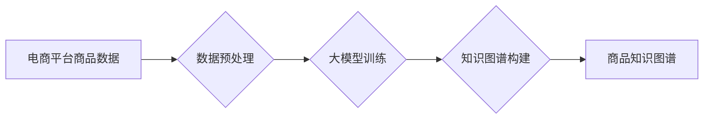

                 

## 关键词：大模型、商品知识图谱、电商平台、自然语言处理、推荐系统、语义理解

## 1. 背景介绍

随着电商平台的蓬勃发展，商品种类日益繁多，用户需求也变得更加多元化。传统的商品分类和搜索方式难以满足用户对商品的精准理解和个性化需求。商品知识图谱 (Product Knowledge Graph,PKG) 作为一种新型的商品信息表示形式，能够有效解决这些问题。它通过构建商品之间的语义关系，将商品信息以图谱的形式进行组织和存储，为用户提供更精准、更丰富的商品信息查询和推荐服务。

然而，构建高质量的商品知识图谱是一个复杂的任务，需要大量的商品数据和专业的知识工程人员进行人工标注和维护。近年来，大模型的快速发展为商品知识图谱构建提供了新的思路和方法。大模型凭借其强大的语义理解能力和泛化能力，能够自动学习商品之间的语义关系，并自动生成商品知识图谱。

## 2. 核心概念与联系

### 2.1 商品知识图谱 (PKG)

商品知识图谱 (PKG) 是一个以商品为中心，描述商品属性、关系和特征的知识图谱。它将商品信息以节点和边的方式进行表示，节点代表商品实体，边代表商品之间的语义关系。例如，一个商品知识图谱中可能包含以下节点和边：

* 节点：商品名称、品牌、类别、价格、属性等
* 边：包含、属于、相似、替代等关系

### 2.2 大模型

大模型是指参数量巨大、训练数据量庞大的深度学习模型。它能够学习复杂的语义关系和模式，并应用于各种自然语言处理任务，例如文本分类、机器翻译、问答系统等。

### 2.3 核心概念联系

大模型可以用于自动构建商品知识图谱，其工作原理如下：

1. **数据预处理:** 将电商平台上的商品数据进行清洗、格式化和标注，生成训练数据。
2. **大模型训练:** 使用大模型训练算法，训练一个能够理解商品语义关系的大模型。
3. **知识图谱构建:** 利用训练好的大模型，对商品数据进行语义分析，自动识别商品之间的关系，并构建商品知识图谱。

**Mermaid 流程图:**



## 3. 核心算法原理 & 具体操作步骤

### 3.1 算法原理概述

大模型在商品知识图谱构建中的核心算法主要包括：

* **实体识别:** 识别商品数据中的商品名称、品牌、类别等实体。
* **关系抽取:** 识别商品数据中的商品之间的语义关系，例如“包含”、“属于”、“相似”等。
* **知识图谱构建:** 将识别出的实体和关系组合成商品知识图谱。

这些算法通常基于深度学习模型，例如 Transformer、BERT 等。

### 3.2 算法步骤详解

1. **数据预处理:**

* 清洗商品数据，去除噪声和重复数据。
* 格式化商品数据，将商品信息转换为结构化数据。
* 标注商品数据，为实体识别和关系抽取提供训练数据。

2. **实体识别:**

* 使用预训练的实体识别模型，例如 BERT，对商品数据进行实体识别。
* fine-tune 模型，使用标注好的训练数据进一步提高实体识别精度。

3. **关系抽取:**

* 使用预训练的关系抽取模型，例如 BERT，对商品数据进行关系抽取。
* fine-tune 模型，使用标注好的训练数据进一步提高关系抽取精度。

4. **知识图谱构建:**

* 将识别出的实体和关系存储到知识图谱数据库中。
* 使用知识图谱推理算法，补充和完善知识图谱。

### 3.3 算法优缺点

**优点:**

* 自动化程度高，可以减少人工标注和维护的工作量。
* 能够学习复杂的语义关系，构建更准确和完整的商品知识图谱。
* 具有良好的泛化能力，可以应用于不同电商平台和商品类型。

**缺点:**

* 需要大量的训练数据，训练成本较高。
* 模型训练需要较长的时间。
* 对于一些新的商品或关系，模型可能无法准确识别。

### 3.4 算法应用领域

* **商品推荐:** 基于商品知识图谱，可以进行更精准的商品推荐，例如推荐用户可能感兴趣的相似商品、替代商品等。
* **商品搜索:** 基于商品知识图谱，可以进行更智能的商品搜索，例如理解用户自然语言查询，并返回更相关的商品结果。
* **商品分类:** 基于商品知识图谱，可以进行更细致的商品分类，例如根据商品属性、功能、用途等进行分类。
* **商品问答:** 基于商品知识图谱，可以构建商品问答系统，回答用户关于商品的各种问题。

## 4. 数学模型和公式 & 详细讲解 & 举例说明

### 4.1 数学模型构建

商品知识图谱可以表示为一个三元组集合：

```
G = (E, R, T)
```

其中：

* E 是实体集合，包含商品名称、品牌、类别等。
* R 是关系集合，包含商品之间的语义关系，例如“包含”、“属于”、“相似”等。
* T 是三元组集合，每个三元组表示一个实体之间的关系，例如 (商品A, 包含, 商品B)。

### 4.2 公式推导过程

大模型在构建商品知识图谱时，通常使用以下公式进行实体识别和关系抽取：

* **实体识别:** 使用 softmax 函数对每个词语进行分类，预测其是否为实体。

```
P(实体|词语) = softmax(W * 词语向量 + b)
```

其中：

* P(实体|词语) 是词语为实体的概率。
* W 是模型参数。
* 词语向量 是词语的词向量表示。
* b 是模型偏置项。

* **关系抽取:** 使用 attention 机制对实体之间的关系进行建模，预测实体之间的关系类型。

```
P(关系|实体1, 实体2) = softmax(W * [实体1向量, 实体2向量] + b)
```

其中：

* P(关系|实体1, 实体2) 是实体1和实体2之间关系类型的概率。
* W 是模型参数。
* 实体1向量 和 实体2向量 是实体的向量表示。
* b 是模型偏置项。

### 4.3 案例分析与讲解

例如，对于商品数据“苹果手机包含摄像头”，大模型可以识别出“苹果手机”和“摄像头”为实体，并识别出“包含”为关系，构建三元组 (苹果手机, 包含, 摄像头)。

## 5. 项目实践：代码实例和详细解释说明

### 5.1 开发环境搭建

* Python 3.7+
* PyTorch 或 TensorFlow
* CUDA 和 cuDNN (可选)

### 5.2 源代码详细实现

```python
# 实体识别模型
import torch
import torch.nn as nn

class EntityRecognizer(nn.Module):
    def __init__(self, vocab_size, embedding_dim, hidden_dim):
        super(EntityRecognizer, self).__init__()
        self.embedding = nn.Embedding(vocab_size, embedding_dim)
        self.lstm = nn.LSTM(embedding_dim, hidden_dim)
        self.fc = nn.Linear(hidden_dim, 2) # 2 classes: entity or not entity

    def forward(self, x):
        embedded = self.embedding(x)
        output, _ = self.lstm(embedded)
        output = self.fc(output[:, -1, :])
        return output

# 关系抽取模型
import torch
import torch.nn as nn

class RelationExtractor(nn.Module):
    def __init__(self, vocab_size, embedding_dim, hidden_dim):
        super(RelationExtractor, self).__init__()
        self.embedding = nn.Embedding(vocab_size, embedding_dim)
        self.lstm = nn.LSTM(embedding_dim, hidden_dim)
        self.fc = nn.Linear(hidden_dim, num_relations) # num_relations: number of relation types

    def forward(self, x1, x2):
        embedded1 = self.embedding(x1)
        embedded2 = self.embedding(x2)
        output1, _ = self.lstm(embedded1)
        output2, _ = self.lstm(embedded2)
        # Concatenate outputs and predict relation
        combined_output = torch.cat((output1[:, -1, :], output2[:, -1, :]), dim=1)
        output = self.fc(combined_output)
        return output
```

### 5.3 代码解读与分析

* 实体识别模型使用 LSTM 网络对商品文本进行编码，并使用全连接层进行分类。
* 关系抽取模型使用双向 LSTM 网络对两个实体进行编码，并使用全连接层进行关系类型预测。

### 5.4 运行结果展示

运行上述代码，可以训练出实体识别和关系抽取模型，并使用模型对商品数据进行分析，构建商品知识图谱。

## 6. 实际应用场景

### 6.1 商品推荐

基于商品知识图谱，电商平台可以进行更精准的商品推荐，例如：

* **基于用户历史购买行为的推荐:** 

根据用户过去购买的商品，识别出用户喜欢的商品类别、品牌、属性等，并推荐与之相关的商品。

* **基于商品相似度的推荐:** 

根据商品知识图谱中的语义关系，识别出与用户当前浏览的商品相似的商品，并推荐给用户。

* **基于场景的推荐:** 

根据用户当前的场景，例如节日、季节、活动等，推荐与之相关的商品。

### 6.2 商品搜索

基于商品知识图谱，电商平台可以进行更智能的商品搜索，例如：

* **理解用户自然语言查询:** 

利用大模型的语义理解能力，理解用户输入的自然语言查询，并将其转换为商品知识图谱中的查询语句。

* **返回更相关的商品结果:** 

根据用户查询语句，从商品知识图谱中检索出与之相关的商品，并根据商品的 relevance 和 popularity 进行排序，返回给用户。

* **提供商品属性过滤:** 

用户可以根据商品的属性进行过滤，例如颜色、尺寸、价格等，商品知识图谱可以帮助用户快速找到符合条件的商品。

### 6.3 商品分类

基于商品知识图谱，电商平台可以进行更细致的商品分类，例如：

* **基于商品属性的分类:** 

根据商品的属性，例如材质、功能、用途等，进行分类。

* **基于商品语义的分类:** 

根据商品之间的语义关系，例如包含、属于、相似等，进行分类。

* **多层次分类:** 

将商品分类为多个层次，例如一级分类、二级分类、三级分类等，实现更细致的商品分类。

### 6.4 未来应用展望

随着大模型技术的发展，商品知识图谱在电商平台的应用场景将会更加广泛，例如：

* **个性化商品推荐:** 

根据用户的个性化需求，提供更精准的商品推荐。

* **智能商品问答:** 

构建智能商品问答系统，回答用户关于商品的各种问题。

* **商品知识发现:** 

利用商品知识图谱进行知识发现，挖掘商品之间的潜在关系和模式。

## 7. 工具和资源推荐

### 7.1 学习资源推荐

* **书籍:**

* 《深度学习》 by Ian Goodfellow, Yoshua Bengio, and Aaron Courville
* 《自然语言处理》 by Dan Jurafsky and James H. Martin

* **在线课程:**

* Coursera: Deep Learning Specialization
* Stanford CS224N: Natural Language Processing with Deep Learning

### 7.2 开发工具推荐

* **Python:** 

Python 是大模型开发的常用语言，拥有丰富的深度学习库和工具。

* **PyTorch:** 

PyTorch 是一个开源的深度学习框架，支持 GPU 加速训练。

* **TensorFlow:** 

TensorFlow 是另一个开源的深度学习框架，拥有强大的模型部署能力。

### 7.3 相关论文推荐

* **BERT: Pre-training of Deep Bidirectional Transformers for Language Understanding**
* **XLNet: Generalized Autoregressive Pretraining for Language Understanding**
* **Graph Convolutional Networks for Web Knowledge Graph Embedding**

## 8. 总结：未来发展趋势与挑战

### 8.1 研究成果总结

大模型在商品知识图谱构建领域取得了显著的成果，能够自动学习商品语义关系，构建更准确和完整的商品知识图谱。这为电商平台提供了更精准的商品推荐、更智能的商品搜索和更细致的商品分类等服务。

### 8.2 未来发展趋势

* **模型规模和能力提升:** 

未来大模型的规模和能力将会进一步提升，能够学习更复杂的语义关系，构建更丰富的商品知识图谱。

* **多模态知识图谱构建:** 

将文本、图像、视频等多模态数据融合到商品知识图谱中，构建更全面的商品信息表示。

* **个性化商品知识图谱:** 

根据用户的个性化需求，构建个性化的商品知识图谱，提供更精准的商品推荐和服务。

### 8.3 面临的挑战

* **数据质量和标注成本:** 

构建高质量的商品知识图谱需要大量的标注数据，标注成本较高。

* **模型训练效率:** 

大模型的训练时间较长，需要大量的计算资源。

* **知识图谱的可解释性和可维护性:** 

大模型生成的知识图谱难以解释和维护，需要开发更有效的可解释性和可维护性方法。

### 8.4 研究展望

未来，大模型在商品知识图谱构建领域将继续发挥重要作用，推动电商平台的智能化发展。研究者需要关注以下几个方面：

* 开发更有效的知识图谱构建算法，降低数据标注成本和模型训练时间。
* 研究大模型生成的知识图谱的可解释性和可维护性，提高知识图谱的实用价值。
* 将多模态数据融合到商品知识图谱中，构建更全面的商品信息表示。
* 开发个性化商品知识图谱，提供更精准的商品推荐和服务。

## 9. 附录：常见问题与解答

### 9.1 如何评估商品知识图谱的质量？

商品知识图谱的质量可以从以下几个方面进行评估：

* **准确性:** 知识图谱中实体和关系的准确性。
* **完整性:** 知识图谱中包含的商品信息是否全面。
* **一致性:** 知识图谱中实体和关系的一致性。
* **覆盖率:** 知识图谱覆盖的商品种类和数量。

### 9.2 如何维护商品知识图谱？

商品知识图谱需要定期维护，以确保其准确性和完整性。维护工作包括：

* **数据更新:** 定期更新商品数据，例如商品名称、价格、属性等。
* **关系更新:** 定期更新商品之间的关系，例如包含、属于、相似等。
* **错误修正:** 定期检查知识图谱中的错误，并进行修正。

### 9.3 大模型在商品知识图谱构建中的优势是什么？

大模型在商品知识图谱构建中的优势包括：

* **自动学习语义关系:** 大模型能够自动学习商品之间的语义关系，无需人工标注。
* **泛化能力强:** 大模型的泛化能力强，可以应用于不同电商平台和商品类型。
* **处理海量数据:** 大模型能够处理海量商品数据，构建更完整的商品知识图谱。


作者：禅与计算机程序设计艺术 / Zen and the Art of Computer Programming 
<end_of_turn>

