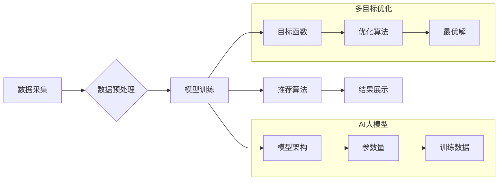

                 

## 推荐系统中AI大模型的多目标优化

> 关键词：推荐系统、AI大模型、多目标优化、协同过滤、深度学习、个性化推荐

## 1. 背景介绍

推荐系统作为信息过滤和个性化内容呈现的关键技术，在电商、社交媒体、视频平台等领域发挥着越来越重要的作用。随着人工智能技术的快速发展，基于深度学习的推荐系统逐渐成为主流，其强大的学习能力和表达能力能够挖掘用户隐性需求，提供更精准的推荐结果。然而，传统推荐系统往往面临着数据稀疏、冷启动、推荐结果单一等问题。

AI大模型的出现为推荐系统带来了新的机遇。其海量参数和强大的泛化能力能够更好地学习用户和物品的复杂关系，提升推荐效果。然而，AI大模型的训练和部署也带来了新的挑战，例如训练成本高、模型复杂度大、可解释性差等。

多目标优化作为一种解决复杂问题的新方法，能够有效地平衡不同目标之间的冲突，找到最优的解决方案。在推荐系统中，多目标优化可以帮助我们同时优化推荐准确率、多样性、覆盖率等多个指标，构建更智能、更全面的推荐系统。

## 2. 核心概念与联系

### 2.1 推荐系统架构

推荐系统通常由以下几个主要模块组成：

* **数据采集模块:** 收集用户行为数据、物品信息等数据。
* **数据预处理模块:** 对收集到的数据进行清洗、转换、特征提取等处理。
* **模型训练模块:** 利用机器学习算法训练推荐模型。
* **推荐算法模块:** 根据用户特征和物品信息，生成推荐结果。
* **结果展示模块:** 将推荐结果以用户友好的方式展示给用户。

### 2.2 AI大模型

AI大模型是指参数量巨大、训练数据海量的人工智能模型。其强大的学习能力和泛化能力使其能够在各种任务中取得优异的性能，例如自然语言处理、图像识别、机器翻译等。

### 2.3 多目标优化

多目标优化是指同时优化多个目标函数，找到最优解的算法。在推荐系统中，多目标优化可以帮助我们平衡不同目标之间的冲突，例如提高推荐准确率的同时保持推荐多样性。

**Mermaid 流程图**



## 3. 核心算法原理 & 具体操作步骤

### 3.1 算法原理概述

多目标优化算法在推荐系统中可以帮助我们同时优化多个指标，例如推荐准确率、多样性、覆盖率等。常见的多目标优化算法包括：

* **Pareto优化:** 寻找所有不可支配解的集合，即不存在一个解能够同时优于另一个解的所有目标函数值。
* **遗传算法:** 借鉴生物进化机制，通过选择、交叉、变异等操作，逐步逼近最优解。
* **粒子群算法:** 模拟鸟群觅食的行为，通过粒子之间的相互作用，寻找最优解。

### 3.2 算法步骤详解

以Pareto优化为例，其步骤如下：

1. **定义目标函数:** 首先需要定义需要优化的目标函数，例如推荐准确率、多样性、覆盖率等。
2. **构建解空间:** 构建可能的解空间，例如推荐模型的超参数、推荐策略等。
3. **生成初始解集:** 生成初始的解集，每个解代表一种推荐策略。
4. **评估解集:** 对每个解进行评估，计算其对应的目标函数值。
5. **筛选Pareto解集:** 从评估结果中筛选出Pareto解集，即所有不可支配解的集合。
6. **迭代优化:** 对Pareto解集进行迭代优化，例如通过调整超参数、改变推荐策略等，寻找更优的解。

### 3.3 算法优缺点

**优点:**

* 可以同时优化多个目标，找到最优的平衡点。
* 能够处理复杂、多变的推荐场景。

**缺点:**

* 计算复杂度高，需要大量的计算资源。
* 找到最优解可能需要很长时间。

### 3.4 算法应用领域

多目标优化算法在推荐系统中广泛应用，例如：

* **个性化推荐:** 同时优化推荐准确率和多样性，提供更个性化的推荐结果。
* **内容推荐:** 同时优化推荐准确率和覆盖率，推荐更广泛的内容。
* **广告推荐:** 同时优化点击率和转化率，提高广告效果。

## 4. 数学模型和公式 & 详细讲解 & 举例说明

### 4.1 数学模型构建

假设我们有两个目标函数，分别为推荐准确率 $R$ 和推荐多样性 $D$。我们可以构建一个多目标优化模型，目标是找到一个解 $x$，使得 $R(x)$ 和 $D(x)$ 都达到最大值。

$$
\begin{aligned}
\text{目标函数: } & \max R(x), \max D(x) \\
\text{约束条件: } & x \in X
\end{aligned}
$$

其中，$X$ 是解空间。

### 4.2 公式推导过程

具体的公式推导过程取决于选择的优化算法。例如，对于Pareto优化，我们可以使用以下公式计算每个解的Pareto优劣关系：

$$
\text{Pareto优劣关系: } \forall x_1, x_2 \in X, x_1 \prec x_2 \Leftrightarrow R(x_1) \leq R(x_2) \text{ and } D(x_1) \leq D(x_2)
$$

### 4.3 案例分析与讲解

假设我们有两个推荐策略，策略 $A$ 的推荐准确率为 $0.8$，推荐多样性为 $0.6$，策略 $B$ 的推荐准确率为 $0.7$，推荐多样性为 $0.7$。根据Pareto优劣关系公式，我们可以判断策略 $A$ Pareto优于策略 $B$，因为 $A$ 在两个目标函数上都优于 $B$。

## 5. 项目实践：代码实例和详细解释说明

### 5.1 开发环境搭建

* Python 3.7+
* TensorFlow 2.0+
* PyTorch 1.0+
* scikit-learn 0.20+

### 5.2 源代码详细实现

```python
# 导入必要的库
import numpy as np
from sklearn.metrics import precision_score, recall_score, f1_score

# 定义推荐准确率目标函数
def accuracy_function(y_true, y_pred):
    return precision_score(y_true, y_pred)

# 定义推荐多样性目标函数
def diversity_function(y_pred):
    # 计算推荐结果的种类数
    unique_items = np.unique(y_pred)
    return len(unique_items) / len(y_pred)

# 定义多目标优化算法
def multi_objective_optimization(data, model, objective_functions):
    # ...

# 训练模型并进行多目标优化
model = ...
optimized_model = multi_objective_optimization(data, model, [accuracy_function, diversity_function])

# 使用优化后的模型进行预测
predictions = optimized_model.predict(data)
```

### 5.3 代码解读与分析

* 代码首先导入必要的库。
* 然后定义了推荐准确率和推荐多样性的目标函数。
* 接着定义了多目标优化算法，该算法可以根据具体的优化目标和算法选择进行实现。
* 最后，代码训练了模型，并使用多目标优化算法进行优化。

### 5.4 运行结果展示

运行结果展示可以包括优化后的模型的性能指标、Pareto解集等信息。

## 6. 实际应用场景

### 6.1 个性化推荐

多目标优化可以帮助我们构建更个性化的推荐系统，例如：

* 同时优化推荐准确率和多样性，为用户提供更符合其兴趣的推荐结果。
* 考虑用户历史行为、偏好和上下文信息，提供更精准的个性化推荐。

### 6.2 内容推荐

多目标优化可以帮助我们构建更全面的内容推荐系统，例如：

* 同时优化推荐准确率和覆盖率，推荐更广泛的内容，满足用户多样化的需求。
* 考虑用户兴趣、阅读习惯和内容类型等因素，推荐更相关的和有价值的内容。

### 6.3 广告推荐

多目标优化可以帮助我们构建更有效的广告推荐系统，例如：

* 同时优化点击率和转化率，提高广告效果。
* 考虑用户兴趣、行为和广告特征等因素，推荐更精准的广告，提高用户体验。

### 6.4 未来应用展望

随着人工智能技术的不断发展，多目标优化在推荐系统中的应用前景广阔。未来，我们可以期待：

* 更智能、更全面的推荐系统，能够更好地理解用户需求，提供更个性化、更精准的推荐结果。
* 更有效的广告推荐系统，能够提高广告效果，降低广告成本。
* 更广泛的应用场景，例如教育、医疗、金融等领域。

## 7. 工具和资源推荐

### 7.1 学习资源推荐

* **书籍:**
    * 《推荐系统》 by  Koren, Yehuda
    * 《深度学习》 by  Ian Goodfellow, Yoshua Bengio, Aaron Courville
* **在线课程:**
    * Coursera: Recommender Systems
    * Udacity: Deep Learning Nanodegree

### 7.2 开发工具推荐

* **Python:** 
    * TensorFlow
    * PyTorch
    * scikit-learn
* **云平台:**
    * AWS
    * Azure
    * Google Cloud

### 7.3 相关论文推荐

* **Pareto优化:**
    * Pareto Optimality in Multi-Objective Optimization
* **遗传算法:**
    * Genetic Algorithms in Search, Optimization, and Machine Learning
* **粒子群算法:**
    * Particle Swarm Optimization: Basic Concepts, Variants, and Applications

## 8. 总结：未来发展趋势与挑战

### 8.1 研究成果总结

多目标优化在推荐系统中的应用取得了显著的成果，能够有效地平衡不同目标之间的冲突，构建更智能、更全面的推荐系统。

### 8.2 未来发展趋势

未来，多目标优化在推荐系统中的应用将朝着以下几个方向发展：

* **更复杂的优化目标:** 除了推荐准确率和多样性，我们可以考虑更多更复杂的优化目标，例如用户满意度、公平性、可解释性等。
* **更有效的优化算法:** 随着人工智能技术的不断发展，我们将开发出更有效的优化算法，能够更快、更准确地找到最优解。
* **更个性化的推荐:** 我们将利用多目标优化技术，构建更个性化的推荐系统，能够更好地理解用户的需求，提供更精准的推荐结果。

### 8.3 面临的挑战

多目标优化在推荐系统中的应用也面临着一些挑战：

* **计算复杂度高:** 多目标优化算法的计算复杂度较高，需要大量的计算资源。
* **数据稀疏性:** 现实世界中的数据往往是稀疏的，这会影响多目标优化算法的性能。
* **可解释性差:** 一些多目标优化算法的决策过程难以解释，这会影响用户的信任度。

### 8.4 研究展望

未来，我们将继续研究多目标优化在推荐系统中的应用，努力解决上述挑战，构建更智能、更全面的推荐系统。

## 9. 附录：常见问题与解答

* **Q1: 多目标优化和单目标优化的区别是什么？**

**A1:** 单目标优化是指优化一个目标函数，而多目标优化是指同时优化多个目标函数。

* **Q2: 多目标优化算法有哪些？**

**A2:** 常见的多目标优化算法包括Pareto优化、遗传算法、粒子群算法等。

* **Q3: 多目标优化在推荐系统中的应用有哪些？**

**A3:** 多目标优化在推荐系统中的应用包括个性化推荐、内容推荐、广告推荐等。


作者：禅与计算机程序设计艺术 / Zen and the Art of Computer Programming 
<end_of_turn>

