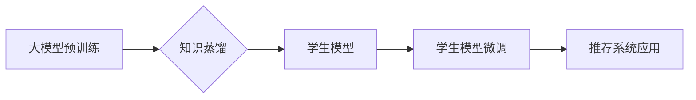

                 

## 推荐系统中的大模型知识蒸馏迁移应用

> 关键词：推荐系统、大模型、知识蒸馏、迁移学习、模型压缩、效率提升

## 1. 背景介绍

推荐系统作为互联网时代的重要组成部分，在电商、社交媒体、视频平台等领域发挥着至关重要的作用。随着用户需求的不断变化和数据量的激增，推荐系统的准确性和效率面临着新的挑战。大模型凭借其强大的学习能力和泛化能力，在推荐系统领域展现出巨大的潜力。然而，大模型的训练成本高昂，部署和推理效率低下，限制了其在实际应用中的推广。

知识蒸馏是一种模型压缩技术，通过将大模型的知识迁移到小模型中，实现模型规模缩减和效率提升。迁移学习则是将预训练模型在新的任务或领域上进行微调，以提高模型性能。将知识蒸馏与迁移学习相结合，可以有效地解决大模型在推荐系统中的应用难题。

## 2. 核心概念与联系

### 2.1 知识蒸馏

知识蒸馏是一种模型压缩技术，其核心思想是将大模型的知识迁移到小模型中。大模型作为“教师模型”，拥有丰富的知识和表达能力；小模型作为“学生模型”，具有更小的规模和更低的计算成本。通过训练学生模型模仿教师模型的输出，可以将教师模型的知识“蒸馏”到学生模型中。

### 2.2 迁移学习

迁移学习是指利用预训练模型在新的任务或领域上进行微调，以提高模型性能。预训练模型在大量数据上进行训练，已经学习到了一些通用的知识和特征，这些知识可以迁移到新的任务中，从而减少新的任务所需的训练数据和训练时间。

### 2.3 知识蒸馏迁移学习

将知识蒸馏与迁移学习相结合，可以实现更有效的模型压缩和性能提升。具体来说，可以先使用大模型在推荐任务上进行预训练，然后将预训练模型作为教师模型进行知识蒸馏，将知识迁移到更小的学生模型中。学生模型可以进一步在新的任务或领域上进行微调，以提高其性能。

**Mermaid 流程图**



## 3. 核心算法原理 & 具体操作步骤

### 3.1 算法原理概述

知识蒸馏迁移学习的核心算法原理是利用教师模型的输出作为学生模型的监督信号，通过最小化教师模型和学生模型输出之间的差异来训练学生模型。

### 3.2 算法步骤详解

1. **预训练大模型:** 在推荐任务上使用大模型进行预训练，例如使用用户行为数据训练一个协同过滤模型或深度神经网络模型。
2. **知识蒸馏:** 将预训练的大模型作为教师模型，选择一个更小的模型作为学生模型。训练学生模型时，使用教师模型的输出作为监督信号，并通过一个温度参数来调整教师模型的输出分布，使其更加平滑。
3. **学生模型微调:** 将蒸馏后的学生模型在新的任务或领域上进行微调，例如使用新的用户行为数据或商品信息进行微调。

### 3.3 算法优缺点

**优点:**

* **模型压缩:** 可以有效地将大模型的知识迁移到更小的学生模型中，从而实现模型规模的缩减。
* **效率提升:** 学生模型的计算成本和部署成本都比教师模型低，可以提高推荐系统的效率。
* **性能提升:** 通过知识蒸馏，学生模型可以继承教师模型的知识和表达能力，在新的任务或领域上表现出更好的性能。

**缺点:**

* **训练复杂度:** 知识蒸馏的训练过程比传统的模型训练过程更加复杂，需要更多的参数和技巧。
* **教师模型依赖:** 学生模型的性能依赖于教师模型的质量，如果教师模型的训练效果不好，学生模型的性能也会受到影响。

### 3.4 算法应用领域

知识蒸馏迁移学习在推荐系统领域具有广泛的应用场景，例如：

* **个性化推荐:** 将大模型的知识迁移到用户设备上，实现个性化推荐的离线部署。
* **跨域推荐:** 将大模型在某个领域的知识迁移到另一个领域，实现跨域推荐的应用。
* **冷启动推荐:** 利用大模型的知识，帮助新用户或新商品快速获得推荐。

## 4. 数学模型和公式 & 详细讲解 & 举例说明

### 4.1 数学模型构建

知识蒸馏的目标是训练一个学生模型，使其尽可能地模仿教师模型的输出。可以使用交叉熵损失函数来衡量教师模型和学生模型输出之间的差异。

假设教师模型的输出为 $p_i$，学生模型的输出为 $q_i$，则交叉熵损失函数可以表示为：

$$
L = -\sum_{i=1}^{N} p_i \log q_i
$$

其中，$N$ 是样本的数量。

### 4.2 公式推导过程

为了提高学生模型的泛化能力，可以引入一个温度参数 $T$，将教师模型的输出分布进行平滑。平滑后的教师模型输出为：

$$
p_i' = \frac{exp(p_i/T)}{\sum_{j=1}^{N} exp(p_j/T)}
$$

然后，使用平滑后的教师模型输出作为监督信号，训练学生模型。

### 4.3 案例分析与讲解

假设我们有一个推荐系统，需要推荐用户喜欢的电影。我们可以使用一个大模型进行预训练，例如使用用户评分数据训练一个协同过滤模型。然后，将预训练模型作为教师模型，训练一个更小的学生模型。

在训练过程中，我们可以使用温度参数 $T$ 来控制教师模型输出的平滑程度。当 $T$ 值较大时，教师模型的输出分布更加平滑，学生模型更容易学习到教师模型的知识。当 $T$ 值较小时，教师模型的输出分布更加尖锐，学生模型需要更加关注教师模型的局部特征。

## 5. 项目实践：代码实例和详细解释说明

### 5.1 开发环境搭建

* Python 3.7+
* PyTorch 1.7+
* TensorFlow 2.0+
* CUDA 10.2+

### 5.2 源代码详细实现

```python
# 导入必要的库
import torch
import torch.nn as nn

# 定义教师模型和学生模型
class TeacherModel(nn.Module):
    # ...

class StudentModel(nn.Module):
    # ...

# 加载预训练的教师模型
teacher_model = TeacherModel()
teacher_model.load_state_dict(torch.load('teacher_model.pth'))

# 训练学生模型
optimizer = torch.optim.Adam(student_model.parameters(), lr=0.001)
criterion = nn.CrossEntropyLoss()

for epoch in range(num_epochs):
    for batch in dataloader:
        # 前向传播
        outputs_teacher = teacher_model(batch)
        outputs_student = student_model(batch)

        # 计算损失
        loss = criterion(outputs_student, outputs_teacher)

        # 反向传播
        optimizer.zero_grad()
        loss.backward()
        optimizer.step()

# 保存训练好的学生模型
torch.save(student_model.state_dict(), 'student_model.pth')
```

### 5.3 代码解读与分析

* 代码首先定义了教师模型和学生模型的结构。
* 然后，加载预训练的教师模型权重。
* 使用交叉熵损失函数和 Adam 优化器训练学生模型。
* 在训练过程中，使用教师模型的输出作为监督信号，并通过温度参数来控制教师模型输出的平滑程度。
* 最后，保存训练好的学生模型权重。

### 5.4 运行结果展示

训练完成后，可以将学生模型部署到实际应用中，并评估其性能。

## 6. 实际应用场景

### 6.1 个性化推荐

知识蒸馏迁移学习可以用于构建个性化推荐系统，将大模型的知识迁移到用户设备上，实现离线推荐。

### 6.2 跨域推荐

知识蒸馏迁移学习可以用于跨域推荐，例如将电商平台的推荐模型迁移到社交媒体平台，实现跨平台的推荐服务。

### 6.3 冷启动推荐

知识蒸馏迁移学习可以帮助新用户或新商品快速获得推荐，缓解冷启动问题。

### 6.4 未来应用展望

随着大模型技术的不断发展，知识蒸馏迁移学习在推荐系统领域将有更广泛的应用场景，例如：

* **多模态推荐:** 将大模型的知识迁移到多模态推荐系统中，例如将文本、图像、视频等多种模态信息融合在一起进行推荐。
* **联邦学习推荐:** 利用知识蒸馏迁移学习，在联邦学习框架下进行推荐系统训练，保护用户隐私。
* **动态推荐:** 利用知识蒸馏迁移学习，构建动态推荐系统，根据用户行为和环境变化实时调整推荐结果。

## 7. 工具和资源推荐

### 7.1 学习资源推荐

* **论文:**
    * Hinton, G., Vinyals, O., & Dean, J. (2015). Distilling the knowledge in a neural network. arXiv preprint arXiv:1503.02531.
    * Pan, S. J., & Yang, Q. (2010). A survey on transfer learning. IEEE Transactions on Knowledge and Data Engineering, 22(10), 1345-1359.
* **博客:**
    * https://towardsdatascience.com/knowledge-distillation-a-powerful-technique-for-model-compression-a32a60899369
    * https://blog.paperspace.com/knowledge-distillation-tutorial/

### 7.2 开发工具推荐

* **PyTorch:** https://pytorch.org/
* **TensorFlow:** https://www.tensorflow.org/

### 7.3 相关论文推荐

* **BERT:** Devlin, J., Chang, M. W., Lee, K., & Toutanova, K. (2018). BERT: Pre-training of deep bidirectional transformers for language understanding. arXiv preprint arXiv:1810.04805.
* **GPT-3:** Brown, T. B., Mann, B., Ryder, N., Subbiah, M., Kaplan, J., Dhariwal, P., ... & Amodei, D. (2020). Language models are few-shot learners. arXiv preprint arXiv:2005.14165.

## 8. 总结：未来发展趋势与挑战

### 8.1 研究成果总结

知识蒸馏迁移学习在推荐系统领域取得了显著的成果，有效地解决了大模型的训练成本高昂和部署效率低下的问题。

### 8.2 未来发展趋势

未来，知识蒸馏迁移学习将在以下方面继续发展：

* **更有效的知识蒸馏方法:** 研究更有效的知识蒸馏方法，例如利用注意力机制、自编码器等技术，提高知识迁移的效率。
* **跨模态知识蒸馏:** 研究跨模态知识蒸馏方法，将不同模态的信息融合在一起进行知识迁移，构建更强大的推荐系统。
* **联邦学习知识蒸馏:** 研究在联邦学习框架下进行知识蒸馏，保护用户隐私，同时实现模型的知识共享和提升。

### 8.3 面临的挑战

知识蒸馏迁移学习仍然面临一些挑战：

* **教师模型选择:** 选择合适的教师模型对于知识蒸馏的效果至关重要，需要根据具体的应用场景进行选择。
* **温度参数调优:** 温度参数的设置对知识蒸馏的效果也有很大影响，需要进行仔细的调优。
* **数据分布不一致:** 当教师模型和学生模型在训练数据上的分布不一致时，知识迁移的效果会受到影响。

### 8.4 研究展望

未来，我们将继续研究知识蒸馏迁移学习在推荐系统领域的应用，探索更有效的知识蒸馏方法，构建更智能、更个性化的推荐系统。

## 9. 附录：常见问题与解答

**Q1: 知识蒸馏迁移学习与传统迁移学习有什么区别？**

**A1:** 知识蒸馏迁移学习是一种特殊的迁移学习方法，它利用教师模型的输出作为学生模型的监督信号，通过最小化教师模型和学生模型输出之间的差异来训练学生模型。传统迁移学习则通常是将预训练模型在新的任务或领域上进行微调，例如使用预训练的语言模型进行文本分类任务。

**Q2: 知识蒸馏迁移学习的优势是什么？**

**A2:** 知识蒸馏迁移学习的优势在于可以有效地将大模型的知识迁移到更小的模型中，从而实现模型压缩和效率提升。

**Q3: 知识蒸馏迁移学习的局限性是什么？**

**A3:** 知识蒸馏迁移学习的局限性在于需要一个高质量的教师模型，并且训练过程相对复杂。


作者：禅与计算机程序设计艺术 / Zen and the Art of Computer Programming 
<end_of_turn>

