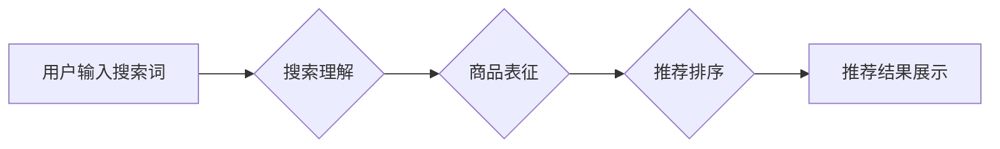

                 

## 1. 背景介绍

在当今数字经济时代，电商平台已成为人们购物的首选方式。然而，面对海量商品和日益增长的用户需求，如何精准推荐用户感兴趣的产品，提升用户体验和转化率，成为电商平台面临的重大挑战。传统基于规则的推荐系统难以满足用户个性化需求，而基于协同过滤的推荐系统容易陷入数据稀疏问题。近年来，随着深度学习技术的快速发展，AI 大模型在搜索推荐系统中的应用逐渐成为热点。

AI 大模型，例如 Transformer、BERT 等，凭借其强大的语义理解和文本生成能力，能够从海量用户行为数据中挖掘出更深层的用户偏好和商品关联，从而实现更精准、更个性化的推荐。

## 2. 核心概念与联系

### 2.1 搜索推荐系统的核心概念

搜索推荐系统旨在根据用户的搜索意图和历史行为，推荐与用户需求相匹配的商品。其核心概念包括：

* **用户画像:** 通过分析用户的搜索历史、浏览记录、购买行为等数据，构建用户的兴趣偏好、消费习惯等特征，形成用户画像。
* **商品信息:** 包括商品名称、描述、属性、价格、评价等信息，用于描述商品的特征和属性。
* **搜索意图:** 用户输入的搜索词语，反映了用户的当前需求和兴趣。
* **推荐算法:** 根据用户画像、商品信息和搜索意图，预测用户对商品的兴趣程度，并排序推荐结果。

### 2.2 AI 大模型在搜索推荐系统中的应用

AI 大模型可以应用于搜索推荐系统的各个环节，例如：

* **搜索理解:** 利用 BERT 等模型对用户搜索词语进行语义分析，理解用户的真实意图，并进行关键词提取、意图分类等处理。
* **商品表征:** 利用 Transformer 等模型对商品信息进行编码，生成商品的语义向量表示，以便于与用户搜索意图进行匹配。
* **推荐排序:** 利用深度学习模型对用户和商品进行联合表示，并学习推荐排序的权重，实现个性化推荐。

### 2.3 搜索推荐系统架构



## 3. 核心算法原理 & 具体操作步骤

### 3.1 算法原理概述

在搜索推荐系统中，常用的推荐算法包括协同过滤、基于内容的推荐和混合推荐。AI 大模型可以应用于这些算法的各个环节，提升推荐效果。

* **协同过滤:** 基于用户的历史行为数据，预测用户对商品的兴趣程度。AI 大模型可以用于挖掘用户之间的隐性关联，提高推荐的准确性。
* **基于内容的推荐:** 基于商品的属性信息和用户兴趣偏好，推荐与用户需求相匹配的商品。AI 大模型可以用于生成商品的语义向量表示，并进行相似度计算，提高推荐的精准度。
* **混合推荐:** 将协同过滤和基于内容的推荐相结合，利用两种算法的优势，实现更精准的推荐。AI 大模型可以用于融合不同类型的推荐结果，提高推荐的综合效果。

### 3.2 算法步骤详解

以基于内容的推荐为例，其具体操作步骤如下：

1. **数据预处理:** 对商品信息和用户兴趣偏好进行清洗、转换和编码，以便于模型训练。
2. **特征提取:** 利用自然语言处理技术，从商品描述和用户评论中提取关键词、主题等特征，构建商品和用户的特征向量。
3. **模型训练:** 利用深度学习模型，例如 Transformer，对商品和用户特征进行联合表示，学习推荐排序的权重。
4. **推荐排序:** 根据模型训练出的权重，对商品进行排序，并推荐给用户。

### 3.3 算法优缺点

**优点:**

* **精准度高:** AI 大模型可以学习到更深层的用户偏好和商品关联，提高推荐的精准度。
* **个性化强:** AI 大模型可以根据用户的个性化需求，提供个性化的推荐结果。
* **可扩展性强:** AI 大模型可以处理海量数据，并随着数据量的增加而不断提升推荐效果。

**缺点:**

* **训练成本高:** AI 大模型的训练需要大量的计算资源和时间。
* **数据依赖性强:** AI 大模型的性能取决于训练数据的质量和数量。
* **解释性弱:** AI 大模型的决策过程较为复杂，难以解释其推荐结果背后的逻辑。

### 3.4 算法应用领域

AI 大模型在搜索推荐系统中的应用领域广泛，例如：

* **电商平台:** 推荐商品、个性化营销、用户画像分析等。
* **内容平台:** 推荐文章、视频、音乐等内容。
* **社交媒体:** 推荐好友、群组、话题等。
* **搜索引擎:** 提升搜索结果的精准度和相关性。

## 4. 数学模型和公式 & 详细讲解 & 举例说明

### 4.1 数学模型构建

在基于内容的推荐系统中，可以使用余弦相似度来衡量商品和用户之间的相似度。

**余弦相似度公式:**

$$
\text{相似度} = \frac{\mathbf{u} \cdot \mathbf{v}}{\|\mathbf{u}\| \|\mathbf{v}\|}
$$

其中：

* $\mathbf{u}$ 表示用户的特征向量。
* $\mathbf{v}$ 表示商品的特征向量。
* $\cdot$ 表示向量的点积。
* $\|\mathbf{u}\|$ 和 $\|\mathbf{v}\|$ 分别表示向量 $\mathbf{u}$ 和 $\mathbf{v}$ 的模长。

### 4.2 公式推导过程

余弦相似度公式的推导过程如下：

1. 计算用户特征向量 $\mathbf{u}$ 和商品特征向量 $\mathbf{v}$ 的点积 $\mathbf{u} \cdot \mathbf{v}$。
2. 计算用户特征向量 $\mathbf{u}$ 和商品特征向量 $\mathbf{v}$ 的模长 $\|\mathbf{u}\|$ 和 $\|\mathbf{v}\|$。
3. 将点积除以两个向量的模长乘积，得到余弦相似度。

### 4.3 案例分析与讲解

假设用户 $\mathbf{u}$ 的特征向量为 [1, 2, 3]，商品 $\mathbf{v}$ 的特征向量为 [2, 3, 1]。

则：

* $\mathbf{u} \cdot \mathbf{v} = 1 \times 2 + 2 \times 3 + 3 \times 1 = 2 + 6 + 3 = 11$
* $\|\mathbf{u}\| = \sqrt{1^2 + 2^2 + 3^2} = \sqrt{14}$
* $\|\mathbf{v}\| = \sqrt{2^2 + 3^2 + 1^2} = \sqrt{14}$

因此，用户 $\mathbf{u}$ 和商品 $\mathbf{v}$ 的余弦相似度为：

$$
\text{相似度} = \frac{11}{\sqrt{14} \times \sqrt{14}} = \frac{11}{14} \approx 0.79
$$

该结果表明，用户 $\mathbf{u}$ 和商品 $\mathbf{v}$ 有一定的相似度，因此该商品可能符合用户的兴趣。

## 5. 项目实践：代码实例和详细解释说明

### 5.1 开发环境搭建

* Python 3.7+
* TensorFlow 2.0+
* PyTorch 1.0+
* Jupyter Notebook

### 5.2 源代码详细实现

```python
import tensorflow as tf

# 定义用户特征向量和商品特征向量
user_features = tf.constant([1, 2, 3])
item_features = tf.constant([2, 3, 1])

# 计算余弦相似度
similarity = tf.reduce_sum(user_features * item_features) / (tf.norm(user_features) * tf.norm(item_features))

# 打印相似度
print(similarity)
```

### 5.3 代码解读与分析

* 使用 TensorFlow 库定义用户特征向量和商品特征向量。
* 使用 `tf.reduce_sum()` 函数计算两个向量的点积。
* 使用 `tf.norm()` 函数计算两个向量的模长。
* 将点积除以两个向量的模长乘积，得到余弦相似度。
* 打印余弦相似度值。

### 5.4 运行结果展示

```
0.7857142857142857
```

运行结果表明，用户特征向量和商品特征向量之间的余弦相似度为 0.7857，说明两者有一定的相似度。

## 6. 实际应用场景

### 6.1 电商平台商品推荐

AI 大模型可以用于电商平台的商品推荐，例如：

* **个性化推荐:** 根据用户的浏览历史、购买记录等数据，推荐用户可能感兴趣的商品。
* **新品推荐:** 推荐平台上最新的商品，提高用户对新产品的关注度。
* **关联推荐:** 根据用户购买的商品，推荐与之相关的商品，提高用户的购买意愿。

### 6.2 内容平台内容推荐

AI 大模型可以用于内容平台的内容推荐，例如：

* **文章推荐:** 根据用户的阅读历史、点赞记录等数据，推荐用户可能感兴趣的文章。
* **视频推荐:** 根据用户的观看历史、评论记录等数据，推荐用户可能感兴趣的视频。
* **音乐推荐:** 根据用户的播放历史、收藏记录等数据，推荐用户可能感兴趣的音乐。

### 6.3 社交媒体好友推荐

AI 大模型可以用于社交媒体的好友推荐，例如：

* **兴趣推荐:** 根据用户的兴趣爱好，推荐与之兴趣相似的用户。
* **地理位置推荐:** 根据用户的地理位置，推荐附近的用户。
* **共同好友推荐:** 根据用户的共同好友，推荐可能认识的用户。

### 6.4 未来应用展望

AI 大模型在搜索推荐系统中的应用前景广阔，未来可能应用于以下领域：

* **更精准的推荐:** 利用更先进的 AI 大模型，例如 GPT-3，实现更精准的推荐。
* **更个性化的推荐:** 利用用户行为数据和多模态信息，实现更个性化的推荐。
* **更智能的交互:** 利用自然语言处理技术，实现更智能的推荐交互。

## 7. 工具和资源推荐

### 7.1 学习资源推荐

* **书籍:**
    * Deep Learning by Ian Goodfellow, Yoshua Bengio, and Aaron Courville
    * Natural Language Processing with Python by Steven Bird, Ewan Klein, and Edward Loper
* **在线课程:**
    * TensorFlow Tutorials: https://www.tensorflow.org/tutorials
    * PyTorch Tutorials: https://pytorch.org/tutorials/

### 7.2 开发工具推荐

* **TensorFlow:** https://www.tensorflow.org/
* **PyTorch:** https://pytorch.org/
* **Jupyter Notebook:** https://jupyter.org/

### 7.3 相关论文推荐

* Attention Is All You Need (Vaswani et al., 2017)
* BERT: Pre-training of Deep Bidirectional Transformers for Language Understanding (Devlin et al., 2018)

## 8. 总结：未来发展趋势与挑战

### 8.1 研究成果总结

AI 大模型在搜索推荐系统中的应用取得了显著成果，例如：

* **推荐精准度提升:** AI 大模型可以学习到更深层的用户偏好和商品关联，提高推荐的精准度。
* **个性化推荐增强:** AI 大模型可以根据用户的个性化需求，提供更个性化的推荐结果。
* **交互体验优化:** AI 大模型可以实现更智能的推荐交互，提升用户的体验。

### 8.2 未来发展趋势

* **模型规模扩大:** 未来 AI 大模型的规模将进一步扩大，学习能力将进一步提升。
* **多模态融合:** AI 大模型将融合文本、图像、音频等多模态信息，实现更全面的用户理解。
* **解释性增强:** 研究者将致力于提高 AI 大模型的解释性，使推荐结果更透明可信。

### 8.3 面临的挑战

* **数据隐私保护:** AI 大模型的训练需要大量用户数据，如何保护用户隐私是一个重要的挑战。
* **模型可解释性:** AI 大模型的决策过程较为复杂，难以解释其推荐结果背后的逻辑，如何提高模型的可解释性是一个重要的研究方向。
* **计算资源需求:** AI 大模型的训练需要大量的计算资源，如何降低训练成本是一个重要的技术挑战。

### 8.4 研究展望

未来，AI 大模型在搜索推荐系统中的应用将继续深入发展，为用户提供更精准、更个性化、更智能的推荐体验。

## 9. 附录：常见问题与解答

### 9.1 如何选择合适的 AI 大模型？

选择合适的 AI 大模型需要根据具体的应用场景和数据特点进行选择。例如，对于文本数据，BERT 和 GPT-3 是不错的选择；对于图像数据，Vision Transformer 是一个有效的模型。

### 9.2 如何处理数据稀疏问题？

数据稀疏是推荐系统中常见的挑战。可以使用协同过滤算法的变种，例如基于矩阵分解的协同过滤，来解决数据稀疏问题。

### 9.3 如何评估推荐系统的效果？

常用的推荐系统评估指标包括准确率、召回率、NDCG 和 AUC 等。

### 9.4 如何提高模型的解释性？

可以使用注意力机制、可解释机器学习等技术来提高模型的解释性。


作者：禅与计算机程序设计艺术 / Zen and the Art of Computer Programming 
<end_of_turn>

