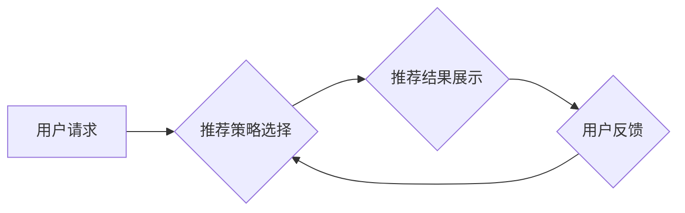

                 

## 搜索推荐系统的A/B测试：大模型的多臂赌博机应用

> 关键词：搜索推荐系统、A/B测试、多臂赌博机、大模型、在线学习、模型优化

## 1. 背景介绍

在当今数据爆炸的时代，搜索推荐系统已成为互联网应用的核心组成部分。从电商平台的商品推荐到社交媒体的个性化内容推送，搜索推荐系统无处不在，其精准度和用户体验直接影响着平台的商业成功和用户粘性。

传统的搜索推荐系统通常依赖于特征工程和静态模型，难以适应用户行为的动态变化和新信息的涌现。随着大模型的兴起，其强大的学习能力和泛化能力为搜索推荐系统的优化提供了新的思路。

A/B测试作为一种常用的在线实验方法，能够有效地评估不同推荐策略的效果，并根据测试结果进行模型优化。然而，在面对海量用户和多样的推荐策略时，传统的A/B测试方法面临着效率低下和样本量不足等挑战。

## 2. 核心概念与联系

### 2.1 多臂赌博机问题

多臂赌博机问题（Multi-Armed Bandit Problem，MAB）是一个经典的强化学习问题，其核心在于如何选择最优的行动（拉动哪个赌博机）以最大化累积奖励。

在搜索推荐系统中，每个推荐策略可以看作是一个“赌博机”，用户点击行为可以看作是“奖励”。多臂赌博机算法的目标是找到最优的推荐策略，即在不断学习用户偏好和反馈的基础上，最大化用户的点击率、转化率等指标。

### 2.2 A/B测试与多臂赌博机

A/B测试通常用于比较两个或多个版本之间的差异，而多臂赌博机算法则可以扩展到多个版本，并根据实时反馈动态调整策略分配。

将A/B测试与多臂赌博机结合，可以实现以下优势：

* **动态策略分配:**  根据用户反馈和历史数据，动态调整不同推荐策略的展示比例，从而更有效地探索和利用最优策略。
* **效率提升:**  相比于传统的A/B测试，多臂赌博机算法可以更快速地收敛到最优策略，减少实验时间和资源消耗。
* **数据利用:**  多臂赌博机算法可以充分利用用户行为数据，并进行在线学习，不断优化推荐策略。

### 2.3 大模型的应用

大模型在搜索推荐系统中可以发挥重要作用，例如：

* **特征提取:**  大模型可以学习更丰富的用户特征和商品特征，从而提高推荐的精准度。
* **模型训练:**  大模型可以训练更复杂的推荐模型，并更好地捕捉用户行为的复杂模式。
* **个性化推荐:**  大模型可以根据用户的历史行为和偏好，提供更个性化的推荐结果。

将大模型与多臂赌博机结合，可以实现更智能、更精准的搜索推荐系统。

**Mermaid 流程图**



## 3. 核心算法原理 & 具体操作步骤

### 3.1 算法原理概述

多臂赌博机算法的核心思想是通过不断地探索和利用来找到最优的策略。

* **探索:**  尝试不同的策略，收集更多信息。
* **利用:**  选择已经表现良好的策略，最大化奖励。

常见的多臂赌博机算法包括：

* **ε-贪婪算法:**  以概率ε随机选择一个策略，以1-ε的概率选择当前表现最好的策略。
* **上置信界算法 (UCB):**  根据策略的历史奖励和不确定性，选择置信区间上限最大的策略。
* **Thompson采样算法:**  基于贝叶斯概率，选择策略的概率与其估计的奖励和不确定性相关。

### 3.2 算法步骤详解

以ε-贪婪算法为例，其具体步骤如下：

1. **初始化:**  为每个策略分配一个初始奖励值，通常设置为0。
2. **选择策略:**  以概率ε随机选择一个策略，以1-ε的概率选择当前奖励最高的策略。
3. **执行策略:**  执行选择的策略，并观察用户反馈。
4. **更新奖励:**  根据用户反馈更新策略的奖励值。
5. **重复步骤2-4:**  重复以上步骤，直到达到预设的实验结束条件。

### 3.3 算法优缺点

**优点:**

* **简单易懂:**  算法原理和实现都比较简单。
* **效率较高:**  可以快速收敛到最优策略。

**缺点:**

* **参数设置:**  ε参数需要根据实际情况进行调整，否则可能导致算法收敛速度过慢或过快。
* **探索不足:**  当ε值过小时，算法可能会陷入局部最优，无法找到全局最优策略。

### 3.4 算法应用领域

多臂赌博机算法广泛应用于以下领域：

* **搜索推荐系统:**  优化推荐策略，提高用户点击率和转化率。
* **广告投放:**  选择最有效的广告投放策略，最大化广告收益。
* **在线学习:**  根据用户反馈动态调整模型参数，提高模型性能。
* **A/B测试:**  加速A/B测试过程，提高实验效率。

## 4. 数学模型和公式 & 详细讲解 & 举例说明

### 4.1 数学模型构建

假设有K个不同的推荐策略，每个策略的奖励函数为$r_k(a)$,其中$a$是用户点击行为。

目标是找到最优策略$k^*$,使得累积奖励最大化：

$$k^* = \arg\max_{k \in \{1, 2, ..., K\}} \sum_{t=1}^{T} r_k(a_t)$$

其中$T$是实验时间。

### 4.2 公式推导过程

ε-贪婪算法的策略选择公式为：

$$k_t = \begin{cases}
\arg\max_{k \in \{1, 2, ..., K\}} Q_k(t-1) & \text{with probability } 1-\epsilon \\
\text{randomly chosen } k \in \{1, 2, ..., K\} & \text{with probability } \epsilon
\end{cases}$$

其中：

* $k_t$是第t次实验选择的策略。
* $Q_k(t-1)$是第k个策略在第t-1次实验前的累计奖励平均值。
* $\epsilon$是探索参数，控制探索和利用的比例。

### 4.3 案例分析与讲解

假设有三个推荐策略，A、B、C，每个策略的奖励函数分别为：

* $r_A(a) = 0.6$
* $r_B(a) = 0.7$
* $r_C(a) = 0.5$

当$\epsilon = 0.1$时，算法会以90%的概率选择奖励最高的策略B，以10%的概率随机选择其他策略，以进行探索。

随着实验的进行，算法会不断更新每个策略的累计奖励平均值，并根据更新后的值调整策略选择概率。最终，算法会收敛到最优策略B。

## 5. 项目实践：代码实例和详细解释说明

### 5.1 开发环境搭建

* Python 3.x
* TensorFlow/PyTorch 等深度学习框架
* Scikit-learn 等机器学习库
* Jupyter Notebook 或其他代码编辑器

### 5.2 源代码详细实现

```python
import numpy as np

class EpsilonGreedy:
    def __init__(self, epsilon=0.1):
        self.epsilon = epsilon
        self.Q = np.zeros(K)  # 策略累计奖励平均值

    def choose_action(self, state):
        if np.random.uniform() < self.epsilon:
            return np.random.choice(K)
        else:
            return np.argmax(self.Q)

    def update_Q(self, state, action, reward):
        self.Q[action] += (reward - self.Q[action]) / (t + 1)

# ... 其他代码 ...
```

### 5.3 代码解读与分析

* `EpsilonGreedy`类实现了ε-贪婪算法。
* `__init__`方法初始化算法参数，包括探索参数ε和策略累计奖励平均值Q。
* `choose_action`方法根据当前状态和ε值选择策略。
* `update_Q`方法根据用户反馈更新策略的累计奖励平均值。

### 5.4 运行结果展示

通过运行代码，可以观察算法在不同探索参数ε值下的表现，并分析其收敛速度和最终选择的策略。

## 6. 实际应用场景

### 6.1 搜索引擎推荐

搜索引擎可以利用多臂赌博机算法来优化搜索结果的排序，根据用户的点击行为和反馈动态调整结果展示顺序，提高用户体验和搜索效率。

### 6.2 电商平台推荐

电商平台可以利用多臂赌博机算法来推荐商品，根据用户的浏览历史、购买记录和偏好，个性化推荐商品，提高转化率和用户粘性。

### 6.3 内容平台推荐

内容平台可以利用多臂赌博机算法来推荐文章、视频、音频等内容，根据用户的阅读习惯、观看记录和兴趣爱好，个性化推荐内容，提高用户参与度和平台活跃度。

### 6.4 未来应用展望

随着大模型的不断发展，多臂赌博机算法在搜索推荐系统中的应用将更加广泛和深入。

* **更精准的推荐:**  大模型可以学习更丰富的用户特征和商品特征，从而提高推荐的精准度。
* **更个性化的推荐:**  大模型可以根据用户的历史行为和偏好，提供更个性化的推荐结果。
* **更智能的推荐:**  大模型可以学习用户的隐性需求，并提供更智能的推荐建议。

## 7. 工具和资源推荐

### 7.1 学习资源推荐

* **书籍:**
    * Reinforcement Learning: An Introduction by Sutton and Barto
    * Bandit Algorithms by Auer, Cesa-Bianchi, and Fischer
* **在线课程:**
    * Coursera: Reinforcement Learning Specialization
    * Udacity: Intro to Machine Learning
* **博客和文章:**
    * Towards Data Science
    * Machine Learning Mastery

### 7.2 开发工具推荐

* **Python:**  Python 是机器学习和深度学习的常用编程语言。
* **TensorFlow/PyTorch:**  TensorFlow 和 PyTorch 是流行的深度学习框架。
* **Scikit-learn:**  Scikit-learn 是机器学习库，提供多种算法和工具。
* **Jupyter Notebook:**  Jupyter Notebook 是交互式代码编辑器，方便进行机器学习实验和原型开发。

### 7.3 相关论文推荐

* **Multi-Armed Bandit Algorithms for Online Learning** by Auer, Cesa-Bianchi, and Fischer
* **A Contextual Bandit Approach to Personalized News Recommendation** by Chapelle, Li, and Smola
* **Deep Reinforcement Learning for Recommender Systems** by Wang, Wang, and Zhang

## 8. 总结：未来发展趋势与挑战

### 8.1 研究成果总结

多臂赌博机算法在搜索推荐系统中的应用取得了显著成果，能够有效地优化推荐策略，提高用户体验和商业效益。

### 8.2 未来发展趋势

* **更复杂的模型:**  将大模型与多臂赌博机算法结合，构建更复杂的推荐模型，提高推荐的精准度和个性化程度。
* **更有效的算法:**  研究更有效的多臂赌博机算法，提高算法的收敛速度和探索效率。
* **更全面的应用:**  将多臂赌博机算法应用于更多场景，例如广告投放、在线教育、医疗诊断等。

### 8.3 面临的挑战

* **数据稀疏性:**  在一些场景下，用户数据可能比较稀疏，导致算法难以收敛到最优策略。
* **用户行为复杂性:**  用户的行为模式复杂多样，难以用简单的模型进行准确预测。
* **模型可解释性:**  大模型的决策过程往往比较复杂，难以解释其推荐结果，这可能会影响用户的信任度。

### 8.4 研究展望

未来，多臂赌博机算法在搜索推荐系统中的研究将继续深入，探索更有效的算法、更复杂的模型和更全面的应用场景，为用户提供更智能、更精准、更个性化的体验。

## 9. 附录：常见问题与解答

* **Q: 多臂赌博机算法的探索参数ε值应该如何设置？**

* **A:**  ε值需要根据实际情况进行调整，通常可以从0.1开始，并根据实验结果进行调整。

* **Q: 多臂赌博机算法适用于哪些场景？**

* **A:**  多臂赌博机算法适用于任何需要动态调整策略的场景，例如搜索推荐系统、广告投放、在线学习等。

* **Q: 多臂赌博机算法的局限性是什么？**

* **A:**  多臂赌博机算法的局限性在于需要大量的用户数据才能收敛到最优策略，并且难以处理用户行为过于复杂的情况。


作者：禅与计算机程序设计艺术 / Zen and the Art of Computer Programming<end_of_turn>

