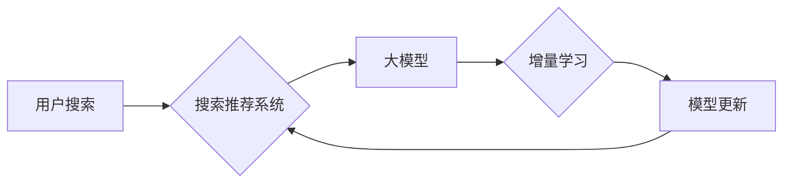

                 

## 搜索推荐系统的增量学习：大模型的持续适应机制

> 关键词：搜索推荐系统、增量学习、大模型、持续适应、在线学习、冷启动问题

### 1. 背景介绍

搜索推荐系统作为连接用户需求与信息资源的重要桥梁，在现代互联网生态中扮演着至关重要的角色。传统的搜索推荐系统通常依赖于离线训练，将历史数据用于构建静态模型，但随着用户行为、内容结构和搜索趋势的不断变化，这些静态模型逐渐失去效力，难以适应动态环境。

大模型的出现为搜索推荐系统的持续适应带来了新的机遇。大模型凭借其强大的泛化能力和参数规模，能够学习更复杂的模式和关系，并通过微调和在线学习机制，不断更新模型参数，以适应不断变化的用户需求和信息环境。

增量学习作为一种在线学习方法，能够有效地解决大模型在面对海量数据和动态环境下的训练挑战。它通过逐步更新模型参数，仅学习新数据中的变化，避免了重新训练整个模型的巨大成本和时间消耗。

### 2. 核心概念与联系

**2.1 核心概念**

* **搜索推荐系统:**  旨在根据用户的搜索意图和历史行为，推荐相关的信息资源，例如网页、产品、视频等。
* **增量学习:**  一种在线学习方法，通过逐步更新模型参数，仅学习新数据中的变化，避免了重新训练整个模型的巨大成本和时间消耗。
* **大模型:**  参数规模庞大，训练数据量巨大，能够学习更复杂的模式和关系的深度学习模型。

**2.2 架构关系**



**2.3 核心联系**

增量学习为大模型的持续适应提供了有效的机制。大模型能够学习用户行为和内容结构的复杂模式，而增量学习则能够帮助大模型不断更新模型参数，以适应不断变化的用户需求和信息环境。

### 3. 核心算法原理 & 具体操作步骤

**3.1 算法原理概述**

增量学习的核心思想是，仅学习新数据中的变化，避免了重新训练整个模型的巨大成本和时间消耗。它通常通过以下步骤实现：

1. **初始化模型:**  使用预训练的大模型作为初始模型。
2. **更新模型:**  根据新数据，更新模型参数，以最小化模型在新数据上的损失函数。
3. **评估模型:**  评估更新后的模型性能，并根据评估结果进行调整。

**3.2 算法步骤详解**

1. **数据预处理:**  对新数据进行预处理，例如文本清洗、特征提取等。
2. **模型加载:**  加载预训练的大模型。
3. **梯度计算:**  计算模型在新的数据上的梯度。
4. **参数更新:**  使用梯度下降算法或其他优化算法，更新模型参数。
5. **模型评估:**  使用验证集或测试集评估更新后的模型性能。
6. **模型保存:**  保存更新后的模型。

**3.3 算法优缺点**

* **优点:**
    * 效率高:  仅学习新数据中的变化，避免了重新训练整个模型的巨大成本和时间消耗。
    * 适应性强:  能够不断更新模型参数，以适应不断变化的用户需求和信息环境。
    * 降低冷启动问题:  对于新用户或新内容，增量学习能够更快地进行适应和推荐。
* **缺点:**

    * 可能会出现过拟合问题:  如果新数据与训练数据分布差异较大，可能会导致模型过拟合。
    * 需要维护历史数据:  需要存储历史数据，以便进行增量更新。

**3.4 算法应用领域**

* 搜索推荐系统
* 自然语言处理
* 图像识别
* 机器翻译
* 医疗诊断

### 4. 数学模型和公式 & 详细讲解 & 举例说明

**4.1 数学模型构建**

假设我们有一个搜索推荐系统，其目标是预测用户对某个物品的点击概率。我们可以使用一个二分类模型，例如逻辑回归，来实现这个目标。

**4.2 公式推导过程**

逻辑回归模型的输出是一个概率值，表示用户点击物品的概率。该概率值可以通过以下公式计算:

$$
p(y=1|x) = \frac{1}{1 + e^{-(w^T x + b)}}
$$

其中:

* $p(y=1|x)$ 是用户点击物品的概率
* $x$ 是用户特征向量
* $w$ 是模型参数向量
* $b$ 是模型偏置项
* $e$ 是自然对数的底数

**4.3 案例分析与讲解**

假设我们有一个用户特征向量 $x = [age, gender, interests]$, 其中 $age$ 是用户的年龄，$gender$ 是用户的性别，$interests$ 是用户的兴趣爱好。模型参数向量 $w$ 和偏置项 $b$ 是通过训练得到的。

当用户输入一个搜索词时，系统会根据用户的特征向量 $x$ 计算出点击概率 $p(y=1|x)$。如果 $p(y=1|x) > 0.5$，则系统会推荐该物品给用户。

### 5. 项目实践：代码实例和详细解释说明

**5.1 开发环境搭建**

* Python 3.7+
* TensorFlow 2.0+
* PyTorch 1.0+
* CUDA 10.0+ (可选)

**5.2 源代码详细实现**

```python
import tensorflow as tf

# 定义模型
model = tf.keras.models.Sequential([
    tf.keras.layers.Dense(64, activation='relu', input_shape=(3,)),
    tf.keras.layers.Dense(1, activation='sigmoid')
])

# 定义损失函数和优化器
loss_fn = tf.keras.losses.BinaryCrossentropy()
optimizer = tf.keras.optimizers.Adam(learning_rate=0.001)

# 训练模型
for epoch in range(10):
    for batch in data_loader:
        with tf.GradientTape() as tape:
            predictions = model(batch['features'])
            loss = loss_fn(batch['labels'], predictions)
        gradients = tape.gradient(loss, model.trainable_variables)
        optimizer.apply_gradients(zip(gradients, model.trainable_variables))

# 保存模型
model.save('search_recommendation_model.h5')
```

**5.3 代码解读与分析**

* 代码定义了一个简单的深度学习模型，用于预测用户点击物品的概率。
* 模型使用两个全连接层，第一个层有64个神经元，激活函数为ReLU，第二个层有1个神经元，激活函数为sigmoid。
* 损失函数为二分类交叉熵，优化器为Adam。
* 训练模型时，使用数据加载器加载数据，并迭代训练模型。
* 训练完成后，保存模型。

**5.4 运行结果展示**

训练完成后，可以使用测试集评估模型性能，例如计算准确率、召回率等指标。

### 6. 实际应用场景

**6.1 搜索引擎推荐**

搜索引擎可以利用增量学习，根据用户的搜索历史和行为，推荐相关的网页、图片、视频等信息资源。

**6.2 电商平台推荐**

电商平台可以利用增量学习，根据用户的购买历史和浏览记录，推荐相关的商品。

**6.3 内容平台推荐**

内容平台可以利用增量学习，根据用户的阅读历史和观看记录，推荐相关的文章、视频、音频等内容。

**6.4 未来应用展望**

随着大模型技术的不断发展，增量学习在搜索推荐系统中的应用将更加广泛和深入。例如，可以利用增量学习，实现个性化推荐、跨域推荐、动态推荐等功能。

### 7. 工具和资源推荐

**7.1 学习资源推荐**

* **书籍:**
    * Deep Learning by Ian Goodfellow, Yoshua Bengio, and Aaron Courville
    * Hands-On Machine Learning with Scikit-Learn, Keras & TensorFlow by Aurélien Géron
* **在线课程:**
    * TensorFlow Tutorials: https://www.tensorflow.org/tutorials
    * PyTorch Tutorials: https://pytorch.org/tutorials/

**7.2 开发工具推荐**

* **TensorFlow:** https://www.tensorflow.org/
* **PyTorch:** https://pytorch.org/
* **Scikit-learn:** https://scikit-learn.org/

**7.3 相关论文推荐**

* **Continual Learning: A Review** by  Zenke, F., et al. (2019)
* **Online Learning for Recommender Systems** by  Rendle, S. (2012)

### 8. 总结：未来发展趋势与挑战

**8.1 研究成果总结**

增量学习为大模型的持续适应提供了有效的机制，能够有效地解决大模型在面对海量数据和动态环境下的训练挑战。

**8.2 未来发展趋势**

* **更有效的增量学习算法:**  研究更有效的增量学习算法，能够更好地处理新数据和旧数据的冲突，提高模型的泛化能力。
* **更强大的大模型:**  开发更强大的大模型，能够学习更复杂的模式和关系，提高模型的推荐精度。
* **更个性化的推荐:**  利用增量学习，实现更个性化的推荐，满足用户的个性化需求。

**8.3 面临的挑战**

* **过拟合问题:**  增量学习可能会出现过拟合问题，需要开发更有效的正则化方法来解决。
* **数据质量问题:**  增量学习需要高质量的数据，数据质量问题会影响模型的性能。
* **计算资源问题:**  训练大模型需要大量的计算资源，这对于一些资源有限的机构来说是一个挑战。

**8.4 研究展望**

未来，增量学习将在搜索推荐系统中发挥越来越重要的作用。随着大模型技术的不断发展，增量学习将成为搜索推荐系统的重要发展方向。


### 9. 附录：常见问题与解答

**9.1 如何选择合适的增量学习算法？**

选择合适的增量学习算法需要根据具体应用场景和数据特点进行选择。一些常用的增量学习算法包括：

* **EWC (Elastic Weight Consolidation):** 通过对重要权重的惩罚，防止模型过拟合新数据。
* **LwF (Learning Without Forgetting):** 通过最小化模型在旧数据上的损失，保持模型对旧数据的记忆。
* **Replay Buffer:** 将旧数据存储在缓冲区中，并在训练过程中随机抽取一部分数据进行训练。

**9.2 如何解决增量学习中的过拟合问题？**

过拟合问题是增量学习中常见的挑战。一些常用的解决方法包括：

* **正则化:**  使用正则化项来惩罚模型的复杂度，例如L1正则化和L2正则化。
* **数据增强:**  对训练数据进行增强，例如数据旋转、数据翻转等，增加数据的多样性。
* **早停:**  在训练过程中，监控模型在验证集上的性能，并在性能下降时停止训练。

**9.3 如何评估增量学习模型的性能？**

评估增量学习模型的性能需要使用专门的指标，例如：

* **Accuracy:**  模型在测试集上的准确率。
* **Recall:**  模型在测试集上召回率。
* **F1-score:**  模型在测试集上的F1-score。
* **Catastrophic Forgetting:**  模型在学习新数据后，对旧数据的遗忘程度。


作者：禅与计算机程序设计艺术 / Zen and the Art of Computer Programming 
<end_of_turn>

