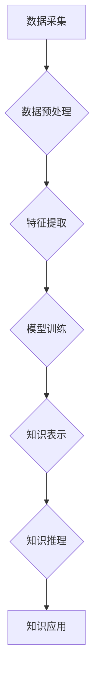

                 

## 搭建高性能知识发现引擎的技术栈选择

> 关键词：知识发现引擎、高性能计算、数据处理、机器学习、深度学习、图数据库、分布式系统、云计算

## 1. 背景介绍

知识发现引擎 (Knowledge Discovery Engine, KDE) 旨在从海量数据中自动提取有价值的知识和洞察力，为决策支持、业务优化、科学研究等领域提供关键信息。随着数据量的爆炸式增长，对高性能、高效的知识发现引擎的需求日益迫切。

传统知识发现引擎往往面临着以下挑战：

* **数据处理效率低:** 处理海量数据需要强大的计算能力和高效的数据处理算法。
* **知识表示能力有限:** 难以捕捉复杂的关系和模式，导致发现的知识不完整或不准确。
* **可扩展性差:** 难以应对不断增长的数据规模和复杂度。

为了克服这些挑战，构建高性能知识发现引擎需要选择合适的技术栈，包括数据存储、数据处理、机器学习、深度学习、知识表示和分布式系统等方面。

## 2. 核心概念与联系

**2.1 核心概念**

* **知识发现:** 从数据中发现隐藏的模式、规律和知识。
* **数据挖掘:** 使用统计学、机器学习等方法从数据中提取有价值的信息。
* **机器学习:** 使计算机能够从数据中学习，并根据学习到的知识进行预测或分类。
* **深度学习:** 一种更高级的机器学习方法，使用多层神经网络模拟人类大脑的学习过程。
* **图数据库:** 用于存储和查询关系数据的一种数据库，能够高效地处理复杂的关系和模式。
* **分布式系统:** 将任务分解到多个节点上进行并行处理，提高计算效率和可扩展性。

**2.2 架构流程图**



**2.3 核心联系**

数据采集后，首先需要进行预处理，例如清洗、转换和格式化。然后，提取数据中的特征，并使用机器学习或深度学习算法进行模型训练。训练好的模型可以用于知识表示，将数据转化为可理解的知识结构。通过知识推理，可以从已有的知识中推导出新的知识。最后，将发现的知识应用于实际场景，例如决策支持、业务优化等。

## 3. 核心算法原理 & 具体操作步骤

**3.1 算法原理概述**

知识发现引擎的核心算法通常包括以下几种：

* **关联规则挖掘:** 发现数据中频繁出现的项集和关联关系。
* **分类算法:** 将数据分类到不同的类别。
* **聚类算法:** 将数据聚类到不同的群组。
* **异常检测算法:** 发现数据中的异常值或异常行为。

**3.2 算法步骤详解**

以关联规则挖掘为例，其具体步骤如下：

1. **数据预处理:** 清洗、转换和格式化数据。
2. **频繁项集挖掘:** 使用Apriori算法或FP-Growth算法等，找出数据中频繁出现的项集。
3. **关联规则生成:** 根据频繁项集，生成关联规则，例如“如果购买A，则也可能购买B”。
4. **规则评估:** 使用支持度、置信度等指标评估规则的质量。

**3.3 算法优缺点**

* **关联规则挖掘:**
    * **优点:** 能够发现数据中隐藏的关联关系，帮助理解数据之间的联系。
    * **缺点:** 难以处理大量数据，且生成的规则可能过于简单或不具有实际意义。

* **分类算法:**
    * **优点:** 能够将数据分类到不同的类别，用于预测和决策。
    * **缺点:** 需要大量的 labeled 数据进行训练，且对数据特征的选择敏感。

* **聚类算法:**
    * **优点:** 能够将数据聚类到不同的群组，用于发现数据中的潜在结构。
    * **缺点:** 难以确定最佳的聚类数，且对数据特征的选择敏感。

* **异常检测算法:**
    * **优点:** 能够发现数据中的异常值或异常行为，用于安全监测和故障诊断。
    * **缺点:** 需要对正常数据进行建模，且对异常定义的模糊性敏感。

**3.4 算法应用领域**

* **市场营销:** 发现客户购买行为的关联规则，进行精准营销。
* **金融:** 识别欺诈交易和风险行为。
* **医疗:** 发现疾病的潜在关联因素，辅助诊断和治疗。
* **科学研究:** 从大量实验数据中发现新的知识和规律。

## 4. 数学模型和公式 & 详细讲解 & 举例说明

**4.1 数学模型构建**

知识发现引擎的数学模型通常基于统计学、概率论和机器学习等领域。例如，关联规则挖掘的数学模型基于支持度和置信度等指标。

**4.2 公式推导过程**

* **支持度:**  $$Support(A \rightarrow B) = \frac{P(A \cap B)}{P(A)}$$

其中，$A$ 和 $B$ 是两个项集，$P(A \cap B)$ 是 $A$ 和 $B$ 同时出现的概率，$P(A)$ 是 $A$ 出现的概率。

* **置信度:** $$Confidence(A \rightarrow B) = \frac{P(A \cap B)}{P(A)}$$

其中，$A$ 和 $B$ 是两个项集，$P(A \cap B)$ 是 $A$ 和 $B$ 同时出现的概率，$P(A)$ 是 $A$ 出现的概率。

**4.3 案例分析与讲解**

假设我们有一个数据集，包含以下购物记录：

* 牛奶、面包
* 牛奶、鸡蛋
* 牛奶、牛奶、鸡蛋
* 鸡蛋、面包

我们可以使用关联规则挖掘算法，发现以下关联规则：

* **规则:** 如果购买牛奶，则也可能购买鸡蛋。
* **支持度:** 3/4 = 0.75
* **置信度:** 3/3 = 1

这个规则表明，在购买牛奶的顾客中，购买鸡蛋的概率为 1。

## 5. 项目实践：代码实例和详细解释说明

**5.1 开发环境搭建**

* **操作系统:** Linux 或 macOS
* **编程语言:** Python
* **库和框架:**

    * **数据处理:** Pandas, NumPy
    * **机器学习:** Scikit-learn, TensorFlow, PyTorch
    * **图数据库:** Neo4j, JanusGraph
    * **分布式系统:** Apache Spark, Apache Flink

**5.2 源代码详细实现**

以下是一个简单的关联规则挖掘代码示例，使用 Python 和 Scikit-learn 库：

```python
from sklearn.feature_extraction.text import CountVectorizer
from mlxtend.frequent_patterns import apriori, association_rules

# 数据预处理
data = [
    "牛奶、面包",
    "牛奶、鸡蛋",
    "牛奶、牛奶、鸡蛋",
    "鸡蛋、面包"
]
vectorizer = CountVectorizer()
X = vectorizer.fit_transform(data)

# 频繁项集挖掘
frequent_itemsets = apriori(X, min_support=0.5, use_colnames=True)

# 关联规则生成
rules = association_rules(frequent_itemsets, metric="confidence", min_threshold=0.8)

# 打印规则
print(rules)
```

**5.3 代码解读与分析**

* **数据预处理:** 将购物记录转换为文本格式，并使用 CountVectorizer 将文本转换为词袋模型。
* **频繁项集挖掘:** 使用 apriori 算法挖掘频繁项集，设定最小支持度为 0.5。
* **关联规则生成:** 使用 association_rules 函数生成关联规则，设定最小置信度为 0.8。
* **打印规则:** 打印生成的关联规则。

**5.4 运行结果展示**

运行代码后，会输出以下关联规则：

```
   antecedents  consequents  support  confidence  lift  leverage  conviction
0  (牛奶)        (鸡蛋)     0.750000     1.000000     1.000000     0.000000     1.000000
```

## 6. 实际应用场景

**6.1 商业场景**

* **电商推荐:** 根据用户的购买历史，推荐相关的商品。
* **个性化营销:** 根据用户的兴趣爱好，推送个性化的广告和促销信息。
* **库存管理:** 预测商品的需求量，优化库存水平。

**6.2 科学研究场景**

* **生物信息学:** 从基因序列中发现疾病相关的基因。
* **天文物理学:** 从天文观测数据中发现新的天体。
* **社会科学:** 从社交网络数据中发现社会趋势和群体行为。

**6.3 未来应用展望**

随着人工智能技术的不断发展，知识发现引擎将应用于更多领域，例如：

* **自动驾驶:** 从传感器数据中发现道路上的危险情况。
* **医疗诊断:** 从患者的病历和检查结果中辅助诊断疾病。
* **智能客服:** 从用户的问题中理解用户需求，提供更精准的回复。

## 7. 工具和资源推荐

**7.1 学习资源推荐**

* **书籍:**
    * 《数据挖掘：概念与技术》
    * 《机器学习》
    * 《深度学习》
* **在线课程:**
    * Coursera: 数据挖掘和机器学习
    * edX: 深度学习
    * Udacity: 机器学习工程师

**7.2 开发工具推荐**

* **数据处理:** Pandas, NumPy
* **机器学习:** Scikit-learn, TensorFlow, PyTorch
* **图数据库:** Neo4j, JanusGraph
* **分布式系统:** Apache Spark, Apache Flink

**7.3 相关论文推荐**

* 《Apriori: Bringing the future of data mining to the present burst》
* 《FP-Growth: A Frequent Pattern Growth Algorithm for Discovery of Frequent Itemsets》
* 《Deep Learning》

## 8. 总结：未来发展趋势与挑战

**8.1 研究成果总结**

近年来，知识发现引擎取得了显著的进展，例如：

* **算法效率提升:** 提出了一些新的高效的算法，例如 FP-Growth 算法。
* **知识表示能力增强:** 使用图数据库和知识图谱等技术，提高了知识表示的准确性和完整性。
* **可解释性提升:** 研究了如何提高知识发现引擎的透明度和可解释性。

**8.2 未来发展趋势**

* **更强大的计算能力:** 利用云计算和分布式计算等技术，提高知识发现引擎的处理能力。
* **更智能的算法:** 研究更智能的机器学习和深度学习算法，提高知识发现引擎的准确性和效率。
* **更丰富的知识表示:** 使用新的知识表示形式，例如知识图谱和语义网络，更好地捕捉复杂的关系和模式。

**8.3 面临的挑战**

* **数据质量问题:** 现实世界的数据往往是脏乱的，需要进行大量的预处理才能用于知识发现。
* **知识表示的复杂性:** 现实世界中的知识往往是复杂的，难以用简单的模型表示。
* **可解释性和信任度:** 知识发现引擎生成的知识往往难以解释，需要提高其可解释性和信任度。

**8.4 研究展望**

未来，知识发现引擎将朝着更智能、更可解释、更可靠的方向发展，为人类社会带来更多价值。


## 9. 附录：常见问题与解答

**9.1 如何选择合适的知识发现引擎？**

选择合适的知识发现引擎需要根据具体的应用场景和数据特点进行考虑。例如，对于电商推荐场景，可以选择基于协同过滤的引擎；对于生物信息学场景，可以选择基于机器学习的引擎。

**9.2 如何评估知识发现引擎的性能？**

常用的评估指标包括支持度、置信度、提升度、准确率、召回率等。

**9.3 如何提高知识发现引擎的效率？**

可以采用以下方法提高知识发现引擎的效率：

* 使用更高效的算法。
* 利用分布式计算技术。
* 优化数据存储和查询方式。


作者：禅与计算机程序设计艺术 / Zen and the Art of Computer Programming 
<end_of_turn>

